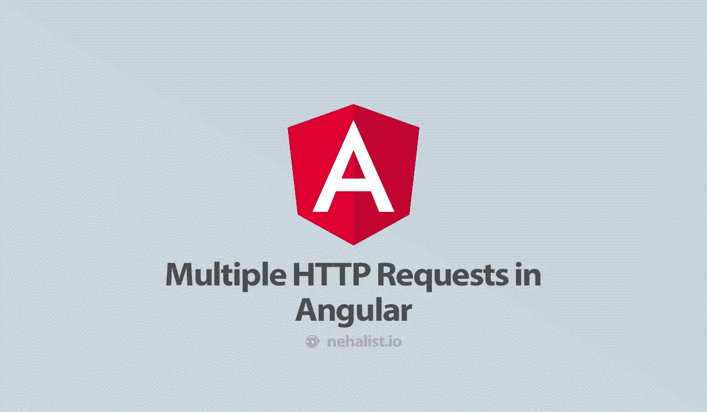

# Angular 中的多个 HTTP 请求

> 原文：<https://itnext.io/multiple-http-requests-in-angular-43df566016eb?source=collection_archive---------4----------------------->



RxJS 有时会令人困惑，一开始可能不清楚如何做某些事情。其中之一可能是如何以正确的方式处理多个 HTTP 请求——但很高兴这并不太复杂。

执行多个请求可能有两种不同的情况；一个接一个地(顺序地)或同时地(并行地)。

# 要求

这种方法依赖于 Angulars`[http client](https://angular.io/guide/http)`——因此`this.http`将总是引用`HttpClient`。

此外，为了更容易理解，本指南将使用一个简单的 PHP 脚本作为 API:

```
<?php
header("Access-Control-Allow-Origin: *");
header("Content-Type: application/json");$timeout = isset($_GET['timeout']) ? $_GET['timeout'] : 0;sleep($timeout);echo json_encode([
    'timeout' => $timeout
]);
```

这个脚本允许用一个`timeout`参数调用它，将等待给定的时间来响应，并用它已经等待的时间来响应。

# 继续地

从属查询是顺序执行 HTTP 请求的一个很好的例子；例如，您想要查询在不同端点查询的该用户的一些用户详细信息*和*项目。

为了完成这项工作，我们将利用管道中的函数。让我们看一个例子:

```
import {concatMap, tap} from 'rxjs/operators';this.http.get('[http://test.localhost/api.php?timeout=1'](http://test.localhost/api.php?timeout=1'))
      .pipe(
        tap(res => console.log('First result', res)),
        concatMap((res: { timeout: number }) => this.http.get(`[http://test.localhost/api.php?timeout=${+res.timeout](http://test.localhost/api.php?timeout=${+res.timeout) + 1}`)),
        tap(res => console.log('Second result', res)),
        concatMap((res: { timeout: number }) => this.http.get(`[http://test.localhost/api.php?timeout=${+res.timeout](http://test.localhost/api.php?timeout=${+res.timeout) + 3}`)),
        tap(res => console.log('Third result', res)),
      )
      .subscribe(res => console.log('Latest result', res));
```

控制台输出:

```
First result {timeout: "1"}
Second result {timeout: "2"}
Third result {timeout: "5"}
Latest result {timeout: "5"}
```

1 秒后记录第一个输出，2 秒后记录第二个，5 秒后记录第三个(也是最新的一个)。正如您在管道中看到的，第一个请求之后的每个请求都依赖于前一个请求的响应。

# 平行的

请求可能是独立的，您需要在应用程序继续运行之前执行所有请求。想象一下查询你的应用程序设置(例如，默认主题、语言等等)、当前用户和当前视图数据(例如，你正在查看的当前帖子)——这些事情都不相互依赖，但是你需要所有这些才能让你的应用程序显示出来。

一次一个地查询这些内容是浪费资源——我们可以只查询所有的内容，然后处理组合的结果。

为了使我们的请求并行，我们将使用`forkJoin`。`forkJoin`中的请求是并行请求的，当所有请求完成时，可观察对象自身发出:

```
import {forkJoin} from "rxjs";
import {tap} from "rxjs/operators";forkJoin([
  this.http.get('api.php?timeout=1').pipe(tap(res => console.log(res)),
  this.http.get('api.php?timeout=5').pipe(tap(res => console.log(res)),
  this.http.get('api.php?timeout=3').pipe(tap(res => console.log(res)),
]).subscribe(allResults => console.log(allResults));
```

查看控制台会显示以下结果:

```
{timeout: "1"}
{timeout: "3"}
{timeout: "5"}
(3) [{…}, {…}, {…}]
  0: {timeout: "1"}
  1: {timeout: "5"}
  2: {timeout: "3"}
```

前三行来自我们的`tap`中的`console.log`。您可以清楚地看到，即使 3 秒超时请求列在 5 秒请求的之后的*，3 秒超时记录在 5 秒超时请求的*之前的*——因为我们的请求是单独并行执行的。*

在我们所有的观察对象都发出一个值之后(或者，换句话说，在 5 秒钟的请求结束之后)，`forkJoin`将发出一个值，最终导致我们的`subscribe`被调用。

在上面提到的例子中，我们可以通过这样做来利用这一点:

```
const postId = this.route.snapshot.paramMap.get("postId");forkJoin([
  this.http.get(`/api/settings`).pipe(tap(settings => this.store.dispatch(new LoadSettings(settings)))),
      this.http.get(`/api/user`).pipe(tap(user => this.store.dispatch(new SetCurrentUser(user)))),
      this.http.get(`/api/post/${postId}`).pipe(tap(post => this.store.dispatch(new SetCurrentPost(post))))
]).subscribe(() => this.showApplication = true);
```

在应用程序设置之后，当前用户和文章被加载，应用程序可以被显示。

*如果你喜欢这篇文章，请留下你的👏，关注我上* [*推特*](https://twitter.com/nehalist) *并订阅* [*我的快讯*](https://nehalist.io/newsletter/) *。本帖原载于*[*nehalist . io*](https://nehalist.io/multiple-http-requests-in-angular)*。*