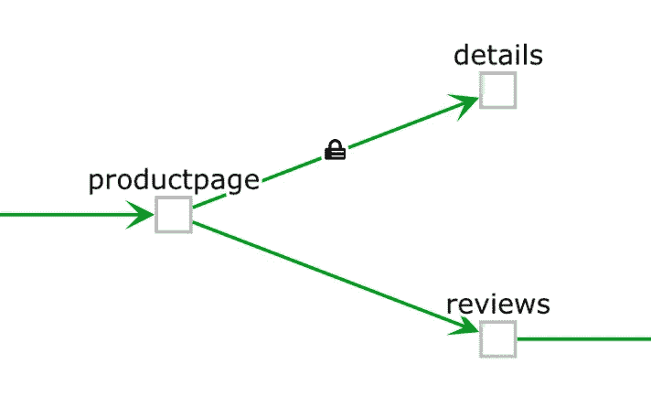
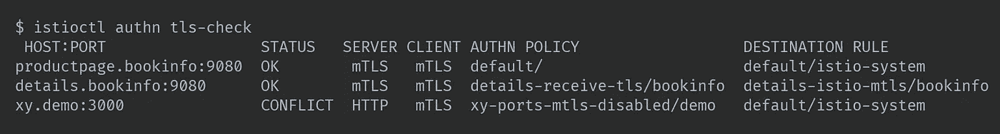
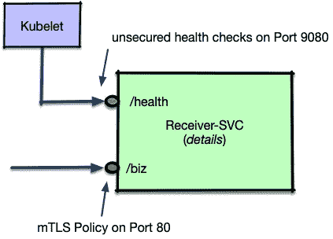
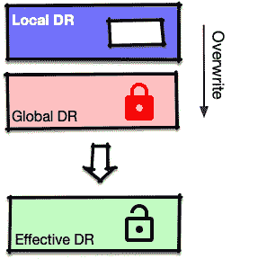
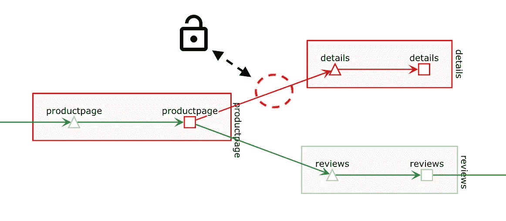

# 关于 Istio 与 mTLS 的思考

> 原文：<https://itnext.io/musings-about-istio-with-mtls-c64b551fe104?source=collection_archive---------1----------------------->

首先，我想说清楚，我认为 Istio 中的 mTLS 是一个非常棒的功能，几乎是 Istio 的一个独特卖点。



Kiali 图表显示了从*产品页面*到通过 mTLS 保护的详细信息的流量

但它也有一些难以发现的陷阱。是的，这是有记录的，但我花了一段时间才明白。在这篇文章中，我想提供一些关于安装和调试的信息。
在左图中，你可以看到 mTLS 建立连接时 [Kiali](https://github.com/kiali/) 显示的内容。

## “互 TLS”到底是什么，mTLS？

TLS 或传输层安全性确保服务之间的通信是加密的。通过正确的配置，还可以借助证书来检查服务是否与它们声明的一样。TLS 的一个主要例子是当您调用 https URL 时的 web 浏览器。

mTLS 现在还确保不仅客户端(调用者)验证服务器(被称为服务)的证书，反之亦然。

在 Citadel 组件的帮助下，Istio 可以在任意两个服务之间建立 MTL，包括证书的创建、分发和检查。

# 为两个服务之间的单个连接设置 mTLS

由于 Bookinfo 是 Istio 的 Hello World，我将使用它来解释如何设置从 *productpage* 到 *details* 服务的 mTLS，如上图所示。

这包括两个部分:

1.  安装一个[策略](https://istio.io/docs/reference/config/istio.authentication.v1alpha1/#Policy)来告诉细节它想要接收 TLS 流量(仅):

```
**apiVersion**: authentication.istio.io/v1alpha1
**kind**: Policy
**metadata**:
  **name**: details-receive-tls
**spec**:
  **targets**:
  - **name**: details
  **peers**:
  - **mtls**: {}
```

2.安装一个 [DestinationRule](https://istio.io/docs/reference/config/istio.networking.v1alpha3/#DestinationRule) 来告诉客户端(productpage)将详细信息告知 TLS:

```
**apiVersion**: networking.istio.io/v1alpha3
**kind**: DestinationRule
**metadata**:
  **name**: details-istio-mtls
**spec**:
  **host**: details.bookinfo.svc.cluster.local
  **trafficPolicy**:
    **tls**:
      **mode**: ISTIO_MUTUAL
```

下面是所涉及服务的图形表示，以及前面两个配置文档适用的地方。


现在，当您仔细查看上面的策略时，您会看到[对等身份验证](https://istio.io/docs/reference/config/istio.authentication.v1alpha1/#MutualTls)的条目

```
**peers**:
- **mtls**: {}
```

这意味着 TLS 验证是严格的，Istio(或者说是 pod 中的特使代理)需要 TLS 流量和有效证书。我们可以传递一个标志来获得[许可模式](https://istio.io/docs/reference/config/istio.authentication.v1alpha1/#MutualTls-Mode):

```
**peers**:
- **mtls**: 
    **mode**: PERMISSIVE
```

# 窥视特使的世界观(关于 mTLS)

现在我们已经看到了如何配置 MTL，让我们看看 Envoy 是如何看待这个世界的。

## 首先是细节服务

让我们从*细节*服务和严格的 TLS 请求开始。我使用 [*istioctl*](https://istio.io/docs/reference/commands/istioctl/) 工具来查询 details pod 实例，并请求*监听器*配置(这基本上是关于传入请求的代理配置)。

```
$ istioctl proxy-config **listener** details-v1-688965fbdf-b9w5w

[
  {
    **"name"**: "172.17.0.9_9080",
    **"address"**: {
      **"socketAddress"**: {
        **"address"**: "172.17.0.9",
        **"portValue"**: 9080
      }
    },
```

第一部分没有什么特别之处，只是标识了端点(配置包含多个端点，但是我们感兴趣的是用于“业务”流量的端点)。接下来是第一个有趣的部分:

```
**"filterChains"**: [
{
  **"tlsContext"**: {
    **"commonTlsContext"**: {
      **"tlsCertificates"**: [
      {
        **"certificateChain"**: {
          **"filename"**: "/etc/certs/cert-chain.pem"
        },
        **"privateKey"**: {
          **"filename"**: "/etc/certs/key.pem"
        }
      }
      ],
      **"validationContext"**: {
        **"trustedCa"**: {
          **"filename"**: "/etc/certs/root-cert.pem"
        }
      },
      **"alpnProtocols"**: [
        "h2",
        "http/1.1"
      ]
    },
    **"requireClientCertificate"**: true
  },
```

过滤器链用于检测传入流量是否是 TLS。该配置指示证书在 Envoy 文件系统中的位置、允许的协议以及客户端必须出示其证书。

接下来我们来看看过滤器配置，它包括一个特定于 Istio 的 http_filter:

```
**"filters"**: [
{
  **"name"**: "envoy.http_connection_manager",
  **"config"**: {
    /* ..omitted.. */
    **"http_filters"**: [
    {
      **"config"**: {
        **"policy"**: {
          **"peers"**: [
          {
            **"mtls"**: {}
          }
          ]
        }
      },
      **"name"**: "istio_authn"
    }
```

该过滤器主要查看策略，如果如上所示设置为“mtls ”,它将在先前定义的证书和证书链的帮助下检查传入请求的证书。

## 现在*产品页面*客户端配置

我们再次使用 istioctl proxy-config 来获取*集群*设置，并检查发送方的详细服务。我们可以再次使用 details-pod，因为每个 pod 都有完整的*集群*视图。唯一的区别是本地 pod 的入站部分，我们目前对此不感兴趣。

```
$ istioctl proxy-config **cluster** details-v1-688965fbdf-b9w5w -o json | less

{
  **"name"**: "outbound|9080||details.bookinfo.svc.cluster.local",
  **"type"**: "EDS",
  **"tlsContext"**: {
    **"commonTlsContext"**: {
      **"tlsCertificates"**: [
      {
        **"certificateChain"**: {
          **"filename"**: "/etc/certs/cert-chain.pem"
        },
        **"privateKey"**: {
          **"filename"**: "/etc/certs/key.pem"
        }
      }
      ],
      **"validationContext"**: {
        **"trustedCa"**: {
          **"filename"**: "/etc/certs/root-cert.pem"
        },
        **"verifySubjectAltName"**: [
          "spiffe://cluster.local/ns/bookinfo/sa/default"
        ]
      },
      **"alpnProtocols"**: [
        "istio"
      ]
    },
    **"sni"**: "outbound|9080||details.bookinfo.svc.cluster.local"
  }
}
```

为了简洁起见，这里的输出被删减了很多。如果您自己运行该命令，只需在输出中搜索*细节*。同样，您会看到包含所有证书信息的 TLS 上下文。这里最有趣的一行是最后一行。“sni”条目告诉 Envoy 使用 TLS 并将各自的目标服务器名称传递给被调用的 IP/端口组合。维基百科有一篇关于 SNI 在 TLS 中用法的[文章。](https://en.wikipedia.org/wiki/Server_Name_Indication)

## 使用 Istioctl 检查 mTLS 设置

运行 *istioctl authn tls-check* 有助于发现问题(由于输出很宽很长，我已经将其缩短，但仍然被迫放入一个截图以获得一些合理的格式):



istioctl 授权 tls 检查的输出缩短

在产品页面的输出中，您可以看到使用了网状 mTLS(见下一段)，详细信息我已经设置了自己的策略和目标规则，对于第 3 行的 xy.demo，检测到冲突，其中 DR(=客户端)要求使用 mTLS，但 xy.demo 服务器有一个覆盖策略，只允许普通 HTTP。

# 设置网状范围的 MTL

在 Istio 文档中[详细描述了如何设置网状宽 mTLS。要检查此*网格策略*是否在您的集群上启用，您可以运行以下命令:](https://istio.io/docs/tasks/security/authn-policy/#globally-enabling-istio-mutual-tls)

```
$ kubectl get MeshPolicy default
```

当建立全网状 mTLS 时，网状网络中服务之间的所有连接都通过 mTLS 得到保护。但是，不仅仅是这些，还包括到网格外部服务的所有其他连接。请看一下 DestinationRule 中的这一行:

```
**spec**:
  **host**: "*.local"
```

"*.local”匹配本地 Kubernetes 集群中的每个服务，包括对 Kubernetes API 的调用。这意味着对于这些呼叫，MTL 必须明确关闭[，这在文档](https://istio.io/docs/tasks/security/authn-policy/#request-from-istio-services-to-kubernetes-api-server)中再次描述。

同样，来自 kubelet 这样的非安全服务进行健康检查的调用现在会被 Envoy 拒绝，因为 [*MeshPolicy*](https://istio.io/docs/tasks/security/authn-policy/#globally-enabling-istio-mutual-tls) 规定了所有服务的 MTL。正常的基于 http 的健康检查不能在 Istio 1.0.x 和更早的版本中使用，您需要切换到让 [kubelet 执行一个命令来进行检查](https://istio.io/help/faq/security/#k8s-health-checks)并提供它的返回代码。理论上，您也可以切换到许可的 TLS，但是这样您会失去大部分好处，所以不推荐这样做。

另一种选择是(如果您的代码允许的话)将健康检查端点放在与业务流量不同的端口上。



业务流量和健康检查的分离

为了实现这一点，我们需要做两件事:

1.  禁用端口 9080 的策略

```
**spec**:
  **targets**:
  - **name**: details
    **ports**:
    - **number**: 9080
  **peers**:
# no mtls entry means disable
```

2.禁用详细信息服务的运行状况检查端口的 mTLS。当我们打开整个网状网络时，端口 80 仍将被 mTLS 覆盖。

```
**spec**:
  **host**: details
  **trafficPolicy**:
    **tls**:
      **mode**: ISTIO_MUTUAL
    **portLevelSettings**:
    - **port**:
        **number**: 9080
      **tls**:
        **mode**: DISABLE
```

## Istio 1.1，mTLS 和健康检查

Istio 1.1 [将(很可能)具有不同的行为](https://github.com/istio/istio/issues/9150)，其中来自 Kubelet 的健康检查调用将发送到 Istio 的试点代理，然后该代理通过 mTLS 调用指定的应用健康检查端点。这是通过重写 sidecar 注入上的 pod 规范来实现的，以便为 kubelet 发送其请求提供不同的端口。应用程序不需要修改任何代码，可以继续使用单个端口进行业务流量和运行状况检查。在撰写本文时，这项工作仍在进行中，文档还没有准备好。Istio issue 9150 提供了所有相关信息。

# 一些需要注意的事情…

有一点可能非常令人困惑，那就是 Istio 处理同一个目标的多个 DestinationRules 的方式。我们在上一个示例中已经看到了这一点，但实际上，当您从一个没有为整个网状网络启用 mTLS 的集群转到一个启用了 mTLS 的集群时，这可能会产生不良影响。

前一个例子中的明确情况非常清楚，通过使用 [**模式:禁用**](https://istio.io/docs/reference/config/istio.networking.v1alpha3/#TLSSettings-TLSmode) ，mTLS(发送)被关闭。当 mTLS 在网状范围内时，如果指定如下 DestinationRule，则更容易出错:

```
**spec**:
  **host**: details
  **subsets**: 
  **- name:** a-subset
    **labels**:
       **version**: abc
```



这一条没有提到流量策略，当不使用 mTLS 时，这完全没问题。但是由于*细节*服务需要 mTLS，这基本上会使所有对*细节*服务的调用失败。原因是 Istio 没有忽略丢失的流量策略，而是用“nothing”覆盖全局策略，这实际上禁用了 TLS 发送。

要解决这个问题，我们需要显式地添加流量策略(即使它是在网状范围内指定的)

```
**spec**:
  **host**: details
  **subsets**:
  - **name**: a-subset
    **labels**:
       **version**: abc
  **trafficPolicy**:
    **targets**:
    - **name**: details
    **peers**:
    - **mtls**: {}
```

我个人希望在这里看到一些继承，使 DestinationRules 在启用或禁用网状或命名空间范围的 mTLS 的场景中都可用。通过在全局 DestinationRule 中指定传递 mtls 策略或允许说:

```
**# Just an idea, will not work in current Istio 1.0/1.1
trafficPolicy**:
  **peers**:
  - **mtls**: 
      **mode**: INHERIT
```

前者可能需要较少的输入工作:-)，对于编写 DestinationRules 的用户来说，因为他们可以直接使用缺省值，而无需进一步的工作。

# 这对基亚利来说意味着什么？

截至本文撰写之时(2018 年 12 月 7 日)，Kiali 尚未展示所有相关细节。如果 DestinationRule 启用了 mTLS，我们将显示锁图标。我们尚未显示 mTLS 是否仅设置了一半(策略缺失或策略已设置，但 DestinationRule 未启用 mTLS)。你至少可以得到一个提示:



Kiali 向详细信息显示流量失败，因为它需要 TLS，但 productpage 上的 DR 忘记重复全局设置(以发送 TLS)。由于这个原因，连接上的锁丢失了

不幸的是，目前这还不够明确，但至少是一个提示——您可以运行 *istioctl authn tls-check* 来验证这一点，如上所示。

有一堆开放的票([基亚利-2092](https://issues.jboss.org/browse/KIALI-2092) 、[基亚利-2108](https://issues.jboss.org/browse/KIALI-2108) )和[基亚利-2082](https://issues.jboss.org/browse/KIALI-2082) 来显示更多的政策相关数据，所以请继续关注(或者如果你想加快速度，请帮助我们实现:-)

# 行动呼吁

请让我知道这个帖子是否有用，并帮助我们使 [Kiali](https://github.com/kiali) 以最好的和有用的方式显示各自的信息。

# 感谢...

我要感谢托马斯·霍特、戴尔·巴比伊、约翰·马齐特利、吴庭艳、李涛和朱莉·斯蒂克勒为我提供了这篇文章草稿的良好反馈。