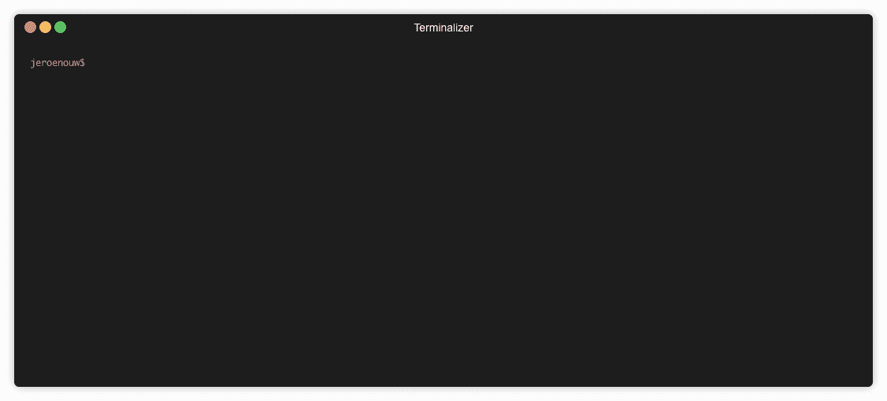
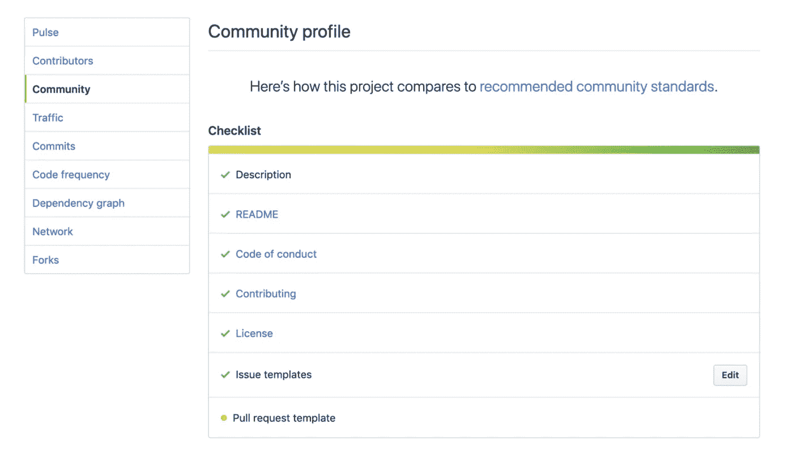

# 每个开发人员的必备工具

> 原文：<https://itnext.io/must-have-tool-for-every-developer-71508e73e9aa?source=collection_archive---------0----------------------->

## 编程；编排

## 通过生成文档节省大量时间


韦斯利·廷吉在 [Unsplash](https://unsplash.com?utm_source=medium&utm_medium=referral) 上拍摄的照片

作为一名开发人员，你应该听说过“干”这个词——不要重复。你应该避免反复写同一个句子。这不仅适用于代码，也适用于文档。谁愿意为了好玩而写基础文档呢？

为了提高和加速对项目的贡献，你需要文档。你参与的每个项目都有一些基本的[降价](https://en.wikipedia.org/wiki/Markdown)文档:

一个**自述文件**描述项目是什么，如何安装和启动项目。

这可能是一个**拉式请求模板**，用于指导参与者如何设置拉式请求。

**安全漏洞报告**这样用户可以提供关于可能的安全问题的信息。

描述项目中的规则、责任和道德行为的**行为准则**。

您可以用一个命令来生成这些文件，而不是手动编写所有这些文件，这需要花费很多时间。

# 1.生成降价文档

使用 [CGX](https://github.com/jeroenouw/cgx) CLI 一次生成五个文档文件的示例:



[CGX 在 NPM](https://www.npmjs.com/package/cgx)

这是一个命令行界面工具，可以通过 [NPM](https://www.npmjs.com/package/cgx) 安装。

# 2.适用于所有类型的项目

*   新的或已经存在的
*   大号、中号还是小号
*   不依赖于编程语言
*   Github、Gitlab、CodeCommit 和 Bitbucket 的特定文件



社区清单 Github

# 3.生成各种文件

你可以生成很多，内置 20 多个模板。不仅仅是降价，比如 YAML。例如，它包含一个 **CI 模板**，供 Gitlab 在管道中执行自动化任务。

下面列出了每个 Git 提供程序的所有可能文件；

## Github、Gitlab、CodeCommit 和 Bitbucket

*   许可证(麻省理工学院、ISC、Apache 2.0、BSD 2 条款、GPLv3 或 CCOv1)
*   变更日志
*   贡献的
*   自述文件
*   待办事项
*   行动守则
*   Dockerfile 文件

## Github 特定

*   错误报告(问题)
*   安全漏洞报告
*   功能请求(问题)
*   拉式请求模板
*   一次所有文件

## Gitlab 特定

*   CI 模板
*   错误(问题)
*   功能提案(问题)
*   合并请求
*   一次所有文件

## 特定代码提交

*   构建规范(AWS 代码构建)
*   应用程序规范(AWS 代码部署)
*   一次所有文件

# 4.快速入门

将 CGX CLI 作为全局 CLI 安装。

```
npm install -g cgx
cd <your-repo-location># Then you run
cgx
```

或者通过 [npx](https://www.npmjs.com/package/npx) 使用:

```
cd <your-repo-location># Then you run
npx cgx
```

这将启动 CLI 并询问您要添加哪些文件！

# 结论

[一个有用的工具](https://github.com/jeroenouw/cgx)，你至少应该试一次。节省一些时间，看看哪些文档可能适合您的项目。如果你喜欢这篇文章，请点击 50 次👏按钮并关注我了解更多内容。