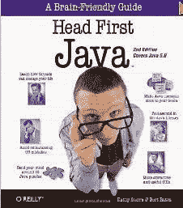
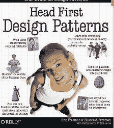
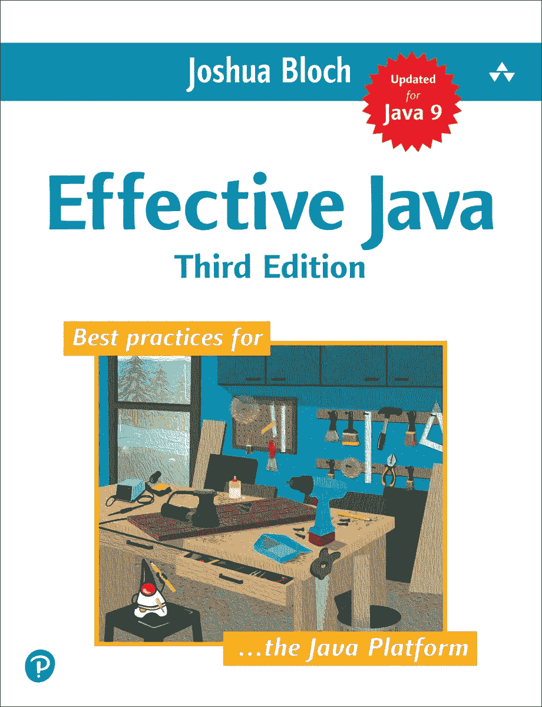
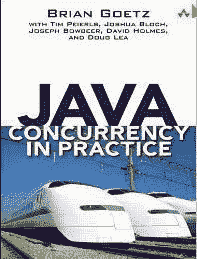
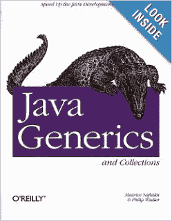
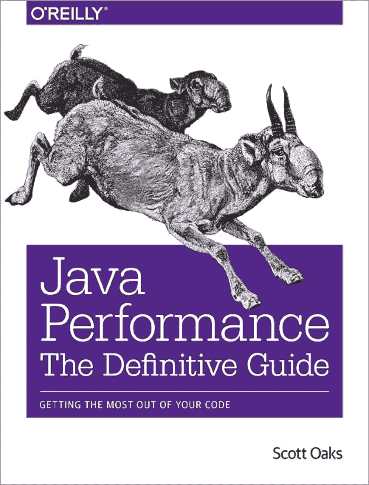
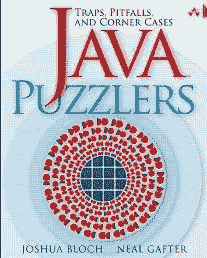
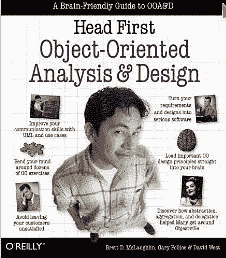
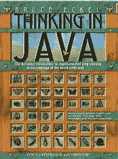
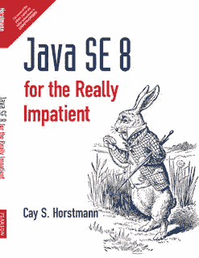

# 深入学习 Java 编程的十大书籍和课程——最好的

> 原文：<https://itnext.io/must-read-books-to-learn-java-programming-327a3768ea2f?source=collection_archive---------4----------------------->

苏珊·尹在 [Unsplash](https://unsplash.com?utm_source=medium&utm_medium=referral) 上的照片

大家好，今天是在线课程的世界。每个人都在谈论从在线培训、Youtube、 [Coursera](https://click.linksynergy.com/deeplink?id=JVFxdTr9V80&mid=40328&murl=https%3A%2F%2Fwww.coursera.org%2F) 、 [Udemy](https://click.linksynergy.com/deeplink?id=JVFxdTr9V80&mid=39197&murl=https%3A%2F%2Fwww.udemy.com%2F) 、 [edX Team](https://www.awin1.com/cread.php?awinmid=6798&awinaffid=631878&clickref=&p=) 和其他网站上学习，这是帮助你更快学习的在线课程，但是，我相信书籍仍然应该是你学习的重要部分，因为它们提供了最深入的知识，并且通常由该主题的权威撰写。

如果您正在学习 [Java 编程](https://www.java.com/en/)，那么请准备好阅读本文中一些最棒的书籍来学习和掌握 Java 编程。

每当程序员开始学习 Java 编程语言时，他们问的第一个问题就是，“*学习 Java 应该参考哪本书？*”或*“初学者学习 Java 最好的书是什么？”*或者*“能告诉我一些学习 Java 的好书吗？”这本身就说明了 Java 书籍对于程序员，尤其是初学者是多么重要。*

尽管 Java 中有如此多的免费资源，如[教程](http://java67.blogspot.com/)、[在线课程](http://www.java67.com/2018/08/top-10-free-java-courses-for-beginners-experienced-developers.html)、技巧、[博客](http://javarevisited.blogspot.com/)和代码示例，但 Java 书籍有自己的一席之地，因为:

*   它们是由这方面的权威程序员编写的
*   他们用更多的细节和解释涵盖了这个主题。

这些 Java 书籍是我个人的最爱，每当我有时间的时候，我更喜欢阅读它们来刷新我的知识。虽然我已经读了其中的许多(到目前为止，我已经读了至少四遍 [**Effective Java**](https://www.amazon.com/Effective-Java-3rd-Joshua-Bloch/dp/0134685997/?tag=javamysqlanta-20) )，但我总是想学习一些新的东西，我对伟大书籍的追求永无止境。

这些书是当今最好的书籍之一，对初学者、中级和高级 Java 程序员同样有用。

不管你是完全的 Java 新手还是已经用 Java 编程一段时间了，你都会通过这些书学到很多新的东西。

话虽如此，但并不是所有的书都同样适合所有水平的 Java 有志者。对于初学者来说， [*头先 Java*](http://www.amazon.com/dp/0596009208/?tag=javamysqlanta-20) 仍然是*最好的入门书，而对于高级 Java 开发者来说， [*有效 Java*](https://www.amazon.com/Effective-Java-3rd-Joshua-Bloch/dp/0134685997/?tag=javamysqlanta-20) 是一本不错的入门书。*

# *深入学习 Java 编程的 10 本书*

*这里是我收集的 Java 书籍，我建议给每一个想学 Java 的程序员。它包含了初学者和有经验的程序员的书籍。*

*这些书涵盖了各种领域，包括核心 Java 基础知识、Java 集合框架、[多线程和并发性](https://javarevisited.blogspot.com/2018/06/top-5-java-multithreading-and-concurrency-courses-experienced-programmers.html)、 [JVM 内部机制](https://javarevisited.blogspot.com/2018/07/top-5-java-performance-tuning-books-for.html)和性能调优、[设计模式](https://javarevisited.blogspot.com/2018/02/top-5-java-design-pattern-courses-for-developers.html)等。*

## *1.头先 Java*

*许多人会认为这是一本过时的书，但说实话, [Head First Java](http://www.amazon.com/dp/0596009208/?tag=javamysqlanta-20) 对于任何编程和 Java 新手来说都是最好的书。这种先入为主的解释方式相当惊人，我真的很喜欢他们的书。*

*Head First Java 涵盖了关于类、对象、线程、集合和语言特性的基本 Java 编程知识，如[泛型](http://javarevisited.blogspot.sg/2011/09/generics-java-example-tutorial.html)、[枚举](https://javarevisited.blogspot.com/2011/08/enum-in-java-example-tutorial.html)、[变量参数](https://javarevisited.blogspot.com/2011/09/variable-argument-in-java5-varargs.html)，或[自动装箱](http://javarevisited.blogspot.sg/2012/07/auto-boxing-and-unboxing-in-java-be.html#axzz59AWpr6cb)。*

*它们还有一些关于 Swing、网络和 Java IO 的高级章节，这使得它们成为 Java 初学者的完整包。如果你是从零开始，这应该是你看的第一本 Java 书。*

**

*如果你更喜欢在线课程而不是书本，那么你也可以看看 Udemy 的 [**完整的 Java MasterClass**](https://click.linksynergy.com/deeplink?id=JVFxdTr9V80&mid=39197&murl=https%3A%2F%2Fwww.udemy.com%2Fjava-the-complete-java-developer-course%2F) 课程。*

* [## 完整的 Java Masterclass(针对 Java 17 进行了更新)

### 你刚刚在网上偶然发现了最完整、最深入的 Java 编程课程。拥有超过 260，000 名学生…

udemy.com](https://click.linksynergy.com/deeplink?id=JVFxdTr9V80&mid=39197&murl=https%3A%2F%2Fwww.udemy.com%2Fjava-the-complete-java-developer-course%2F) 

免责声明:这不是一门免费课程，如果你从 Udemy 购买这门课程，或者如果你使用亚马逊网站上列出的书籍的链接，我将获得报酬。* 

## *2.头先设计模式*

*[Head First 设计模式](http://www.amazon.com/dp/0596007124/?tag=javamysqlanta-20)是 Head-First 实验室的另一本顶级 Java 书籍。*

*当我在 2006 年开始阅读这本书的时候，我并没有过多地考虑设计模式，它们如何解决常见的问题，如何应用设计模式，它们提供了什么好处，以及各种各样的基本东西。但看完这本 Java 书，我受益匪浅。*

*关于[继承](http://www.java67.com/2016/03/top-21-java-inheritance-interview-Questions-Answer-Programming.html)和[组合](http://javarevisited.blogspot.sg/2013/06/why-favor-composition-over-inheritance-java-oops-design.html#axzz57Kv4wGXe)的第一章简直棒极了，它通过引入问题和解决方案来促进实践的改进。*

**

*这本书还包含有用的要点、练习和记忆图，帮助你快速理解设计模式。*

*如果你想学习核心的 Java 设计模式和面向对象的设计原则，这是你应该看的第一本 Java 书。*

*如果你正在寻找一门关于 GOF 或面向对象设计模式的课程，我建议你去看看 [**设计模式库**](https://pluralsight.pxf.io/c/1193463/424552/7490?u=https%3A%2F%2Fwww.pluralsight.com%2Fcourses%2Fpatterns-library) ，这是我迄今为止参加过的关于设计模式的最好的课程之一。*

* [## 设计模式库

### 所有类型的设计模式的参考库

pluralsight.pxf.io](https://pluralsight.pxf.io/c/1193463/424552/7490?u=https%3A%2F%2Fwww.pluralsight.com%2Fcourses%2Fpatterns-library) 

关于这本书的一个好消息是新版本针对 [Java SE 8](https://javarevisited.blogspot.com/2018/08/top-5-java-8-courses-to-learn-online.html) 进行了更新，它将教你如何使用 Java 8 的特性开发经典的 GOF 设计模式，比如 [lambda 表达式](https://javarevisited.blogspot.com/2014/02/10-example-of-lambda-expressions-in-java8.html#axzz5b2nmYJFN)和[流](http://www.java67.com/2018/10/java-8-stream-and-functional-programming-interview-questions-answers.html)。* 

## *3.有效的 Java*

*[Effective Java](http://www.amazon.com/dp/0321356683/?tag=javamysqlanta-20) 是我记录中最好的 Java 书籍之一，也是最令人愉快的书籍之一。我非常尊重作者 Joshua Bloch，因为他对 Java 集合框架和 Java 并发包做出了贡献。*

*高效的 Java 最适合精通 Java 编程的经验丰富的程序员。对于那些希望通过遵循[编程最佳实践](http://javarevisited.blogspot.sg/2014/10/10-java-best-practices-to-name-variables-methods-classes-packages.html#axzz5Bwn8nSNW)来分享他们的技能，以及渴望聆听为 Java 开发工具包(JDK)做出贡献的人的程序员来说，这是非常棒的。*

**

*有效的 Java 由 Java 编程最佳实践的集合组成，范围从[静态工厂](http://javarevisited.blogspot.it/2011/12/factory-design-pattern-java-example.html)、[序列化](http://javarevisited.blogspot.sg/2016/09/how-to-serialize-object-in-java-serialization-example.html)、[等于](https://javarevisited.blogspot.com/2012/12/difference-between-equals-method-and-equality-operator-java.html#axzz5Y4Kd7uK1)和 [hashcode](http://javarevisited.blogspot.sg/2011/02/how-to-write-equals-method-in-java.html#axzz5B6EWE6M7) 到泛型、枚举、变量和反射。*

*这本 Java 编程书几乎涵盖了 Java 的每个方面，与您习惯的方式略有不同。*

*去年发布了一个新版本，介绍了去年 9 月发布的 JDK 7、8 和 17 的功能。它还有整整一章是关于 [lambdas](https://javarevisited.blogspot.com/2017/08/how-to-convert-lambda-expression-to-method-reference-in-java8-example.html) 的。*

## *4.实践中的 Java 并发*

*[Java Concurrency in Practice](http://www.amazon.com/dp/0321349601/?tag=javamysqlanta-20)是 Joshua Bloch、Doug Lea 及其团队的另一部经典作品。这是关于并发和多线程的最好的 Java 书籍——核心 Java 开发人员的必读书籍之一。*

*Java 并发实践的优势包括:*

*1)这本书非常详细，抓住了多线程和并发性的小细节*

*2)本书没有关注核心 Java 类，而是关注并发问题，如[死锁](https://javarevisited.blogspot.com/2018/08/how-to-avoid-deadlock-in-java-threads.html)、饥饿、线程安全、竞争条件，并介绍了使用 Java 并发类解决这些问题的方法。*

*这本书是学习和掌握 Java 并发包和类的极好资源，比如 [CountDownLatch](http://javarevisited.blogspot.sg/2012/07/countdownlatch-example-in-java.html) 、 [CyclicBarrier](http://javarevisited.blogspot.sg/2012/07/cyclicbarrier-example-java-5-concurrency-tutorial.html) 、 [BlockingQueue](http://javarevisited.blogspot.sg/2012/12/blocking-queue-in-java-example-ArrayBlockingQueue-LinkedBlockingQueue.html) 或 [Semaphore](http://javarevisited.blogspot.sg/2012/05/counting-semaphore-example-in-java-5.html) 。这是我喜欢读这本 Java 书，并且反复阅读的最大原因。*

**

*Java 中的 [*并发实践的另一个优点*](https://medium.com/javarevisited/is-java-concurrency-in-practice-still-valid-8bb54fc3fb7f) 是真实的例子；这本书里的例子清晰、简洁、有智慧。*

*4)这本书还善于解释什么是错的，为什么是错的，以及如何改正，这是任何一本 Java 书取得成功所必不可少的。*

*简而言之，这是学习 Java 中并发和多线程的 [*最佳书籍之一。从初学者的角度来看，内容肯定是先进的，但毫无疑问，这是有经验的 Java 程序员的必读之书。*](https://medium.com/javarevisited/6-multithreading-and-concurrency-books-every-java-programmer-should-read-b6a08d2aae54)*

*顺便说一句，如果你觉得这本书太难了，需要帮助来指导你，那么你也可以看看 Heinz Kabutz 根据这本书编写的[**Java Concurrency in Practice Bundle**](https://learning.javaspecialists.eu/courses/concurrency-in-practice-bundle?affcode=92815_johrd7r8)课程。它对从本书中获得最大收益帮助很大，我强烈推荐给任何想要掌握并发和线程的 Java 开发人员。*

* [## 实践捆绑包中的 Java 并发

### 与并发学习相关的课程](https://learning.javaspecialists.eu/courses/concurrency-in-practice-bundle?affcode=92815_johrd7r8)* 

## *5.Java 泛型和集合*

*来自 O'Reilly 的 Naftalin 和 Philip Wadler 的[Java Generics and Collection](http://www.amazon.com/dp/0596527756/?tag=javamysqlanta-20)是另一本关于 Java 的好书，我最初忘记将它包括在我的列表中，但现在应许多读者的要求，我将它包括在内。*

*我喜欢这本书是因为它关于泛型和集合的内容，这是 Java 语言的核心领域。*

*一个有经验的程序员应该对 [Java 集合](https://javarevisited.blogspot.com/2011/11/collection-interview-questions-answers.html)和[泛型](https://javarevisited.blogspot.com/2017/03/how-to-implement-stack-in-java-using-array-example.html)有很深的了解，这些书在这方面有帮助。*

**

*它解释了每个集合接口，如 [Set](http://www.java67.com/2013/08/ata-structures-in-java-programming-array-linked-list-map-set-stack-queue.html) 、 [List](https://javarevisited.blogspot.com/2011/05/example-of-arraylist-in-java-tutorial.html) 、 [Map](http://www.java67.com/2013/02/10-examples-of-hashmap-in-java-programming-tutorial.html) 、Queue，以及它们的实现，比较了它们在不同情况下的表现。*

*我真的很喜欢他们在每章末尾的比较图表，它让你很好地了解什么时候使用特定的 Java 集合类，比如`ArrayList`、`HashMap`或`LinkedHashMap`。*

*如果你需要在线课程，那么[**Richard war Burton**](https://pluralsight.pxf.io/c/1193463/424552/7490?u=https%3A%2F%2Fwww.pluralsight.com%2Fcourses%2Fjava-fundamentals-collections)**[在](https://medium.com/u/4ab46c1e2074?source=post_page-----327a3768ea2f--------------------------------) [Pluralsight](https://medium.com/u/50a6c7ef7431?source=post_page-----327a3768ea2f--------------------------------) 上的**Java Fundamentals:Collections 是一个很好的伙伴。*

* [## Java 基础:集合

### 了解为什么要使用集合而不是数组，并理解列表、集合和映射的强大功能。

pluralsight.pxf.io](https://pluralsight.pxf.io/c/1193463/424552/7490?u=https%3A%2F%2Fwww.pluralsight.com%2Fcourses%2Fjava-fundamentals-collections) 

顺便说一下，你需要一个 [**Pluralsight 会员**](https://pluralsight.pxf.io/c/1193463/424552/7490?u=https%3A%2F%2Fwww.pluralsight.com%2Fpricing) 才能加入这个课程，费用大约是每月 29 美元或每年 299 美元(14%的折扣)。如果你没有这个计划，我强烈推荐你加入，因为它能促进你的学习，而且作为一名程序员，你总是需要学习新的东西。

或者，你也可以使用他们的 **1** [**0 天免费试用**](https://pluralsight.pxf.io/c/1193463/424552/7490?u=https%3A%2F%2Fwww.pluralsight.com%2Flearn) 免费观看本课程。* 

## *6.Binu John 的 Java 性能*

*这是另一本讲述 JVM 内部机制、垃圾收集、JVM 调优、剖析的好书。等等，我强烈推荐每一位高级 Java 开发人员阅读本书。这也是我个人的最爱之一。*

*随着我们的逐渐进步，我们从初级水平开始到中级水平，现在是高级水平。*

**Java Performance*完全是关于性能监控、剖析和用于 Java 性能监控的工具。*

*这不是一般的编程书。相反，它提供了关于 [JVM](http://javarevisited.blogspot.sg/2011/11/hotspot-jvm-options-java-examples.html) 、[垃圾收集](http://javarevisited.blogspot.sg/2012/10/10-garbage-collection-interview-question-answer.html)、 [Java 堆](http://javarevisited.blogspot.sg/2011/05/java-heap-space-memory-size-jvm.html)监控和分析应用程序的详细信息。*

*我喜欢他们关于 JVM 概述的那一章，这是用简单的语言学习更多 JVM 知识的必读书。*

*初学者和中级程序员都可以从本书中受益，但是在阅读本书之前，最好先掌握一些 Java 经验。到目前为止，这是关于性能监控的最好的 Java 书籍。*

*如果你对性能很认真，这是另一本必读的 Java 书。*

*Java 中有几本新书，涵盖了 JDK 1.7。想要找到类似**[**Java Performance 的最新 Java 性能书籍，Scott Oaks** 的权威指南](http://www.amazon.com/Java-Performance-The-Definitive-Guide/dp/1449358454?tag=javamysqlanta-20) **，当然值得在购买这本书之前查阅一下。*****

******

***如果你需要一些关于解决内存和 CPU 问题的积极指导，我建议你也看看 Richard Warburton 的 [**理解和解决 Java 内存问题**](https://pluralsight.pxf.io/c/1193463/424552/7490?u=https%3A%2F%2Fwww.pluralsight.com%2Fcourses%2Fjava-understanding-solving-memory-problems) 课程。***

*** [## 了解 Java 虚拟机:内存管理

### 本课程涵盖了 Java 中垃圾收集的所有方面，包括内存如何分成代和…

pluralsight.pxf.io](https://pluralsight.pxf.io/c/1193463/424552/7490?u=https%3A%2F%2Fwww.pluralsight.com%2Fcourses%2Funderstanding-java-vm-memory-management)*** 

## ***7.Java 难题***

***约书亚·布洛赫的另一本书值得一读，这次是与尼尔·加夫特合作的。这本书是关于 Java 编程语言中的死角和陷阱。***

***Java 比 [C++](http://www.java67.com/2018/02/5-free-cpp-courses-to-learn-programming.html) 更安全，而 [JVM](https://javarevisited.blogspot.com/2018/02/top-3-jvm-languages-java-programmer-learn.html#axzz5jSDZJeu0) 很好地将程序员从容易出错的内存分配和释放中解放出来。但是，Java 仍然有让有经验的 Java 程序员感到惊讶的极限情况。***

******

***这本 Java 书展示了这样的 Java 陷阱，并对它们进行了更详细的解释。如果你喜欢谜题，这是一本很好的 Java 书——你甚至可以在[核心 Java 访谈](http://javarevisited.blogspot.sg/2015/10/133-java-interview-questions-answers-from-last-5-years.html#axzz4pEKHfj36)中包括许多这样的内容，来检查他们的 Java 知识。***

***我对它的评价没有 [*有效 Java*](https://javarevisited.blogspot.com/2017/10/effective-java-3rd-edition-coming-soon.html#axzz5Nf1J69kw) 和[*Java Concurrency in Practice*](https://javarevisited.blogspot.com/2016/06/5-books-to-learn-concurrent-programming-multithreading-java.html)*，*高，但是你仍然可以试一试，特别是检查一下你对 Java 的知识和它的边角案例，这将有助于你从面试中回答一些[棘手的 Java 问题](http://www.java67.com/2012/09/top-10-tricky-java-interview-questions-answers.html)。***

***为了理解这本 Java 书的大部分内容，尝试自己解谜，然后查看解释，使你的知识更加具体。在 Udemy 上还有一个在线课程叫做 [**消除代码恐惧的 Java 谜题**](https://click.linksynergy.com/deeplink?id=JVFxdTr9V80&mid=39197&murl=https%3A%2F%2Fwww.udemy.com%2Feliminate-code-fear%2F) ，作者是 Imtiaz Ahmed，它将帮助你解决任何编程问题，并且一劳永逸地掌握它们。***

*** [## 消除代码恐惧的 Java 难题| Udemy

### 真正掌握 Java 编程并成为危险开发者的最快方法！

udemy.com](https://click.linksynergy.com/deeplink?id=JVFxdTr9V80&mid=39197&murl=https%3A%2F%2Fwww.udemy.com%2Feliminate-code-fear%2F)*** 

## ***8.面向对象的分析与设计***

***Head-First 系列的另一本关于 Java 编程和设计原则的好书。 [*头先面向对象分析与设计*](http://javarevisited.blogspot.sg/2013/06/5-must-read-books-to-learn-object.html) 可结合 [*头先设计模式*](http://www.amazon.com/dp/0596007124/?tag=javamysqlanta-20) 阅读。***

***这本书聚焦于面向对象的设计原则，像[喜欢组合胜过继承](http://javarevisited.blogspot.sg/2013/06/why-favor-composition-over-inheritance-java-oops-design.html)，为接口而不是实现编程，DRY 等等。***

******

***学习 Java 的一部分是编写好的代码并遵循最佳实践，这本书在教育程序员这方面很有帮助。***

***从本书中获得的知识适用于许多面向对象的编程语言，总体来说，将提高你对[代码](http://www.java67.com/2016/02/5-books-to-improve-coding-skills-of.html)和 [OOP 设计原则](https://pluralsight.pxf.io/c/1193463/424552/7490?u=https%3A%2F%2Fwww.pluralsight.com%2Fcourses%2Fprinciples-oo-design)的理解。***

***不过，如果你觉得你的 OOP 技能有所欠缺，你需要一门课程来学习坚实的原理以编写更好的代码，我建议你加入 Coursera 上的 [**面向对象 Java 编程:数据结构和超越专门化**](https://click.linksynergy.com/deeplink?id=JVFxdTr9V80&mid=40328&murl=https%3A%2F%2Fwww.coursera.org%2Fspecializations%2Fjava-object-oriented%3F) 。它由加州大学圣地亚哥分校或加州大学提供，包含了一系列的课程来更好地教你 Java 中的 OOP。***

*** [## 面向对象的 Java 编程:数据结构及其他

### 这个专业涵盖了软件开发中的中级主题。您将学习面向对象编程…

coursera.com](https://click.linksynergy.com/deeplink?id=JVFxdTr9V80&mid=40328&murl=https%3A%2F%2Fwww.coursera.org%2Fspecializations%2Fjava-object-oriented%3F) 

而且，如果你觉得 Coursera 的课程有用，那么我建议你加入 Coursera Plus 的 [**，这是一个 Coursera 的订阅计划，让你可以无限制地访问他们最受欢迎的课程、专业、专业证书和指导项目。它每年花费大约 399 美元，但是它完全物有所值，因为你可以获得无限的证书。**](https://click.linksynergy.com/deeplink?id=JVFxdTr9V80&mid=40328&murl=https%3A%2F%2Fwww.coursera.org%2Fcourseraplus)

***

## ***9.用 Java 思考***

***[*用 Java 思考*](http://www.amazon.com/dp/0131872486/?tag=javamysqlanta-20) 是布鲁斯·埃凯尔写的，他也是《用 C++ 思考[的作者，用他独特的风格来教授 Java 概念。](https://www.amazon.com/Thinking-C-Bruce-Eckel/dp/0139177094?tag=javamysqlanta-20)***

***许多人会同意这是最好的 Java 书籍之一，因为它指出了一些聪明的例子。这是一本完整的 Java 书籍，也是一个内存映射参考。***

***Java 中有一章 [Java 内存映射 IO](http://javarevisited.blogspot.sg/2012/01/memorymapped-file-and-io-in-java.html) ，是我的最爱。***

******

***如果你不喜欢头头是道的教学风格，但是需要一本浅显示例风格的 Java 入门书，*用 Java 思考*是个不错的选择。***

***它很详细，很成熟，而且经常更新，但是，如果你需要更多的选择，你也可以看看这些为初学者准备的核心 Java 书籍。***

***而且，如果你喜欢让你的学习更有趣的在线课程，那么我建议你看看杜克大学在 Coursera 上提供的 [Java 编程和软件工程基础](https://click.linksynergy.com/deeplink?id=JVFxdTr9V80&mid=40328&murl=https%3A%2F%2Fwww.coursera.org%2Fspecializations%2Fjava-programming)专业。***

*** [## Java 编程和软件工程基础| Coursera

### 通过对 Java 的介绍，向你的软件开发生涯迈出第一步——最受欢迎的……

coursera.com](https://click.linksynergy.com/deeplink?id=JVFxdTr9V80&mid=40328&murl=https%3A%2F%2Fwww.coursera.org%2Fspecializations%2Fjava-programming) 

6 万多名学生已经从中受益。审计是免费的，但如果你还需要一个证书来显示在你的 LinkedIn 个人资料或简历中，你就需要付费。*** 

## *****10。为真正没有耐心的人准备的 Java SE 8*****

***这是学习 Java 8 的[最佳书籍之一。也是我的通用 Java 8 书。如果你时间比较少，想学习所有关于](https://www.amazon.com/Java-SE8-Really-Impatient-Course/dp/0321927761?tag=javamysqlanta-20) [Java 8](https://javarevisited.blogspot.com/2018/08/top-5-free-java-8-and-9-courses-for-programmers.html) 的重要东西，这本书是可以参考的。***

***我没必要提醒你关于凯的事。霍斯特曼的写作技巧，Java 最好的作者之一，还有约书亚·布洛赫，我发现他们都非常可读。***

***你不会觉得无聊，程序员看技术书经常会觉得无聊。它解释了 [lambda 表达式](http://www.java67.com/2014/11/java-8-comparator-example-using-lambda-expression.html)、[流](http://www.java67.com/2014/04/java-8-stream-examples-and-tutorial.html)、[函数接口](https://javarevisited.blogspot.com/2018/01/what-is-functional-interface-in-java-8.html)、[方法引用](https://javarevisited.blogspot.com/2017/03/what-is-method-references-in-java-8-example.html)、[新的 Java 日期时间 API](https://javarevisited.blogspot.com/2015/03/20-examples-of-date-and-time-api-from-Java8.html#axzz5dUGc82ss) ，以及其他几个小的增强，如连接字符串、可重复注释等。***

******

***简而言之，这无疑是学习 Java 的最佳书籍之一，如果您需要提供一些在线课程来学习 Java 8 的特性，那么没有比真正的 Java 冠军 José Paumard 所著的[Java 8 新特性](https://pluralsight.pxf.io/c/1193463/424552/7490?u=https%3A%2F%2Fwww.pluralsight.com%2Fcourses%2Fjava-8-whats-new)更好的课程了。***

*** [## Java 8 的新特性

### Java 8 大部分新特性的快速概述。本课程涵盖了 lambda 表达式和流 API，但是…

pluralsight.pxf.io](https://pluralsight.pxf.io/c/1193463/424552/7490?u=https%3A%2F%2Fwww.pluralsight.com%2Fcourses%2Fjava-8-whats-new)*** 

## ***包扎***

***这是我列出的**顶级 Java 编程书籍和课程**。我已经读完了所有的书，其中一些我还在读，有几本，像 *Effective Java* 第三版和 Head-First 系列，我已经读了几遍。许多有抱负的 Java 开发者问我他们应该从哪本书开始，现在应该读哪本 Java 书。我希望你能在这本书集中找到一些好书。***

***快乐阅读！***

*****学习 Java 编程的其他有用资源**
[2023 年 Java 程序员应该学会的 10 件事](https://javarevisited.blogspot.com/2017/12/10-things-java-programmers-should-learn.html#axzz5atl0BngO)
[每个 Java 开发者都应该知道的 10 个工具](http://www.java67.com/2018/04/10-tools-java-developers-should-learn.html)
[学习 Java 编程语言的 10 个理由](http://javarevisited.blogspot.sg/2013/04/10-reasons-to-learn-java-programming.html)
[Java 和 Web 开发者应该学会的 10 个框架](http://javarevisited.blogspot.sg/2018/01/10-frameworks-java-and-web-developers-should-learn.html)
[成为更好的 Java 开发者的 10 个技巧](http://javarevisited.blogspot.sg/2018/05/10-tips-to-become-better-java-developer.html)
[2023 年要学习的 5 大 Java 框架](http://javarevisited.blogspot.sg/2018/04/top-5-java-frameworks-to-learn-in-2018_27.html)
应知
[2023 年 Web 开发者路线图](https://hackernoon.com/the-2019-web-developer-roadmap-ab89ac3c380e)
[50+数据结构和算法问题进行编码面试](https://hackernoon.com/50-data-structure-and-algorithms-interview-questions-for-programmers-b4b1ac61f5b0)***

## ***结束语***

***感谢您阅读本文。你可能会想，有这么多东西要学，有这么多课程要参加，但你不需要担心。***

***很有可能你已经知道了大部分内容，而且也有很多有用的免费资源供你使用——我也在这里和那里链接了它们以及其他资源，这些资源当然不是免费的，但是很值钱。***

***我是 Udemy 课程的特别粉丝，因为它们非常实惠，并且以很少的金额提供很多价值，但是你可以自由选择你想要的课程。***

***在一天结束的时候，你应该从使用这里提到的资源中获得足够的知识和经验。***

***祝您的 Java 之旅好运！当然**不会很容易**，但是通过遵循这个路线图和指南，你离成为你一直想成为的 Java 开发人员又近了一步***

***如果你喜欢这篇文章，那么请考虑在 medium 上关注我( [javinpaul](https://medium.com/u/bb36d8439904?source=post_page-----327a3768ea2f--------------------------------) )。如果你想在每篇新帖发布时得到通知，别忘了在 Twitter 上关注**[**javarevited**](https://twitter.com/javarevisited)！再次祝你的 Java 开发之旅一切顺利，非常感谢所有的作者写出了这么棒的书。*****

*****这些顶级 Java 编程书籍是学习 Java 的最佳书籍中的一部分——我甚至可以说其中一些是有史以来出版的最好的 Java 书籍。顺便说一句，当你购买任何这些书或课程时，我也会赚取一小笔佣金。*****

*****您可能喜欢的其他 Java 资源*****

***** [## 2023 年初学者学习的 10 个最佳 Java 课程和认证

### 如果你是计算机科学专业的毕业生，或者想学习 Java 并且正在寻找一些很棒的资源，比如…

medium.com](https://medium.com/javarevisited/top-5-java-online-courses-for-beginners-best-of-lot-1e1e240a758)  [## 2023 年要学习的 11 门最佳免费 Java 编程课程

### 我的免费课程列表深入学习 Java 从核心 Java 到多线程到 JDBC 到合集，什么都有…

medium.com](https://medium.com/javarevisited/10-free-courses-to-learn-java-in-2019-22d1f33a3915)  [## 2023 年免费在线学习 Java 的 10 个最佳地点

### 我最喜欢的免费在线学习 Java 的网站，适合初学者和想学习 Java 编码的人…

medium.com](https://medium.com/javarevisited/10-best-places-to-learn-java-online-for-free-ce5e713ab5b2)*****