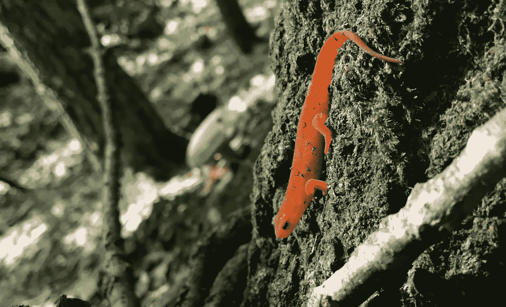
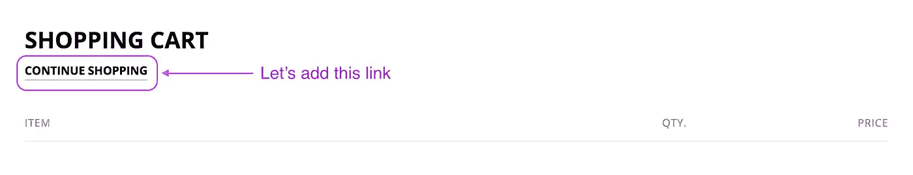
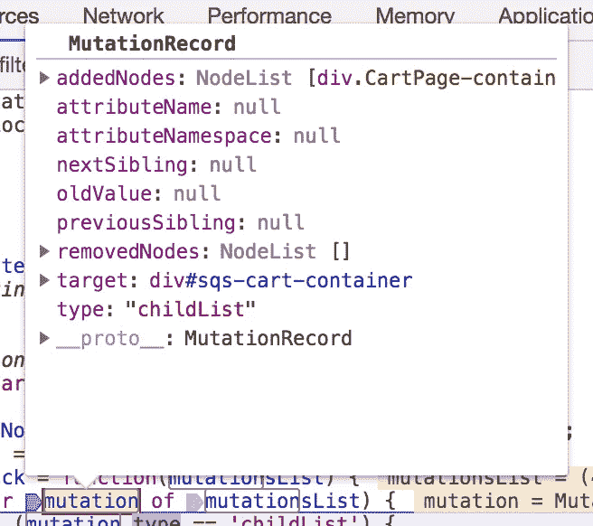
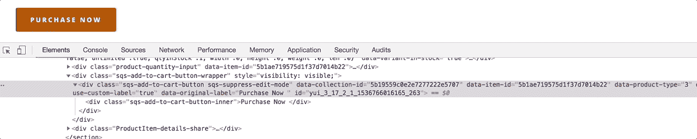

# 突变观察者前来救援

> 原文：<https://itnext.io/mutation-observers-to-the-rescue-c73e786158c0?source=collection_archive---------1----------------------->

不，不是 x 战警超级粉丝，是 Javascript 的`MutationObserver`接口！



红色 eft——水生东部蝾螈的陆地幼体阶段。诺拉·布朗

有时候，你对一个站点的代码没有多少控制权。也许你正在做一个用 Squarespace，或者 Wordpress + plugins + more plugins 构建的客户端站点。在这种情况下，当您想要进行改进或改变行为时，Javascript 通常是我们求助的工具。但是有时，甚至通常的 Javascript 挂钩都不可用。

例如，一种常见的模式是等待页面的 DOM 内容被加载，然后访问页面上的某个元素，并对其进行更改。但是，如果您想要访问的元素是在页面的`load`事件触发后动态加载的呢？

或者，您可能希望对页面上发生的事情做出反应，但是无论是什么代码的开发人员都没有发布一个您可以收听的友好事件列表。也许甚至没有一个适当的事件被解雇(震惊！).

# 进入突变观察者，舞台左侧

我们可以向得到大力支持的`MutationObserver`寻求一点帮助。它易于理解和实现，并且在 IE10 之后的现代浏览器也支持[。真的很棒。](https://caniuse.com/#feat=mutationobserver)

一般模式是:

1.  创建新的观察者
2.  告诉它当突变发生时该做什么
3.  指导它观察你想要的元素，有一定的选项:

```
// DOM element we want to observe
var targetNode = ...;// Options for the observer
var config = { ...options... };// Callback will execute when mutations are observed
var callback = function(mutationsList){ ...do stuff... };// Create a new observer, passing in the callback function
var observer = new MutationObserver(callback);// Start observing the targetNode with the given configuration
observer.observe(targetNode, config);
```

观察者配置有几个选项:

*   最重要的是，它描述了**观察什么** : `childList`、`attributes`、`characterData`，或者任意组合。
*   如果您正在监视属性，您可以另外指定一个`attributeFilter`，它将观察到的属性限制在您提供的数组中。
*   如果您正在观察属性或角色数据，您可以通过将`attributeOldValue`或`characterDataOldValue`选项分别设置为`true`来记录预变异值。
*   默认情况下，变异观察器只会观察你指定的节点；要查看它包含的整个子树，请将`subtree`选项设置为`true`。

因此，配置可能看起来像这样:

```
var config = {
    attributes: true,
    attributeOldValue: true,
    attributeFilter: ['class'],
    subtree: true
}
```

上面将配置我们的观察者来观察我们的目标节点和任何后代节点上的`class`属性的变化，并跟踪变异前的值。

# 操作动态加载的 DOM 内容



向 Squarespace 购物车页面添加“继续购物”链接

让我们用一个突变观察者来处理我们的第一个用例。我们想在 Squarespace 购物车页面上添加一个突出的(但也很微妙的)“继续购物”链接。很简单，对吧？只要抓住那个漂亮的标题，添加一个链接，就万事大吉了(为了简洁，这里使用了 jQuery):

```
$('.cart-title').append('<br><a href="/shop-home" style="font-size: .5em">Continue Shopping</a>');
```

如果这是在一个`$(document).ready`回调中，或者包含在结束的`</body>`标签之前，它应该可以很好地工作。当然，除非整个购物车，包括标题，在页面加载后被添加到 DOM *中。*

没问题。我们可以使用一个`MutationObserver`来观察 DOM 或者 DOM 的一个特定部分的变化，并且当我们看到我们的`cart-title`被添加时做出反应:

正如您所看到的，突变观察者的回调可以接受一个参数(上面代码中的`mutationsList`，这是一个`[MutationRecord](https://developer.mozilla.org/en-US/docs/Web/API/MutationRecord)` [对象](https://developer.mozilla.org/en-US/docs/Web/API/MutationRecord)的数组。



Chrome DevTools 中的一个变异记录

每个突变记录都有许多有用的属性，包括:

*   `type` : `childList`、`attributes`或`characterData`，如果您正在观察多种突变类型，并希望根据类型采取不同的行动，这将非常有用。
*   `target`:子节点或属性已经改变的元素，或一个`CharacterData`节点。请注意，这可能是也可能不是您正在观察的原始`targetNode`——如果`subtree: true`是`targetNode`的任何后代。
*   `addedNodes`、`removedNodes`、`previousSibling`、`nextSibling`:前两个是广告，previous 和 next 是相对于增加或删除的节点。
*   `attributeName`:如果突变类型为`attributes`，则更新的属性名称。如果您对多个属性的更改感兴趣，这很方便。
*   如果你已经配置了观察器来记录突变前的值，这就是它们的位置。对于`attributes`，是突变前的值，对于`characterData`，是突变前的字符数据。

# 响应属性更改

在我们的第二个场景中，我们希望对页面上发生的事情做出响应——我们无法控制的事情以及我们无法访问的事件。对于这个例子，让我们想象一个“添加到购物车”动作:用户点击“添加到购物车”按钮，站点的代码发出一个 Ajax 调用，商品被添加到用户的购物车。此时，您希望将用户带到购物车页面。



在添加到购物车的整个过程中，类别和其他属性会发生变化

在这个添加到购物车的过程中，按钮和周围元素的许多属性都发生了变化，包括类。我们可以设置一个变异观察者来观察它们并做出反应:

在这里，由于我们没有观察子树，我们知道`mutation.target`将是我们最初的`targetNode`。所以我们可以简单地等待`cart-added`类出现在类列表中，表明添加到购物车的过程已经完成，然后将用户带到购物车页面。

# 突变观察者的其他用例

在上面的两个场景中，当我们不得不求助于观察 DOM 的变化时，突变观察者 API 救了我们，因为我们无法控制进行这些变化的代码。但是可能有其他场景使用`MutationObserver`模式。假设您想要对添加到页面的新元素做出反应，有几种方式可以实现(单击按钮、点击 return、ajax 调用)。不需要以所有这些方式触发，或者使用发布/订阅模式，也许您只需观察 DOM 的最终结果——添加新元素。

你用过`MutationObserver`吗？下面留言评论！感谢阅读。

## 更多关于突变观察者的信息

*   `[MutationObserver](https://developer.mozilla.org/en-US/docs/Web/API/MutationObserver)`[Mozilla 上的 API 文档](https://developer.mozilla.org/en-US/docs/Web/API/MutationObserver)
*   [Mozilla 博客上的文章](https://hacks.mozilla.org/2012/05/dom-mutationobserver-reacting-to-dom-changes-without-killing-browser-performance/)
*   [用突变观察器实现撤销/重做](https://addyosmani.com/blog/mutation-observers/)