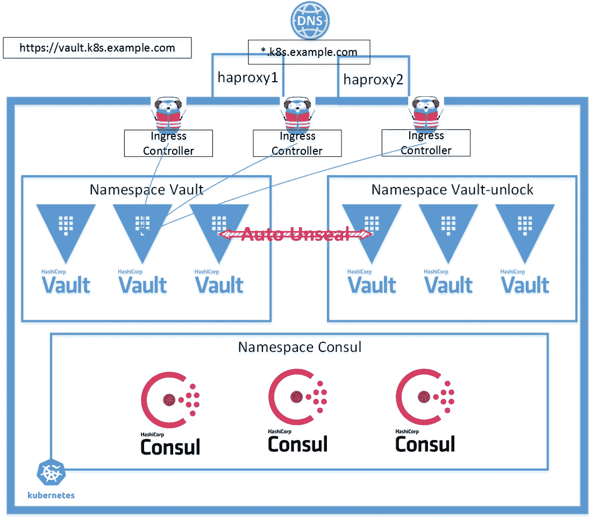
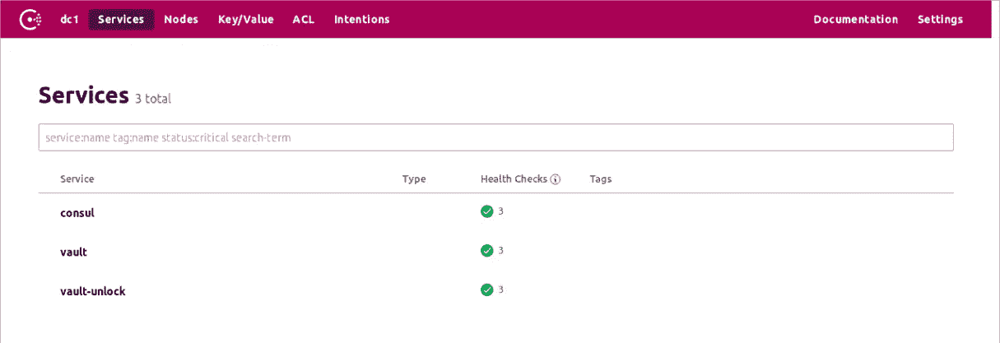
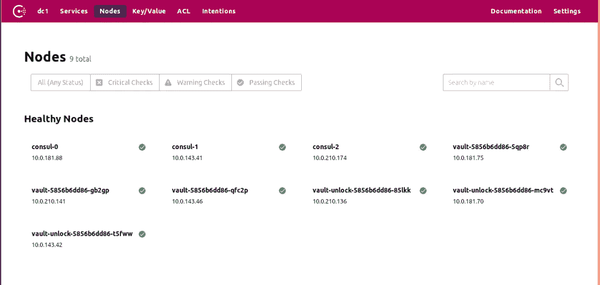
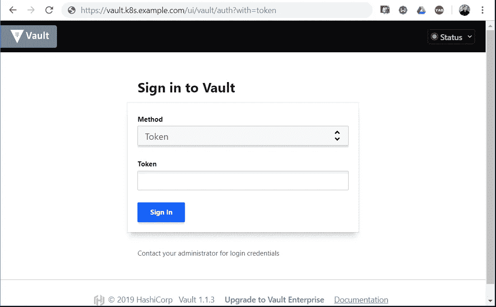
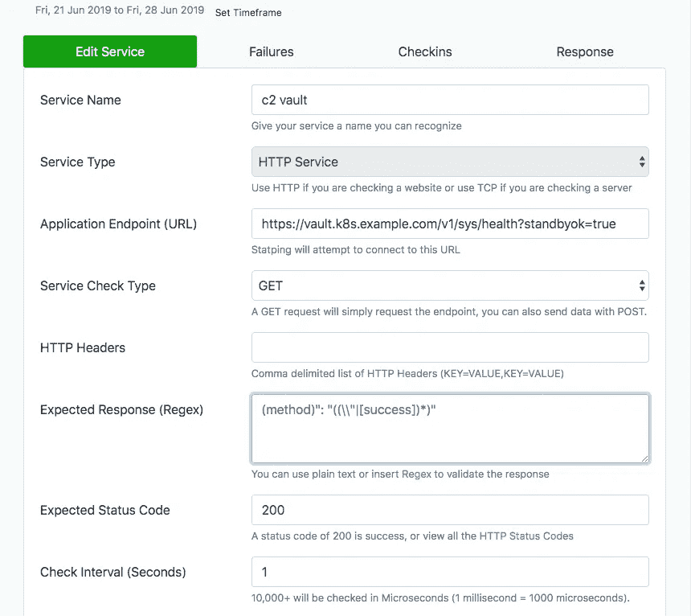
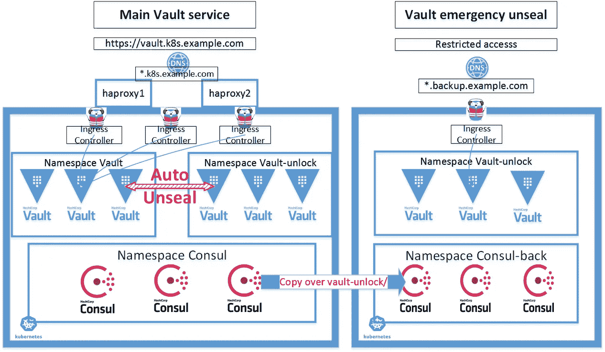
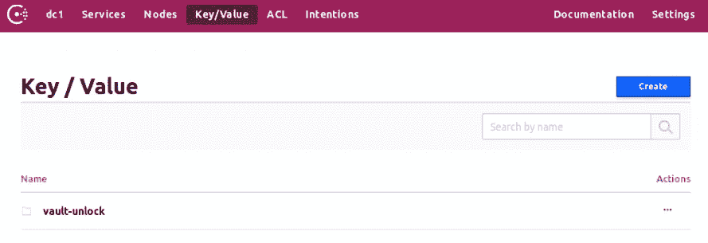

# 相互自动解封 Kubernetes 中的两个保险库集群

> 原文：<https://itnext.io/mutual-auto-unseal-two-vault-clusters-in-kubernetes-465516da98f8?source=collection_archive---------0----------------------->

相互自动解封 Kubernetes 中的两个保险库集群

## 介绍

当我将 [Vault](https://learn.hashicorp.com/vault/) 部署到 Kubernetes 时，我意识到拥有自动解封功能对 Vault 集群实现真正的高可用性非常重要。

在我以前的文章“Kubernetes 中的高可用性 Vault cluster”([链接](https://medium.com/@liejuntao001/highly-available-vault-cluster-in-kubernetes-e406f07569a6))中，即使我已经尽力使 Vault cluster 尽可能地高可用性，在没有自动解封的情况下，Vault cluster 也可以容忍部分 pods 故障，但无法承受整个集群的重新启动。

[*这篇文章*](/hashicorp-vault-on-kubernetes-with-auto-unseal-b7e64edbe63e) 很好地解释了为什么和如何。对我来说，问题是我没有“AWS KMS 服务”可以使用，或者任何类似的云供应商安全服务，因为我在自我管理的云供应商上运行 Kubernetes([*本文*](https://medium.com/@liejuntao001/create-highly-available-kubernetes-cluster-with-minimal-dependencies-c45f5b34e9d2?source=friends_link&sk=cb2aa36f5c61f2d59211664e75f29946) 解释了我的设置)。

Vault 版本 [1.1](https://www.hashicorp.com/blog/vault-1-1) 新增支持“中转自动解封”，即使用第二个 Vault 集群 B 自动解封集群 a。

这里的想法是，部署 2 个存储集群 A 和 B，并设置它们为彼此自动解封。

如果存储区群集 A 和 B 本身都具有高可用性，则在任何 pod 崩溃/更新的情况下，新的 pod 可以从另一个群集自动解封。两个集群的所有吊舱同时停机的可能性应该非常小。

在本文中，我在同一个 Kubernetes 集群中部署了两个 vault 集群，命名为“Vault”和“vault-unlock”，位于两个名称空间中。在实际生产环境中，我会建议在两个 Kubernetes 集群中部署它们的更健壮的方法。

下面是示意图。



体系结构

*2020 年 1 月 9 日更新*

> *Vault 使用 Consul 集群作为存储后端。为了保证安全/稳定，我在* [*这篇文章*](https://medium.com/swlh/consul-in-kubernetes-pushing-to-production-223506bbe8db) *中分享了我最近在 Kubernetes 中运行 Consul 进行生产的经验。*

## 本文中使用的来源

```
[github link](https://github.com/liejuntao001/vault-mutual-auto-unseal)
```

## 先决条件

*   高可用性 Kubernetes 集群([示例](https://medium.com/@liejuntao001/create-highly-available-kubernetes-cluster-with-minimal-dependencies-c45f5b34e9d2))

## 部署 2 个存储集群

第一个集群被命名为“vault”，位于源代码文件夹“vault”中。此集群用于外部服务，因此它有一个入口规则。

遵循这里描述的[](https://medium.com/@liejuntao001/highly-available-vault-cluster-in-kubernetes-e406f07569a6)**或类似如下的步骤。**

**第二个群集被命名为“vault-unlock”，位于源代码文件夹“vault2”中。
该集群**专用于**自动解封目的。**

**基本上，这与创建第一个集群的步骤相同，只是“vault-unlock”命名空间中的所有内容，没有入口。**

**检查源代码中的 README.md 文件，了解以下命令。**

```
**# create namespace
$ kubectl apply -f vault2/vault_namespace.yml# go to ca folder
$ cd ca# create certs
$ cfssl gencert \
    -ca=ca.pem \
    -ca-key=ca-key.pem \
    -config=config/ca-config.json \
    -profile=default \
    config/vault-unlock-csr.json | cfssljson -bare vault-unlock# it's important to use the same GOSSIP_ENCRYPTION_KEY as first cluster
$ kubectl -n vault-unlock create secret generic vault \
    --from-literal="gossip-encryption-key=${GOSSIP_ENCRYPTION_KEY}" \
    --from-file=ca.pem \
    --from-file=vault-unlock.pem \
    --from-file=vault-unlock-key.pem \
    --from-file=vault-client.pem \
    --from-file=vault-client-key.pem# go to vault2 folder
$ cd vault2
$ kubectl -n vault-unlock create configmap vault --from-file=config/vault.json# now deploy
$ kubectl apply -f .# init and unseal
$ vault operator init$ vault operator unseal$ vault status
Key             Value
---             -----
Seal Type       shamir
Initialized     true
Sealed          false
Total Shares    5
Threshold       3
Version         1.1.3
Cluster Name    vault-cluster-98e11b27
Cluster ID      3804aaeb-8f62-ca79-4e34-f2cad7dfd062
HA Enabled      true
HA Cluster      [https://10.0.210.129:8201](https://10.0.210.129:8201)
HA Mode         active**
```

**部署完成后，consul UI 如下所示**

************

**可以通过公共地址访问 Vault UI**

****

# **前半部分—使用群集存储库自动解封存储库-解锁**

**我按照 [*公文*](https://learn.hashicorp.com/vault/operations/autounseal-transit) 的指示。**

****前提条件****

**群集“保险存储”已完全解封并正常工作**

****集群“保险库”中的操作****

```
**# connect to "vault" cluster
$ kubectl -n vault port-forward svc/vault 8200 &# below commands need root token$ vault login
Token (will be hidden):# enable audit, logs into container console 
$ vault audit enable file file_path=stdout
Success! Enabled the file audit device at: file/# enable transit engine
$ vault secrets enable transit# create key "autounseal"
$ vault write -f transit/keys/autounseal
Success! Data written to: transit/keys/autounseal# create autounseal policy, content from official doc
$ vault policy write autounseal autounseal.hcl
Success! Uploaded policy: autounseal# create a token with the policy, it's wrapped in wrapping_token
$ vault token create -policy="autounseal" -wrap-ttl=120
Key                              Value
---                              -----
wrapping_token:                  s.AO55UYmKpT4TmPVn2AZ0UkNT
wrapping_accessor:               7N3PtIwhuAtjJZ2GvA9RM0iV
wrapping_token_ttl:              2m
wrapping_token_creation_time:    2019-06-25 19:24:46.345501602 +0000 UTC
wrapping_token_creation_path:    auth/token/create
wrapped_accessor:                B8kWfoLfXYOAxFI2P2TIduaI# get the token from wrapping_token
# as previous command shows, the wrapping_token is only valid for 120 seconds
$ VAULT_TOKEN="s.AO55UYmKpT4TmPVn2AZ0UkNT" vault unwrap
Key                  Value
---                  -----
token                s.LvLFn4InVdIorAFS5E9j6xd3
token_accessor       KST0fJN4xMd2Yaztrmya8SNx
token_duration       768h
token_renewable      true
token_policies       ["autounseal" "default"]
identity_policies    []
policies             ["autounseal" "default"]# this is the token to be used in next step
token                s.LvLFn4InVdIorAFS5E9j6xd3**
```

****集群“保险库解锁”中的操作****

**在源代码中，将 vault2/config/vault.json 复制为 vault 2/config/vault _ auto 启封. json，并附加“seal”配置。**

**下面是我的例子，详细参考 [*doc*](https://www.vaultproject.io/docs/configuration/seal/transit.html) *。填写上一步得到的令牌。***

```
**"seal": {
    "transit": {
      "address": "[https://vault.vault.svc.cluster.local:8200](https://vault.vault.svc.cluster.local:8200)",
      "token": "this_is_token_to_access_vault",
      "disable_renewal":"false",
      "key_name": "autounseal",
      "mount_path": "transit/",
      "tls_skip_verify": "false",
      "tls_server_name": "vault",
      "tls_ca_file": "/etc/tls/ca.pem",
      "tls_client_cert": "/etc/tls/vault-unlock.pem",
      "tls_client_key": "/etc/tls/vault-unlock-key.pem"
    }
  },**
```

**使用文件“vault _ auto 启封. json”中的内容重新创建配置映射“vault ”,但仍将其命名为“vault.json ”,以供 pod 使用。**

```
**kubectl -n vault-unlock create configmap vault --from-file=vault.json=config/vault_autounseal.json -o yaml --dry-run | kubectl replace -f -**
```

**重新创建保管库解锁部署。具有自动解封配置的日志如下所示:**

```
**# Do below in source code vault2/
$ kubectl delete -f vault_deployment.yml
$ kubectl apply -f vault_deployment.yml
$ kubectl -n vault-unlock logs -f vault-544d44df85-6pmvf -c
 vault
==> Vault server configuration:Seal Type: transit
         Transit Address: [https://vault.vault.svc.cluster.local:8200](https://vault.vault.svc.cluster.local:8200)
        Transit Key Name: autounseal
      Transit Mount Path: transit/
             Api Address: [https://vault.vault-unlock.svc.cluster.local:8200](https://vault.vault-unlock.svc.cluster.local:8200)
                     Cgo: disabled
         Cluster Address: [https://10.0.181.115:8201](https://10.0.181.115:8201)
              Listener 1: tcp (addr: "[::]:8200", cluster address: "[::]:8201", max_request_duration: "1m30s", max_request_size: "33554432", tls: "enabled")
               Log Level: info
                   Mlock: supported: true, enabled: true
                 Storage: consul (HA available)
                 Version: Vault v1.1.3
             Version Sha: 9bc820f700f83a7c4bcab54c5323735a581b34eb2019-06-25T19:51:54.065Z [WARN]  core: entering seal migration mode; Vault will not automatically unseal even if using an autoseal: from_barrier_type=shamir to_barrier_type=transit
==> Vault server started! Log data will stream in below:**
```

**现在，“保险存储-解锁”群集处于“密封迁移模式”。**

**进行海豹迁徙**

```
**# connect to "vault-unlock" cluster
$ kubectl -n vault-unlock port-forward vault-544d44df85-6pmvf 8200 &# below means seal migration in progress
$ vault status
Key                           Value
---                           -----
Recovery Seal Type            shamir
Initialized                   true
Sealed                        true
Total Recovery Shares         5
Threshold                     3
Unseal Progress               0/3
Unseal Nonce                  n/a
Seal Migration in Progress    true
Version                       1.1.3
HA Enabled                    true# do seal migration
$ vault operator unseal -migrate
Unseal Key (will be hidden):# Repeat until unsealed
$ vault status
Key                      Value
---                      -----
Recovery Seal Type       shamir
Initialized              true
Sealed                   false
Total Recovery Shares    5
Threshold                3
Version                  1.1.3
Cluster Name             vault-cluster-c6f60ee0
Cluster ID               a152257b-813d-9eb3-57ea-f7d0683f0b1c
HA Enabled               true
HA Cluster               [https://10.0.181.115:8201](https://10.0.181.115:8201)
HA Mode                  active**
```

**只有一个舱需要海豹迁移。**

**现在重新启动 vault-unlock 集群。“保险库-解锁”的所有窗格都将自动解封。日志如下所示:**

```
**# Do below in source code vault2/
$ kubectl delete -f vault_deployment.yml
$ kubectl apply -f vault_deployment.yml$ kubectl -n vault-unlock logs -f vault-544d44df85-7877s -c
 vault
==> Vault server configuration:Seal Type: transit
         Transit Address: [https://vault.vault.svc.cluster.local:8200](https://vault.vault.svc.cluster.local:8200)
        Transit Key Name: autounseal
      Transit Mount Path: transit/
             Api Address: [https://vault.vault-unlock.svc.cluster.local:8200](https://vault.vault-unlock.svc.cluster.local:8200)
                     Cgo: disabled
         Cluster Address: [https://10.0.181.70:8201](https://10.0.181.70:8201)
              Listener 1: tcp (addr: "[::]:8200", cluster address: "[::]:8201", max_request_duration: "1m30s", max_request_size: "33554432", tls: "enabled")
               Log Level: info
                   Mlock: supported: true, enabled: true
                 Storage: consul (HA available)
                 Version: Vault v1.1.3
             Version Sha: 9bc820f700f83a7c4bcab54c5323735a581b34eb==> Vault server started! Log data will stream in below:2019-06-25T20:01:28.680Z [INFO]  core: stored unseal keys supported, attempting fetch
2019-06-25T20:01:28.702Z [INFO]  core: vault is unsealed
2019-06-25T20:01:28.702Z [INFO]  core.cluster-listener: starting listener: listener_address=[::]:8201
2019-06-25T20:01:28.702Z [INFO]  core.cluster-listener: serving cluster requests: cluster_listen_address=[::]:8201
2019-06-25T20:01:28.703Z [INFO]  core: entering standby mode
2019-06-25T20:01:28.706Z [INFO]  core: unsealed with stored keys: stored_keys_used=1
2019-06-25T20:01:28.736Z [INFO]  core: acquired lock, enabling active operation
2019-06-25T20:01:28.781Z [INFO]  core: post-unseal setup starting
2019-06-25T20:01:28.784Z [INFO]  core: loaded wrapping token key
2019-06-25T20:01:28.784Z [INFO]  core: successfully setup plugin catalog: plugin-directory=
2019-06-25T20:01:28.788Z [INFO]  core: successfully mounted backend: type=system path=sys/
2019-06-25T20:01:28.788Z [INFO]  core: successfully mounted backend: type=identity path=identity/
2019-06-25T20:01:28.789Z [INFO]  core: successfully mounted backend: type=cubbyhole path=cubbyhole/
2019-06-25T20:01:28.811Z [INFO]  core: successfully enabled credential backend: type=token path=token/
2019-06-25T20:01:28.811Z [INFO]  core: restoring leases
2019-06-25T20:01:28.811Z [INFO]  rollback: starting rollback manager
2019-06-25T20:01:28.813Z [INFO]  expiration: lease restore complete
2019-06-25T20:01:28.816Z [INFO]  identity: entities restored
2019-06-25T20:01:28.821Z [INFO]  identity: groups restored
2019-06-25T20:01:28.822Z [INFO]  core: post-unseal setup complete**
```

**因此，集群“保险库解锁”具有“自动解封”功能。**

# **后半部分—使用群集存储区解锁来自动解封存储区**

**基本上，这和上半场是一样的。**

**请记住哪个集群正在运行…尤其是在“重新创建”部署这一步，请确保源文件夹是正确的。**

**我建议在步骤中经常备份 consul 集群。参见 [*doc*](https://www.consul.io/docs/commands/snapshot.html) 。**

## **完成了吗？**

**在两个 vault 集群切换到“自动解封”模式后，切记不要同时销毁两个部署。如果至少有一个存储区盒处于“未密封”模式，它们最终都会被解除密封。**

## **故障排除:**

*   **尝试进行密封迁移时出错**

```
**$ vault operator unseal -migrate
Unseal Key (will be hidden):
Error unsealing: Error making API request.URL: PUT [https://127.0.0.1:8200/v1/sys/unseal](https://127.0.0.1:8200/v1/sys/unseal)
Code: 400\. Errors:* 'migrate' parameter set true in JSON body when not in seal migration mode**
```

**这是因为 Configmap vault 仍然包含 config/vault.json 中的内容。用 config/vault _ auto 启封. json 中的内容替换它**

*   **启用运输印章“客户端 tls 验证”时出错**

```
**# vault container could not start
$ kubectl -n vault-unlock get pod
NAME                     READY   STATUS    RESTARTS   AGE
vault-6d5fff8bd8-6d5dr   1/2     Error     1          12s
vault-6d5fff8bd8-cmfjt   1/2     Error     1          12s
vault-6d5fff8bd8-kzn9l   1/2     Running   1          12s$ kubectl -n vault-unlock logs -f vault-6d5fff8bd8-6d5dr -c vaul
t
Error parsing Seal configuration: Put [https://vault.vault.svc.cluster.local:8200/v1/transit/encrypt/autounseal](https://vault.vault.svc.cluster.local:8200/v1/transit/encrypt/autounseal): x509: certificate signed by unknown authority**
```

**这个问题困扰了我很长时间…甚至在我相信我已经正确设置了“密封”配置的所有参数之后。**

**通过将“tls_skip_verify”设置为“true ”,可以很容易地使其工作，并且这可能是可以的，因为这里两个 Vault 集群都在同一个 Kubernetes 集群内。**

**但是，如果两个不同的 Kubernetes 群集中有两个 Vault 群，则必须进行 TLS 验证。**

```
 **"tls_skip_verify": "false",
      "tls_server_name": "vault",
      "tls_ca_file": "/etc/tls/ca.pem",
      "tls_client_cert": "/etc/tls/vault-unlock.pem",
      "tls_client_key": "/etc/tls/vault-unlock-key.pem"**
```

**如错误所示，问题一定出在证书上。经过多次尝试，我找到了目前的解决方案，就是在 vault_deployment.yml 中设置 VAULT_CACERT**

```
 **env:
          - name: VAULT_CACERT
            value: "/etc/tls/ca.pem"**
```

## **内心平静的测试**

**因此，这两个存储区群集现在可以相互“自动解封”。目的是获得高度可用的存储库服务。**

**从用户的角度来看，我设置测试来检查保险库状态**每 1 秒**用[统计](https://github.com/hunterlong/statping)如下。它从互联网到 Kubernetes 的入口控制器，再到 Vault 集群，检查 Vault 的健康状况。**

**关于设置的更多细节在我的文章“在重启期间测量和提高 Kubernetes 集群的高可用性”([链接](https://medium.com/@liejuntao001/how-to-reboot-highly-available-kubernetes-cluster-5a9df4daecf))中。**

****

*   **滚动更新部署**

**如本文中的[所述，vault 部署结合了“RollingUpdate”、“livenessProbe”、“readinessProbe”、“lifecycle-preStop”和“PodDisruptionBudget”。它确保在更新期间，3 个 pod 中只有一个终止，并且新创建的 pod 必须进入“未密封”状态，以便进行下一次 pod 更新。](https://medium.com/@liejuntao001/highly-available-vault-cluster-in-kubernetes-e406f07569a6)**

**在我撰写本文时对 vault 部署进行的许多更新中，检测到了 **0** 故障。**

*   **主机直接重启**

**在写这篇文章的时候，我得到了云提供商的一次性主机维护。两台机器停机 20 分钟，一台有 haproxy，另一台有主节点，入口控制器也在那里。在这种情况下，statping 记录了 4 个**故障。****

*   **整个 Kubernetes 集群重新启动**

**我使用本文[和*中描述的方法来测试维护重启场景。我按顺序重启 Kubernetes 集群的所有节点，例如:*](https://medium.com/@liejuntao001/how-to-reboot-highly-available-kubernetes-cluster-5a9df4daecf)**

```
**192.168.3.122 haproxy1.example.com haproxy1
192.168.2.17 haproxy2.example.com haproxy2
192.168.4.114 master1.example.com master1
192.168.5.58 master2.example.com master2
192.168.1.203 master3.example.com master3
192.168.3.72 worker1.example.com worker1
192.168.5.67 worker2.example.com worker2
192.168.7.180 worker3.example.com worker3**
```

**对于每个节点，首先清空 pod，重新启动，等待它恢复，最后“解锁”节点。**

**在这个测试中，statping 总是记录大约 50 次故障，每个重启周期大约有**2–6**次故障。我花了很长时间试图找到解决办法。我试过了[这篇文章](https://blog.gruntwork.io/zero-downtime-server-updates-for-your-kubernetes-cluster-902009df5b33)里的方法，但是没用。这里讨论的[](https://groups.google.com/forum/#!topic/vault-tool/q-QbKku8ad4)**解释了保险库不是为零停机时间设计的。当活动存储节点关闭时，备用存储节点接管需要时间。****

***因此，在源代码中，我尽我所能，对于集装箱保险库，延迟 6 秒，对于集装箱领事-保险库-代理，延迟 6 秒，然后调用“领事离开”。请让我知道是否可以做任何改进。***

```
***# container vault
        lifecycle:
          preStop:
            exec:
              command: [
                "sh", "-c",
                # Introduce a delay to the shutdown sequence to wait for the
                # pod eviction event to propagate.
                "sleep 6",
              ]...
# container consul-vault-agent lifecycle:
          preStop:
            exec:
              command: [
                "sh", "-c",
                # shutdown vault first, then shutdown consul agent
                "sleep 6 && consul leave"
              ]***
```

> ***2020 年 1 月 31 日更新***
> 
> ***我想更新一下，在实现了高可用的 Consul 集群之后，Vault 的可用性得到了极大的提高。阅读[这篇文章](https://medium.com/swlh/consul-in-kubernetes-pushing-to-production-223506bbe8db)。***
> 
> ***在我最近的两次“[整个集群重启](https://medium.com/@liejuntao001/how-to-reboot-highly-available-kubernetes-cluster-5a9df4daecf)”中，分别检测到 0 和 1 个错误。***

# ***最坏的情况—死锁***

***如果两个存储区群集同时死亡会怎样？我曾经不小心破坏了领事的部署。虽然我可以在不丢失数据的情况下带回领事，但两个保险库集群都无法解封。***

***—***

*****更新**:我发现了另一个肯定会让金库集群崩溃的案例。由于 Vault 依赖 Consul 作为存储后端，因此如果 Consul 群集关闭，例如 Consul 进入没有领导者的状态，则 Vault 群集将进入所有密封状态。***

***因此，确保 Consul 集群的高可用性非常重要。我更新了 consul_statefulset.yml 添加了 livenessProbe。当领事集群需要滚动更新时，我发现领事集群和金库集群都很好。***

***但是，如果所有工作节点同时重新启动服务器，存储集群将进入死锁状态。这必须避免。***

***—***

***不幸的是，我找不到恢复的方法，因为两个集群永远处于密封模式…我希望在这种情况下，保险库可以用所有的恢复密钥解封，但不确定这是否可能。(一个相关岗位[此处](https://groups.google.com/forum/#!searchin/vault-tool/lost$20kms%7Csort:date/vault-tool/-gdDm-KRlxw/b-dLs_JMBQAJ))***

```
***$ kubectl get pod --all-namespaces -l app=vault
NAMESPACE      NAME                            READY   STATUS    RESTARTS   AGE
vault-unlock   vault-unlock-5fc9c7cdd7-22cl4   1/2     Running   10         5h6m
vault-unlock   vault-unlock-5fc9c7cdd7-pclv8   1/2     Running   11         38h
vault-unlock   vault-unlock-5fc9c7cdd7-v6pvx   1/2     Running   11         38h
vault          vault-5fc9c7cdd7-62qb6          1/2     Running   11         38h
vault          vault-5fc9c7cdd7-gnfdj          1/2     Running   10         5h6m
vault          vault-5fc9c7cdd7-nb8n7          1/2     Running   11         38h***
```

***所以这一次，我别无选择，只能重建 2 个存储集群。***

## ***死锁的解决方案***

******

***带备份的相互自动密封***

***如何从理论上应该很少但有可能发生的死锁中恢复过来(而且是由于人为失误发生的)？***

***这里的问题是，两个存储库集群在解封方面相互依赖。我们必须打破这种依赖性，例如，应该有一个存储区群集处于“手动”解封模式。***

***如图所示，我的想法是在第二个 Kubernetes 集群中创建一个“手动解封”的 Vault 集群。当处于“手动解封”模式时，此“手动解封”保管库群集与“保管库解锁”具有相同的内容。***

*****高级步骤:*****

*****主*主*主*****

1.  **初始化“咨询”集群**
2.  **初始化“存储库”集群**
3.  **初始化“保险库解锁”群集**
4.  **借助“保险存储-解锁”群集，将“保险存储”群集切换到自动解封模式**

*****助手库伯星团*****

1.  **创建“咨询反馈”集群**
2.  **拍摄主群集的“consul”内容的快照，并恢复到“consul-back”群集。仅保留“保险库-解锁”K/V 目录**
3.  **创建“保险库-解锁”集群，因为内容与主集群中的“保险库-解锁”相同，所以可以使用相同的解封密钥来解封**
4.  **将 helper Kubernetes 中的“vault-unlock”保持在这种“手动解封”模式下，因此它总是可以手动解封，并且它有一个备份的传输密钥来解封主群集中的“vault”**

****

**执政官-回到助手库伯内特星团**

*****主库本星团*****

**1.在“保险库”群集的帮助下，将“保险库解锁”切换到自动解封模式**

## ****死锁时****

1.  **确保 helper Kubernetes 集群中的“vault-unlock”集群未密封且可访问**
2.  **从主 Kubernetes 中删除“保险库”部署，在助手 Kubernetes 中“保险库-解锁”的帮助下切换到使用“紧急解封”**

```
**kubectl -n vault create configmap vault --from-file=vault.json=config/vault_emergency.json -o yaml --dry-run | kubectl replace -f -**
```

**3.“vault”群集解封后，在主 Kubernetes 中重新创建“vault-unlock”群集，它将由主 Kubernetes 中的“vault”群集“自动解封”。**

**4.将“保险库”集群切换到使用主 Kubernetes 中的“保险库解锁”作为“自动解封”**

```
**kubectl -n vault create configmap vault --from-file=vault.json=config/vault_autounseal.json -o yaml --dry-run | kubectl replace -f -**
```

***Todo* :找出主 Kubernetes“vault”集群和辅助 Kubernetes“vault-unlock”集群之间的 TLS 通信。当前 TLS 验证被跳过。**

***更新:*其实我发现做 TLS 验证超级简单。作为帮助者，Kubernetes 通过 URL[https://vault.backup.example.com，](https://vault.backup.example.com,)在 Trafik Ingress 上提供保险库服务，它使用的是加密证书。**

**所以只需注释掉“vault”集群的 vault_deployment.yml 中的 2 行代码**

```
 **#- name: VAULT_CACERT
          #  value: "/etc/tls/ca.pem"**
```

**日志:**

```
**$ kubectl -n vault logs -f vault-6df998bb7c-5q7g8 -c vault
==> Vault server configuration:Seal Type: transit
         Transit Address: [https://vault.b](https://vault.k8s.cnhi.tech)ackup.example.com
        Transit Key Name: autounseal
      Transit Mount Path: transit/
             Api Address: [https://vault.vault.svc.cluster.local:8200](https://vault.vault.svc.cluster.local:8200)
                     Cgo: disabled
         Cluster Address: [https://10.0.181.79:8201](https://10.0.181.79:8201)
              Listener 1: tcp (addr: "[::]:8200", cluster address: "[::]:8201", max_request_duration: "1m30s", max_request_size: "33554432", tls: "enabled")
               Log Level: INFO
                   Mlock: supported: true, enabled: true
                 Storage: consul (HA available)
                 Version: Vault v1.1.3
             Version Sha: 9bc820f700f83a7c4bcab54c5323735a581b34eb==> Vault server started! Log data will stream in below:2019-07-03T04:38:10.435Z [INFO]  core: stored unseal keys supported, attempting fetch
2019-07-03T04:38:10.466Z [INFO]  core: vault is unsealed
2019-07-03T04:38:10.466Z [INFO]  core.cluster-listener: starting listener: listener_address=[::]:8201
2019-07-03T04:38:10.466Z [INFO]  core.cluster-listener: serving cluster requests: cluster_listen_address=[::]:8201
2019-07-03T04:38:10.466Z [INFO]  core: entering standby mode
2019-07-03T04:38:10.469Z [INFO]  core: unsealed with stored keys: stored_keys_used=1**
```

## **自动解封令牌刷新**

**一个月后，我发现自动解封无法工作。尝试从另一个保险库解封时，得到“403 许可被拒绝”。**

**这是因为我们依赖带有“自动解封”策略的令牌来完成工作。记住上面的步骤:**

```
**# create a token with the policy, it's wrapped in wrapping_token
$ vault token create -policy="autounseal" -wrap-ttl=120
Key                              Value
---                              -----
wrapping_token:                  s.AO55UYmKpT4TmPVn2AZ0UkNT
wrapping_accessor:               7N3PtIwhuAtjJZ2GvA9RM0iV
wrapping_token_ttl:              2m
wrapping_token_creation_time:    2019-06-25 19:24:46.345501602 +0000 UTC
wrapping_token_creation_path:    auth/token/create
wrapped_accessor:                B8kWfoLfXYOAxFI2P2TIduaI# get the token from wrapping_token
# as previous command shows, the wrapping_token is only valid for 120 seconds
$ VAULT_TOKEN="s.AO55UYmKpT4TmPVn2AZ0UkNT" vault unwrap
Key                  Value
---                  -----
token                **s.LvLFn4InVdIorAFS5E9j6xd3**
token_accessor       KST0fJN4xMd2Yaztrmya8SNx
token_duration       **768h**
token_renewable      true
token_policies       ["autounseal" "default"]
identity_policies    []
policies             ["autounseal" "default"]# this is the token to be used in next step
token                s.LvLFn4InVdIorAFS5E9j6xd3**
```

**进行自动解封的令牌将在 768 小时后过期，例如 32 天。由于我们使用 config map(vault _ auto 启封. json)中的令牌，令牌过期后无法访问 remote。**

**在“vault _ 启封. json”中，即使“disable_renewal”被定义为“false”，令牌仍然过期。我的理解是，如果令牌在 32 天内完全未使用，则不会发生“续订”，例如，在该时间段内，不会发生“自动解封”。**

```
**"seal": {
    "transit": {
      "address": "[https://vault.vault-unlock.svc.cluster.local:8200](https://vault.vault-unlock.svc.cluster.local:8200)",
      "token": "this_is_token_to_access_vault-unlock",
      "disable_renewal":"false",**
```

**要解决这个问题，可能有几种方法**

*   **扩展令牌的 TTL**
*   **定期续订令牌**
*   **定期重新生成令牌并更新配置图**

## **摘要**

**在本文中，我描述了创建高可用性 Vault service 的方法。为了实现这个目标，我设置了两个 Vault 集群来实现相互自动解封。其中一个是向外部用户提供保险库服务，另一个是专门做“解锁”工作。为了避免在极端情况下可能发生的死锁，第三个存储库集群充当“解锁”存储库的备份。**

**所有源代码在 [***github***](https://github.com/liejuntao001/vault-mutual-auto-unseal) 共享。**

## **感谢阅读。**

## **参考:**

**[使用传输机密引擎自动解封](https://learn.hashicorp.com/vault/operations/autounseal-transit)**

**[运输密封配置](https://www.vaultproject.io/docs/configuration/seal/transit.html)**

**[vault 服务器配置](https://www.vaultproject.io/docs/configuration/index.html)**

**[tcp 监听器配置](https://www.vaultproject.io/docs/configuration/listener/tcp.html)**

> ****2020 年 1 月 31 日更新****

**感谢大家的掌声和回应。我想添加更多关于死锁的细节，关于导致死锁的可能场景和摆脱死锁的方法。**

**相互自动解封背后的想法是，如果我们在两个 Vault 集群中至少有一个解封的 Vault 实例，则两个 Vault 集群都可以恢复到完全解封的状态。**

**如果没有未密封的实例，死锁将 100%确定发生。**

****到目前为止，我已经看到了这些导致死锁的场景:****

*   **Kubernetes 集群下降**

**在单个主 Kubernetes 集群中，重新启动主主机会导致 Vault 集群完全密封。**

**解决方案:如果 vault 和 vault-unlock 都在同一个 Kubernetes 集群中，请对多个主服务器使用 HA Kubernetes。或者，将 vault 和 vault-lock 放在单独的 Kubernetes 集群中。避免同时在两个 Kubernetes 集群上进行危险的操作。**

*   **领事集群被摧毁**

**由于意外或任何原因，当执政官集群关闭时，依赖它的金库也关闭。**

**解决方案:对保险库和保险库解锁使用单独的 Consul 集群。不要使用与演示中相同的 Consul 集群。**

*   **领事失去了集群领导权**

**对于几秒钟内失去领导权，有些人是可以容忍的。我不确定它有多长。**

**解决方案:使 Consul 集群高度可用。在这里阅读我的文章[。](https://medium.com/swlh/consul-in-kubernetes-pushing-to-production-223506bbe8db)**

*   **服务于保险库/领事的主机同时停机**

**可能有很多原因。我曾经使用 Terraform 来调整主机的大小，但它们同时关闭了…**

**解决方案:这取决于基础设施。尝试所有方法来避免主机同时停机。**

**这些解决方案对于避免死锁和实现高可用性保险存储服务都很重要。**

****在死锁的情况下，是否可以使用替代的解封方法？****

**启封的过程是使用各种方法向保险库提供主密钥。保管库需要主密钥来恢复其加密密钥。然后使用加密密钥解密其数据。**

**提供主密钥的方法有:**

*   **“保险库操作员初始化”中的几个解封密钥。**
*   **这里列出的[的自动解封方法](https://www.vaultproject.io/docs/configuration/seal/index.html)，来自外部可信服务，或者‘中转’，来自另一个可信保险库。**

**这个问题其实是这样的，如果保险库集群目前使用的是解封方法 A，那么在被密封的情况下，有没有可能用方法 B 解封？**

**从我的理解来说，这是不可能的。当然哈希公司有最终决定权。**

**这是因为方法 A 是当前提供主密钥的唯一方法，是唯一的信任根。**

**如果当前的解封方法是“Vault transit ”,则加密密钥将由 transit secret engine 中的密钥加密。和“几把解封钥匙”总结的不是一把。**

**只有在保险库解封后，才能改变“解封方式”，如“[封存迁移](https://www.vaultproject.io/docs/concepts/seal/#seal-migration)”所示，要改变“解封方式”，命令是“保险库操作员解封-迁移”。**

**我不清楚是否可以在两种自动解封方法之间更改解封方法，例如，“金库中转-> HSM Pkcs11”，而不通过“金库中转->沙米尔-> HSM”。如果有人感兴趣，请尝试让我知道。**

****死锁解决方案****

**所以我的结论是，目前从死锁中恢复的唯一方法是使用完全相同的“解封方法”，使用完全相同的密钥。**

**除非 Hashicorp 提供了一种方法来导出存储在“解封方法”中的原始密钥，并允许将其提供给 Vault。但这看起来是一个超级不安全的想法。**

**或者考虑这个问题，当保险库的“解封方法 A”不可能时，如何解封？**

**像在[这个讨论](https://groups.google.com/forum/#!searchin/vault-tool/lost$20kms%7Csort:date/vault-tool/-gdDm-KRlxw/b-dLs_JMBQAJ)中，如果 GCP·KMS 的解封钥匙丢失，如何解封金库，本案中 GCP·KMS 的“解封方法”在哪里？**

**和其他事情一样，解决方案是有一个备份。对于不同的提供商，备份方法可能会有所不同。**

> **2020 年 3 月 8 日更新**

**我想说谢谢你的反馈。一位读者提醒我通过 [API](https://www.vaultproject.io/api-docs/secret/transit/#backup-key) 备份传输密钥的方法。**

**我试了一下，这是备份/恢复传输密钥的方法。**

```
**# Create a transit key
$ vault write -f transit/keys/transit_test
Success! Data written to: transit/keys/transit_test# Read transit key
$ vault read transit/keys/transit_test
Handling connection for 8200
Key                       Value
---                       -----
allow_plaintext_backup    **false**
deletion_allowed          **false**
derived                   false
exportable                **false**
name                      transit_test# To allow backup, change the key configuration
$ vault write transit/keys/transit_test/config exportable=true
$ vault write transit/keys/transit_test/config allow_plaintext_backup=true# Check the config again
$ vault read transit/keys/transit_test
Key                       Value
---                       -----
allow_plaintext_backup    **true**
deletion_allowed          false
derived                   false
exportable                **true**
name                      transit_test# Now do backup
$ vault read transit/backup/transit_test
Key       Value
---       -----
backup    eyJwb2xpY3kiO......VeryLooooongStrinng# After backup, the key has a mark as "it has been backuped"
$ vault read transit/keys/transit_test
Key                       Value
---                       -----
backup_info               map[time:2020-03-08T06:27:13.859635651Z version:1]# Do restore
$ vault write transit/restore/transit_restore [@transit_test](http://twitter.com/transit_test).json# The restored key has a mark as "it is restored"
$ vault read transit/keys/transit_restore
Key                       Value
---                       -----
allow_plaintext_backup    true
backup_info               map[time:2020-03-08T06:27:13.859635651Z version:1]
deletion_allowed          false
derived                   false
exportable                true
name                      transit_restore
restore_info              map[time:2020-03-08T06:42:45.174879348Z version:1]**
```

**我认为这可能是一种备用方法。发生死锁时，创建一个新的 Vault 实例，并将密钥恢复到其中。然后将“紧急解封”指向新金库，解除死锁。需要考虑的事项:**

*   **为了备份，我们必须修改密钥的配置“exportable”和“allow_plaintext_backup”。一旦设置为真，就不能再设置为假。并且恢复的密钥继承了这些配置，这两个配置更改的安全含义是什么？**
*   **如何保护备份密钥值？如果备份被泄露，会有什么安全隐患？**

**我目前没有答案。**

> **2021 年 3 月 24 日更新**

**我要报告的是，这个解决方案在生产 Kubernetes 集群中已经被证明非常稳定。在过去的 1 年多时间里，死锁从未发生。我每隔几周就进行一次常规的集群重启(这里描述了)。对于每个重新启动周期，外部监视器工具可以检测到 0(大部分)到 1 个存储区错误。**