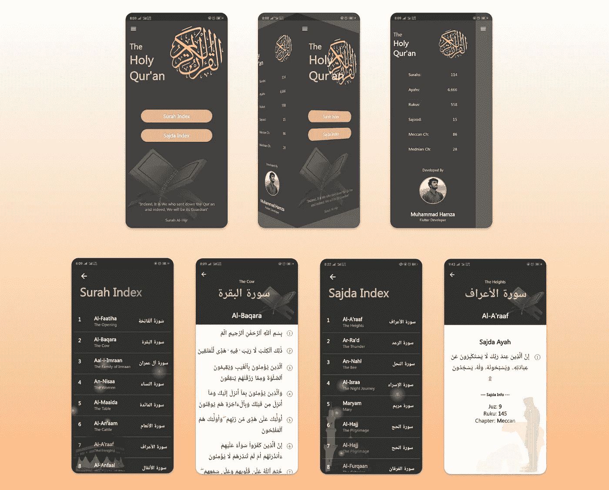
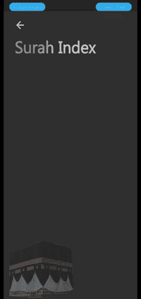
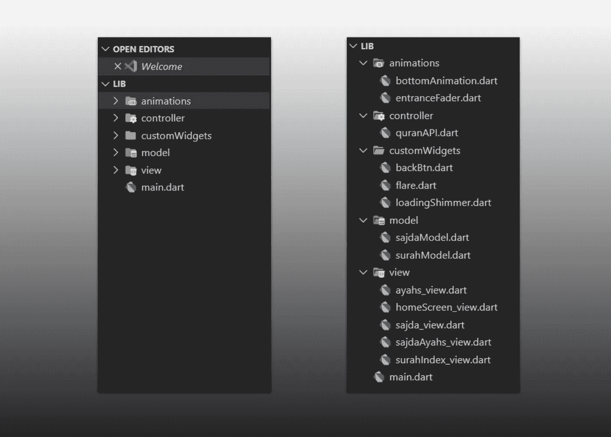
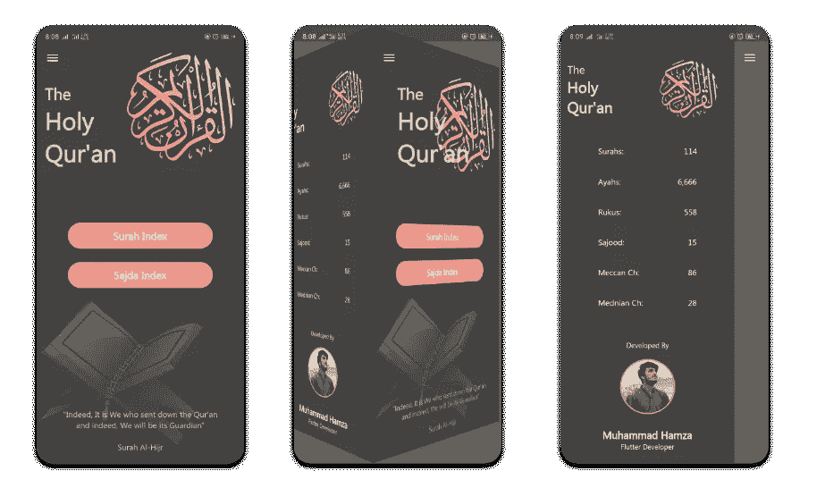
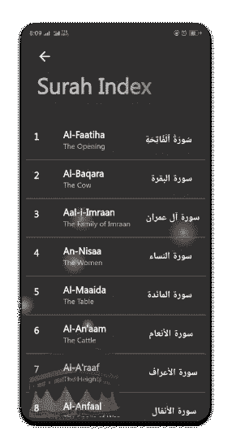
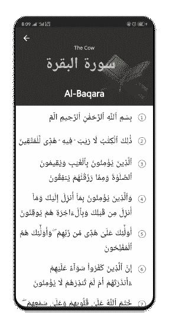
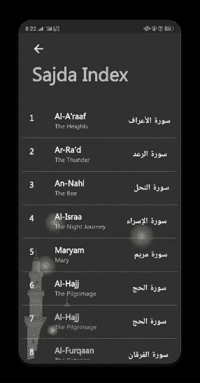
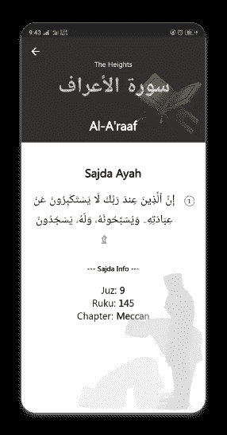
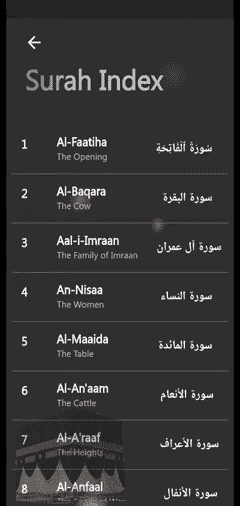

# 颤动应用中的 MVC 神圣的古兰经应用

> 原文：<https://itnext.io/mvc-in-flutter-app-the-holy-quran-app-c0fd8ae31d67?source=collection_archive---------1----------------------->

这款应用可能没有太多功能，但我想学习 MVC 和 jSON 数据解析，所以下面是我在大约 5-7 天内做的事情。


神圣的古兰经应用程序

这是一个神圣的古兰经应用程序，使用 Flutter 和 API 在后面获取所有数据。你可以在这里获得 API [。](https://alquran.cloud/api)

# 让我们开始吧…！

这就是我们将要建造的。



我们要构建什么:)

## 包装

我将使用以下软件包:

*   [https](https://pub.dev/packages/http)
*   [微光](https://pub.dev/packages/shimmer#-readme-tab-) —用于进度指示器效果

因此，当 API 被调用时，我们的加载器将看起来像这样



微光装载机

我们还将制作这个抽屉动画作为特别的礼物😅


3D 抽屉

> 因为，该应用程序是开源的，所以你可以在这里获得完整的代码[。](https://github.com/m-hamzashakeel/The_Holy_Quran_App)

> 在我们开始之前，让我诚实地告诉你，我不是专家，所以我将根据我目前为止的理解来解释 MVC，但是如果你想要完整的细节，那么请阅读这篇文章。

## 项目结构

让我们深入了解我们的项目结构



MVC 项目结构

为了更好的理解，所有的东西都被分开了，动画，自定义部件，所有的模型，视图，控制器类。

## 控制器

UI 调用控制器类来请求数据，它看起来像这样:

使用了两个 URL 链接，您可以在这里找到它们[。一个是获取完整的古兰经，另一个是获取古兰经中所有的圣训。](https://alquran.cloud/api)

这个类只是从 API 中获取数据，并使用模型类将它们转换成 JSON 格式。

## **型号**

每个视图有两个模型类

**萨吉达模特班**

**苏拉模型类**

如果你想学习 jSON 数据解析，我会推荐你这篇文章。这对我帮助很大😄

让我们看看下一步，那就是使用我们的模型和控制器类来更新我们的 UI，即视图

## 景色

这个应用没有应用状态管理，所以代码会非常简单明了。在所有视图中，UI 都是使用 setState 和 FutureBuilder 小部件更新的。因为，我应用了抽屉的所有动画，所以代码可能看起来有点混乱，但它不是:)

我用过 5 个视图类，大概是这样的:

*   **homeScreen_view.dart:** 主屏幕 UI 包含两个按钮(Surah Index，Sajda Index)和其他小部件，包括我们的动画抽屉



*   **surahIndex_view.dart:** 使用我们模型类中的方法显示古兰经中所有章节的 UI



*   **ayahs_view.dart:** 显示每个章节的 ayahs 的 UI



*   **sajda_view.dart:** 它使用我们模型类中的另一种方法显示了古兰经中的所有 15 种 sajda



*   **sajdaAyahs_view.dart:** 类似于我们的 *ayahs_view.dart* 它显示每个 sajda 的 ayah。



> 注意:只有两个视图的 UI 是通过模型类更新的，我将其余的数据传递给了其他必要的小部件的构造函数

## 微光负载效应

我提到了我将用来创建一个微光加载器的包。因此，微光进度条的代码应该是这样的:

**WidgetAnimator** 简单地从底部直到它的位置淡入淡出任何小部件。代码可在[这里](https://github.com/m-hamzashakeel/The_Holy_Quran_App/blob/master/lib/animations/bottomAnimation.dart)获得。没有这个，微光会工作，所以不要担心，它不是强制性的在这里使用😃

## 背景中的眩光效果

首先，让我们看看如何创建一个小闪电。

```
Container( height: 10,
      width: 10,
      decoration: BoxDecoration(
           shape: BoxShape.circle,
           gradient: RadialGradient(colors: [
                      Colors.yellow,
                      Colors.yellow.withAlpha(150),
                      Colors.yellow.withAlpha(100),
                      Colors.yellow.withAlpha(50),
                      Colors.yellow.withAlpha(5), ])),),
```

现在，我以这样的方式制作了这个闪光的动画，它从屏幕外的某个地方开始，移动到另一个点(原始位置),这个点也在屏幕外，但在背景中。所以，整个事情的代码是这样的:

入口推子动画非常简单，代码如下:

> 如果您在 iniState()中设置了 _controller.forward()，那么一个小工具将会淡入屏幕并停在原来的位置。所以，一定要试一试！

你需要为它提供一个**子**，一个**偏移量**，从它应该淡入屏幕的位置直到它的原始位置，**延迟**，在此之后它将开始移动，以及**持续时间**它将在移动中停留的时间。有道理吗？:)

现在，如果你把你的光晕放在屏幕外面，作为它的原始位置，并给出相反方向的偏移，那么在动画开始后，它看起来像是从一边移动到另一边。我希望我说清楚了😜

最后，您可以创建如下内容:



背景中的闪光

## 最后是 3D 抽屉动画

你可以从我最喜欢的 flutter 开发者[这里](https://github.com/MarcinusX/drawer_challenge/blob/master/lib/custom_drawer_guitar.dart)获得实现。但在我的例子中，我在抽屉中添加了一些小部件，包括简单的文本、列、堆栈、图像、资产和圆形头像。


我们到了。一个基于 **MVC** 的非常简单的应用程序，有漂亮的用户界面和很少的动画。我希望你喜欢它，如果是的话，给我一些👏和⭐️的[回购。](https://github.com/m-hamzashakeel/The_Holy_Quran_App)

## 那都是乡亲们！

# 谢谢大家和# happyFluttering💙