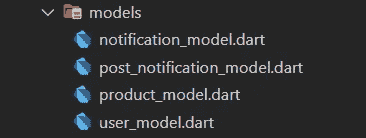
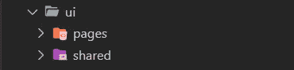

# MVC+S 设计模式在颤振中的应用

> 原文：<https://itnext.io/mvc-s-design-pattern-in-flutter-6eba15169413?source=collection_archive---------2----------------------->

在 Flutter 中有很多方法来设计一个应用程序。设计一个应用程序最广为人知的方法之一就是 MVC。MVC 希望通过对文件进行分类来实现这一点，通过将什么在哪里和它做什么分开，你可以有一个更可读的代码结构。

## 什么是 MVC

**模型-视图-控制器(MVC)** 是一种架构模式，它将应用程序分成三个主要的逻辑组件:**模型**、视图和控制器。这些组件中的每一个都是为处理应用程序的特定开发方面而构建的。

## 什么是 MVC+S？

[https://blog . gskinner . com/archives/2020/09/flutter-state-management-with-mvcs . html](https://blog.gskinner.com/archives/2020/09/flutter-state-management-with-mvcs.html)

MVC+S 模式给了我们更多可读、可控和有组织的架构。没什么特别的，只是整理你的文件。心态简单但好处不可胜数。与 MVC**不同的是**我们分离了**服务**层。

如果你准备好了，让我们深入研究一下条款。

## 模型

*   模型是您根据需要创建的数据类。在控制器的帮助下，你可以操作模型的数据。

**模型文件夹**

*   把你所有的模型放在这里，比如`my_user.dart`、`product.dart`或者其他。

## 视角

*   视图是 Flutter 应用程序中的所有小部件和页面。这些视图本身可能包含一个“视图控制器”，但是它仍然被认为是视图应用层的一部分。

**UI 文件夹**

*   所有的用户界面都在这里。

## 控制器

*   控制器层是执行特定类型任务的高级功能。他们通常从服务中获取数据，并将其注入模型，以及他们控制和更新应用程序状态方式。

**提供商/控制器文件夹**

*   状态管理逻辑放在这里。您可以将您的 providers、blocs 逻辑或任何其他状态管理逻辑放入该文件夹。您甚至可以将其重命名为您的状态管理架构，如 providers、blocs 等。

## 服务

*   服务从外界获取数据，并将其返回给应用程序。命令调用服务并将结果注入到模型中。服务不直接接触模型。

**服务文件夹**

*   进入你的应用程序的任何数据都必须来自这里。它可能正在连接 REST API 或任何数据库连接。

这是实现 MVC+S 模式的最基本的方法。

如果你想看看基于 MVC+S 的文件夹结构，你可以在这里查看这篇文章👇 👇

 [## 下一个项目的最佳文件夹结构

### 对于每个开发人员来说，快速增长的项目和不断变化的计划是一个真正的噩梦。获得…的唯一方法

itnext.io](/best-folder-structure-for-your-next-project-a0d18ad1483a) 

你可以看看这个用于 MVC+S 的基本文件夹系统👇 👇

 [## GitHub-sn cone/mvcs-示例

### 此时您不能执行该操作。您已使用另一个标签页或窗口登录。您已在另一个选项卡中注销，或者…

github.com](https://github.com/SncOne/mvcs-example) 

**感谢您的阅读！**👏👏

如果你喜欢这篇文章，请点击👏按钮(你知道你可以升到 50 吗？)

另外，别忘了关注我，在你的社交网站上分享这篇文章！也让你的朋友知道吧！！