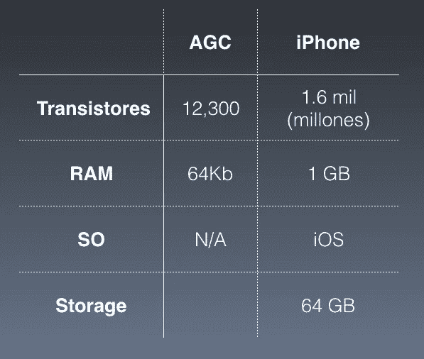
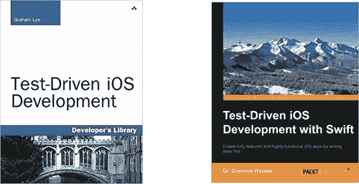
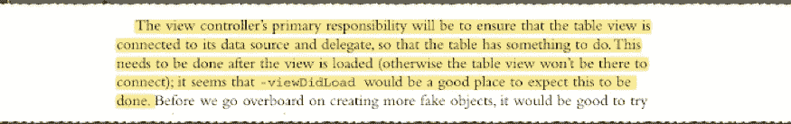
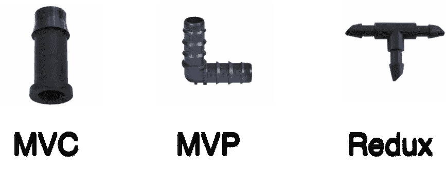
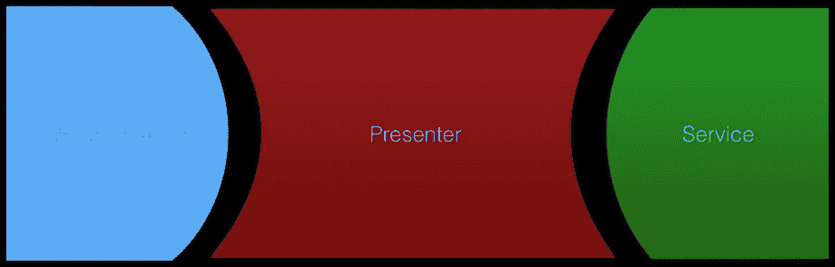

# MVP:模型视图演示者

> 原文：<https://itnext.io/mvp-model-view-presenter-8d3654d8fa4c?source=collection_archive---------0----------------------->

iOS 或 MacOS 应用程序在 Swift 中的可能实施构想

## 您可以从这里下载我们将要创建的整个项目:

[https://github.com/landhgames/mvp-expense](https://github.com/landhgames/mvp-expense)

# **简介**

1969 年，人类登上了月球。为了这个非常复杂的任务，美国国家航空航天局聘请了麻省理工学院，委托他们建造阿波罗制导计算机(AGC)的项目，当然，还有在这台机器上运行的软件，将宇航员带到月球。与现代的 iPhone(甚至不那么现代的 iPhone 6)相比，AGC 功能更弱！

图一。AGC vs iPhone(这是西班牙语，但是你懂的)

虽然 iPhone 比 AGC 强大很多倍，但在月球之旅中，你会信任哪个计算机系统？答案是(或者至少是我的)AGC 及其软件！但是..等等！为什么有人会选择这样一台功能如此之弱的计算机呢？

**测试**

原因是:很难保证 AGC 软件-硬件的效率和性能，不仅是因为硬件的可靠性，更重要的是因为软件的可靠性，因为 NASA 在软件开发中使用非常高的标准。他们有两个团队一起工作，一个团队编写一行代码，另一个团队测试这一行代码中的错误。(…)开发组织对单个模块进行内部代码审查和单元测试，然后对组装成软件负载的模块组进行集成测试

为了在我们的代码中达到如此高的效率标准，我们有一个非常强大的工具:单元测试。这个工具保证了我们代码的质量。它帮助我们测试软件的关键组件，并确保我们的代码做了设计要做的事情。

它还承诺帮助我们停止引入新的错误，避免倒退。那么，一旦我们决定开始实现单元测试，我们应该测试代码的哪些部分呢？

在寻找测试内容的过程中，我找到了几本书，它们承诺会对我有所帮助:

图 2(其实不是推荐书籍)

其中一个人说:

图 3 测试内容的一个不太有趣的想法

*“视图控制器的主要职责是确保表格视图连接到其数据源和委托，以便表格有事可做(…)”*

所以添加一个测试来确保 UITableView 既有它的委托又有它的 Datasource 集将帮助我找到错误并停止回归？事实是，不！这不会帮助你发现错误和停止回归，这样的测试将是非常琐碎的，可以通过其他工具来解决，如 UI 测试，如[iosnapshottestcase](https://github.com/uber/ios-snapshot-test-case/)。

这个问题的答案是，在你正在编写的应用程序之下，应该有一个坚实而强大的设计。根本不使用任何设计可能会导致不可测试的代码。

**MVC 重述**

我不会深入 MVC 的细节，但我假设 iOS 和 OSX 的大多数 Swift 开发人员对这种设计模式都有些熟悉，因为编程工具和语言文档在 iOS/OSX 开发人员形成的最开始就提到了这种模式。

**设计模式作为工具**

作为帮助我们创建 UI 应用程序的“官方”设计模式，MVC 还有其他几种模式。重要的是要注意，没有一个单一的“银弹”或独特的解决方案可以满足每个开发人员的需求。有几个，重要的是一个好的开发人员了解工具箱中的所有工具，知道在给定的程序中使用哪种模式，甚至知道在同一个应用程序中使用不同的模式。

每种设计模式都有自己的优点和缺点、优势和劣势，以及在实现给定技术之前明智地考虑的开销。所有这些都应该被考虑并熟练运用，*强大的力量伴随着巨大的责任*。

图 4。设计模式作为解决不同问题的工具

**MVP:模型视图演示者**

MVP 代表 Model View Presenter，是由微软的 Martin Fouler 在 20 世纪 90 年代发明的(尽管有些人声称这实际上是在更早之前发明的；他们不总是这样吗？).

与 MVC 一样，MVP 使用 Swift 开发人员熟悉的几个组件，从视图开始。

**视图(或实际上)视图控制器**

视图组件具有与 MVC 实现中相同的职责。处理用户界面。在 iOS 和 OSX 开发中，我们不可分割地使用视图和 UIViewController，这就构成了面向对象编程中“视图”的概念。

我认为这个故事最重要的寓意之一是*我们想要创建一个如此愚蠢的视图控制器，以至于测试它几乎没有意义*。至少在做 MVP 的时候。

图 5。MVP 组件

**型号**

与 MVC 一样，模型代表了我们的程序所处理的抽象。这可以是抽象的实体，例如:用户、销售、产品等。我们用现实世界中的任何抽象来建模我们的程序。它可能是来自我们的应用程序正在消费的某个服务的类型。

图 6。MVP 组件(更广泛的观点)

**演示者**

表示者是一个抽象的实体，包含应用程序的业务逻辑，完全不知道实际的服务实现。MVP 模式允许我们将 ViewController 从 presenter 中分离出来，然后再将 Presenter 从服务中分离出来。

ViewController 必须实例化服务和表示器，并将服务注入到表示器中。这个 Presenter 实体将成为测试实际程序的完美候选。

它应该是这样工作的:

图 7。MVP 组件之间的交互

ViewController 将引用 presenter，并将用户与 UI 的任何可能的交互通知给 presenter。如果演示者想要改变 UI/UX 中的某些内容，他必须请求 ViewController 进行更新。演示者还将在 ViewController 和服务(网络、数据库等)之间进行协调。

足够的理论，让我们开始看看这是什么样子，以及一个实际的项目可以做什么。因此，我们一如既往地使用同一个应用程序:一个帮助我们记录开销的应用程序。

首先，让我们看看 ViewController 是什么样子的:

因此，与普通的 ViewController 没有什么不同，除了:

*   它在第 5 行和第 6 行中包含了 loginPresenter 和 loginService 的变量
*   在 ViewDidLoad 中(第 11 行到第 14 行),我们为呈现者创建了实际的实例，我们还注入了实际的服务
*   在 didPressLogin 按钮中，我们检查一切都已正确完成(如果没有显示错误消息)，但是如果没问题，我们就调用***func loginUserSaveSessionAndGetUserList()***，它当然位于 Presenter 中，并(顾名思义)尝试登录用户。如果不能，它还会显示一个警报。

现在让我们看看演示者的样子:

嗯，演示者和视图控制者是完全不同的生物。

*   LoginPresenter 似乎根本不处理 UI 的东西，它的函数非常干净，只接受它们需要的参数(大部分是字符串，没有花哨的 IBOutlets 或类似的东西，没有 UIKit 的东西)
*   它有一个 **init** ，简单地将服务设置为它的成员变量，还有两个函数，基本上是服务，或者实际上是从 ViewController 中调用和使用的 Presenter API
*   最终，演示者内部的方法将调用转发给服务(例如在***func loginUserSaveSessionAndGetUserList()***的情况下),但它也检查结果，如果一切顺利，它将用户保存在会话对象中。夏威夷大学（TheUniversityofHawaiiatManoa）..
*   ***func get userlist(…)***函数不执行任何检查，它只是将结果和错误发送到 ViewController，这可能是因为在这一点上，演示者对该数据做些什么没有多大意义，尽管它可能会这样做。

**测试(续)**

所以现在剩下的问题是，我们应该测试什么？所有这些类和设计都非常花哨，(尽管它们可能会造成瓶颈并使代码更加复杂)，那么这样做有什么好处呢？正如前面提到的 ***我们获得了*** 测试我们程序模型的能力。在我们的例子中，这将是演示者的功能。

在测试包中，我们创建了 LoginServiceMock 对象。这个服务基本上等同于真正的 LoginService，但是(它实际上是它的一个子类),并将覆盖演示者从那个组件使用的方法。在这个 LoginServiceMock 中，我们将:

*   检查模型是否被很好地初始化和解析
*   检查(使用标志)方法是否确实被调用
*   保存我们可以从对象调用中推断出的任何新状态(这样我们以后就可以断言这些状态)

之后，我们设置组件的其余部分，直到我们到达函数***【func testlogin flow()***，在这里我们基本上调用服务内部的 he 方法，并断言服务内部的相应调用已经完成。

**下载整个项目**

你可以在这里下载整个项目:[https://github.com/landhgames/mvp-expense](https://github.com/landhgames/mvp-expense)

问题、建议或意见？你可以在推特上找到我。

记住，按住*喜欢*按钮，你可以留下任意多的喜欢；— )

**有用链接&参考**

*   [1] [NASA 航天飞机软件开发历史](https://history.nasa.gov/computers/Ch4-5.html)
*   [2] [苹果公司的模型-视图-控制器](https://developer.apple.com/library/archive/documentation/General/Conceptual/CocoaEncyclopedia/Model-View-Controller/Model-View-Controller.html)
*   [3][John Sundell——编写具有强大可测试性的 Swift 代码](https://www.youtube.com/watch?v=amVstam84Xo)
*   [哑用户界面是好用户界面:在 iOS 中使用 MVP 和 swift](http://iyadagha.com/using-mvp-ios-swift/)