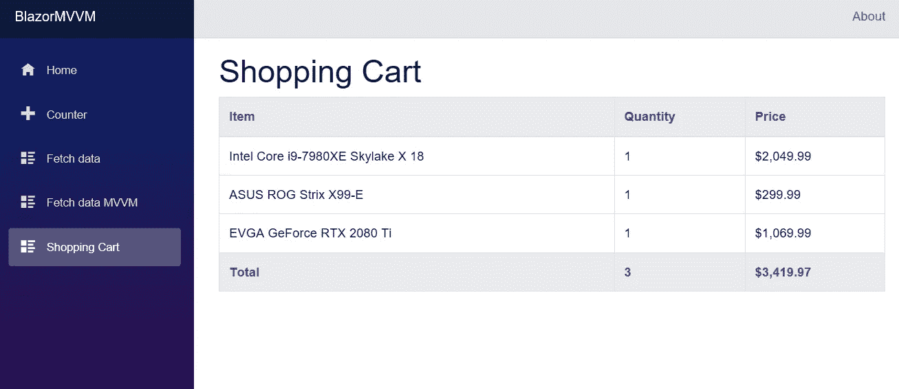
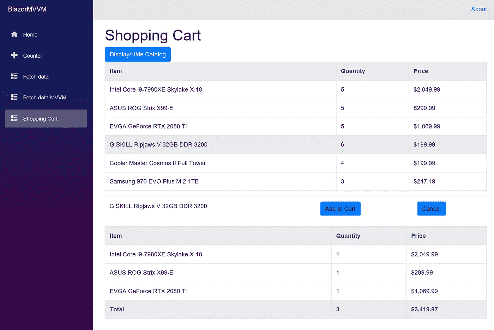
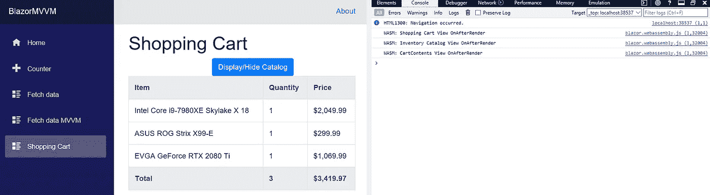

# MVVM 和布拉索:组件和状态已经改变()

> 原文：<https://itnext.io/mvvm-and-blazor-components-and-statehaschanged-a31be365638b?source=collection_archive---------0----------------------->


这是我撰写的关于在客户端 Blazor 中实现模型视图视图模型模式的一种方法的系列文章中的第六篇。如果您想从头开始阅读本系列的第一篇文章，请点击此处:

[](/a-simple-mvvm-implementation-in-client-side-blazor-8c875c365435) [## 客户端 Blazor 中一个简单的 MVVM 实现。

### 本文是我将介绍我目前计划如何创建 Blazor 客户端的系列文章的第一篇…

itnext.io](/a-simple-mvvm-implementation-in-client-side-blazor-8c875c365435) 

本系列的所有代码都存储在 GitHub 上的。我将在本文开头使用的代码是 ArticleFive 分支和 4.5 版本。本文末尾的代码将是 ArticleSix 和 4.6 版本。

# 组件之间是如何通信的？

正如 MVVM 允许我们将视图模型和模型分解成多个小的可重用的类一样，Blazor 允许我们将视图分解成多个小的可重用的组件。在本文中，我们将讨论组件在页面中的行为，以及使用组件时可能遇到的潜在显示问题。

我们将扩展我们在前一篇文章中开始构建的购物车。我们将为购物车添加一些交互性，允许用户调出一个库存目录，并将该目录中的商品添加到购物车中。我们将把购物车重构为一个单独的组件，然后作为一个组件添加到库存目录中。完成后，我们将有一个包含两个子视图的父视图，这将让我们检查 Blazor 组件的行为。

我们还将借此机会讨论 Blazor 如何决定何时将更新呈现给 View。我们将回顾一下`StageHasChanged()`方法以及您想要手动调用它的时间。

# 是时候重构我们的购物车了

为了达到我们测试组件行为的目的，我们需要做一些改变。我们希望有一个库存的产品，我们可以拉，以及购物车，我们把这些项目。为了正确识别我们正在处理的项目，我们不能坚持使用我们在上一篇文章中使用的`List<InventoryItem>`,所以我们要改为一个`Dictionary<int, InventoryItem>`,它将给每个项目一个唯一的标识符。我们将创建两个模型类`Inventory_Model.cs`来表示我们的可用库存，创建`ShoppingCart_Model.cs`来表示我们购物车中当前的商品。我们坚持使用`_Model`命名，以利用我们在第四篇文章中构建的模型的自动服务注册。下面是我们的库存模型和界面:

首先，我们只是声明我们的库存，并使用构造函数来设置可用的项目和数量以及价格。我们现在有一个公共方法，让我们检查一个项目是否有请求数量的可用项目。

购物车模型也非常简单。下面列出的代码还存储了购物车中商品的字典，并有一个添加商品的方法和一个删除商品的方法。

添加这两个模型以及对字典的更改几乎完全重写了我们的购物车视图模型。请看看下面的代码:

我们已经更新了构造函数，注入了两个新的模型类。我们还改变了向购物车添加商品的方式，使用商品 Id 并在模型中调用`AddItem()`。我们有一个全新的方法`UpdateCart()`,它使用购物车的最新内容(包括总数量和价格)来更新视图模型。最后，我们将`DisplayPrice()`移出作为一个扩展方法，这样我们就可以在名称空间的任何地方使用它，并提高视图中代码绑定的可读性。

最后，我们必须为视图更新类背后的代码，以便像我们在上一篇文章中所做的那样填充我们的起始购物车。新的代码如下所示:

我们现在可以简单地通过 Id 添加它们，然后在完成后调用`UpdateCart()`。

# 添加第一个组件

对于购物车组件，我们将把购物车的内容移到它自己的组件中。在组件文件夹中创建一个新的视图`CartContents.razor`。给它一个 ViewModels 名称空间的`using`语句，并将整个`<table>`从我们的父模型移动到组件中。对于这个组件，我们将演示如何将父视图模型传递给组件，因此我们需要添加一个为`IShoppingCartModel`提供参数的`functions{}`块。我们还需要在绑定中进行语法修改，以使用我们的`DisplayPrice()`扩展方法。有了所有这些，我们的组件将如下所示:

我们的父视图现在几乎是空的。要使用组件，我们只需将它与绑定一起添加，以将父视图模型向下传递给组件:

完成所有这些更改后，我们可以启动我们的应用程序，并看到我们的购物车显示再次工作，并显示我们期望的样本数据。



# 在我们添加另一个视图模型之前

对于库存目录组件，我将从父组件传入一个子视图模型。因为我将来肯定会创建额外的视图模型，所以我会更新我们的`Startup.cs`来自动注册我的新视图模型。我将在`ConfigureServices()`中添加一行代码来获取任何名称包含`_ViewModel`的类，并在启动时自动注册这些类。更新后的代码块现在如下所示:

# 从库存中选择项目的组件

现在我们可以自动注册任何新的视图模型，让我们利用这一点，在我们的视图模型文件夹中创建一个新的类`InventoryCatalog_ViewModel.cs`。该类的内容遵循我们在本系列文章中介绍的 MVVM 实现。我们将为这个视图模型需要公开的任何内容创建公共属性和方法，然后创建一个包含所有这些公共成员的公共接口。

目录本身将是一个带有附加到数据行的`onclick`方法的表。最初显示组件时，不会呈现表格，只会显示或隐藏目录表格的单个按钮。此按钮通过委托调用父视图模型，并填充或清空目录表。一旦表中的一个项目被选中，将有一个按钮将选中的项目添加到我们的购物车(通过委托返回到父视图模型)和一个按钮取消选择。

回到黑暗时代，当我学习编程时，我们必须首先声明委托的定义，然后声明委托，然后给它们分配方法。英寸 Net Framework 2.0 增加了泛型委托`Action<T>`，它允许我们创建不返回值的泛型委托，并为它们分配一个方法。

我们将在我们的视图模型中使用这个通用接口两次，并将其拉至接口。您可以在下面看到，我们有一个不带参数的方法和一个带`int`的方法:

```
public Action AddItemsButtonClickDelegate { get; set; }public Action<int> AddSelectedItemToCartDelegate { get; set; }
```

我们的 catalog ViewModel 类和接口的代码如下所示:

创建视图模型后，我们可以将组件放在一起，并将其传递给。在组件文件夹中创建一个新的 razor 视图`InventoryCatalog.razor`。这是另一个相对简单的视图，唯一值得注意的是它有两个条件渲染块。如果`CatalogItems`中没有项目，则不呈现目录表，如果没有`SelectedItem`，则不显示添加和取消按钮。新组件的完整代码如下所示:

现在它已经创建好了，我们只需要将它添加到我们的视图和视图模型中。我们可以给`ShoppingCart.razor`添加一行

```
<BlazorMVVM.Client.Components.InventoryCatalog ViewModel="@ViewModel.InventoryCatalogViewModel" />
```

在 ViewModel 中，我们需要添加一些常用的组件。我们需要一个私有变量、一个公共属性和构造函数注入。我们还将添加两个新方法`AddItemsButtonClick()`和`CheckInventoryAndAddItemToCart()`，并将它们分配给子视图模型中的代理。已经添加的每个公共成员也需要被拉至接口。在所有这些添加之后，我们的类和接口现在看起来像这样:

如果我们现在运行我们的应用程序并单击 Display/Hide 按钮，我们将看到我们的库存目录显示出来。单击目录中的一个项目，我们将看到添加和取消按钮。



# 运行中的组件

现在，我们已经构建了两个组件，并在页面中工作，是时候看看我们的劳动成果了。单击库存目录中的任何商品，然后单击“添加到购物车”按钮。当我们这样做的时候，我们可以看看我们的购物车，看到它是…没有更新。到底是怎么回事？我们的代码有问题吗？我们在最新的 Blazor 预览版中发现了一个 bug 吗？答案是，这种意料之外的行为实际上是意料之中的行为。为了理解为什么我们需要讨论一下 Blazor 如何更新 Razor 组件。

每个 Razor 组件(别忘了页面也是组件)都被编译成一个渲染树。渲染树是一个编译好的 C#类，它是从我们的视图中自动生成的。如果我们看一下为我们的`InventoryCatalog.razor`生成的代码，这个类的开头看起来像这样:

如果您将上面的代码与我们的视图进行比较，就很容易匹配。您还可以看到它在何处根据项目计数有条件地决定是否添加 catalog items 表的呈现。

当事情发生变化时，Blazor 用来“神奇地”更新显示的过程由几个步骤组成。第一步是最重要的一步。每当一个组件处理一个事件时，它就会触发该组件被呈现。一旦渲染被触发，Blazor 就会在渲染树上做一个 diff 来查看发生了什么变化，并更新 DOM，这样我们就可以在屏幕上看到我们的变化。

当我们从目录中添加商品时，为什么我们的购物车没有更新？答案是我们的`onclick()`事件是由我们的`InventoryCatalor.razor`组件处理的。事件被处理，组件随后呈现自身。对我们来说，问题是我们的`CartContents.razor`组件也被更新了，但是它在更新后没有被渲染。通过在代码中添加一些调试语句，我们可以观察到这种行为是如何发生的。在所有三个视图中添加下面的覆盖方法(为每个视图使用正确的名称)。

```
protected override void OnAfterRender()
{
   base.OnAfterRender();
   Console.WriteLine("CartContents View OnAfterRender");
}
```

有了这些代码并使用浏览器调试控制台，我们可以看到，只要导航到页面，所有三个视图都会呈现出来。



我们对目录采取的任何操作只会导致目录呈现。您可以在控制台窗口中看到，父视图和购物车视图从未被重绘。我们如何避免出现这样的情况:我们更新了视图模型，但是用户看不到视图中反映的变化？有许多选择。

# 选项 1:不使用组件

我觉得这是一个可怕的建议，我不会给任何人，但它会工作。如果每个页面都是一个组件，那么每个被处理的事件都会导致整个页面被渲染。

# 选项 2:实现 INotifyPropertyChanged

很多人都非常熟悉这个选项。您在 ViewModel 上实现了这个接口，它实际上包括向您的类添加一个事件:

```
public event PropertyChangedEventHandler PropertyChanged;
```

然后，您将进入您的公共属性的设置器，并添加额外的代码来调用事件(如果处理程序不为空)。对于`Cart`,代码如下所示:

```
PropertyChanged?.Invoke(this, 
   new PropertyChangedEventArgs(nameof(Cart)));
```

连接之后，我们只需要添加一个事件处理程序。在`Oninit()`方法的`ShoppingCart.razor.cs`中添加这行代码:

```
ViewModel.PropertyChanged += (o, e) => StateHasChanged();
```

`StateHasChanged()`是告诉视图需要重新渲染的方法。很像生命周期方法，它是特定于视图的，所以它只在`functions{}`块或我们后面的代码中可用。

如果我们现在启动实现了`INotifyPropertyChanged`的应用程序，我们会看到，从我们的目录中选择和添加一个商品会导致我们的购物车实际上更新了正确的商品、数量和价格。

使用`INotifyProperyChanged`的唯一问题是我们必须注意它实际上在做什么。如果有人对它很熟悉，并且第一次看 Blazor，他们可能会认为在 ViewModel 中更新`Cart`只是更新了一个绑定，并且在 DOM 中做了一个简单的改变。实际发生的是`StateHasChanged()`被设置在组件上，它为自己以及所有的子组件(如果有的话)运行完整的渲染过程。这种差异可能不会有任何实际影响，也不会导致任何错误，但理解正在发生的事情是有好处的。

# 选项 3:使用委托

这与`INotifyProperyChanged`的工作方式没有太大区别，但执行方式略有不同。如果 Blazor 只在事件被处理后才呈现组件，并且总是呈现完整的组件及其子组件，为什么我们需要用事件调用填充我们的属性设置器呢？也许我们应该把它集中到一个单一的委托中，我们的视图模型可以在任何需要的时候调用它。

我们将再次使用`Action`通用委托。我们将在我们的`ShoppingCartViewModel.cs`中为该代表添加一个公共属性

```
public Action StateHasChangedDelegate { get; set; }
```

把它拉到界面上。现在我们可以在视图中的`OnInit()`中分配这个委托，就像我们之前对事件处理程序所做的那样:

```
ViewModel.StateHasChangedDelegate = StateHasChanged;
```

现在，要将我们的新委托付诸实施，请转到我们的 ViewModel 中的`UpdateCart()`方法，并在该方法的末尾添加一条语句，以便在委托不为空时调用我们的委托:

```
StateHasChangedDelegate?.Invoke();
```

现在，我们的示例再次正确更新。无论我们使用`INotifyPropertyChanged`还是代表，在这一点上可能会归结为个人偏好，因为它们在功能上没有太大的不同。

# 选项 4:不要在家里(或工作场所)尝试这种方法

另一个可行的方法是将视图的渲染链接在一起，但我目前没有这样做。在我们当前的示例代码中，我可以轻松地使用委托方法调用，让`InventoryCatalog.razor`中的`OnAfterRender()`为`CartContents.razor`调用`StateHasChanged()`。这将工作，并将导致购物车正确更新时，我从目录中添加项目。如果有用，为什么我建议不要这么做？如果我处理的下一个项目是在购物车中添加或删除项目时调整库存，会发生什么情况？为了使我的更新生效，我将添加一个新的委托，名为`StateHasChanged()`，向另一个方向移动。`OnAfterRender()`在每次渲染后触发，所以如果我有两个方向的代理，A 将导致 B 渲染，这将导致 A 渲染，我现在已经创建了我的第一个 Blazor 无限循环。还要记住，渲染父组件也会渲染所有子组件，因此以这种方式设置的从子组件到父组件的单个委托也会导致无限循环。

如果 Blazor 有一些额外的生命周期方法，我们可以像 OnBeforeRender 或 OnStateHasChanged 那样挂钩，可能会有一种方式在组件之间进行链式更新。仍然有可能有人会想出一种创新的方法来做这件事，或者 Blazor 的新发展将使它成为可能。

# 选项 5: EventCallback(使用这个)

英寸增加了网芯 3 预告 3 `EventCallback`和`EventCallback<T>`。这个新委托的工作方式与`Action`非常相似，只是发生了一些编译器魔术，使得不再需要调用`StateHasChanged`。使用这个特性，我们现在可以让一个子组件触发父组件上的 rendertree diff，并让我们的应用程序正常工作。

为了实现这一点，我们将向我们的`InventoryCatalog.razor`添加一个新参数:

```
[Parameter]
EventCallback<int> AddSelectedItemToCart { get; set; }
```

为了利用这一点，我们现在将从父视图向目录组件传递一个公共方法。返回到`ShoppingCart.razor`并更新它，将`CheckInventoryAndAddItemToCart()`方法传递给组件。该方法也需要被拉至 ViewModel 接口；以前我们通过委托访问它，但现在我们将通过`EventCallback`直接访问它。

完成这项工作的最后一步是更新我们的组件，使用`EventCallback`代替委托。返回`InventoryCatalog.razor`并按如下方式更新表格:

我们的`onlick`属性现在使用`EventCallback`的`InvokeAsync()`方法回调 ViewModel。如果我们现在运行我们的应用程序，我们可以看到从目录中添加商品正确地更新了购物车，而没有利用我们在视图模型中创建的委托来调用`StateHasChanged()`。我们现在可以删除不需要的属性和委托。

# 最后

在本文中，我们对购物车进行了重构并添加了一些功能，以便更好地理解 Blazor 中组件和组件呈现的工作方式。我们回顾了我们的组件实际刷新和不刷新显示的时间，以及确保它们在我们需要时更新的策略。最后，我们看到`EventCallback`提供了一种在使用子组件时刷新视图的机制，而无需实现事件或委托。

如果你想讨论这篇文章或者 Blazor，你可以在 Twitter @LouisHendricks 上找到我，或者加入 Gitter 上 aspnet/Blazor 房间的社区。

本系列的下一篇文章现已发表。这篇新文章介绍了如何使用客户端 Blazor 和 MVVM 构建一个向导。

[](https://medium.com/@haywireiv/building-a-wizard-in-blazor-with-components-and-mvvm-96219a7b221c) [## 用组件和 MVVM 在 Blazor 中构建向导。

### 这是关于在客户端 Blazor 中实现 MVVM 的一种方法的系列文章中的第七篇。如果你愿意…

medium.com](https://medium.com/@haywireiv/building-a-wizard-in-blazor-with-components-and-mvvm-96219a7b221c)