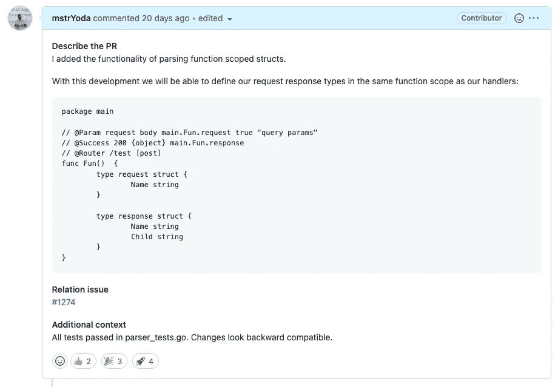
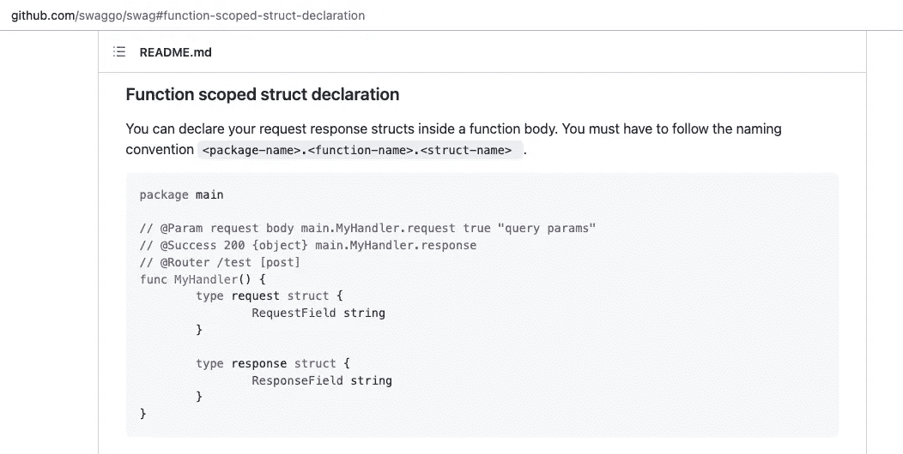
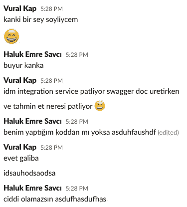
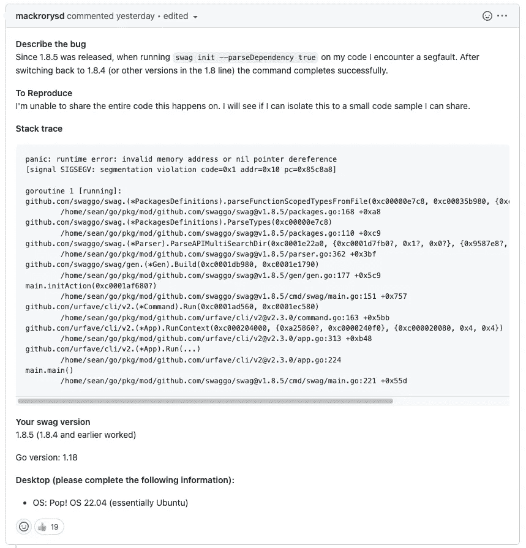
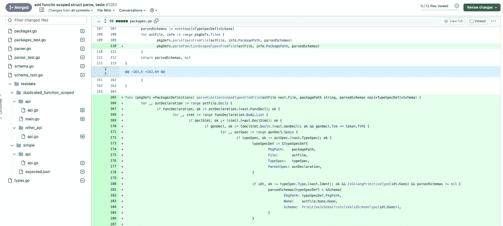
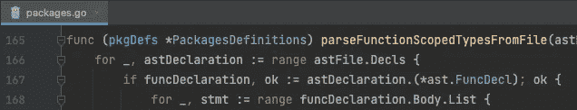
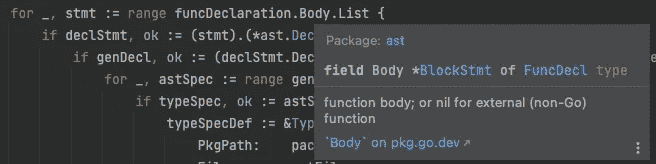
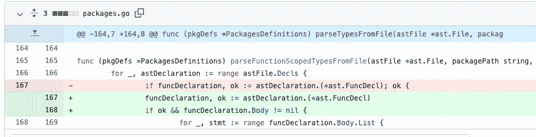

# 我对一个流行的开源包的贡献在 Golang 项目中引起了恐慌

> 原文：<https://itnext.io/my-contribution-to-a-popular-open-source-package-caused-a-panic-in-golang-projects-4d34394df4cf?source=collection_archive---------0----------------------->

你好，今天我将告诉你我对一个流行的开源项目的开发是如何给世界各地使用该项目的人们造成错误的，以及我从这个过程中学到了什么。

## 内容

— Swaggo 项目
—我们的需求和我的贡献
—问题
—问题的原因
—用 tout Body (go:linkname)定义函数
—解决方案
—经验教训

## SWAGGO 项目

为用 Go 语言开发的 API 项目创建 swagger 文档与 Java、C#等语言略有不同。通常，您可以通过在您编写的代码的注释行中添加 Swagger 指令来创建它，对此您没有太多的选择。

项目是最流行和最广泛使用的解决方案之一。

这个项目的基本过程是通过浏览 Go 文件和处理定义中的注释行来创建 swagger 文档。它通过创建一个[抽象语法树(AST)](https://en.wikipedia.org/wiki/Abstract_syntax_tree) 并对其进行导航来实现这一点。

## 我们的要求和我的贡献

当我试图和我的队友一起为一个项目创建一个 swagger 文档时，我们意识到我们不能使用 [swaggo/swag](https://github.com/swaggo/swag/) 工具做出我们想要的定义。

我们想要做的是在我们创建的处理函数中定义请求和响应对象，并确保它们只能从函数内部访问。但是当我们这样做时， [swaggo/swag](https://github.com/swaggo/swag/) 解析器包不能访问相关的请求和响应对象。

为了克服这个问题，我想为 swaggo/swag 库做点贡献。

首先，我给图书馆开了一个问题，问我们是否需要这样一个东西，我想通过这种开发做出贡献。作为回应，他们说解析私有定义是不可能的，当他们问我将如何做时，他们对我的提议很好奇，正等着看呢。

我卷起袖子。我一有机会就做开发，为项目开公关。

由于我所做的开发，请求/响应对象在函数中变得可定义。💪

 [## 由 mstrYoda Pull Request # 1283 swaggo/swag 进行的 add functio 作用域结构分析和测试

### 描述我添加的解析函数作用域结构的功能。随着这一发展，我们将能够…

github.com](https://github.com/swaggo/swag/pull/1283) 

## 问题是

这是一个星期五的晚上…工作结束了，还有几分钟…我期待着周末…我从我的队友那里得到一条消息，我们的一个项目出错了😞

我其实想分享完整的对话:

翻译:
-武拉尔:兄弟我要告诉你一些事情
-我:是的兄弟
-武拉尔:我们的一个服务在生成 swagger do 时出错，猜猜在哪个部分:D
-我:那是因为我开发 asdfasdf
-武拉尔:是的，我猜 asdfsadfs
-我:你不会是认真的 asdfasdf 吧

我们立即访问了该项目的 Github 页面，查看了这些问题。我们所看到的让我有点不安。

许多 [swaggo/swag](https://github.com/swaggo/swag/) 包的用户都遇到了错误，他们都在 CI/CD 管道中或者在由于我的开发而手动生成 swagger 时遇到了错误。

 [## 1.8.5 发行版发行号 1309 swaggo/swag 之后运行“swag init”时出现分段故障

### 描述一下自 1.8.5 发布以来的错误，当在我的代码上运行 swag init - parseDependency true 时，我遇到了一个…

github.com](https://github.com/swaggo/swag/issues/1309) 

坦白地说，我对这种情况感到惊讶，因为我为我的开发编写了单元测试，代码工作正常。事实上，当前单元测试的成功通过证明它没有破坏任何先前的开发。

那么问题会是什么呢？🤔

## 问题的原因

我附上我为 [swaggo/swag](https://github.com/swaggo/swag/) 开发的截图。

正如我们在错误消息中看到的，错误是在`parseFunctionScopedTypesFromFile`方法中接收的。其实错误的确切行号是 **168** 。

现在让我们仔细看看我写的这个方法。

在第 168 行，AST 被访问，如果在定义中有**function declaration**，那么在定义的函数中写的内容将被 for 循环迭代。

那么如果我们确定一个函数定义存在，为什么在尝试用 for 循环迭代这个函数定义的时候会得到一个错误呢？
什么原因导致了**零指针**错误？

当我们查看`functionDeclaration.Body`变量时，我们看到它是一个指针类型。

我在这里没有做 nil 检查，因为我假设如果定义了一个函数，那么这个函数就会有一个体定义。

但实际上可能并非如此。👇

## 没有主体的函数定义

这个术语对你来说听起来陌生吗？不写主体能定义函数吗？

考虑下面的代码，你认为这个代码是 Go 中的有效定义吗？

如果我们试着运行它，我们会得到一个错误吗？

是的，正如您所猜测的，我们不能运行甚至编译这段代码，因为它不是一个有效的定义。

我们可以运行下面的代码吗？

与上一个不同，这里的答案是肯定的，我们可以运行它。

Go 的一个鲜为人知的特性是，我们可以用`go:linkname`指令将一个函数定义链接到其他包的函数定义。

因此，我们可以在不定义物体的情况下定义一个函数。

如果你已经注意到了，这个特性允许我使用在 Go 运行时包下定义的私有函数。

我们在项目中使用的外部依赖可以有这样的函数定义。当我们试图用`swag --parseDependency`命令创建一个 swagger 文档时，带有这个定义的函数在我的开发中引起了恐慌，因为它也解析依赖关系。

## 解决方案

我本来打算做一个开发来马上修复这个问题，但是开源社区的好处是另一个开发人员在我之前写了修复这个 bug 的代码并创建了一个 PR。

 [## 修复:通过 rytsh Pull 请求#1310 swaggo/swag 进行的 funcDeclaration 主体检查

### 将此建议添加到可以作为单次提交应用的批处理中。此建议无效，因为没有更改…

github.com](https://github.com/swaggo/swag/pull/1310) 

## 吸取的教训

带着这个问题，我给自己上了一些课。

✅从不绕过零指针检查假设
✅单元测试可能并不总是足够的。做端到端测试
✅我们可以在 Go 中使用`go:linkname`编写没有体定义的函数，我们可以从私有包中导入函数
✅从不将包依赖项设为最新版本，指定你确信正在工作的版本

我希望它对你来说是有趣和有用的内容。照顾好自己，祝你代码无 bug🙏

**我们来连线**

[Twitter](https://twitter.com/_mstrYoda)
[Github](https://github.com/mstrYoda)

可以在 Github 上支持我:[在 Github 上支持 mstrYoda](https://github.com/sponsors/mstrYoda/)