# 我的新冠肺炎锁定项目，或者我如何开始深入定制 UICollectionViewLayout 以获得 ChatLayout

> 原文：<https://itnext.io/my-covid-19-lockdown-project-or-how-i-started-to-dig-into-a-custom-uicollectionviewlayout-to-get-a-d053e1ad3aa0?source=collection_archive---------2----------------------->

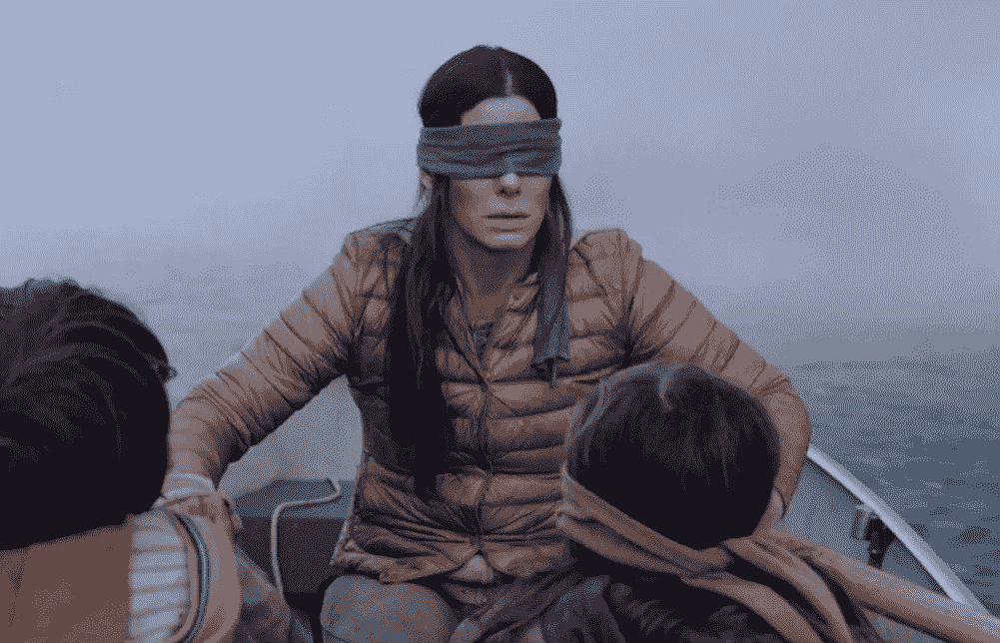

是的，是的，我明白现在是 2020 年，所有铁杆 iOS 开发者都在`SwiftUI`和`Combine`中独家写作。写一篇关于`UIKit`的文章有点“不酷”然而，2020 年与以往所有年份都不一样。很不一样。

三月中旬的某个时候，当都柏林全面封锁的时候，我开始寻找在寒冷的雨夜可以做的事情。在玩了 SwiftUI 和 Combine 之后，我决定我绝对不想成为一个公开的 alpha 测试者。我决定更深入地看看还有什么可能让我感兴趣。然而，我总是找不到时间来解决这个问题。

幸运的是，就在那个时候，我最近开始工作的公司 [WebSummit](https://websummit.com) 决定更换他们的聊天提供商。这意味着我必须更深入地研究当前的聊天实现。

我们的聊天使用了`MessageKit`作为 UI 组件。 [MessageKit](https://github.com/MessageKit/MessageKit) 是一个社区支持的 Swift 库，旨在取代已弃用的[JSQMessagesViewController](https://github.com/jessesquires/JSQMessagesViewController)。大约 5 年前，我碰巧和 JSQMessagesViewController 一起工作。尽管灵活性极低，但它仍能应付各种任务。它是在 UIKit 的最佳传统中编写的，其中所有内容都继承自所有内容，当然，到 Swift 问世时，它已经完全过时了。我只对出现的倡议感到高兴:编写一个库来创建一个聊天 UI，取代`JSQMessagesViewController`。直到 2020 年 3 月，我已经忘记了聊天界面。

然而，2020 年 3 月标志着我开始讨厌`MessageKit`。对我来说，这看起来像是从 Objective-C 到 Swift 的 JSQMessagesViewController 的逐行翻译。我就说到这里，剩下的留给你去想象。

在 GitHub 上仍未解决的大量问题中，或者那些直接记录在库代码中的问题中，滚动问题尤为突出。

默认情况下，`UIScrollView`的行为方式是滚动锚定在左上角。不幸的是，新的内容被添加到“底部”,而没有向上移动其余的内容。这种行为适用于 99%的用例，但不适用于需要相反行为的聊天。在底部添加新内容时，我们需要用添加内容的数量来抵消偏移因子(contentOffset)。

这个事实给了我一个简单的想法。这一切都是通过在`UICollectionViewFlowLayout`上使用一些奇怪的钩子和寄生来完成的。为什么不写一个开箱即用的布局呢？

促使我使用纯 UICollectionViewLayout 的原因是，尽管使用了`UICollectionViewFlowLayout`，`MessageKit`并不支持使用自动布局的自动单元格大小。这意味着我必须自己计算代码中的所有大小。然而，这个特性在`UICollectionViewFlowLayout`中是现成的。

好吧，那就这么决定了。我将编写自己的自定义`UICollectionViewLayout`，在这里我将尝试添加聊天所需的所有内容。说到做到，我创建了一个项目，并创建了一个继承自 UICollectionViewLayout 的类。

一切看起来都很简单，我查阅了文档。

**动画插入、删除、更新和重新排序**

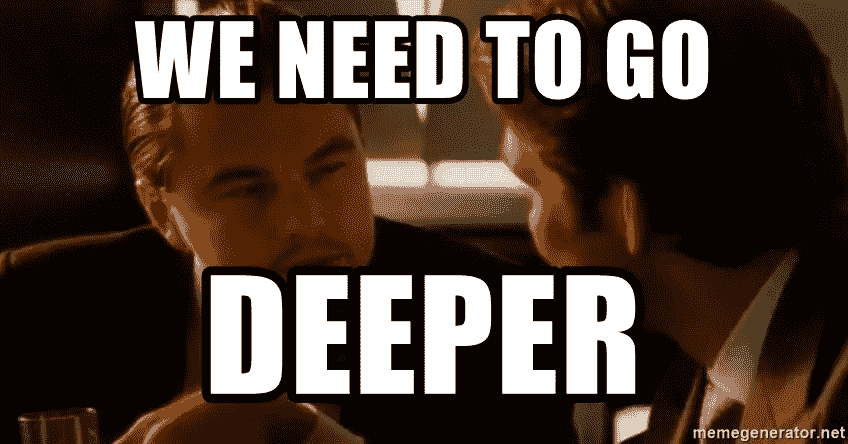

第一个惊喜等待着我。没有关于`UICollectionViewLayout`的官方文档。我的意思是它名义上存在，但忽略了一些非常重要的点。

例如，我决定处理的第一件事甚至不是单元格的大小，而是插入、删除、更新和改变单元格顺序的动画。如您所见，有 4 种类型的单元更新。

`UICollectionViewLayout`中有 2 个方法负责此事:

`initialLayoutAttributesForAppearingItem(at itemIndexPath: IndexPath) -> UICollectionViewLayoutAttributes?`

`finalLayoutAttributesForDisappearingItem(at itemIndexPath: IndexPath) -> UICollectionViewLayoutAttributes?`

这里是关于[initialyoutattributesforappearingitem](https://developer.apple.com/documentation/uikit/uicollectionviewlayout/1617789-initiallayoutattributesforappear)和[finallaoutattributesfordisappearingitem](https://developer.apple.com/documentation/uikit/uicollectionviewlayout/1617740-finallayoutattributesfordisappea)的官方文档

让我们一起阅读`initialLayoutAttributesForAppearingItem`的文档:

> *当您的应用程序向集合视图中插入新项目时，集合视图会为您插入的每个项目调用此方法。因为新项目在集合视图中尚不可见，所以返回的属性表示项目的开始状态。例如，您可以返回将该项定位在屏幕外的属性，或者将其初始 alpha 设置为 0。集合视图使用您返回的属性作为任何动画的起点。(动画的终点是项目的新位置和属性。)如果返回 nil，布局将该项的最终属性用于动画的起点和终点。*
> 
> *该方法的默认实现返回 nil。子类应该根据需要覆盖这个方法，并提供任何初始属性。*

除了告诉我们如何插入一些模糊的附加信息外，没有任何关于如何使用这两种方法重新加载或移动单元格的内容。`finalLayoutAttributesForDisappearingItem`也是一样。好吧，我可以试着用不同的方式解释:

> *如果返回 nil，布局将使用项目的最终属性作为动画的起点和终点。*

然后，我试图用这条语句实现其他所有东西。

它像描述的那样工作，但是只适用于最原始的情况。有趣的是，这个时刻没有以任何方式被描述，但是`itemIndexPath`发生了什么？假设我插入了一个索引为 0 的单元格。在这个 0 之前的那个，很可能会变成 1，对吧？好吧，但是在什么时候？如果我插入 0 号单元格，并将之前的 0 号单元格移到 2 号单元格后面，会怎么样？

我不认为自己很聪明，但我一直认为我至少懂基本的算术和逻辑。然而，当我接近上述问题时，这一点也没有帮助。无论是用基本逻辑还是蛮力，我都无法得到答案。有趣的是，iOS 12 和 iOS 13 的行为也有所不同。一种方法在一种情况下有效，在另一种情况下无效。

然后我决定记录对`UICollectionViewFlowLayout`函数的调用和我的`ChatLayout`显示的内容。当然，如果我让它们处于相同的状态，我的代码会有相同的行为。

我花了几个晚上盯着函数调用列表和`UICollectionViewFlowLayout`的返回值，将它们与我布局中的列表进行比较。拼命想抓住逻辑。调整我的布局，使它可能会产生相同的价值。

哦，纯洁的圣所！那时我不知道`UICollectionViewFlowLayout`正在使用私有 API。经典的苹果和 UIKit。一般来说，讨论私有 API 的使用需要一篇单独的文章。我只能说，在某个时刻，当我准备放弃的时候，`ChatLayout`开始用一种可以接受的方式来表演所有的动画。即使我的通话/价值日志与`UICollectionViewFlowLayout`在相同情况下产生的不同。这就足够了，我继续前进。

作为补充读物。最近有一篇关于苹果文档状况的精彩文章:[关于苹果糟糕透顶的文档](https://www.caseyliss.com/2020/11/10/on-apples-pisspoor-documentation)

**检测细胞大小**

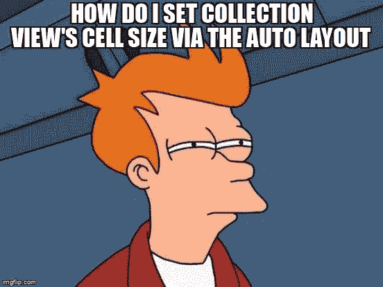

接下来是时候使用 AutoLayout 解决自动调整大小的问题了。几次尝试之后，我开始想:为什么我做的每一步都这么复杂？我是在重新发明轮子吗？我可以测量一个细胞。有各种方法可以做到这一点。但是你如何将所有这些融入到动画中呢？也许已经有人解决了所有这些问题，Github 上有现成的解决方案？

经过一番谷歌搜索，我发现没有多少习俗`UICollectionViewLayout`。是的，他们确实存在。但是它们只能根据它们被编写的目的来布局单元格，但是它们要么不正确地支持动画，要么它们是从`UICollectionViewFlowLayout`继承来的，并以某种方式调整‘prepare’方法中的属性，并依靠`UICollectionViewFlowLayout`来完成剩下的工作。

然后，我在一个黑暗的领域里看到了一线光明。没有讽刺。这是唯一真正的自定义布局，几乎做了我想要的一切。我惊讶地发现我实现的`initialLayoutAttributesForAppearingItem` / `finalLayoutAttributesForDisappearingItem`和 AirBnB 的人写的非常相似。

我复制了他们的动画尺寸调整解决方案。很难说我花了多长时间才发明了这个。我试着用很多方法来实现它，但是我从来没有完全正确过。他们的解决方案完美无缺，对我来说总是管用。

给你更多的细节:单元格状态在`UICollectionViewLayoutAttributes`中描述。在动画制作过程中，你必须保存从`initialLayoutAttributesForAppearingItem`返回的`UICollectionViewLayoutAttributes`实例，然后在`invalidationContext(forPreferredLayoutAttributes:, withOriginalAttributes originalAttributes:)`中，你可以改变该实例的帧尺寸。在那一刻，一些 KVO(键值观察)将在`UICollectionView`中触发，它会给你你期望的调整动画。忘记`preferredAttributes`，忘记`invalidationContext(forPreferredLayoutAttributes:`方法中收到的`originalAttributes`。它只能按照描述的方式工作。

**滚动**

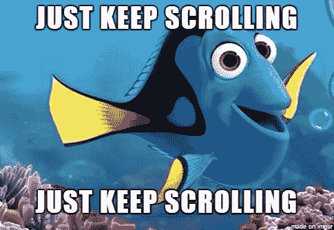

当一些部分最终开始工作时，开始处理滚动是完全有意义的。更准确地说，我需要将`UIScrollView`的行为转换成与标准相反的行为。这是因为当我们在末尾添加内容时，它不会下降，但其他内容会上升。

一些开发人员通过颠倒集合，然后翻转里面的内容来解决这个问题。但是，这样会丢失一些标准的东西，比如 adjustedContextInsets，键盘缩进应该从顶部开始计算，而不是从底部。一般所有的几何图形都是上下颠倒的。

我以为我大概可以从`UICollectionViewLayout`直接解决这个问题。这似乎是一个简单的任务。`UICollectionViewLayout`有一个方法`targetContentOffset (forProposedContentOffset proposedContentOffset: CGPoint) -> CGPoint`。根据文档:重新定义它你就开心了，`UICollectionView`会在更新前告诉你:我要把我的`contentOffset`弄成这样，如果你想修的话——把你的还我。

唯一的问题是，这个方法的调用甚至发生在您可以获得正确的单元格大小之前。如果您在动画更新期间进行计算，例如可见单元告诉您它想要更新其大小，您将无法使用它，因为它仅在动画开始时进行一次调用。是的，你可以使用`UICollectionViewLayoutInvalidationContext`拥有的`contentOffsetAdjustment`，但是在动画事务完成之前你不能正确使用它。因此，我必须计算两个不同的值，`proposedContentOffset`——在`targetContentOffset (forProposedContentOffset proposedContentOffset: CGPoint) -> CGPoint`中动画开始之前将使用的值，以及第二个值，我将在`finalizeCollectionViewUpdates`方法中在事务结束时使用的值。

这一切都很好，直到我开始检查细胞删除。如果您删除一个单元格，另一个单元格将从上方来填充可用空间。如果还没有计算下来的单元格的大小，则开始计算。然而，有了新的尺寸，我必须更新`contentOffsetAdjustment`但是`UICollectionView`忽略了它。不管我怎么尝试，我都无法让它像预期的那样工作:不是通过在各种组合中使用`contentSizeAdjustment`，也不是通过直接改变`contentOffset`。解决方法是忽略此刻出现的所有细胞，以后再计算其他一切。

归根结底，最重要的是达到了预期的结果。我能够按照我想要的方式控制滚动，并保持`UICollectionView`的动画更新工作。

**一点关于 bug 和私有 API**

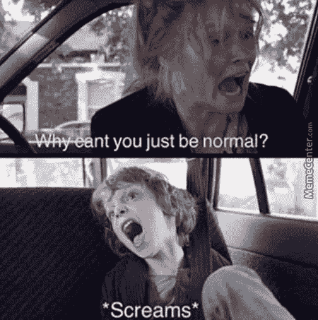

`UICollectionView`中的所有内容在滚动过程中都有轻微跳动。我不知道为什么。我决定在我或多或少弄清楚其他事情之前，不把注意力放在这件事上。后来，我开始谷歌搜索，发现了这个问题:[自我调整+预取 bug](https://openradar.appspot.com/40926834)来自 AirBnB 的同一个伟大的家伙。通过关闭默认启用的预取，我立即摆脱了这种奇怪的行为，内容开始正常滚动。

这是他们的另一个[细胞的自动调整大小的面具打破自我调整大小](http://openradar.appspot.com/46865293)。如果自定义`UICollectionViewLayout`表示内容宽度等于`UICollectionView`宽度，则`layoutAttributesForElements (in rect: CGRect) -> [UICollectionViewLayoutAttributes]`不会被调用预期的次数。解决方法是声明内容宽度略小于`UICollectionView`宽度。

`UICollectionViewFlowLayout`在调用公共的 prepareForCollectionViewUpdates 方法之前，使用私有方法`_prepareForCollectionViewUpdates: withDataSourceTranslator:`很好地计算一切。经典 UIKit。我设法通过引入一个特殊的标志来解决这个问题——如果一个事务开始，告诉`UICollectionView`它里面什么都没有，并开始根据你在`prepareForCollectionViewUpdates`中得到的东西进行计算。这让我摆脱了一些文物。这是我在`MagazineLayout`中窥探到的一个技巧。

蛋糕上的樱桃是 iOS 版本之间的差异，以及`UICollectionView`本身有时会混淆自己的数学，可能会要求您提供不存在的细胞的属性等。要列出我必须面对的一切，我需要单独写一篇文章。

也许，当然，上面描述的一切根本不是 bug。也许我误解了什么。我不会责怪 UIKit 的开发者。这个话题我就不做定论了。

**关于脆弱的一点点**

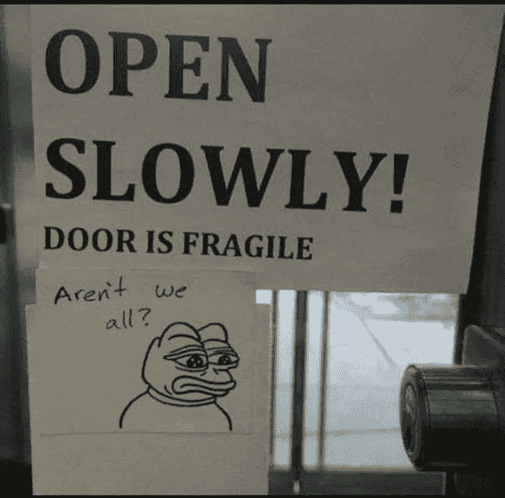

一般来说，所有这些`UICollectionView` + `UICollectionViewLayout`的东西都是相当脆弱的。如果你改变了收藏视图的大小，并插入了一些动画，你会得到人工制品。如果你用一个动画改变`contentInset`并且改变集合中的一些东西——你将会得到人工制品。如果你滚动收藏，用动画改变它，你会得到人工制品。如果你只是做错了什么——你会得到人工制品。

因此，我用标准的`UICollectionViewFlowLayout`替换了我的自定义布局，如果我面临完全相同的行为，这意味着它应该在使用它的代码中的`UICollectionView` + `UICollectionViewLayout`链之外被解决。因此，您将在示例应用程序中看到库附带的一组标志，如:如果键盘开始出现—出现时不要更新&—更新延迟的内容，等等。

**看来是时候去生产了！**

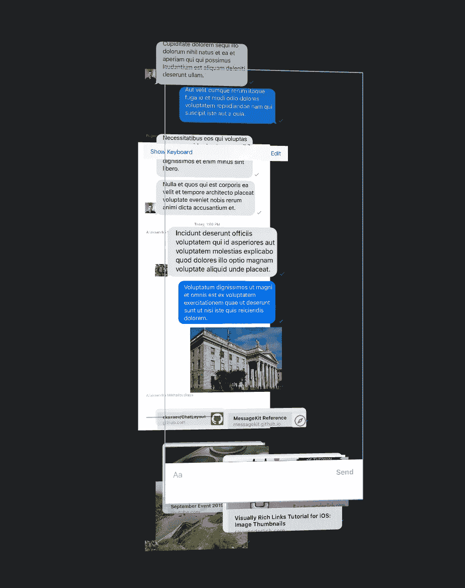

5 月底，在花了几周时间在 Profiler 应用程序中修复性能问题后，我发布了该库的公开测试版。在业余时间，我从我们的应用程序中提取了`MessageKit`库，并用`ChatLayout`替换它。我删除了大量服务于`MessageKit`和各种工作循环的代码，试图修复它的问题。相反，我得到了一个中等大小的`UIViewController`来服务于整个聊天视图。“中等大小”——我相信你知道我的意思😊。我向我的同事展示了它，经过全面测试后，它被合并到 master 中。

我们不再使用`MessageKit`。到目前为止，每个人都很开心。我的同事偶尔会称赞我的表现和做出改变的轻松程度。在吉拉，大多数公开的聊天漏洞会自动关闭。

**结尾是什么？**

最后我得到了一个 ChatLayout 库。

尽管我认为这是一个预览，但它适合在实际应用中使用。我希望，如果其他开发人员开始使用它，将有可能消除我还没有注意到的问题，并添加我不需要的功能。本文的目的是向社区介绍它，并吸引其他开发人员。

为了使修改变得更容易，我暂时对代码进行了轻微的优化。当改变该值时，它不使用任何对存储器的直接写入，等等。没有它，在当前设备上的发布版本中的性能是相当不错的。还有其他事情要做:清理示例应用程序、添加单元测试等等。除了我的主要工作之外，我自己还维护 RouteComposer 库。我担心我根本无法支持 2 个开源项目。我只是勉强找到写这篇文章的时间和灵感。

我将列出我目前认为这种方法的优点。

**关于**

ChatLayout 是 [MessageKit](https://github.com/MessageKit/MessageKit) 的替代解决方案。它使用自定义的`UICollectionViewLayout`来为你提供对演示的完全控制，以及`UICollectionView`中所有可用的工具。

**功能**

*   支持动态单元格和补充视图大小。
*   项目的动画插入/删除/重新加载/移动。
*   在更新过程中，将最后一个可见项目的内容保留在`UICollectionView`的顶部或底部。
*   提供精确滚动到所需项目的工具。
*   附带通用容器视图，以简化定制项目的实现。

【ChatLayout 没有提供的东西(以及它为什么好)

`ChatLayout`是`UICollectionViewLayout`的一个习俗，所以:

*   您不必扩展或覆盖任何自定义的`UIViewController`或`UICollectionView`。你需要自己实例化它们，并以你喜欢的方式使用它们。
*   `ChatLayout`不依靠修改过的`UICollectionViewFlowLayout`也不会上下颠倒的旋转你的`UICollectionView`。这意味着您可以使用视图，就像它们是`UICollectionView`中的常规单元格一样。您可以从使用默认的`adjustedContextInsets`(以及其他)的`UIKit`实现中获益，因为您的视图控制器是一个普通的视图控制器，没有任何技巧。
*   `ChatLayout`在将单元格显示在屏幕上之前，不要求您计算所有单元格的大小。您可以充分利用自动布局约束，并相信在运行时会计算出正确的大小。然而，`ChatLayout`和其他`UICollectionViewLayout`一样，将从您提供的估计单元大小中受益，因为这将使您获得更好的性能。
*   不强迫你使用任何特定的数据模型。您可以存储您的消息，并以您喜欢的方式更新`UICollectionView`。你唯一需要的是尊重`UICollectionView`拥有的自然边界，并有一个正确实施的`UICollectionViewDataSource`。示例应用程序使用 [DifferenceKit](https://github.com/ra1028/DifferenceKit*) 来处理数据模型中的更改。
*   `ChatLayout`不会强迫你使用任何特定的`UIView`来创建你的收藏单元格。您可以按照自己喜欢的方式创建它们。可以是任何一个`UICollectionViewCell`或者`UICollectionReusableView`。该库捆绑了一些通用的`UIView`，可以帮助您更快地构建它们。但是，您不必使用它们。
*   `ChatLayout`不处理键盘外观行为。您必须自己从头开始实现它，或者使用您已经在项目中使用的库。它让你可以完全控制键盘演示。您唯一要做的就是更新您的`UICollectionView`的 contentInsets。
*   `ChatLayout`不提供任何输入控制。你可以使用你喜欢的任何一个，并按照你喜欢的方式定制它。示例应用程序使用 [InputBarAccessoryView](https://github.com/nathantannar4/InputBarAccessoryView*) 。

仅此而已。感谢您的关注。我很高兴收到你的任何意见。

***注意— GIFs:***

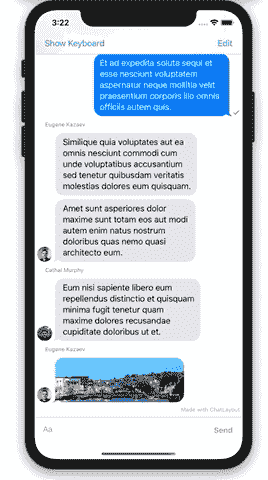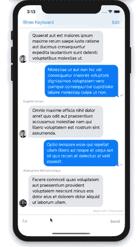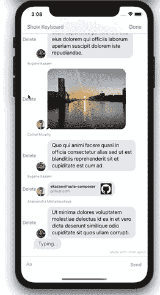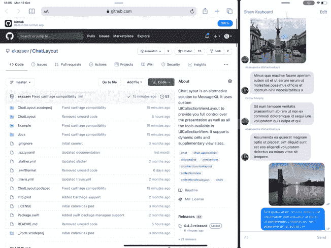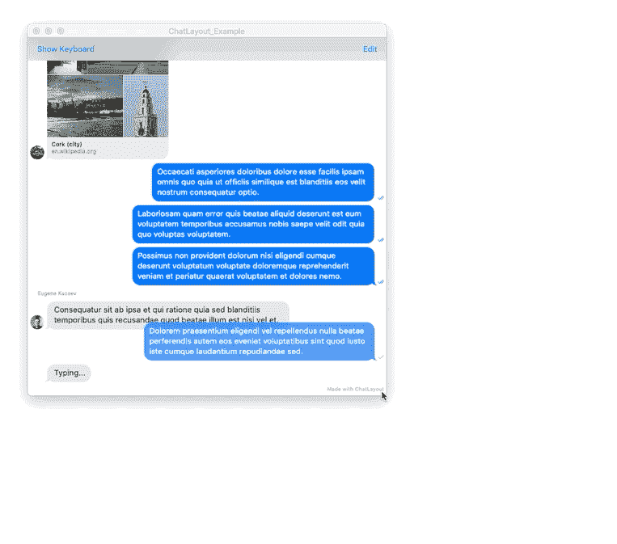