# 我的无服务器 GraphQL 体验👨‍🎨

> 原文：<https://itnext.io/my-experience-with-severless-graphql-2e95e5a8bda7?source=collection_archive---------0----------------------->

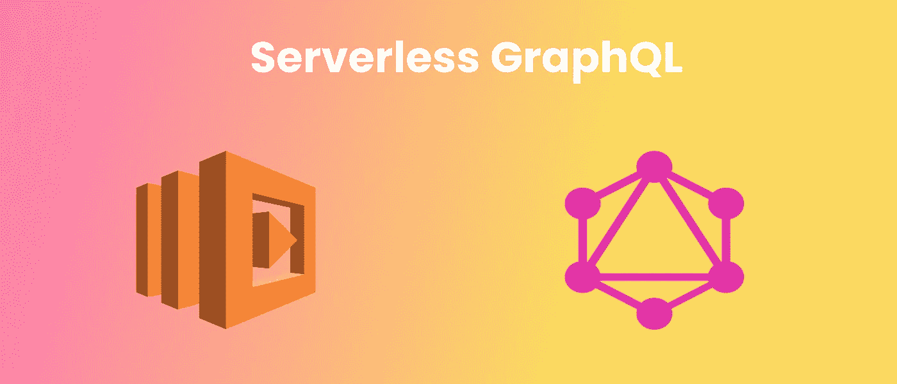

我在 2018 年 12 月的第二周开始在皮条客我的书工作，我的第一个任务是为我们的助学金部门开发一个概念证明。基本上，大学生去年通过谷歌表格和电子邮件订购教科书，这是该公司首次尝试将这一部门纳入其中。我们的客户需要看到某种形式的改进，我们的员工也需要一种更加自动化的方法来处理整个流程。

从 12 月 10 日开始，快进到未来的 4 个星期，我设法生下了[赞西](http://zansi.co.za)！一个简单的基本服务，允许学生为他们的课本下订单，并允许[的工作人员为我的书](http://www.pimpmybook.co.za)拉皮条，能够看到这些订单，并更新他们的状态(如:在订单中，已交付等)和信息，如哪个供应商有这本书，其交付日期等。

考虑到这一背景，要达到最终目标，这并非没有困难。2018 年下半年，我在我的荣誉课程中投入了大量时间来学习 [GraphQL](https://graphql.org/) 。不过，我一开始用的是 [Prisma](https://www.prisma.io/) ，运的是 [FanBoost](https://github.com/AmoDinho/formulaone-graphql-client) 。我的总体看法是，Prisma 有几个方面会使我按时交付 Zansi 的能力变得复杂，并且它们对无服务器部署的支持需要更多的配置。这是可行的，但对于悬在我头上的极短的最后期限来说并不理想。

另外， [AWS AppSync](https://aws.amazon.com/appsync/) 是一个选项，但是我非常怀疑在他们的解析器映射模板中实现定制业务逻辑的能力。最初，我被误导了，认为你没有能力用自己选择的编程语言编写解析器。但是你可以用 Lambda 的形式来实现，你也可以看看 Sarjeel Yusf 的这篇文章。

所以我决定用 [AWS lambda](https://aws.amazon.com/lambda/) 上的 [Apollo-Server-Lambda](https://www.apollographql.com/docs/apollo-server/deployment/lambda.html) 作为我的带有节点的后端。JS 运行时并使用[无服务器框架](https://serverless.com/)。当选择 React with [Apollo-Client](https://www.apollographql.com/docs/react/) 时，前端采用由[样式组件](https://styled-components.com)驱动的[设计系统](https://www.designbetter.co/design-systems-handbook)。

提出 Github 问题、给人们发电子邮件和谷歌搜索都没有解决几个绊脚石。下面是一些绊倒我的事情，因为实际上我花了几天时间想知道人们到底是如何在无服务器环境中使用 GraphQL 的，另一方面，你不应该遭受我所经历的痛苦和挫折。

# 第一条:不要像调用 REST API 一样调用它😒

在创建了“Hello World”的无服务器 GraphQL API 后，我犯了一个错误，在本地调用它，如下所示:

```
$ serverless invoke local -function graphql
```

我会得到下面的错误:

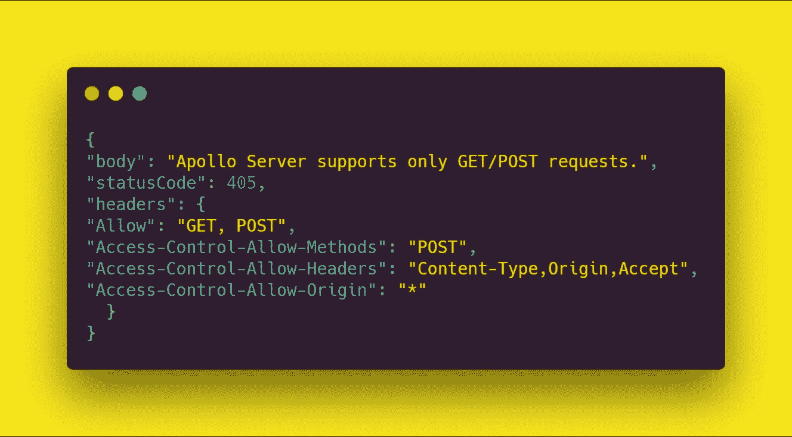

不要像我一样浪费，你要做的就是跑:

```
$ sls offline
```

然后在浏览器中导航到**localhost:4000/name _ of _ endpoint**，然后[游乐场](https://github.com/prisma/graphql-playground)将会打开。然而，你必须确保你的 **serverless.yml** 是这样配置的:

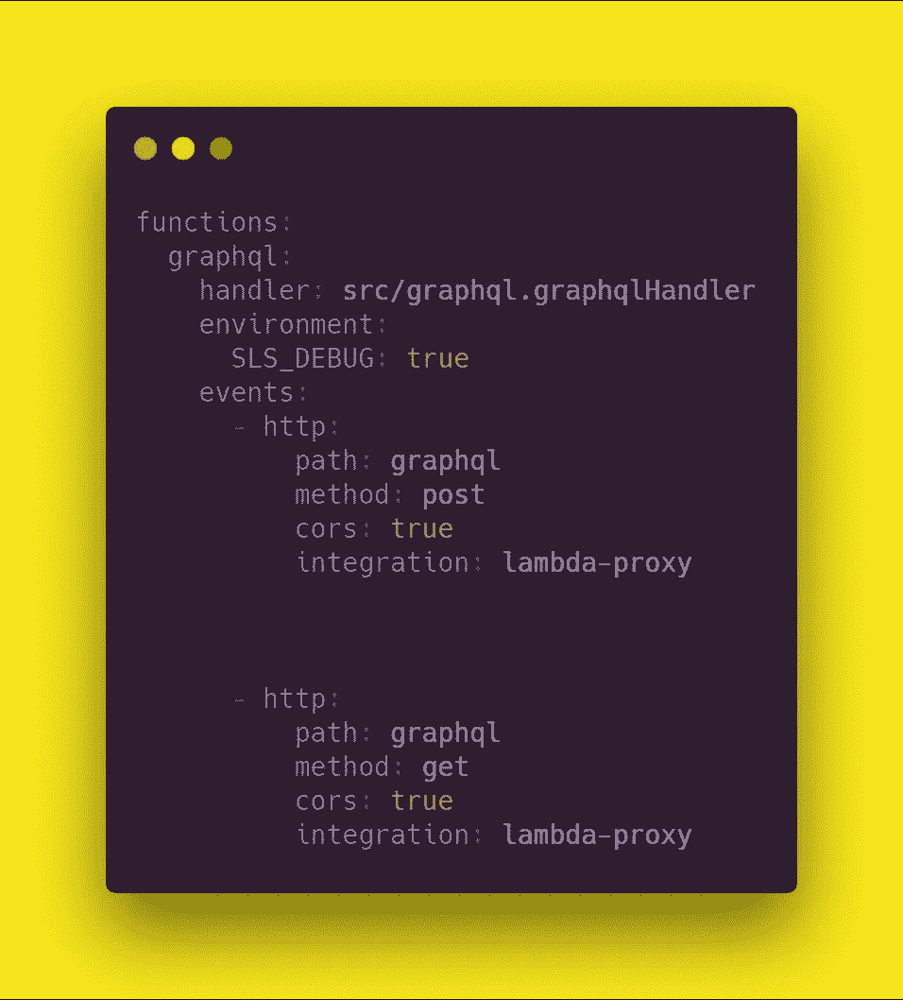

# 第二条:在 Lambda 上用 Cognito 进行身份验证

在大多数情况下，你需要知道你的应用程序中的用户是谁，以及他们能够在你的应用程序中访问和做什么。

需要注意的一点是，无论您使用什么工具进行身份验证，它们都可以配置为与您的 GraphQL API 一起工作。

下面的演讲帮助我了解了为我的 API 实现认证所需的心理模型:

在我的例子中，我使用了 [AWS 的 Cognito](https://aws.amazon.com/cognito/) 服务。第一步是确保您已经为开发和生产环境创建了用户池。

然后确保你的 **serverless.yml** 的功能配置如下:

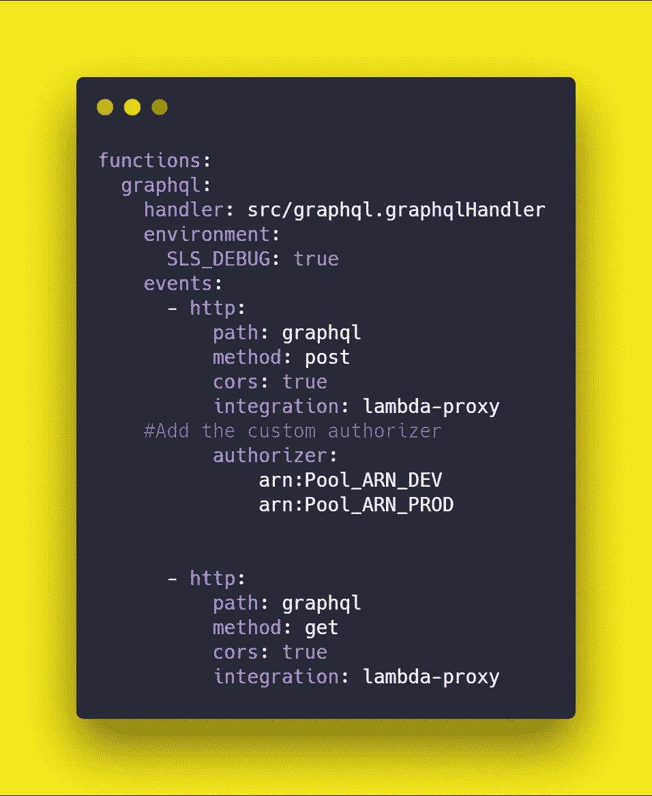

因为您使用的是 AWS 服务，Cognito 的有效负载将在 lambda 的上下文中可用，所以不需要额外的配置:

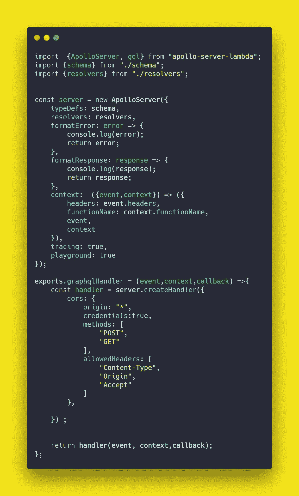

graphql.js

现在，如何访问用户的属性呢？由于使用了 **lambda_proxy** 集成，有一种不同的方式来访问它们:

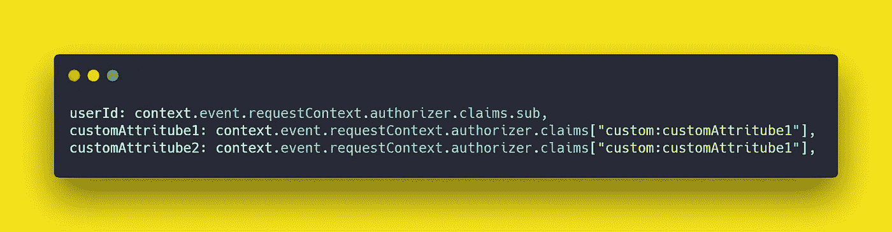

如果您需要将自定义属性添加到您的 Cognito 池，您可以轻松地添加它们，但要确保通过执行以下操作使它们可读和可写:

## 第一步

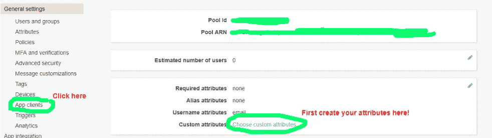

首先确保您已经创建了自定属性，然后点按“应用程序客户端”

## 第二步

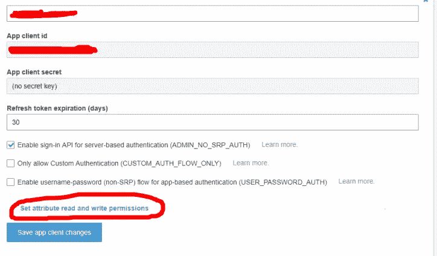

然后单击显示详细信息，然后单击“设置属性读写权限”

## 第三步

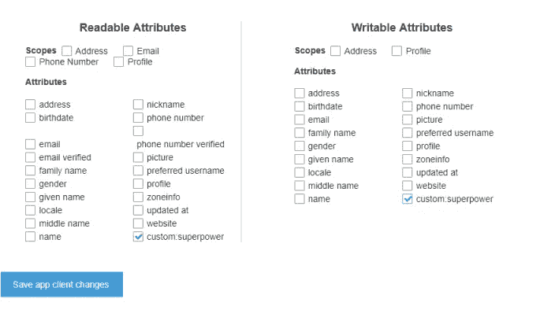

然后勾选你需要的可读可写的相关属性，保存修改。

现在你如何在操场上测试你的 API 呢？好问题，伙计🤯！

1.  我首先必须用虚拟变量对 cognito 变量进行硬编码，以便在本地运行该函数。这是因为无服务器脱机版不支持自定义授权程序。
2.  一旦高兴，我推开发，然后我从前端生成一个 [JWT](https://jwt.io/) ，并访问我的开发端点和粘贴授权头令牌。
3.  在这之后，我将相关的查询/变异连接到前端。

不理想，但我还没有找到一个好的工作，如果你有更好的方法来避免这个蹩脚的过程，请分享！

# 捕捉 3:在 React 中使用 Cognito 进行身份验证

在前端的事情很容易。您只需要安装 **react-apollo 或您首选的 apollo 客户端库**，并为您的端点设置一个 auth 头，如下所示:

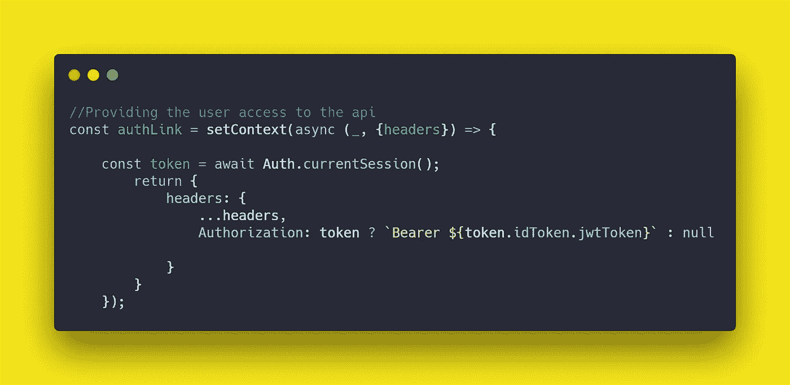

索引. js

对于您的注册组件，这是您如何使用 [Amplify](https://aws-amplify.github.io/) 提交定制的 Cognito 属性:

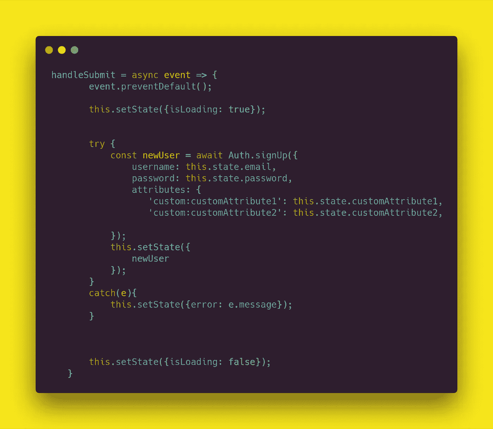

Amplify 的唯一问题是，默认情况下，用户信息存储在 localStorage 中，因此需要彻底调查具有更严格安全要求的应用程序的解决方案。我认为使用 Cookies 可能是一条出路。

# 第四条:不理解“serverless.yml”文件的强大功能

你的 **serverless.yml** 是你和你的 AWS 服务之间的中间人。您应该花时间了解如何正确配置它，以便能够与您的各种服务对话。理解 it 和云形成之间的联系帮助我克服了在 Cognito 时遇到的一些认证问题。

这个[无服务器文档](https://serverless.com/framework/docs/providers/aws/events/apigateway/)探索了不同的选项，您可以用特定的方式配置您的**无服务器. yml** 来获得不同的 API 网关配置。

## 最后，现在学生们正在订购他们的课本，我后悔什么呢？

主要使用 [DynamoDB](https://www.dynamodbguide.com/) ，它不接受空字符串，有很多保留的关键字，这让我很不爽。

有了那次冒险经历，用图表记录所有的事情当然是值得的。除了我所面临的上述问题之外，我所能说的是，你越能接受被卡住的情况，越能理解这是你作为开发人员的工作所特有的过程的一部分，就越容易解决你的障碍。只是我的 2c…💰

## GRAPHQL 所有的东西！！✨🤠