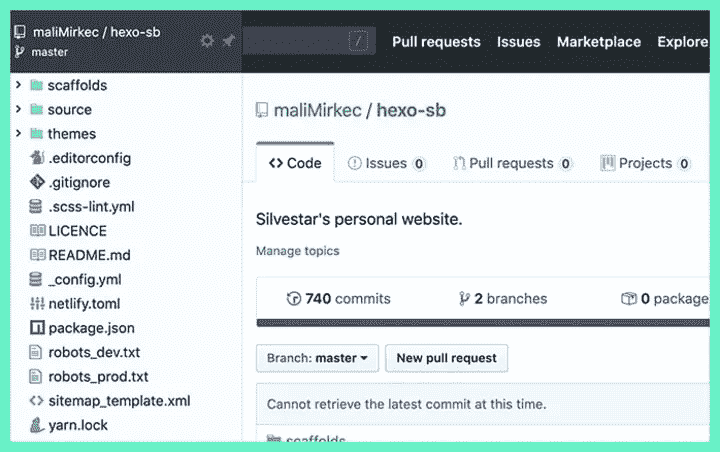
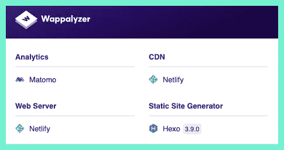
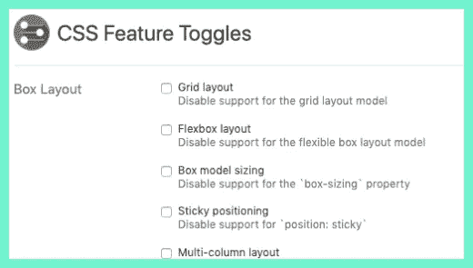
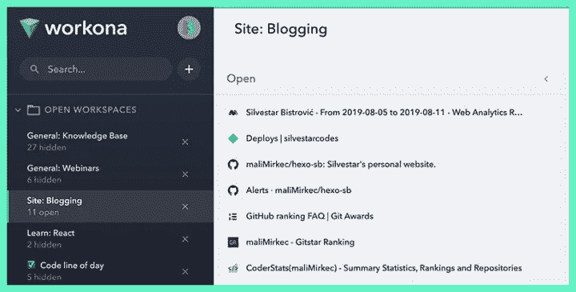
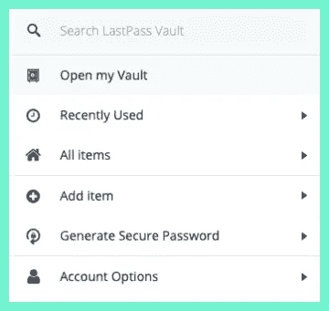
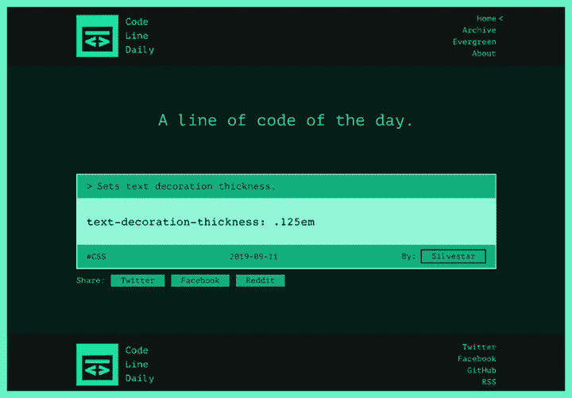

# 我最喜欢的 web 开发扩展

> 原文：<https://itnext.io/my-favorite-extensions-for-web-development-1e230b33e90e?source=collection_archive---------2----------------------->

## 生产率

## 这些扩展可以让您的开发工作变得稍微容易一些。

web 浏览器是 web 开发的基本工具之一。除了默认安装自带的强大开发工具，你可以考虑这些 Chrome 扩展来帮助你完成日常任务:

*   八叉树
*   晶片化器
*   CSS 功能切换
*   沃克纳
*   最后一遍
*   每日代码行
*   共开
*   关键词无处不在
*   阻止自己进行分析
*   总是清除下载 2
*   铬的语法
*   去他妈的工作
*   缓冲器
*   帕布鲁棕色
*   表情键盘

# 八叉树

[Octotree](https://www.octotree.io/) 或“GitHub 上类固醇”，是在 GitHub 页面上增加一些额外功能的扩展。最强大的特性是带有代码树的侧边栏，就像在 ide 中一样。当您试图在存储库中查找文件时，这很方便。

这是我的网站知识库 Octotree 侧边栏的预览。

# 晶片化器

[Wappalizer](https://chrome.google.com/webstore/detail/code-line-daily/jfgojeolhopchbgfdgodicnaimmkbpbg) 标识当前站点使用的技术。我发现这个扩展在审查新项目时很有帮助。我可以看到网站上使用的大多数技术，这让我可以决定是否接受一个项目，甚至做出评估。

例如，您可以看到我的网站使用 Matomo 进行分析，使用 Netlify 作为 web 服务器和 CDN，使用 Hexo 生成静态网站。

# CSS 功能切换

在不同的设备上测试网站可能是一项相当乏味但必须完成的任务。尽管网络正朝着正确的方向发展，但我们应该意识到不支持的 CSS 功能，如 CSS 网格或 CSS 变量。在你努力在不同的浏览器中测试你的网站之前，你可以先在 Chrome 中切换 CSS 功能来节省一些时间。CSS 特性切换扩展让你可以做到这一点——关闭 CSS 特性。

支持的功能包括:

*   布局特性——如 CSS 网格、Flex 和多栏属性；
*   视觉渲染功能—如过渡、动画和遮罩；
*   尺寸特征—如`shape-inside`和`object-fit`属性；
*   其他特性——如 CSS 变量或`calc()`支持。

# 沃克纳

Workona 是我无法想象我的工作日不再缺少的一个扩展。它就像一个项目经理，就在你的浏览器中，你可以在云端管理你所有的工作。这意味着我可以随时在不同的设备上打开我的标签页。我用它来组织我的工作空间，以便阅读文章、观看网络研讨会、学习和从事单独的项目。

你可以在仪表板上看到我工作的一部分。要打开特定工作区的选项卡，只需单击一下即可。

# 最后一遍

[LastPass](https://chrome.google.com/webstore/detail/lastpass-free-password-ma/hdokiejnpimakedhajhdlcegeplioahd) 是一个密码管理器。它可以存储密码，并且可以自动为您填充登录字段。当处理大量客户时，它可以节省你的时间和理智。我也在手机上使用它。它非常有效。

在测试表单时，LastPass 也可以为您节省大量时间。您可以用虚拟数据创建一个配置文件，然后使用“填充”选项来填充表单。我经常在注册表单中使用这个特性。

*有趣的事实:我有超过 20 次的空闲登录。*😵

# 每日代码行

[代码行日报](https://cld.silvestar.codes)是我上个月左右一直在做的一个兼职项目。这是本月早些时候在产品搜索上推出的。

一个追随者建议它可以被用作浏览器插件。本周 Code Line Daily 在 Chrome 网上商店中作为扩展[提供。](https://chrome.google.com/webstore/detail/code-line-daily/jfgojeolhopchbgfdgodicnaimmkbpbg)

# 荣誉奖

这些扩展安装在我的 Chrome 上，但我并不经常使用它，或者说我并不太关注它:

*   [共开](https://chrome.google.com/webstore/detail/codopen/agnkphdgffianchpipdbkeaclfbobaak)。显示的扩展允许在单独的窗口中预览 Codepen 代码段，以便在您喜欢的工具中更容易地调试。有趣的事实:莎拉·德拉斯纳的丈夫做了这个扩展作为给她的礼物。
*   [到处都是关键词](https://chrome.google.com/webstore/detail/keywords-everywhere-keywo/hbapdpeemoojbophdfndmlgdhppljgmp)。用于搜索引擎优化研究的扩展。它显示网站中的关键词，如谷歌搜索、谷歌搜索控制台和谷歌分析。这对基础研究是有用的。
*   [阻止自己进行分析](https://www.igorware.com/extensions/block-yourself-from-analytics)。它可以防止记录你访问谷歌分析。这在处理低流量网站时非常有用。
*   [永远清除下载 2](https://chrome.google.com/webstore/detail/always-clear-downloads-2/jcajchndfkmnaefkhoaoiagemplbfffn) 。它在完成后自动清除下载列表，最重要的是，关闭下载栏。
*   [语法上为铬](https://chrome.google.com/webstore/detail/grammarly-for-chrome/kbfnbcaeplbcioakkpcpgfkobkghlhen)。是每个人必备的扩展。我使用的是付费版本，但它在免费层提供了许多引人注目的功能。
*   [去他妈的工作](https://chrome.google.com/webstore/detail/go-fucking-work/hibmkkpfegfiinilnlabbfnjcopdiiig?hl=en)。当你访问被你定义为浪费的网站时，它会用相当强烈的语言显示激励信息。这使得回去工作不止一次。
*   [缓冲器](https://chrome.google.com/webstore/detail/buffer/noojglkidnpfjbincgijbaiedldjfbhh?hl=en)。这是一个重要的工具，用于安排社交分享。我每天都在使用它。
*   [帕布罗](https://chrome.google.com/webstore/detail/pablo/gfpibnlcombjoeejlongmihndgkpnjjo)。它用溢出的文本和自定义效果创建引人入胜的社交图像。
*   [表情键盘](https://chrome.google.com/webstore/detail/emoji-keyboard-emojis-for/fbcgkphadgmbalmlklhbdagcicajenei)。有时候你只需要搜索一个表情符号来表达自己。它按类别显示表情符号，并且有强大的搜索功能。

*最初发布于*[*https://www . silvestar . codes*](https://www.silvestar.codes/articles/my-favorite-chrome-extensions-for-web-development-mostly/)*。*