# 我最喜欢的重组函数

> 原文：<https://itnext.io/my-favorite-recompose-functions-c8ff98ea308f?source=collection_archive---------1----------------------->

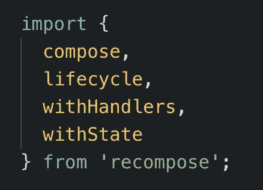

[重新构图](https://github.com/acdlite/recompose)很棒。使用过 Lodash 或 Ramda 这样的库吗？重组是为了反应。

这

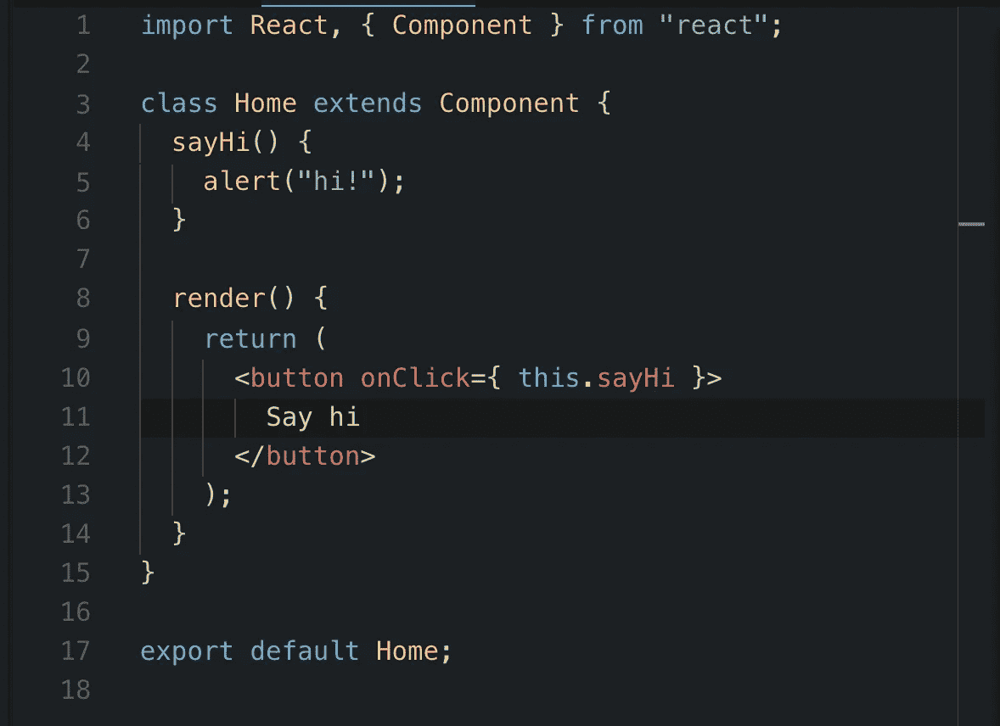

变成了这个

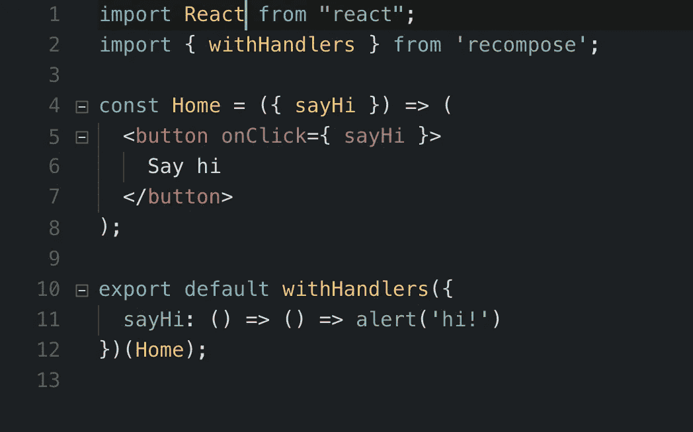

这种风格真的让我越来越喜欢，我想分享一些我最喜欢的功能。

# withHandlers()和 withState()

假设我们想在用户输入时显示他们的名字。我是根据[官方文件](https://github.com/acdlite/recompose/blob/master/docs/API.md#withhandlers)中的例子得出这个结论的。

传统上，我们的 JSX 可能看起来像

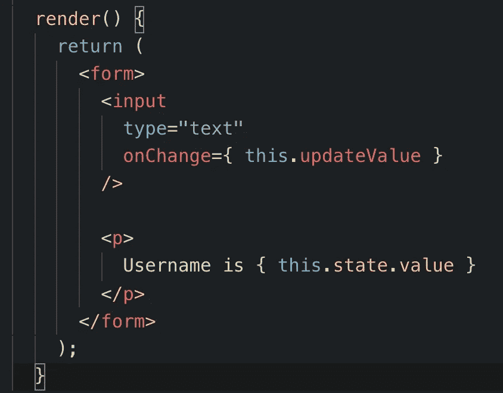

我们需要状态管理来处理用户名，所以我们使用`this.state.value`。让我们在构造函数中定义该状态，并添加一个处理程序来更新它。

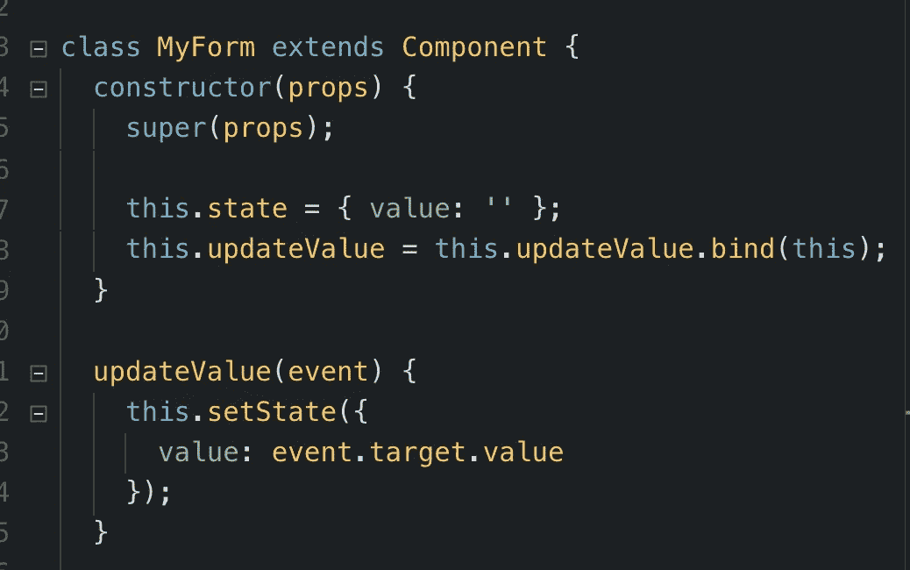

我们的状态被初始化为`{ value: '' }`，并且我们添加了一个`updateValue`方法。我们已经在 JSX 接上了。让我们试一试。

太酷了，有用。当您键入时，用户名会实时更新。

这是一个可能的改编版本。我们的组件现在将接受一个名为`onChange`的道具。

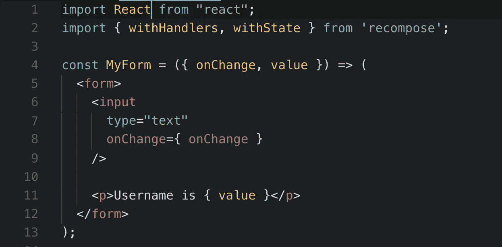

我们将添加状态和一个使用`withState`更新它的处理程序。

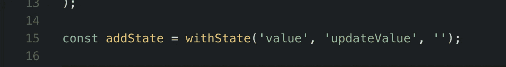

`withState`接受三个参数，`stateName`、`stateUpdaterName`和`initialState`。

在本例中，我们创建了一个名为`value`的状态，将其初始化为一个空字符串，并创建了一个名为`updateValue`的函数来更新它。

现在为`withHandlers`。

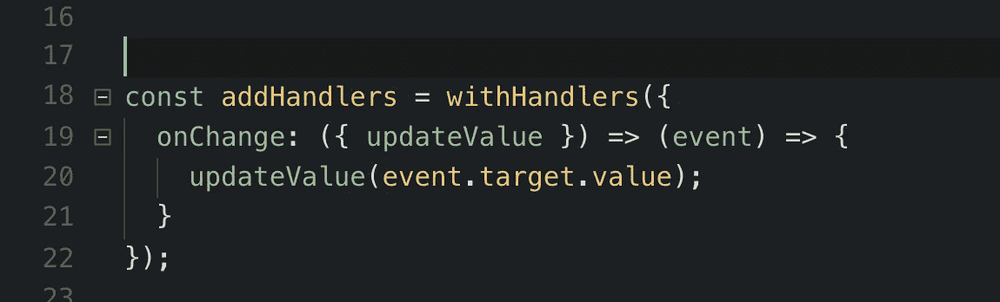

`withHandlers`接受处理程序的对象:接受`props`并返回一个处理程序的高阶函数。即使在处理程序返回之后，它也可以通过闭包访问其父函数的`props`。

`updateValue`是由`withState`提供的更新函数，我们在`withHandlers`内部使用它来设置`event.target.value`为新的状态值。所有这些都发生在处理程序`onChange`中，它将作为道具传递给我们的组件！

记住现在每当用户更新输入框时,`MyForm`调用它的`onChange`道具。

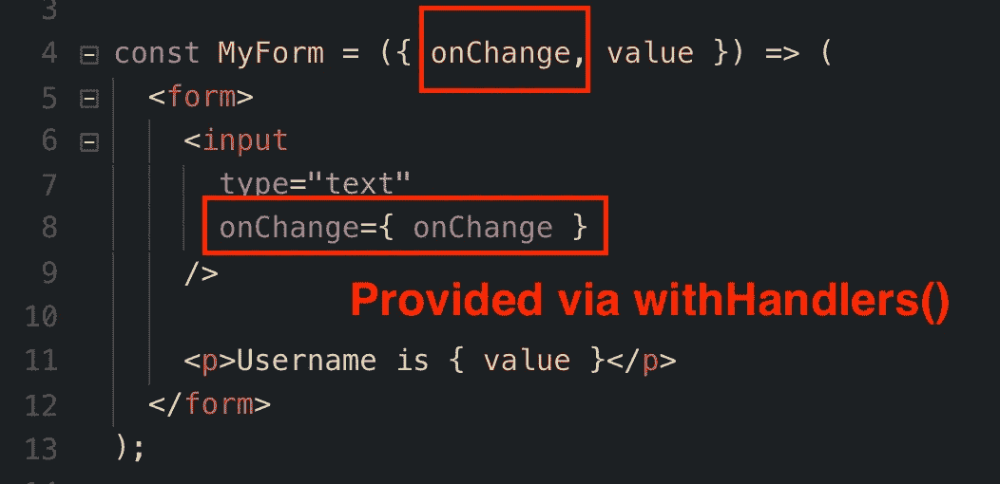

我们的默认导出现在看起来像这样

在调用了`withState`和`withHandlers`之后，你得到了更高阶的组件。必须用另一个组件调用更高一级的组件。

这就是为什么我们把`MyForm`传给`addHandlers`，然后把`addHandlers(MyForm)`传给`addState`。一个装饰下一个，联合起来形成一个更大的实体。

我们的功能保持不变。

# 撰写()

如果你熟悉函数式编程，你可能会认出`compose()`。如果没有，我已经写了[一个帖子解释它和](https://medium.com/@yazeedb/pipe-and-compose-in-javascript-5b04004ac937) `[pipe()](https://medium.com/@yazeedb/pipe-and-compose-in-javascript-5b04004ac937)` [在这里。](https://medium.com/@yazeedb/pipe-and-compose-in-javascript-5b04004ac937)

`compose`结合了`n`函数，允许你更优雅地嵌套函数。让我们用它来重构我们增强的`MyForm`。

我们以前有过这个

我们将导入`compose`

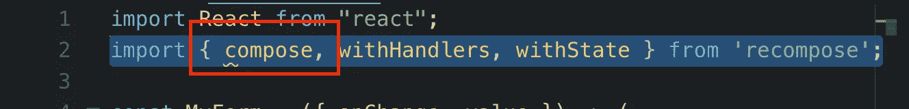

像这样使用它

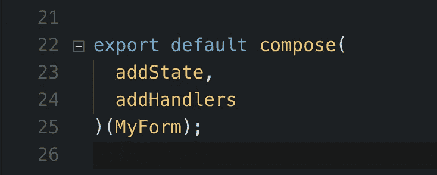

我在[重组文档](http://import { compose, withHandlers, withState } from 'recompose';)中看到的一个模式是将您的“增强”存储在一个变量中，然后导出该变量+您的组件。这里有一个例子。

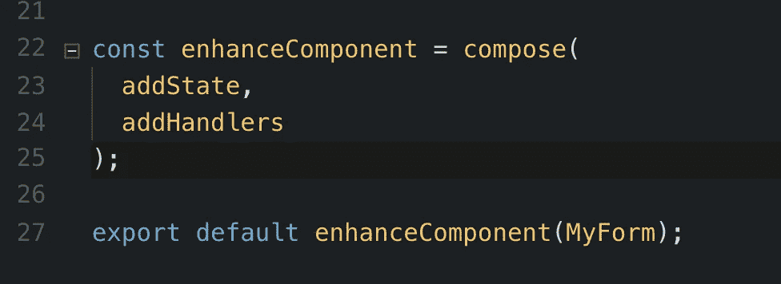

我采用了这种模式，因为它对我来说很有意义。

你的组件是一个接受`props`并返回 JSX 的纯函数。

您的“增强”是高阶组件，旨在添加或改进组件的功能。

以这种方式定义和组合它们似乎是对这一想法的补充。

我再分享一个我最喜欢的高阶组件:`lifecycle`。

# 生命周期

您可能会从名字中猜到，`lifecycle`让您的纯功能组件访问 React 的生命周期挂钩，严格地说是针对类的。

实际上使用了一个类，但是你只处理函数。这才是重点。因为所有的东西都是作为一个函数暴露给你的，所以你只需要考虑这些。

让我们将其添加到我们的`enhanceComponent`高阶组件。我们先导入。

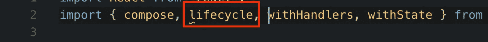

然后把它放在下面

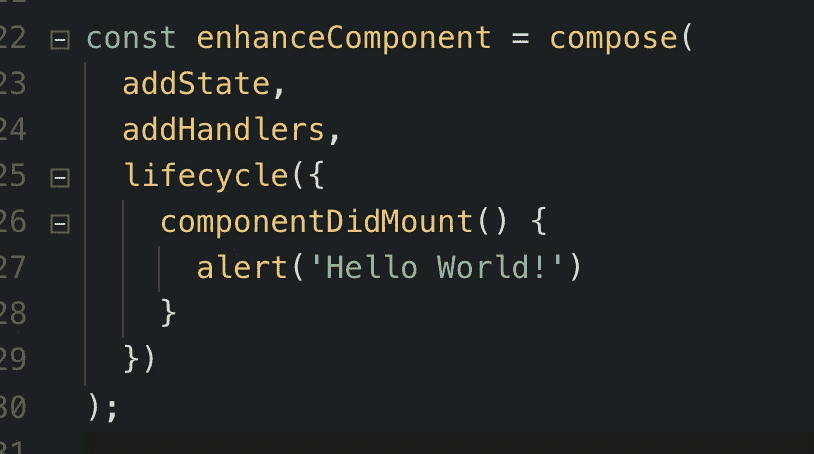

如您所见，`lifecycle`接受函数的对象，就像`withHandlers`一样，但是这些函数必须以有效的 React 生命周期钩子命名。

我们在屏幕上看到以下警告

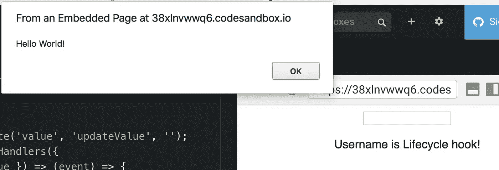

最好使用 [ES6 方法定义](https://developer.mozilla.org/en-US/docs/Web/JavaScript/Reference/Functions/Method_definitions)来允许访问`this.props`。如果你想从`props`调用一个处理程序，你需要`this`指向正确的上下文。

假设在`componentDidMount()`中，我们想将用户名设置为“生命周期挂钩！”

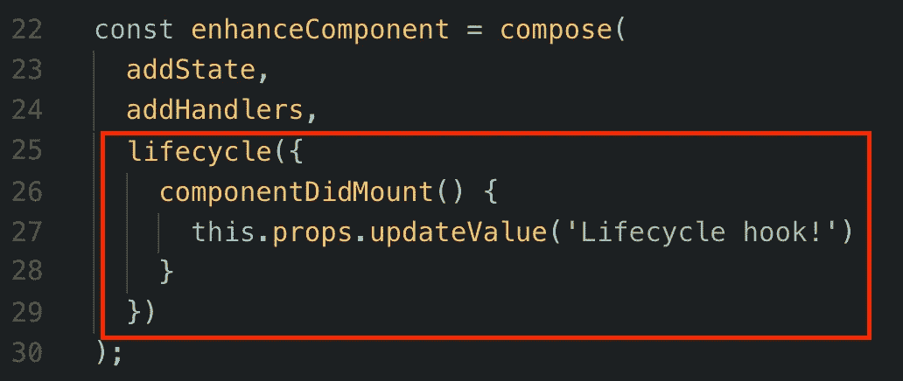

导致了这个

如果我们使用箭头函数，那就不行了

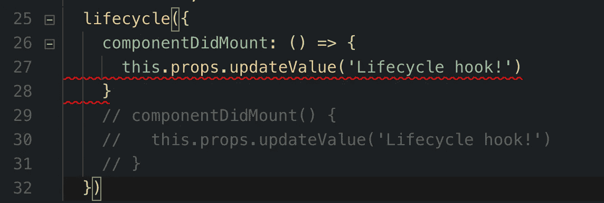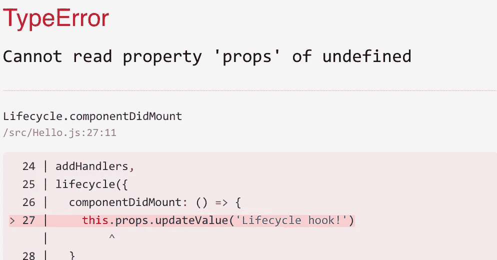

如果我们`console.log(this)`我们得到如下

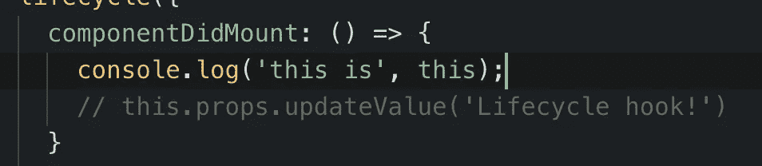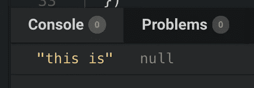

不过，如果您使用 ES5 风格的函数，它也能工作。

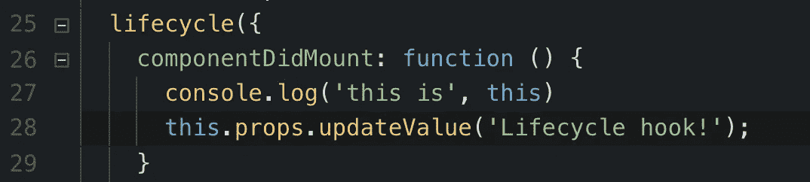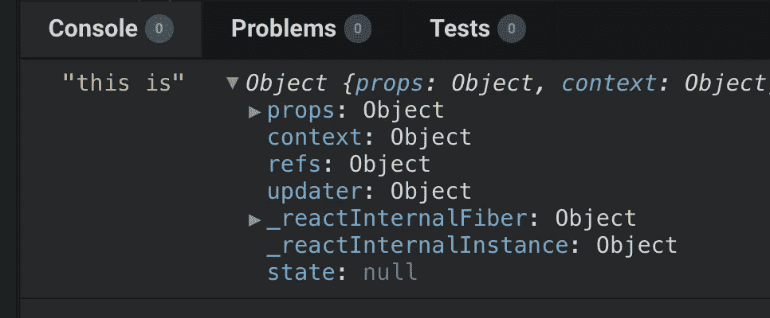

现在我回避 ES5 函数，所以方法定义会做得很好。

# 其他实用功能

这些是我要重组的函数。

随着我开始再次使用 [RxJS Observables](http://reactivex.io/rxjs/) ，一些其他的重组函数引起了我的兴趣。

它们可能是未来一篇文章的主题，如果你感兴趣，这里有一个到重新组合 observable utils 文档的链接。

下次见！

保重，
Yazeed Bzadough