# 我最喜欢的针对颤振和编程的 VS 代码扩展

> 原文：<https://itnext.io/my-favorite-vs-code-extensions-for-flutter-and-programming-bc87b3284c0a?source=collection_archive---------2----------------------->

## 使用这些 VS 代码扩展提高您的生产力，比以往更快地完成您的项目。

在本文中，我将向您展示我最喜欢的 Visual Studio 扩展，它们使您的工作流程更快更简单。我们开始吧！

## 本文由扩展的两部分组成

*   省道/颤振专用延伸
*   其他有用的编码扩展

# 省道/颤振专用延伸

## 棒极了的抖动片段:只用几个字母就能创建小部件

> 只需键入一些关键字并按回车键，您的代码就可以运行了

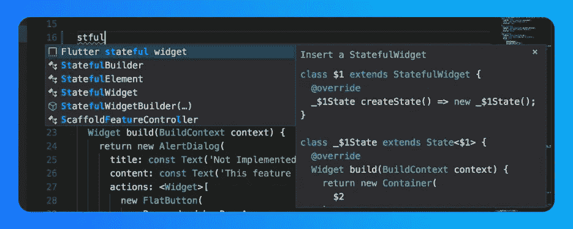

## [Flutter Riverpod 片段](https://marketplace.visualstudio.com/items?itemName=robert-brunhage.flutter-riverpod-snippets):使用几个字母创建提供者

> 只需键入一些关键字并按回车键，您的代码就可以运行了

## [Pubspec Assist](https://marketplace.visualstudio.com/items?itemName=jeroen-meijer.pubspec-assist) :不通过浏览器添加依赖关系

> 按 Ctrl + Shift + P，键入“Pubspec Assist ”,选择依赖项的类型(普通或开发),并键入您将使用的依赖项的名称

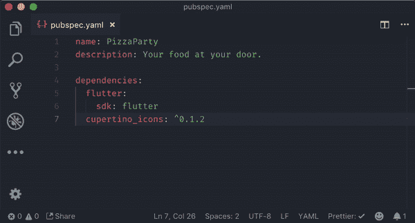

## 快速导入(dart-import):毫不费力地修复您的导入

> 按 Ctrl + Shift + P，键入“修复导入”并输入

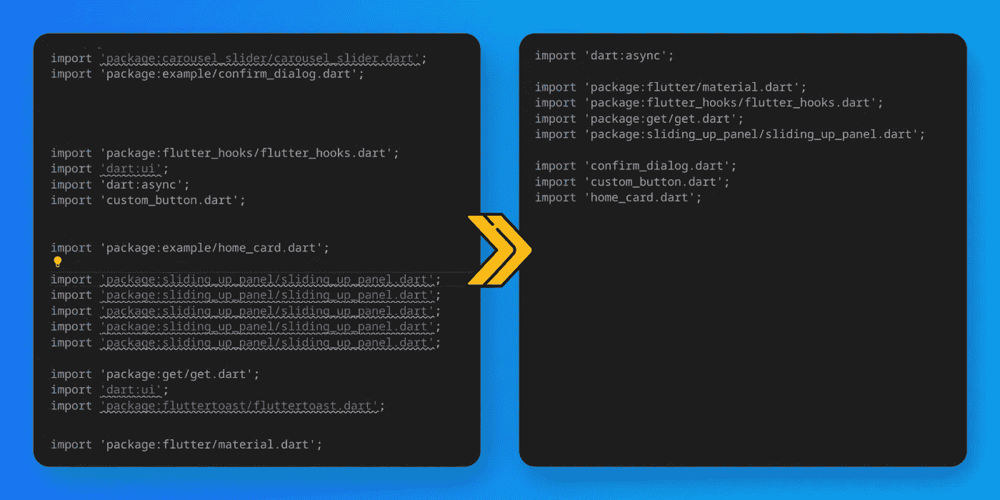

## [Dart 数据类生成器](https://marketplace.visualstudio.com/items?itemName=BendixMa.dart-data-class-generator):创建具有所有功能的 Dart 类！

> 创建一个类，然后点击 lamb 提示并生成您的代码！

# 其他扩展

## [素材图标主题](https://marketplace.visualstudio.com/items?itemName=PKief.material-icon-theme):立即找到您的文件/文件夹

> 这将自动应用。您不需要做任何事情来使用

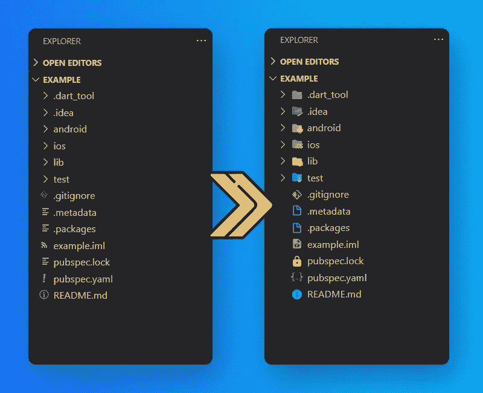

## [支架对上色器 2](https://marketplace.visualstudio.com/items?itemName=CoenraadS.bracket-pair-colorizer-2) :轻松识别您的支架

> 这将自动应用。您不需要做任何事情来使用

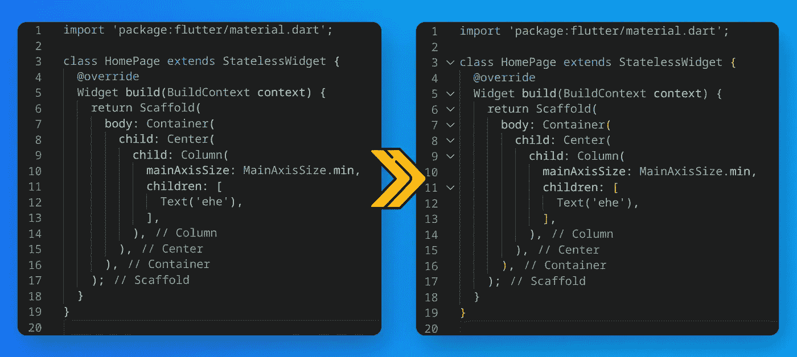

## [SVG 预览](https://marketplace.visualstudio.com/items?itemName=SimonSiefke.svg-preview):用 VS 代码显示你的 SVG 文件

> 只需在项目中打开一个 SVG 文件

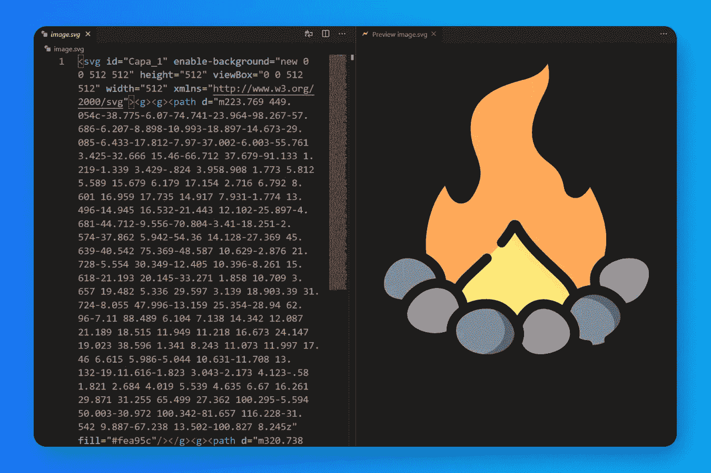

## [删除注释](https://marketplace.visualstudio.com/items?itemName=plibither8.remove-comments):一次性删除所有注释

> 按 Ctrl + Shift + P 键输入“删除所有注释”并回车

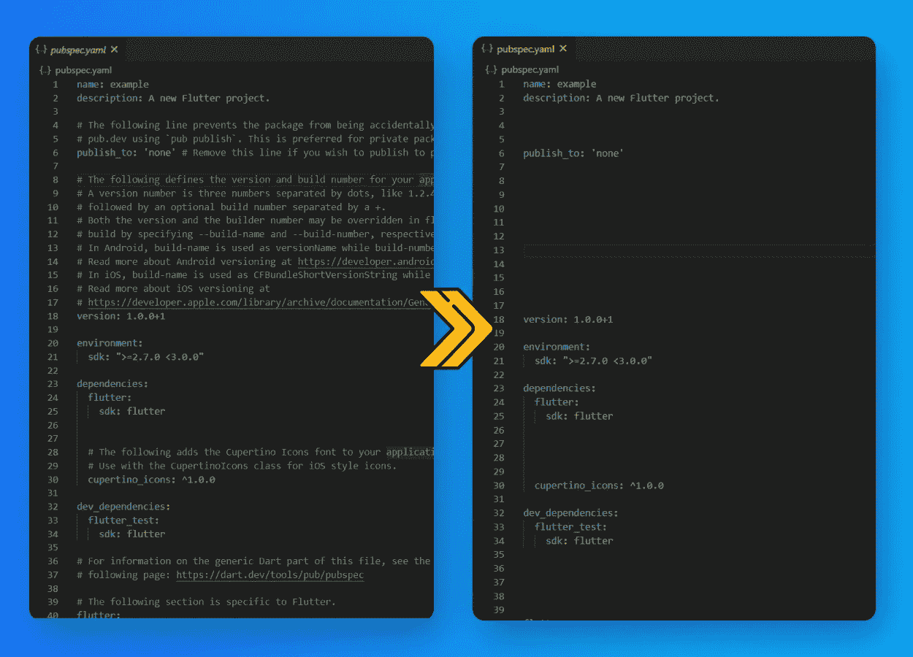

## [删除空行](https://marketplace.visualstudio.com/items?itemName=usernamehw.remove-empty-lines):一秒钟内删除所有空行

> 按 Ctrl + Shift + P 键输入“删除空行”并回车

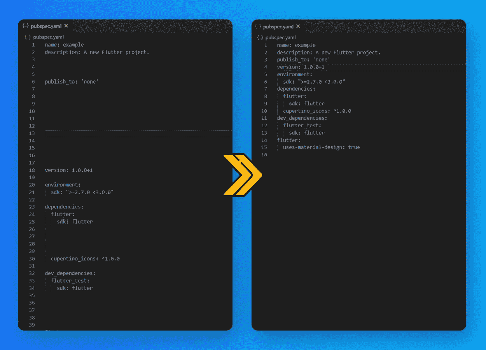

## [降价预览增强](https://marketplace.visualstudio.com/items?itemName=shd101wyy.markdown-preview-enhanced):显示你的自述。设计的 MD 文件

> 打开自述文件，单击将出现在右上角的图标

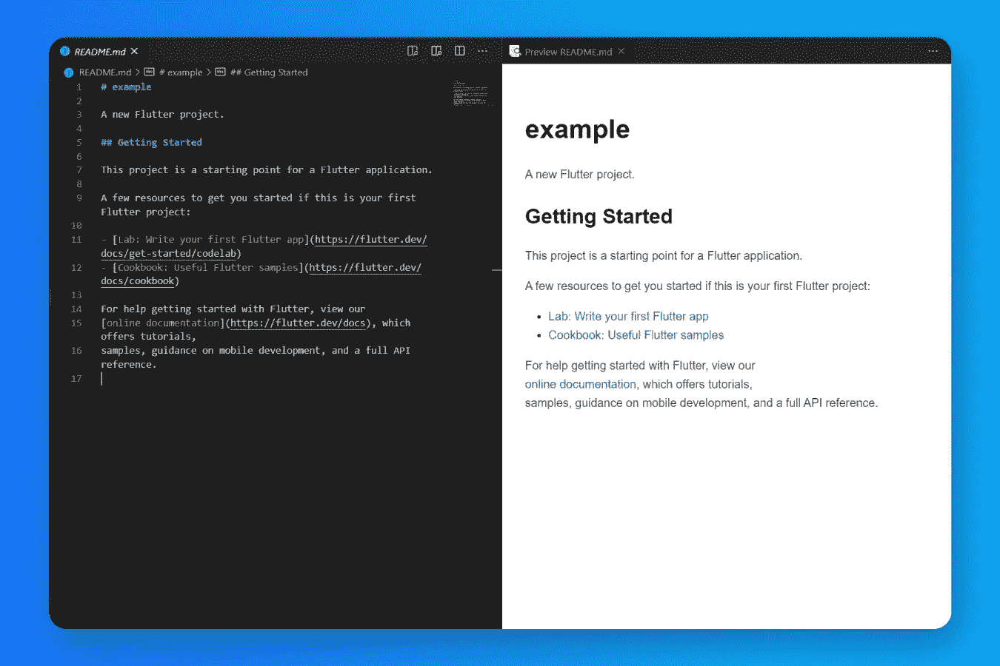

## [JSON](https://marketplace.visualstudio.com/items?itemName=ZainChen.json) :不要迷失在你的 JSON 文件中

> 只需打开一个 JSON 文件，然后单击左侧标签栏中的 JSON 图标

## CodeSnap :给你的代码截图

> 按 Ctrl + Shift + P 键入“CodeSnap”和 Enter，然后选择您的代码，并单击镜头图标导出

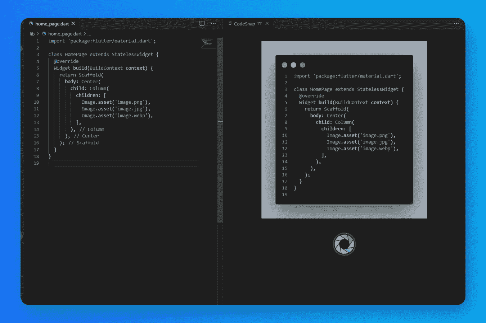

## [更好的评论](https://marketplace.visualstudio.com/items?itemName=aaron-bond.better-comments):丰富你的生活！

> 只是补充`！？* TODO `关键字，并让扩展为它们着色

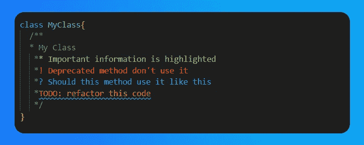

## [图像预览](https://marketplace.visualstudio.com/items?itemName=kisstkondoros.vscode-gutter-preview):无需打开即可预览图像

> 这将自动应用。您不需要做任何事情来使用

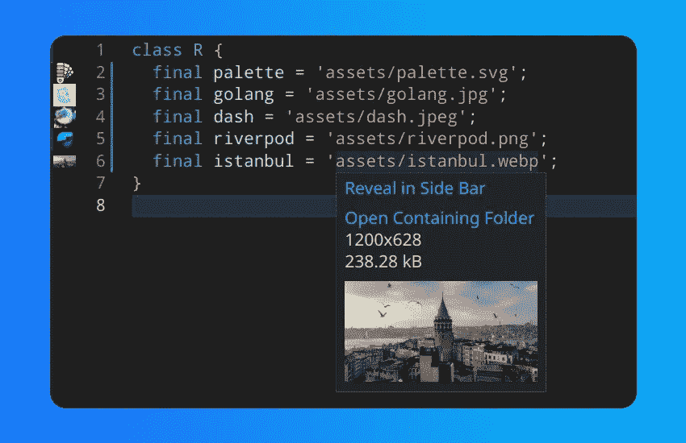

此外，还有一些很棒的扩展，如 Docker、GitLens 等。但是我只提到了对你的颤振开发有帮助的扩展！

# 感谢您的阅读！

我试图尽可能简单地解释。希望你喜欢。

如果你喜欢这篇文章，请点击👏按钮(你知道你可以升到 50 吗？)