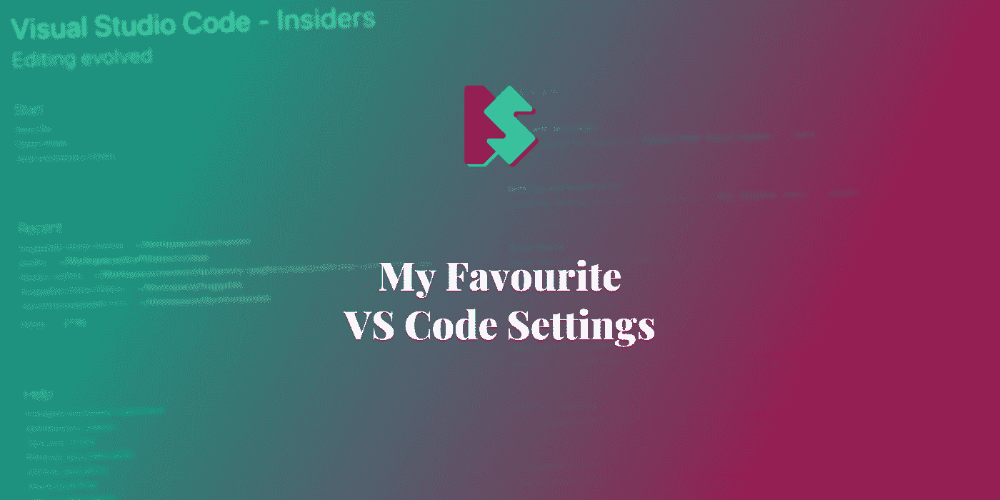
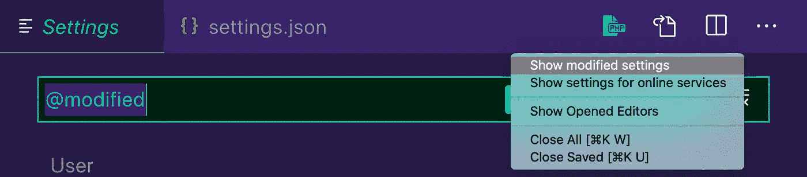
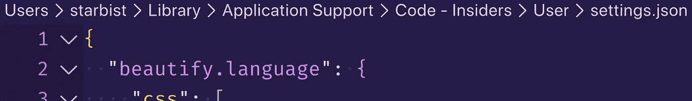
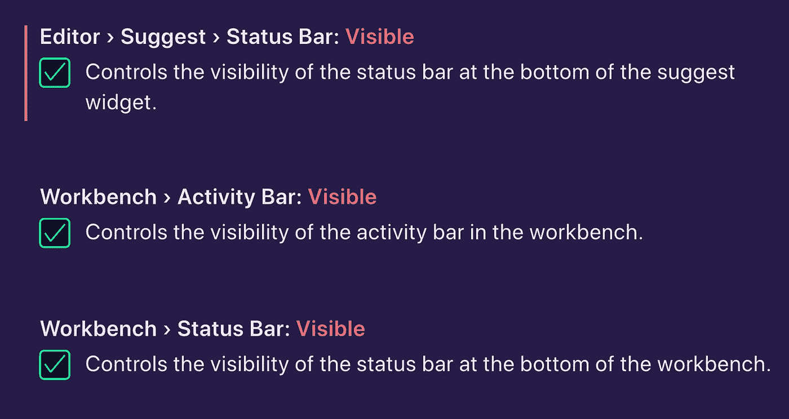
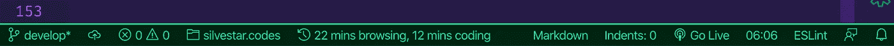
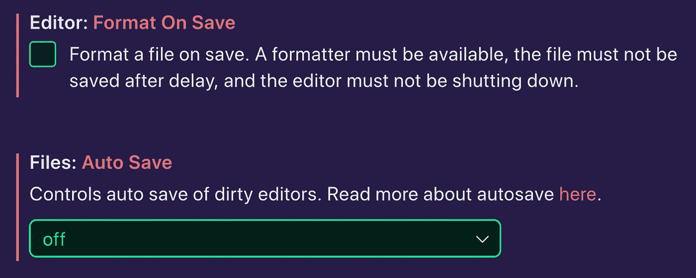
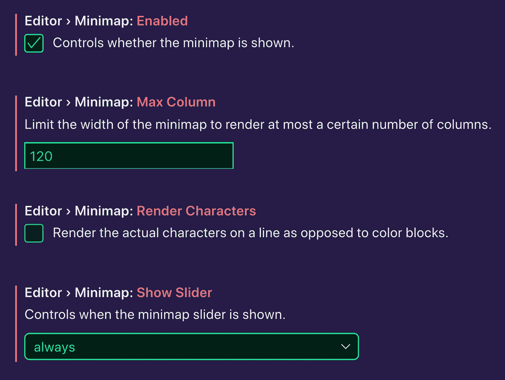

# 我最喜欢的 VS 代码设置

> 原文：<https://itnext.io/my-favorite-vs-code-settings-b38899a48896?source=collection_archive---------1----------------------->

## Visual Studio 代码

## 面包屑、工具条、保存和格式化、窗口管理和小地图



上周，我看到了马特·比尔纳发来的一条有趣的推文，内容是关于在 VS 代码中显示修改过的标签。虽然我已经知道这个超级有用的设置，但它让我重新审视了我的 VS 代码设置。

顺便说一下，该设置可以在 VS 代码设置中的“工作台>编辑器:突出显示修改的选项卡”中找到。如果你也想在当前的 VS 代码窗口中看到修改后的指示器，进入设置，搜索“窗口:标题”，添加`${dirty}`选项。这是它在我的设置中的样子:

```
${dirty} ${activeEditorMedium}${separator}${rootName}
```

# 修改的设置

我在 VS 代码中修改了 364 个设置。要查看这些修改的设置，请转到设置，并从下拉菜单中选择“显示修改的设置”或在输入字段中键入`@modified`。其中一些设置没有被修改成非默认值——它们只是出现在`settings.json`文件中。



修改 VS 代码设置

> *提示:点击“打开设置”图标可以看到这个文件。*

我不打算写所有这些设置。我将描述我最喜欢的设置:

*   面包屑，
*   酒吧，
*   保存和格式化，
*   窗口管理，以及
*   迷你地图。

## 面包屑

我喜欢打开面包屑。然而，我不喜欢杂乱的面包屑和不必要的信息。这就是为什么我关闭了所有花哨的设置，比如显示图标或文件内容(类、常量等)。)在我的面包屑里。它看起来是这样的:



VS 代码面包屑

## 酒吧

从一开始，我就非常喜欢 VS 代码接口。活动栏、状态栏和侧边栏是保存大量信息的便利功能。我喜欢在右侧显示活动栏和侧边栏。这样切换侧边栏不会影响我的主窗口位置，否则可能会导致分心。



VS 代码设置:状态栏和活动栏

我特别喜欢我的状态栏。在里面，我可以看到以下信息:

*   我目前从事的 Git 分支的名称，
*   Git 同步的状态，
*   来自 linters 的错误和警告的数量，
*   当前项目的名称([项目经理扩展](https://marketplace.visualstudio.com/items?itemName=alefragnani.project-manager))，
*   我花了多少时间工作，
*   光标的位置和所选文本的长度，
*   “空格与制表符”偏好设置，
*   文件使用哪种编码，
*   文件使用文件序列的哪个结尾，
*   当前行的缩进深度，以及
*   现在是什么时间。



VS 代码状态栏

请注意，并非所有信息在屏幕截图中都可见。

## 保存和格式化

我不喜欢让 VS 代码自动格式化我的代码。主要原因是我倾向于经常保存文件，因为我通常使用 [BrowserSync](https://www.browsersync.io/) 或 [Live Server extension](https://marketplace.visualstudio.com/items?itemName=ritwickdey.LiveServer) 来查看浏览器中的变化。

我关闭了以下设置:“编辑器:保存时格式化”和“文件:自动保存”。



VS 代码设置:保存和自动保存时的格式

我还关闭了所有与格式相关的设置:

*   "编辑器:粘贴时格式化"，
*   “编辑器:保存时的格式”，以及
*   “编辑器:类型上的格式”。

我通常使用[美化](https://marketplace.visualstudio.com/items?itemName=HookyQR.beautify)插件来格式化我的代码。以下是我对插件的设置:

```
{
  "beautify.language": {
    "css": [
      "css",
      "scss"
    ],
    "html": [
      "htm",
      "html",
      "njk",
      "pug",
      "liquid",
      "php",
      "erb"
    ],
    "js": {
      "filename": [
        ".jshintrc",
        ".jsbeautify"
      ],
      "type": [
        "javascript",
        "json"
      ]
    }
  }
}
```

> *提示:为防止退出时丢失未保存的更改，将“文件:热退出”设置为* `*onExitAndWindowClose*` *。*

## 窗口管理

VS 代码允许你配置窗口行为。我更喜欢下面的 VS 代码窗口设置:

```
{
  "window.closeWhenEmpty": false,
  "window.newWindowDimensions": "inherit",
  "window.openFilesInNewWindow": "off",
  "window.openFoldersInNewWindow": "on",
  "window.restoreFullscreen": false,
  "window.restoreWindows": "all",
  "window.title": "${dirty} ${activeEditorMedium}${separator}${rootName}",
  "window.titleBarStyle": "custom",
}
```

除了已经提到的窗口标题设置，我喜欢在当前窗口打开文件，在新窗口打开文件夹，继承新窗口的窗口大小，并在重启后恢复所有窗口。我也喜欢在关闭最后一个标签页后保持当前窗口打开，并在“窗口”模式下打开最近关闭的窗口，而不是全屏模式。

# 迷你地图

自从我第一次在 Sublime Text 中看到这个功能，我就一直在使用 minimap。我发现它非常有用，尤其是对于较长的文件。它让我更容易找到和导航代码的某些部分。



VS 代码小地图

# 结论

VS 代码里有那么多有意义的设置。你可能会被众多的选择淹没，但是每个选择都有很好的解释，这很有帮助。此外，大多数默认值足以让您轻松地开始使用编辑器。但是，当您觉得编辑器应该有不同的行为时，请尝试搜索该选项并根据您的偏好进行设置。不要忘记与社区共享您的设置。

现在，你最喜欢的 VS 代码设置是什么？

*最初发布于*[*https://www . silvestar . codes*](https://www.silvestar.codes/articles/my-favorite-vs-code-settings/)*。*