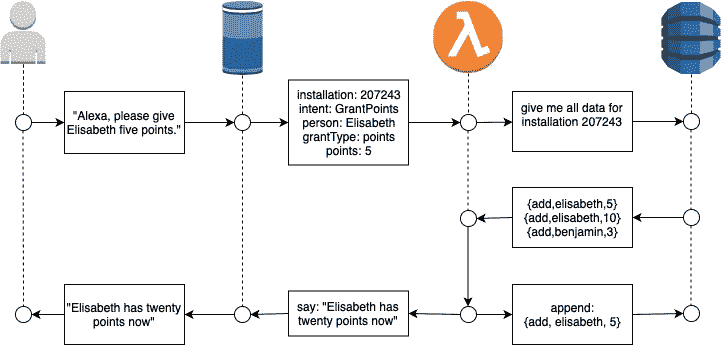

# 我的第一个 Alexa 技能——经验教训

> 原文：<https://itnext.io/my-first-alexa-skill-lessons-learnt-9df5ffe8872c?source=collection_archive---------4----------------------->

> “爸爸！我可以看 iPad 吗？" "不行"
> "妈妈！“我可以看 iPad 吗？”——“不”
> “如果我不在周日早上 6:30 叫醒你呢？”——“好吧！30 分钟！”

为人父母并不容易，有时还需要艰难的讨价还价。就我而言，这通常与我允许孩子看 iPad 的时间长短有关。最近我介绍了一个程序，如果他们做了一些不寻常的事情(例如让我们在周末睡觉)，他们就可以收集积分，然后可以用收到的积分换取 iPad 时间。你可能会对我的方法嗤之以鼻(我妻子肯定会)，但它出奇地有效，孩子们也喜欢。

我过去常常在一张纸上追踪这些点，从而让家里的每个人都非常容易看到和接触到。

然而，作为工程师，我发现这太没技术含量了，所以我很高兴地用 Alexa 技能的复杂和古怪来交换笔和纸的简单。

我的目标是 1)理解技能开发的陷阱，2)构建无服务器应用程序，3)理解随之而来的 DevOps 复杂性。

在这篇文章中，我将分享我开发第一个[开源](https://bitbucket.org/derhackler/pointy/src/master/) Alexa 技能的一些亮点和经验教训。

# 要求

这项技能的基本要求很简单:

*   *作为父母，我想给我的孩子加分，以表达我对他们非凡成就的感激之情。*
*   作为一个孩子，我想检查一下我的积分余额，以确定我可以看多长时间的 iPad。
*   *作为一个孩子，我想用 iPad 时间来交换积分，以便在一周内观看 Paw Patrol。*

## 经验教训:我有一个“重置”需求

在测试期间，我发现我需要模拟一个新用户并快速丢弃所有数据。起初我添加了一个单独的 lambda 函数用于清理，但使用起来不切实际。因此，我添加了一个*重置*意图，它只是丢弃所有数据，可以像任何其他语音命令一样使用。

# 模型:意图、位置和话语

对于 Alexa 技能发展，你需要理解三个基本概念:

*   **意图:**用户希望从你的技能中得到的东西。例如*奖励积分*。
*   **槽点:**你期望什么参数。例如*点数，人*
*   **话语:**用户如何表达意图的例子。例如“G*rant { number of points } points to { Person }”*

当用户与 Alexa 交谈时，她会找出意图，并用具体的值填充插槽。我还使用选项让用户确认一些意图(例如重置意图)，如果一开始没有提供，让 Alexa 询问槽值。那就是所谓的 [*对话模式*](https://developer.amazon.com/docs/custom-skills/dialog-interface-reference.html) 。

尽管开发一项技能完全“像代码一样”是可能的，但我发现 [Alexa 开发控制台](https://developer.amazon.com/alexa)非常有效。它提供了一个很好的 UI 来快速开发技能模型并测试意图和表达。

## 经验教训:我需要疯狂地表达

当我设计和测试技能时，我使用了这样的例子:

> “阿利克夏，给伊丽莎白五分”。

然而，当我让我的孩子做测试时，他们让我和 Alexa 很紧张:

> “Alexa，我是伊丽莎白，爸爸说我可以得到 10 分，但不是我的哥哥，他今天早上叫醒了妈妈，我想看着 Paw 用这些分巡逻，但没有他，他只剩下 5 分。”

Alexa 要理解我的孩子还有很长的路要走。但是通过添加更多的例子(话语),我能够训练我的孩子取得更高的成功率。

# 体系结构

在技能模型中，您指定 Alexa 为每个语音命令调用的端点。可以调用任意的 HTTPS 端点，但是我选择在 Lambda 函数中处理命令。

当用户与 Alexa 交谈时，她将决定哪种技能应该处理请求(这就是为什么您需要设置调用名称)，尝试检测意图，填充插槽，并调用您的端点。尽管处理原始 json 输入和输出并不复杂，但我使用了 [Python Ask SDK](https://github.com/alexa/alexa-skills-kit-sdk-for-python) 来加速开发。作为数据存储，我使用 DynamoDB。考虑到我不希望每次安装都有大量的数据，我将一次安装的所有数据存储在一条记录中。



GrantPoints 意图的说明

注意:Alexa 设备不直接与 lambda 函数对话。中间有一个巨大的 AWS 云。

## 经验教训:简单就够了

我研究了数据持久层的几个选项:RDS 数据库中的规范化模式、DynamoDB 上的细粒度文档或具有 KV 持久性设计的 Redis。

到目前为止，第一个也是最简单的解决方案工作得非常好:有一个 DynamoDB 表，其中每个文档代表一项技能的安装。就像在[事件源](https://microservices.io/patterns/data/event-sourcing.html)中一样，将所有确认的用户操作添加到事件日志中。在代码中完成所有必需的聚合。这在 DynamoDB 中也得到很好的支持，代码如下:

将数据追加到 DynomoDB 记录

# DevOps

在撰写本文时，我的 DevOps 设置非常简单:我使用[无服务器框架](https://serverless.com)来管理 AWS 云形成堆栈。通过执行`serverless deploy`命令手动完成部署。源代码管理是在 Bitbucket 中完成的。还没有完全自动化的 CI/CD 管道。

## 经验教训:无服务器框架非常棒

幸运的是，我一开始就知道手动管理云形成堆栈可能是一种繁琐的体验。利用无服务器框架使我能够专注于业务逻辑，而不必太关心部署和打包。

## 经验教训:Lambda 图层非常棒

如前所述，我正在使用 python ask-sdk。这是一个常规的 python 依赖项，您可以将其添加到 requirements.txt 文件中，并使用 pip 进行安装。

我发现在我的 lambda 函数中正确打包 python 依赖项非常棘手。如果使用[无服务器 python-requirements](https://serverless.com/blog/serverless-python-packaging/) 插件，事情会变得更简单。它使用 Docker，这很好，但是在我非常慢的机器上，这大大增加了打包时间。

第二个主要问题是添加 ask-sdk 将部署包的大小增加了大约 12 MB。这反过来导致了更长的部署时间。

我的解决方案非常有效:我将[依赖项放在 lambda 层](https://bitbucket.org/derhackler/pointy/src/17b118e6e6509159d110d7ebd26c453992f96d38/serverless.yml#lines-51)中，而[在我的函数](https://bitbucket.org/derhackler/pointy/src/17b118e6e6509159d110d7ebd26c453992f96d38/serverless.yml#lines-40)中使用该层。这是一个棘手的设置，但我得到了它的工作感谢 Qui Tang 的[文章。](https://medium.com/@qtangs/creating-new-aws-lambda-layer-for-python-pandas-library-348b126e9f3e)

# 测试

在开发期间，我在 Alexa 开发控制台上做了大部分测试。这非常方便，因为你可以输入你想说的话，它会显示你的函数的 json 输入和输出。

对于真实世界的测试，我邀请我的孩子在我的 Alexa 上玩这个技能。多么痛苦的经历…

对于一些函数，我有简单的单元测试(T2 ),我可以很容易地从 VS 代码中执行这些测试，而不需要构建本地虚拟 AWS 堆栈。

对于自动化集成测试，我探索了使用 BDD 和[行为框架](https://behave.readthedocs.io)。它允许我编写这样的测试:

```
*Scenario*: Points are added to existing points
    *Given* I am a new user
    *When* I say "open pointy and grant elisabeth five points"
    *And* I get asked for confirmation
    *And* I say "yes"
    *And* I say "open pointy and give five points to elisabeth"
    *Then* I hear "Elisabeth has 10 points"
```

快速搜索没有得到任何好的结果，所以我写了一个围绕技能测试 REST API 的[小包装器](https://bitbucket.org/derhackler/pointy/src/master/features/helper/alexa_simulator.py)，这样[特性](https://bitbucket.org/derhackler/pointy/src/master/features/grant_points.feature)的实际[步骤函数](https://bitbucket.org/derhackler/pointy/src/master/features/steps/alexa_steps.py)非常简单。

## 经验教训:BDD 对技能发展非常有用

利用 BDD 进行技能的自动化集成测试非常有效，并且可以产生易于维护和非常有表现力的测试。为了在业务所有者和开发团队之间共享期望，它在需求获取期间会更加强大。

## 经验:Alexa 听力很好

在真实世界的测试中，一个我根本没有注意到的问题很快出现了:

我的大多数意图都希望输入一个人的名字。Amazon 提供了预定义的 slot 类型`AMAZON.FirstName`,可以检测一长串名字。它在通过开发控制台中的文本输入进行测试时效果很好。然而在现实世界中，Alexa 认为她可以听到“伊丽莎白”，“伊丽莎白”，“伊丽莎白”等之间的细微差别。并相应地设置槽值。为了减轻这种影响，我使用了[科隆语音](https://github.com/provinzkraut/cologne_phonetics)算法来检测两个单词在德语中的发音是否相同。所以如果你有听起来几乎一样的孩子，你可能不会对我的技能感到高兴…

# 证书

一项技能要公开，必须经过大约两天的认证过程。当你坚持使用[技能认证指南](https://developer.amazon.com/docs/custom-skills/certification-requirements-for-custom-skills.html)时，相对来说是没有痛苦的。不同的评论者会给出不同的反馈，所以试着第一次就通过。

我真正纠结的是内置的 *LaunchRequest* 命令。根据指南，它应该返回一个快速的欢迎信息和一些你可以做什么的提示。实现如下所示:

带重新提示的启动请求

在`speech_text`之后，Alexa 等待几秒钟，然后用`ask_text`重新提示。这很好，但是你应该能够说“停止”、“取消”等等。取消互动。有一个内置的`AMAZON.StopIntent`和一个`AMAZON.CancelIntent`应该就是这样做的。然而，无论我怎么努力，我都不能让它工作。

## 经验教训:创建自定义“取消”意图

为了缓解这个问题，我必须实现一个自定义的*取消*意图。它超级简单，只包含“停止”、“取消”、“请停止”、“停止”等语句。我花了五分钟来实现，五个小时来解决…

# 摘要

总的来说，开发 Alexa 技能是一次很好的学习经历。我的三大收获:

*   技能发展有一些陷阱，但总的来说，这是非常简单明了的。
*   无服务器非常适合技能发展，并允许您专注于业务逻辑。无服务器框架消除了许多部署问题，不会妨碍您的工作。使用 *Lambda 层*确实可以加快部署过程。
*   在自动化技能测试中，工具有很大的空间。