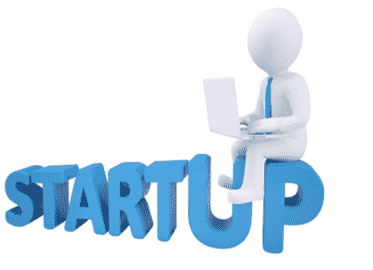
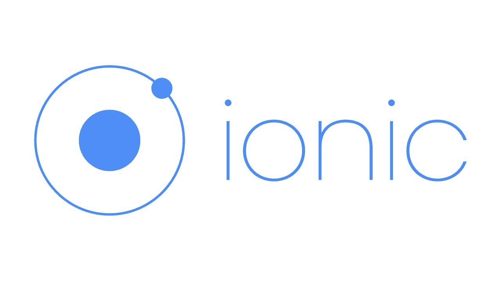
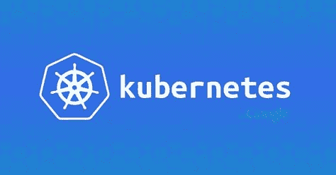

# 我的第一个应用:上市时间

> 原文：<https://itnext.io/my-first-app-time-to-market-90a443ec03fc?source=collection_archive---------3----------------------->

# 介绍

让我们假设你是一名开发人员，你想出了一个好主意。我从哪里开始？我应该使用哪种语言？哪个框架？哪个站台？

主要目标不是构建完美的产品，而是在学习新技术的同时，尽可能快地获得一个可用的产品。

我经常看到的一个问题是，开发人员使用他们已经知道的语言和工具从头开始构建他们的新应用程序。这有两个问题:

*   你会增加**不必要的复杂性**。您当前的工作工具集可能是针对大型应用程序，而不是概念验证。从小处着手，构建简单的东西。
*   **大多数创业公司都失败**，这是事实。很有可能你的想法也会失败，但没关系，最重要的是你从经验中学习。这就是为什么我强烈建议你在日常工作之外尝试新技术来获得经验。至少这样，你会获得非常有价值的知识。

主要的一点是没有单一的答案，你需要选择适合你的技术，我可以写 10 页关于所有可能的选择，但是我会根据我自己的个人经验提供一些建议和技巧。

## 时间表

简而言之，应用程序的生命周期如下:

*   概念验证( **POC** ):这是给你的，用来测试你的想法。分享给朋友，提炼，获得反馈。您也可以将它用于演示。
*   最小可行产品( **MVP** ):这将是你的应用程序的第一个版本，它将是安全的和适当的测试，它将具有最小的功能集。
*   产品的第一个版本。
*   最终产品。

强烈建议您**在跨越不同阶段时重写代码，因为每个阶段都有不同的需求，**扔掉代码是可以的，重要的是您学到了什么。你的目标是尽快开始演示，所以不要花太多时间来设计产品。

# 概念证明(**概念验证**)

此时你只有一个想法，你需要证明它是可行的。目标是**快速失败**，**专注于核心功能**，忽略非功能方面，如日志记录或安全性，记住这不会向公众发布。

要问的第一个问题是，你是否准备好在这个阶段开始支付**钱**。后端即服务( [**BaaS**](https://www.techopedia.com/definition/29428/backend-as-a-service-baas) )是开始构建你的应用的一个很好的方式，但它们确实需要一些钱，所以你需要意识到这一点。但不要担心，这是非常便宜的，特别是因为你不会有太多的交通在这一点上。

关于编程语言，我推荐 **JavaScript** ，因为它易于使用并且有很多框架。

对于演示，我推荐一个混合框架，这样你就可以在 Android、IOs 和 Web 上使用相同的代码库。

我强烈推荐 [**Ionic 框架**](https://ionicframework.com) 来搭建你的 app 前端。它使用简单，文档也很棒，你可以在 **React** 和 **Angular** 之间选择一个作为框架。如果你没有任何经验，我推荐 Angular，因为它可能更容易一些。

对于 BaaS 你有两个流行的选择:[**Google Firebase**](https://firebase.google.com/products/)和 [**AWS Amplify**](https://aws.amazon.com/amplify/) 。两者都是很棒的产品，Amplify 更完整，但更难使用，如果你开始使用其他 AWS 服务，可能会更贵。这是一个很棒的 [**视频**](https://www.youtube.com/watch?v=ucmbO2lWC2A) 解释差异。如果你不确定，从 Firebase 开始。

另一个非常容易使用并且将后端和前端合并成一个统一框架的框架是 [**流星框架**](https://www.meteor.com/#!) 。它非常适合 POCs，您可以使用 [**Heroku**](https://www.heroku.com/) 自由层来部署它。它还支持移动应用程序。所以**如果你不想在 POC/MVP 阶段花一分钱，就使用 Meteor**。

# 最小可行产品( **MVP** )

此时，您希望有一些真正的用户尝试您的应用程序。你需要花更多的时间来测试和保护你的应用。在这个阶段，您应该考虑迁移到云。增加**认证、授权和监控。**

JavaScript 仍然非常适合这个阶段，但是你可能想开始看看其他语言，比如 [**Go**](https://en.wikipedia.org/wiki/Go_(programming_language)) 。

关于后端，您可能需要考虑实施自己的服务，因为 BaaS 可能不足以满足最终产品的需求。

# 产品的第一个版本

对于第一个版本，你需要**转移到云**和**分割前端和后端**，这样你的应用就可以随着用户群的增长而扩展。我不会深入讨论使用哪一个提供者，但是如果你不确定，就用 **AWS** 吧，因为它是最流行的选择。

此时，您需要考虑如何实现后端服务。一个简单的解决方案是为你的后端使用 [**无服务器**](https://en.wikipedia.org/wiki/Serverless_computing) 功能。它可以扩展到支持数百万用户，并且非常易于使用。你可能还想使用 [**Node.js**](https://nodejs.org/) 作为后端，因为它也使用 JavaScript。

# 最终产品

现在，您有了一个具有 Javascript 前端和无服务器后端的工作产品。该解决方案可以扩展，让您很快达到目标。

关于前端，你应该问自己的第一件事是，如果你需要原生移动应用，如果你有一个复杂的用户界面和大量的移动用户，你可能想从一个混合框架如 Ionic 迁移到一个原生框架。

关于后端，您将开始注意到，随着用户群的增长，云账单会越来越大，因此您的主要目标是**开始考虑削减成本**同时保持相同的可靠和安全应用。一个选择是搬到 T21，这可能更具成本效益，但也更复杂。我会在近期写一篇文章比较 server less vs .[**Kubernetes**](https://kubernetes.io/)用于后端。

# 结论

这是一个快速和过于简化的介绍，以建立你的第一个应用程序。开创自己的事业非常具有挑战性，需要很多领域的知识。我只谈到了在你开自己的公司时需要考虑的一些技术问题。**到**到**总结**:

*   不要使用你已经知道的工具，把它作为学习的经验。
*   JavaScript 是启动你的第一个应用程序的绝佳语言。
*   像 Ionic 这样的混合框架允许你用相同的代码库来构建一个网站和移动应用。
*   **BaaS 是一个很好的开始，但是最终你会需要更复杂的服务，所以你需要实现你自己的后端。**
*   **AWS Lambda 这样的无服务器功能对你的后端来说是一个很好的选择。它使用简单，并且可以扩展。**

我希望你喜欢这篇文章。欢迎发表评论或分享这篇文章。跟随[***me***](https://twitter.com/JavierRamosRod7)*进行未来岗位。*