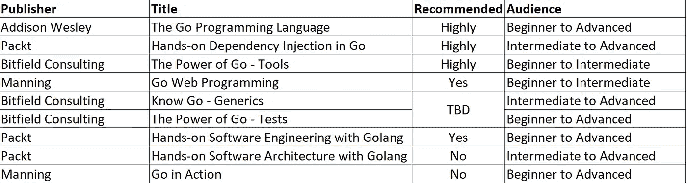

# 我的 Golang 书架——令人惊叹的好书，不推荐！

> 原文：<https://itnext.io/my-golang-bookshelf-the-amazing-good-and-not-recommended-8fb362c8cb37?source=collection_archive---------1----------------------->

最近在讨论依赖注入的时候，我在 Twitter 上分享书籍推荐。这个帖子有点半开玩笑的味道，但它触发了我，因为我最近读了一本关于这个主题的极好的书。

TLDR:依赖注入不仅仅是“传递参数”。

把 Twitter 放在一边，我看了看我的书架，意识到我的 Golang 收藏正在变得令人印象深刻，我应该分享我的想法。这是一个温和的概述，而不是每本书的深入审查。如果你对学习 Golang 感兴趣，这样做的目的是让你走上正确的方向，并避免选择可能不值得的书籍。

我对我的书架和推荐做了一个快速的总结，然后按照偏好的顺序进入每本书。我分享每本书的链接(所有直接链接)

# 摘要

摘要

# Addison Wesley——Go 编程语言

如果你来自其他语言，这是你书架上必须有的书。这本书关注语言本身和它的组成部分。350 页，包了一拳，密密麻麻。这本书可以概括为:

*   语言构造(数据类型、组合、函数、方法、结构、接口)
*   并发性(goroutine、通道、互斥、竞争检测)
*   包装
*   测试
*   杂项功能(反射/低级编程)。

这是你将作为参考的那本书。参考书不一定要 700 页那么长！

[https://www . Amazon . ca/Go-Programming-Language-Alan-Donovan/DP/0134190440](https://www.amazon.ca/Go-Programming-Language-Alan-Donovan/dp/0134190440)

# packt——Go 中的动手依赖注入

我并非来自开发背景，在学习 Go 的过程中，我一直专注于改进我的编码风格，并尝试做尽可能多的测试。这让我找到了这本书。我最初并不情愿，因为我对 Packt 书籍的体验并不积极。这本书绝对改变了我的视角(或者至少是一个惊喜/例外)。

这本书涵盖了 DI 的介绍和坚实的原则。在深入研究使用 DI 和各种方法来提高代码质量和可测试性之前，这是本书的基础。

这本书使用一个可关联的系统作为基础来展示各种技术，并随着你的进步建立在过去的技术上。方法包括猴子修补、构造函数注入、方法注入、JIT 注入、配置注入等等。

这是我将回头参考的另一本书。我可能应该在将来再读一遍，以使其更加清晰，并应用更多的概念。

[https://www . Amazon . ca/Hands-dependence-Injection-Corey-Scott/DP/1789132762](https://www.amazon.ca/Hands-Dependency-Injection-Corey-Scott/dp/1789132762)

# 比特菲尔德咨询——Go 工具的力量

作者 Jon Arundel 有一系列关于 Golang 的书。他是自己出版的，他的书是非凡的。他的书只有数字格式(让我难过)。我跳过了对他的迷你书的评论，专注于他的内容丰富的书。

Go Tools 的强大之处在于它接受了一个常见的挑战，即开发 CLI 应用程序，并以此为基础来演示许多概念。我发现这种方法非常有用，感觉就像在旅行。这本书超越了 CLI 工具的创建，并介绍了相邻的概念。

这本书涵盖了库的创建，用结构和固执己见的构造函数标准化对象，然后涵盖了通过选项接受来自最终用户的输入(以及如何测试它！)，扩展到标志和参数的使用，如何与文件和文件系统抽象交互，等等。

我已经能够在自己的项目中使用一些概念。我分叉了 [ttlcache](https://github.com/jellydator/ttlcache/compare/master...patpicos:ttlcache:feat/disable_overwrite_on_set) 并添加了一个新的选项标志来防止覆盖缓存项。如果我没有读过这本书的内容，我不会明白这是怎么做到的！

这种方法中有趣的是测试的不断使用以及如何开发可测试的软件。约翰提供了一个挑战，通过在每一章中扩展正在开发的程序来测试你的技能。

https://bitfieldconsulting.com/books/tools

# 比特菲尔德咨询公司——围棋测试的力量

我是一个预购客户，这本书今天才出版。这是我的待办事项，我肯定会成为一个守护者。我真的对这一个感到兴奋。

【https://bitfieldconsulting.com/books/tests 

# 比特菲尔德咨询公司—了解 Go 仿制药

这也是我要读的待办事项。泛型是这种语言最近加入的一个备受期待的特性。
我在使用 ttlcache 项目时使用过一点泛型，它相当强大(虽然读代码有点奇怪)。

我将需要提供一个更新，当我读了它…有很少的内容，到目前为止…所以这可能是最全面的内容。

[https://bitfieldconsulting.com/books/generics](https://bitfieldconsulting.com/books/generics)

# 曼宁—去网络编程

Golang 作为一种创建 API 和用于 web 目的的语言非常常见。我拿起这本书，因为我想与 API(作为一个消费者)进行交互，并使用本地 MySQL 数据库。这本书很好地介绍了为 web 构建时会遇到的大多数主题:HTTP 介绍、示例请求/响应、处理程序、响应、cookies 和会话管理、显示内容、与后端交互(数据库、缓存、文件、ORM 和 web 服务)。我最喜欢的部分是与 API 交互，并使用 struct 标签将结果解析为结构(来自其他语言，我认为这非常酷和强大)。

这本书关注于使用核心库，如. net。你不会看到所有最新的框架比如 Gorilla，gin。至少，这些概念为您评估框架的使用提供了一个良好的基础。

我喜欢这本书，因为它为我提供了我一直在寻找的动力，而不是在网上搜索。

[https://www.manning.com/books/go-web-programming](https://www.manning.com/books/go-web-programming)

# packt——Golang 软件工程实践

注意:我还在读这本书，我的观点可能会改变。

到目前为止，这本书是 Packt 的中间道路。它写得很好，内容流畅。这本书花费了大量的精力来介绍 golang 工具(即在开发生命周期中帮助你的工具),这是一个被忽略的领域。

本书涵盖了一个示例应用程序，它将在多个章节中从头到尾介绍解决方案的设计过程。这是一个有用的方法，也展示了一个比 hello world 复杂得多的应用程序。应用程序随着章节的发展而扩展。

到目前为止，我推荐它，我期待着

*   第 10 章—打包/部署应用程序
*   第 11 章—将应用分解为微服务
*   第 13 章——为在 kubernetes 环境中运行的代码提供工具

[https://www . Amazon . ca/Hands-Software-Engineering-Golang-programming/DP/1838554491](https://www.amazon.ca/Hands-Software-Engineering-Golang-programming/dp/1838554491)

# packt——Golang 软件架构实践

这本书属于我对包装书籍的“勉强”。它需要一个字典的方法来涵盖一切，同时又不包含任何东西。它涵盖了太多没有深度的主题。

它在戈朗前线也有所欠缺。这感觉更像是一本带有少量围棋的软件架构书。这本书也充满了令人震惊的错误和错别字；没有剪辑。**不推荐**

[https://www . Amazon . ca/Hands-Software-Architecture-Golang-applications/DP/1788622596](https://www.amazon.ca/Hands-Software-Architecture-Golang-applications/dp/1788622596)

# 曼宁—行动起来

这是我入门时买的第一本围棋书。我买它是因为我过去和曼宁的经历(他们的书棒极了)。

这本书从一个应用实例开始，而不是从基础开始。我发现自己阅读了一个 2 页的代码片段，然后分解成 10-15 页(并重复多次)。

总的来说，我讨厌这本书的流程。要学习语言基础，参考*Go 编程语言！*

我想我提到的书中有一些部分是成功的(goroutines/channels)。但总的来说，与其他曼宁书籍相比，我感到失望。**不推荐。**

【https://www.manning.com/books/go-in-action 