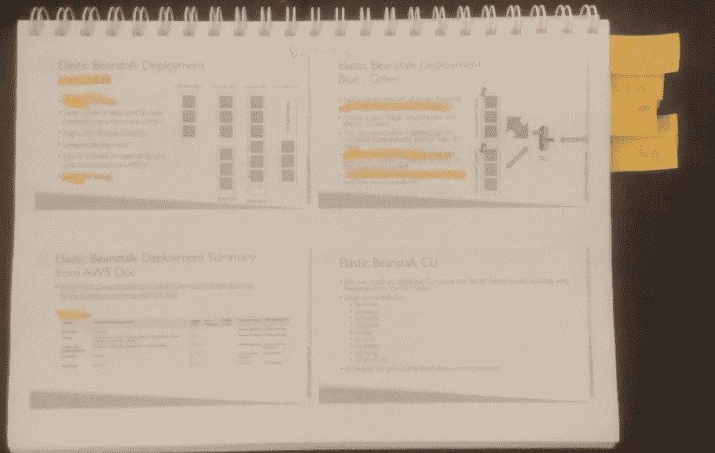
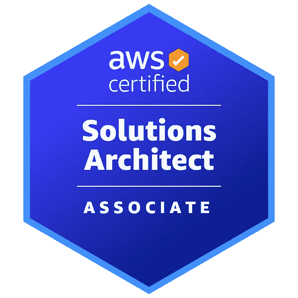

# 我获得 AWS 解决方案架构师认证的黄金之路

> 原文：<https://itnext.io/my-golden-path-to-aws-solution-architect-certification-6d56a8b3f448?source=collection_archive---------1----------------------->

# 序言

作为 DevOps & Cloud 架构师和经理，我需要了解
开发人员的目标以及他们对获得
目标的方式的理解。相应地，跟随他们的思考过程，不断地
向他们介绍满足他们
需求的创新解决方案。

通过我与 AWS 平台的互动，我探索了
独特而有效的一套服务，以扩展开发者的
选择。
为了了解我的内部客户的潜在解决方案
我不断被要求掌握这个不断变化的前沿，我
决定再次测试自己(我的第二次)作为校准机制。
不用说，我发现这是一个非常好的技能衡量标准。

# 内容大纲

在深入本文之前，请回顾一下**解决方案架构师-
助理**认证考试蓝图。

考试蓝图

# 我的实用“黄金路径”

所以复习完考试的蓝图，你大概有点惶恐，无所适从，不知道从何下手。别担心，我会把我成功通过考试的黄金路径呈现给你！

我的“黄金之路”由以下步骤组成:

*   **全面了解考试的材料** — ***课程***
*   **持续记忆**
*   **关注当前枢机考试的题目**
*   **模拟考试**
*   **考试小技巧**

# 课程——主干

自学考试题目可能会很难。细微差别、产品和细节的数量太多，你自己无法处理，因此，一门为你总结一切的课程是必不可少的。

在网上寻找最好的课程时，我遇到了这两个很棒的课程，并最终都买了下来。

**最高性价比**

由 **Stéphane Maarek** 教授的这一杰出课程是目前市场上针对这一特定认证的最物有所值的**课程。Stéphane** 是一位非常有条理、条理清晰的讲师，他的课程讲解和演示都非常到位。尽管如此，还是要做好在这门课程上投入大量时间的准备。
新版课程时长约 27 小时，是目前为止这一环节最长的课程。该课程费用约为 14 美元，物有所值！

 [## 课程数据积云

### 我是一名解决方案架构师、顾问和软件开发人员，对所有与…相关的事物都有着特殊的兴趣

courses.datacumulus.com](https://courses.datacumulus.com/) 

**面向综合和现实生活场景**

阿德里安·坎特里尔的这个令人惊叹的球场是目前为止最好的球场。
**阿德里安**是一位非常有条理且经验丰富的讲师，他的课程讲解和演示都非常到位。
Adrian 的**课程的真正优势在于面向现实生活场景的讲解，包括很棒的平台、知识库和图表
课程费用约为 40 美元，而且物有所值！**

 [## AWS 认证解决方案架构师助理(SAA-C02)

### 我有多长时间可以学习这门课程？终身访问听起来怎么样？注册后，您可以无限制地访问…

learn.cantrill.io](https://learn.cantrill.io/p/aws-certified-solutions-architect-associate-saa-c02) 

# 记住

你需要不断地记忆你在课程中学到的东西，直到细节的**水平**！
该考试旨在考察您是否了解云产品的技术细节，仅有概念上的理解是不够的。

为了掌握云产品，您需要记忆大量材料。

有三种有效记忆材料的流行方法:

1.  **选择一份“备忘单”并遵照执行:**

小抄是一个不断复习你所学一切的好方法。我认为这两个是最好的:

*   **数字云**

 [## AWS 解决方案架构师助理|备忘单

### 这份全面的 AWS 解决方案架构师助理备忘单将帮助您通过 AWS 认证考试

数字云.培训](https://digitalcloud.training/category/aws-cheat-sheets/aws-solutions-architect-associate/) 

*   **教程道场**

 [## 亚马逊网络服务 AWS 备忘单

### AWS 备忘单我们的 AWS 备忘单旨在让您鸟瞰重要的 AWS 服务，您…

tutorialsdojo.com](https://tutorialsdojo.com/aws-cheat-sheets/) 

**2。抽认卡**

用你想记住的关键元素制作你自己的抽认卡，或者用别人的抽认卡来代替。

 [## AWS 解决方案架构师

### 这个课程是由 Brainscape 用户劳伦·神童创建的。访问他们的个人资料，了解更多关于创作者。甲板…

www.brainscape.com](https://www.brainscape.com/packs/aws-solutions-architect-19942759?origin=genome) 

**3。自己写笔记**

到目前为止，准备测试的最佳方法有两种选择:

*   **数字笔记** - Udemy 允许你在课程的视频讲座上写笔记，并在清晰的界面中稍后回顾，如果你喜欢它，这很好。
*   **硬拷贝笔记**——打印课程的 PDF 文件，并在幻灯片顶部写下你认为重要的每一个说明，以及教师告诉你要考虑的每一个考试提示。我发现这是最有效的方法，因为它能让我时刻集中注意力，帮助我复习和不断记忆每堂课的细节。

我的笔记本

# 关注当前枢机考试的主题

这是很多人容易忽略的最重要的部分之一，非常不幸。

当你完成课程后，请查看这个 Reddit 帖子

> [*https://www.reddit.com/r/AWSCertifications*](https://www.reddit.com/r/AWSCertifications/)

*它提供了许多考试信息、策略和方法。*

*为了通过测试，您应该**完全理解**以下服务:*

*   ***Ec2***
*   ***ASG &负载平衡***
*   ***S3***
*   ***数据库***

*除了这些主题之外，所有其他被测试的服务也在不断变化。
因此，当你调查上面提到的 Reddit 线程时。*

# *模拟考试*

*报名**教程道场**实践考试。那里提供的模拟考试比真正的考试稍微难一点，但是它们会让你对真正的考试有一个很好的了解。模拟考试花费 15 美元。*

* [## AWS 认证解决方案架构师助理实践考试 2022 -教程 Dojo

### 这些 AWS 认证解决方案架构师助理(SAA-C02)模拟测试是根据最新的考试格式设计的…

portal.tutorialsdojo.com](https://portal.tutorialsdojo.com/courses/aws-certified-solutions-architect-associate-practice-exams/) 

# 考试小贴士

*   **除非你对自己的知识有把握，否则不要报名参加考试-** 每次考试费用为 150 美元，你需要等待两周才能有机会重考。
    安全总比后悔好。
*   **考点**——如果可能的话，在考点参加考试。它有各种各样的优点，但最重要的一点是(与家庭考试形式相比)你可以方便。
    这可能看起来很有趣，但是请相信我，当时间倒流的时候，你不会想要满满地分析无服务器应用场景:)
*   不要逗留——如果你阅读一个问题超过一分钟，就把它标记出来，继续前进，这很容易被一个有趣而复杂的场景问题吸引，但在你知道之前，你的时间就会被耗尽。
*   如果你的母语不是英语，你有资格获得 30 分钟的时间延长。
    更多详情请点击[此链接](https://www.linkedin.com/pulse/30-minute-extension-your-aws-certification-exam-garcia-lozano/)。

# 尾声

我确信，如果你坚持执行**【黄金路线】**的游戏计划，你会做得很好！

我希望它对你有所帮助，如果有任何问题，请随时联系我。

祝你好运！

或者妈妈

[www.linkedin.com/in/ormaman](http://www.linkedin.com/in/ormaman)Or.maman@nice.com* **