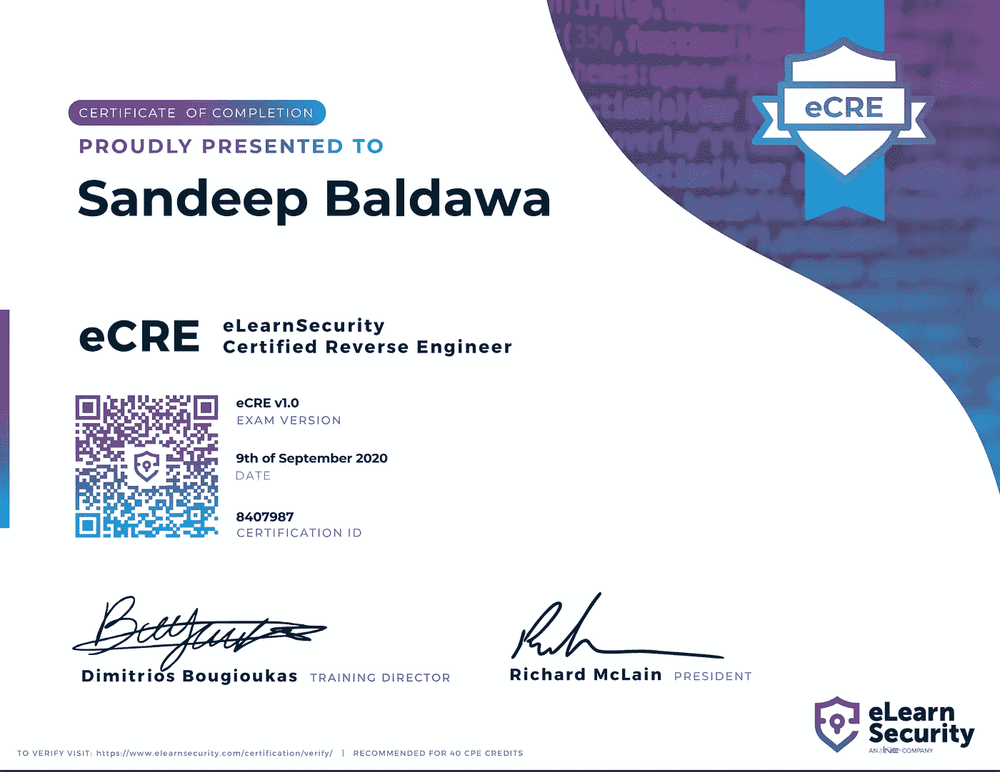

# 我的 eCRE 之旅(电子安全认证逆向工程师)

> 原文：<https://itnext.io/my-journey-to-ecre-elearnsecurity-certified-reverse-engineer-2d9ba626dc2b?source=collection_archive---------2----------------------->

**背景**

在通过 [**eCXD**](https://medium.com/@sandeepbaldawa/xds-v1-elearnsecurity-course-review-cda5bb12f95b) 考试后，我正在寻找一门课程，通过**逆向工程**应用程序来帮助测试应用程序。如果软件的源代码不可用，通常会执行二进制逆向工程。这个过程有时被称为逆向代码工程(来源[维基百科](https://en.wikipedia.org/wiki/Reverse_engineering#:~:text=satisfaction%20of%20curiosity.-,Binary%20software,can%20be%20accomplished%20using%20Jad.))。在分析[恶意软件](https://en.wikipedia.org/wiki/Malware)这样的用例中，理解二进制文件变得很重要，以便理解在幕后发生了什么。

最后敲定了 [**地图**](https://www.elearnsecurity.com/course/malware_analysis_professional/) **(恶意软件分析专业)**来自 **elearnSecurity** 的课程(主要是因为 elearnSecurity 的课程质量)。他们时不时会有课程打折，我最后拿到了课程的 35 折。地图课程的一部分是 [**REP**](https://www.elearnsecurity.com/course/reverse_engineering_professional/) **(逆向工程专业)**完全免费的课程。所以基本上你可以用一道菜的价格得到两道菜。

对我来说最激动人心的部分是向一位**世界知名的专业逆向工程师** [**kyREcon**](https://twitter.com/kyREcon) 学习技能。在这篇博客中，我将试着从较高的层面上介绍这门课程的内容、前提条件、复习和考试。

> ***谁应该参加本课程***

不妨试试 elearnSecurity 为本课程提供的免费模块，看看您是否感兴趣。这个课程是为喜欢接触低级代码(大部分是汇编)的人开设的。

如果你担心你没有足够的基础知识来学习这门课程，这门课程本身就涵盖了大部分的基础知识。

我强烈建议你去上这门课，即使一开始看起来很吓人。如果你致力于学习新概念，他们可以很快学会

# 👉🏽开始之前需要准备的提示

为了让您的时间投资获得最大回报，请确保您:

*   了解基本的 Windows 命令(+其内部)，没有什么先进的
*   了解 [ollydbg](http://www.ollydbg.de/version2.html) 调试器(或任何类似的调试器如 xdbg64、Immunity 等。)
*   汇编代码的高级理解(强烈推荐本课程【https://www.pentesteracademy.com/course?id=3)
*   很多的耐心:)

PS:-本课程并不期望一个人成为汇编编程专家，而是要知道足够的基础知识来帮助识别代码模式

# 👉🏽课程内容和复习

该课程的培训者和创建者是/曾经是 [kyREcon](https://twitter.com/kyREcon) ，他是一位著名的逆向工程&安全开发者。我见过聪明人不能很好地解释事情:)，但 [kyREcon](https://twitter.com/kyREcon) 是一位令人敬畏的老师，知道如何从基本的基本概念出发，走向复杂的主题。这再加上 elearnsecurity 课程的整体质量，使得这是一门很好的课程。

课程内容非常详细，在较高层次上涵盖了以下内容。更多相同的细节在[这里](https://dsxte2q2nyjxs.cloudfront.net/Syllabus_REPV1.pdf)

*   计算机体系结构的概念，如函数、虚拟地址、偏移量、堆栈帧、堆、PE 文件格式和 IA-32 CPU 体系结构。
*   反逆向、代码混淆、二进制打包、系统用来阻止工程师进行逆向工程的加密技术，以及克服这些技术的方法。
*   与文件、注册表相关的 Windows APIs 及其反转
*   涵盖关键概念的大量实例和练习
*   Ringer3 调试器、硬件/软件断点、入口点以及何时使用这些概念。

# 👉🏽当你时间不够时，学习课程材料的技巧

我们每个人都有自己的承诺，对我来说事情总是忙得不可开交。所以我喜欢优化花在学习新东西上的时间。以下是一些对我最有效的技巧

*   制定完成计划—设定完成本课程的日期。
*   向可能知道这件事的人寻求帮助(没什么不好意思的，我们都是来学习的)。我强烈推荐使用 elearnsecurity 的论坛。
*   本课程要求对理论和实践有透彻的理解，密切关注细节，并做笔记
*   有两套笔记(一套详细的)和一套便签，便签对考试来说非常方便
*   安装 flare VM，它有 Windows 上逆向工程的所有工具，链接[此处](https://github.com/fireeye/flare-vm)
*   我在课程中使用了 Windows XP，只是为了遵循课程教师使用的内容，但 Windows 10 或任何其他版本都应该可以。
*   学习 IDA Pro 或等效的工具是很好的，只是为了了解调试同一事物的不同方法
*   思维导图可以理解复杂的二进制文件，也可以做笔记

# 👉🏽登陆日小贴士

这次考试相当具有挑战性。它有两部分

1.  MCQs 在线考试(要求 84%的通过率)
2.  给定二进制数和接战规则的反向练习

第一步是进入第二步的必经之路，第一步有许多棘手的问题，相当具有挑战性。在尝试之前，一定要仔细检查整个理论。理论上注意所有的小细节。请确保在考试期间打开所有幻灯片，以便在需要时进行搜索。不要低估这一步，它将彻底验证你在理论上所理解的东西。这是一个 90 分钟的考试，但总的来说很有趣，可以验证你的知识。

只有在第一步完成后，才能进入第二步。第二步包括在 24 小时内逆转一个有反调试技术、算法、混淆等的二进制文件。结束时，您需要提交调查结果的文档。我花了相当多的时间来回答这个问题，并需要我集中几个小时来回答所有的问题。这个例子可能是考试前看一看的好例子。

总的来说，在考试中我也学到了很多东西，这是一次有趣的考试，尽管我确实感到时间不够。

> **特别感谢 **

要感谢[@ elearns security](https://twitter.com/elearnsecurity)打造了这么牛逼的课程。此外，感谢这些课程评论和渠道激励我参加本课程:

1.  [回顾 1](https://ghost.reverside.ch/ecre-certification/)
2.  [回顾 2](https://osandamalith.com/2016/12/08/passed-ecre/)
3.  [Youtube](https://www.youtube.com/channel/UClcE-kVhqyiHCcjYwcpfj9w)