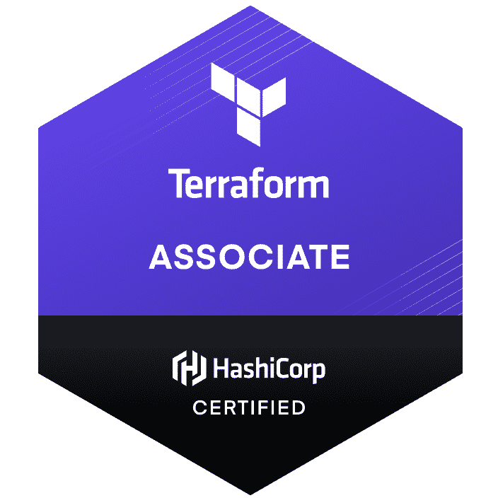

# 我的哈希公司认证之旅:Terraform 助理

> 原文：<https://itnext.io/my-journey-to-hashicorp-certified-terraform-associate-f91f397a01e0?source=collection_archive---------0----------------------->

# 背景

Terraform 是来自 [HashiCorp](https://www.hashicorp.com/) 的基础设施即代码(IaC)产品。它是一种以安全、可重复的方式构建、更改和管理基础设施的工具。

它基于与 Aws 的[云形成](https://aws.amazon.com/cloudformation/)相似的 IaC 理念。运营商和基础设施团队可以使用 Terraform，通过一种称为 HashiCorp 配置语言(HCL)的配置语言来管理环境，实现人工可读的自动化部署。

[Terraform 助理认证](https://www.hashicorp.com/certification/terraform-associate)面向那些专门从事运营/IT 的云工程师，或者那些知道或想知道与开源 HashiCorp Terraform 相关的基本概念和技能的开发人员。

我使用过 VMware、Citrix 等公司的 API 和脚本基础设施工具。Terraform 更上一层楼，让你的脚本跨不同的云厂商工作变得非常容易，比如 Azure、AWS、GCS 等等。这款产品的易用性给我留下了极其深刻的印象。生态系统呈指数增长，并有一个活跃的社区为 Terraform 做出贡献。

# 谁应该参加这次考试

想学习 terraform 的人(即使你已经使用了一段时间，我认为你会学到一些东西)。作为代码的基础设施提供了许多其他优势(参见这里的[和](https://www.terraform.io/intro/index.htm))，在当今的 DevOps 世界中，这是一项非常方便和受欢迎的技能。

关于认证，我的 2c 是一个好的认证提供了一个学习新技术的结构化方法，因为每个人可能不会一直在所有技术上工作。另一种方法是做一个项目并学习。每个人都有不同的风格，认证对我来说是最好的，在我开始一个项目之前。

# 策划黑客

这项考试没有正式的先决条件。但是，我强烈建议您做好以下准备:

1.  了解至少一家公共云提供商，如 AWS、GCP 等。
2.  基本的终端技能以及对内部部署和云架构的基本了解。
3.  耐心阅读 Hashicorp terraform 文档:)

4.制定完成计划—设定完成本课程的日期。

5.一旦你准备好了，检查这些问题

6.向可能知道这件事的人寻求帮助(没什么不好意思的，我们都是来学习的)。我强烈推荐使用哈希公司的论坛。

7.有两套笔记(一套详细的)和一套备忘单，在考试前检查备忘单会非常方便

# 准备

以下文件帮助我准备考试:

1.  [哈希公司地形文件](https://www.terraform.io/intro/index.html)
2.  [Udemy 课程](https://www.udemy.com/course/terraform-beginner-to-advanced/)
3.  [哈希公司的学习指南](https://learn.hashicorp.com/tutorials/terraform/associate-study)
4.  使用 AWS 帐户在本地设置 terraform 尝试一些东西
5.  [样题](https://learn.hashicorp.com/tutorials/terraform/associate-questions)

我花了大约 10 天来准备(因为我对 terraform 比较陌生)，也尝试了 Udemy 课程中的所有练习。我有一个有两个孩子的家庭，所以我每天花大约 2 个小时，根据情况，这对其他人来说可能会少得多。

最后，确保你报名参加考试(见[这里](https://hashicorp-certifications.zendesk.com/hc/en-us/articles/360049382552))。

# 课程内容和复习

在时间成熟的时候，我不会去过的课程的细节，这是涵盖了很多其他博客很好。我向那些地球新手推荐我的课程。我非常喜欢通过这个课程学习 Terraform 工具。

Terraform 的官方文档是不确定的。对于某些领域，他们似乎更困惑我，但总的来说还不错。

# 考试

> 该考试是一个 1 小时的监考考试，您可以在家舒适地进行在线考试。为了适应不同的时区，24 小时都可以方便地安排考试时间。

整体考试很好，验证了所学知识。我会仔细阅读 Hashicorp 的文档，考试中没有任何内容来自文档之外。及格分数为 **70%** 。

考试不是那么简单，有很多棘手的问题，所以建议慢慢阅读这些问题， **60 分钟**基本上足以解决这些问题，所以没有必要匆忙通过。你可以跳过难题，以后再来回答。

总之，我强烈推荐这个认证，不像其他的认证，它很实用，给你一个很好的 terraform 概述。

就这些了，下次见，再见！