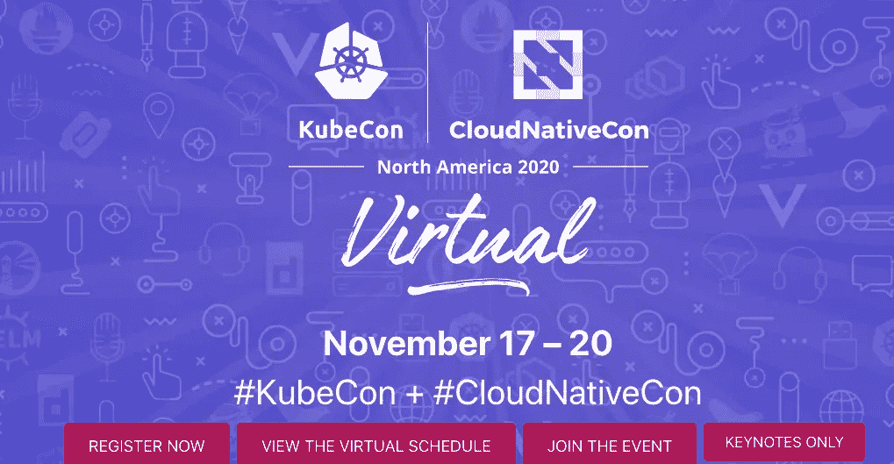
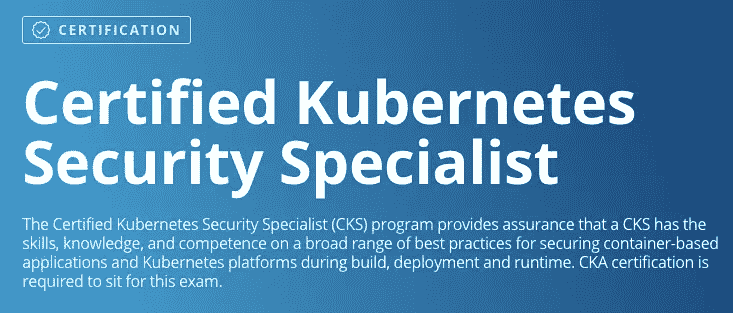
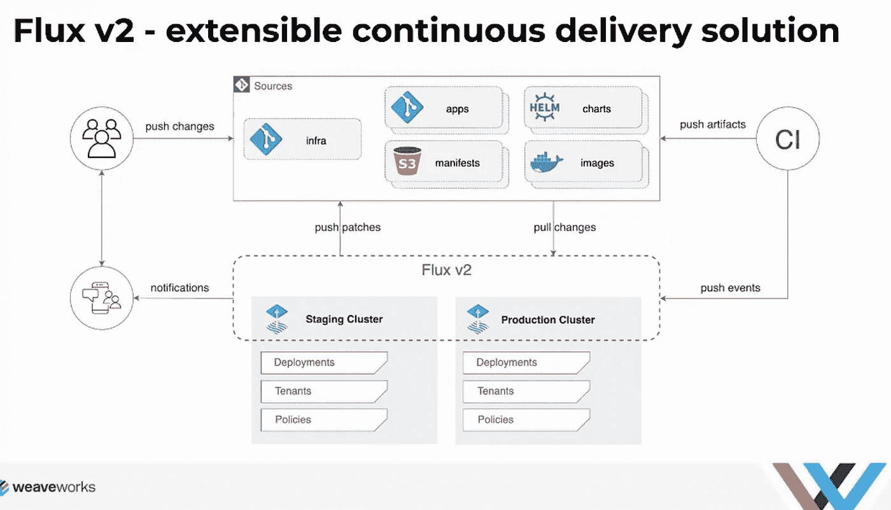
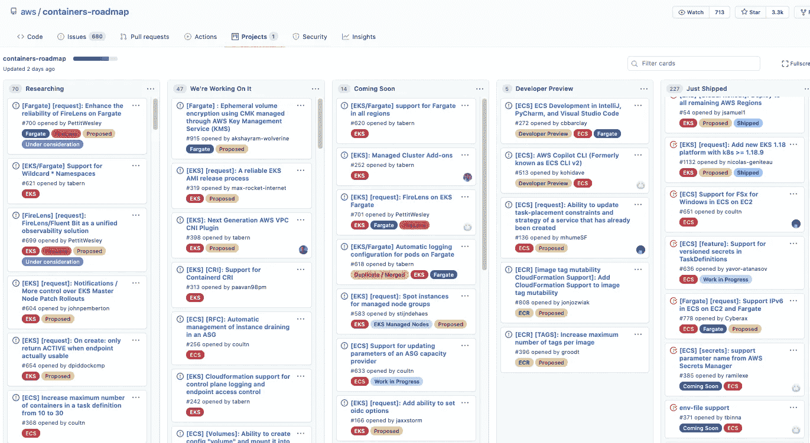

# 到目前为止，我对 2020 年云原生 KubeCon 大会(CNCF)的主要收获

> 原文：<https://itnext.io/my-key-takeaways-on-cloud-native-kubecon-conference-cncf-2020-thusfar-cb1dfae85a4e?source=collection_archive---------1----------------------->

这是我的第一个 **KubeCon** ，在不幸的 2020 年，这都是在线的。我追求的是**内容**——我非常高兴。

这真的是最好的 Kubernetes 和 ServiceMesh 一站式商店

**会议费用** $75 + $20 用于**ServiceMeshCon**——我感兴趣的领域。

Kubernetes 云原生内容的绝对数量令人震惊，尤其是在服务网格方面。我已经预订了几天的学习假，心想我可以买一送一，获得 Kubernetes 安全认证——正如预期的那样，在这期间完成。我希望。不会吧。“没人有时间做那件事”。当我准备参加自己的考试时，我将在另一个博客中单独介绍 CKS。

# 我的笔记和要点

*   现在任何一个提供商都有一个服务网。选择你的毒药。F5 推出 **Aspen** Mesh。VMware 有 **Tanzu** ，孔有 App Mesh。除了最初的 **Linkerd** 和 **Istio** 之外，这还不是一个详尽的列表。

> 有太多东西需要消化。

*   **Linux 基金会** [**Kubernetes 安全专员**](https://training.linuxfoundation.org/certification/certified-kubernetes-security-specialist/) **使用此通用折扣代码可享受 15%的折扣** ($300)。课程折扣&考试预约`SCOFFERS15`。*个人折扣代码允许在 CKS 预订时打 7 折——我在:D 用完了它*

你需要 CKA 作为先决条件

*   [**weaver works**](https://www.weave.works/blog/what-is-gitops-really)发布了`flux`的第 2 版，用于基础设施即代码 GitOps 集成，具有以下新增/更新功能:
    - **事件** - **驱动** **系统** (webhook 接收器-现在有很多选项)可以触发 flux 的更新操作
    - **多个** (github) **存储库**支持多种环境
    -良好的旧舵控制器支持(版本/标记组件)企业:heart:
    - **Kustomize** 如果您想要 mods
    - **etc)只需要定义这应该去哪里
    - **多** - **租用**支持(RBAC:心:)
    - **标记器**用于逐步发布推广，具有 A/B、金丝雀、SLOs 监控，这要归功于应用网格功能(另一个服务网格)**

*   AWS 创建了一个新的 **Kubernetes 节点自动缩放替代方案——kar penter**(发布了 alpha)[https://github.com/awslabs/karpenter](https://github.com/awslabs/karpenter)
    (如果任何人已经尝试过这个，渴望听到反馈)
*   AWS **弹性 Kubernetes 服务发展路线图**此处
    https://github.com/aws/containers-roadmap/projects/1

跟踪新功能和发展

*   有一些有趣的**免费书籍**(再次)可从 **IBM** 获得，“ **Istio 解释:服务网格入门**”。这是一个很好的技术深潜。但是，如果您想了解服务网格是否符合您的业务模式，是否与您的组织能力相匹配，您可能希望从我自己的博客文章开始，在仅仅 [**规划服务网格**](/going-down-the-service-mesh-rabbit-hole-why-do-you-think-you-need-it-and-architecture-8eb440ea5fea?source=your_stories_page-------------------------------------) 时，有一个高层次的概述和考虑
*   **停止编写你自己的操作符**——哈希公司自己的[乔·汤普森](https://kccncna20.sched.com/speaker/kensey.kubecon)的精彩演讲。(作为录制的会话提供)。停止写你的雪花。
*   [**GitOps**](https://medium.com/contino-engineering/building-cloud-native-gitops-on-google-cloud-platform-21e022904e94) 得到了更多的重视。来自社区的大量关于 CI、CD 以及二者之间的粘合剂的对话。这些是对话，因为它们对于一个组织来说是非常独特的，但我还没有遇到过针对 GitOps 集成的云原生发布宣传。CircleCI 可能会更接近，然后你会有 Jenkins-X。我还是不喜欢。这完全取决于您的用例。
*   Gartner 关于 2020–2022 年技术采用的会议颇有见地。我们正在推动新技术的发展，似乎正在提高整个组织的风险偏好。请不要完全相信，这是对未来的展望。迄今为止，从众心理从未成功预测过未来。创新来自个人挑战极限。尼古拉、特斯拉、福特、马斯克等等。
*   我提到孔了吗？ [**孔网 v1.0**](https://konghq.com/products/kong-enterprise/kong-mesh/) 现已出。现在是一件事了。如果你需要 API 管理，他们也能做得很好。这就是南北通信地址。现在，通过添加应用网格，这解决了东南方向的通信问题。对首席信息官来说，最好的是企业订阅。当然了。Kong Mesh 是一个开源产品，不过，为了让您入门。

好的，这些是我自己的要点，希望对你有用。我的目的不是列出所有与会者、赞助商和会议产品，而是列出我感兴趣的花絮。我喜欢精简的 Kubernetes 集群环境，最近洒上了服务网格的魔力。

如果有更多消息将会更新