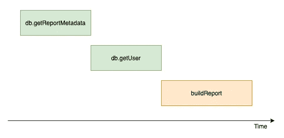
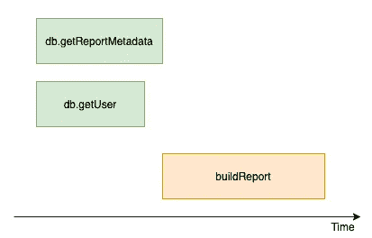

# 我列出的 NodeJS Web 应用程序的典型性能杀手

> 原文：<https://itnext.io/my-list-of-typical-performance-killers-of-nodejs-web-applications-60349b898234?source=collection_archive---------2----------------------->

[图片来源](https://www.pexels.com/photo/close-up-of-snail-on-ground-320956/)

> **你 20%的活动**将占你**结果**的**80%**

我从**帕累托原理**开始，因为我认为它完全符合文章的思想。实际上，修复典型问题大约是开发人员花费在修复性能上的努力的 20 %,并最终获得相当好的结果。

另外，我想提一下，这篇文章不会包含任何关于事件循环的内容，因为:

1.  关于[单线程、事件循环](https://www.journaldev.com/7462/node-js-architecture-single-threaded-event-loop)等等的文章数不胜数
2.  用 NodeJS 编写繁重的计算或 CPU 密集型任务并不常见。但如果当时决定这样做，我相信这是有意为之。因此开发人员知道如何处理 CPU 密集型任务([文章链接](https://codeburst.io/cpu-intensive-node-js-part-1-1218b102e5ec))。

# 监控和警报

在讨论性能杀手之前，我想简单介绍一下监控和警报，因为它是现代系统的重要组成部分。它们允许您通过对您和您的团队来说最方便的渠道(如邮件、Slack 等)获得有关系统技术状况的快速反馈，甚至无需打开应用程序。此外，它还可以跟踪您的修复是否提高了性能，以及修复有多好。此外，已配置的[分布式跟踪](/distributed-tracing-in-your-kibana-with-nodejs-610c9f07b4b4)可以揭示跨服务通信和与持久性存储通信不足的问题。

让我们假设这个系统没有任何监控。所以在这种情况下，有以下几种方法可以发现系统有性能问题:

*   用户反馈。但是说实话，用户很少写反馈。让他们离开你的系统要容易得多。付费用户除外。
*   检查日志。既费时又无聊。

至少应该监控什么？

*   CPU 使用率。高 CPU 使用率会导致总体速度变慢，并且可能是事件循环滞后的症状。当 CPU 使用率高于阈值时发出警报(例如`limitCpu * 0.5 <= currentCpu`)。
*   内存使用。高内存使用率会导致因内存不足而终止进程。当内存使用率高于阈值时发出警报(例如`limitMemory * 0.5 <= currentMemory`)
*   关键路径请求很慢。每个应用程序都有自己的关键路径，以及对其有重大影响的请求列表。可以使用日志记录器或任何 APM 工具跟踪请求时间(顺便说一句，我有一篇关于[弹性 APM](/distributed-tracing-in-your-kibana-with-nodejs-610c9f07b4b4) 的文章)。将警报配置为在请求时间超过阈值时触发。就我个人而言，在过去的 12 个小时里，我使用 75%的百分比。

# 性能杀手

## 1.链式异步流

当异步命令像同步代码一样一个接一个地运行时。自从引入 async-await 以来，这种流开始成为一个更常见的问题，因为这种结构导致编写类似同步的代码。以下是可读代码的典型示例:

下图描述了上述代码块的问题。有两个相互独立的异步请求，它们以链式流程执行，浪费时间。

通过并行运行独立的异步命令，可以很容易地解决这个问题。

在这种情况下， *getReportMetadata* 和 *getUser* 并行运行，减少了总请求时间。

## 2.在 foreach/map/reduce 等中调用异步函数。

更常见的是，代码已经包含了简单的异步函数，可以很好地处理单个实体。例如，获取数据然后进行某种转换并保存它的函数。

函数看起来很不错，但是让我们假设收到了一个支持批量更新的新需求。第一个想法是这样做:

但是价格可能相当高。在这种特殊情况下，有`2*n`个 db 请求被发出。要知道，50 个实体有 100 个并发请求。

至少，从性能角度来看，按照以下方式重新编写现有代码会容易得多:

例如，使用这种方法，可以使用`in` where 子句提取数据，并使用批量写入更新数据(例如 [mongo 批量写入](https://docs.mongodb.com/manual/reference/method/db.collection.bulkWrite/)，[从 postgre](https://www.postgresql.org/docs/9.1/sql-values.html) 中的值更新)

## 3.盲目的中间件链使用

有不同的方法( [DDD](https://khalilstemmler.com/articles/domain-driven-design-intro/) 、[洋葱架构](https://www.codeguru.com/csharp/csharp/cs_misc/designtechniques/understanding-onion-architecture.html)、[分层架构](https://dzone.com/articles/layered-architecture-is-good)等等)认为业务逻辑代码应该从框架相关代码中分离出来。但是仍然有许多项目仍然使用中间件(例如基于 express 和 koa 的)用于业务逻辑、数据获取和与外部服务的通信等等。

典型的代码片段:

代码看起来很棒。它简单、可组合且干净。但是有两个主要的性能问题:

*   **链式异步流。**

这是因为每个中间件都是孤立的，彼此不了解。下面是这种中间件的一个示例:

实际上，这种中间件链的使用产生了与单一功能中的异步命令链相同的效果。

这个问题可以通过重构代码并提取一个负责数据获取和计算数据的专用函数/服务来解决。在这种情况下，可以编写一个并行数据获取的代码。

*   **执行多余动作**

因为中间件之间没有明确的关系，所以可能会出现中间件执行冗余操作的情况。我所说的冗余动作是指在执行主要的请求场景时不需要的动作。最典型的情况是中间件执行不需要的数据提取。

让我们修改上面的例子。在计算数据之前，应用程序执行用户提取、报表元数据提取和模式提取。让我们考虑在重构之后，不再需要获取模式。但是中间件没有被移除。它没有被删除，因为在`fetchSchema`和`calculateData`中间件之间没有明确的关系。因此，存在多余的外部呼叫。

这个问题可以用与前一个问题相同的方式解决。应该通过提取专用服务或功能来重构代码。在这种情况下，数据获取和数据处理之间的关系将是明确的，并且可以容易地去除冗余动作。

## 4.忽略节点更新

NodeJS 开发团队定期发布新版本。他们不断地添加新特性(workers，v8 新特性)，修复问题(性能，安全性，bug)。通过忽略更新，你就锁定了通常价格较低的改进。

如果你甚至不更新 NodeJS 版本，我强烈建议继续跟踪 [changelog](https://github.com/nodejs/node/blob/master/CHANGELOG.md) 。也许你会找到有用的东西。

我的建议:

*   为新服务使用最新的 NodeJS 版本
*   在主动服务开发期间定期更新节点版本

## 5.ORM/ODM 陷阱

ORM/ODM 是一个很好的工具，可以加速应用程序的开发。它从数据库代码中抽象出你的代码。但是 ORM 的强大也有它的弱点。

我认为 ORM 的一个典型问题是开发人员在没有启用查询日志的情况下工作。结果，它导致在数据库抽象下失去控制和性能下降。

典型问题:

1.  低效的查询。ORM 框架可以生成`subselect`而不是`join`。或者更糟的是，对于一个相当简单的场景，它可以生成 N+1 个请求。
2.  热切的关系引人入胜。渴望获取意味着对于每个选择 ORM 将选择子资源，即使你的代码不需要它。结果，代码在不需要的事情上花费了宝贵的时间。

我的建议:

1.  默认情况下，在开发模式下启用请求日志记录
2.  比起渴望，我更喜欢懒惰的获取。实现一个专门的函数来获取带有子资源的实体，只有在需要用子资源获取实体时才调用它。

## 6.忘记数据库索引

据说过早的优化是万恶之源。但是对于数据库索引来说，这实际上并不完全正确。在开发持久模型过程中，应该考虑最常见查询。因此，如何使用数据以及应该索引哪些列是很清楚的。

这里有几个显而易见的场景，在这些场景中，可以添加索引而不必等待性能问题:

1.  有一个基于表策略的多租户应用程序。在这种情况下，每个表都包含一个租户标识符。因此，在这种情况下，应该在每个表中对租户标识符列进行索引。
2.  有一个应用程序包含`orders`。通常订单包含`line items`。因此，在数据库设计期间，`line item`将在`order`上有一个链接，该链接将广泛用于查询。所以`order id`是在`line items`表中被索引的一个很好的候选者。

我的建议是从一开始就索引外键，这些外键应该在查询中广泛使用，并且很可能很少或从不更改。

# 结论

我希望我能够提出我的观点，即在设计和实现系统的过程中，我们应该考虑应用程序的性能和功能，不要害怕为了性能而在新功能的范围内应用重构。