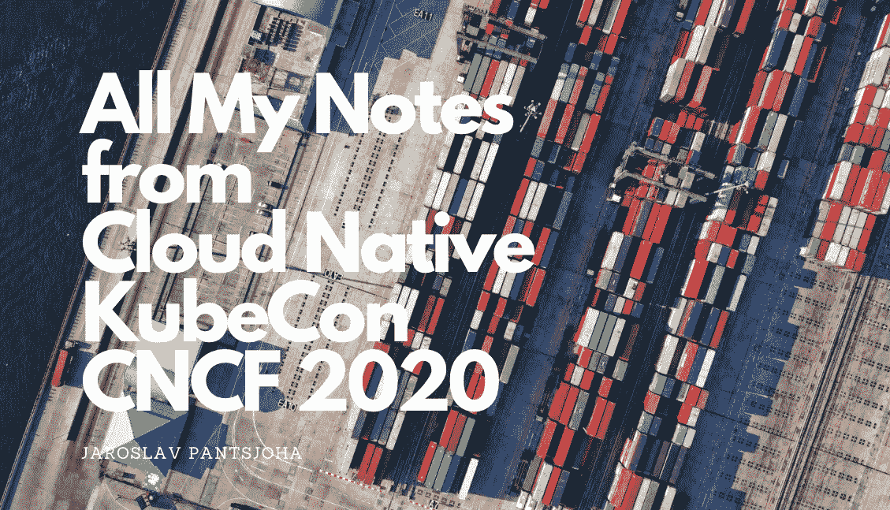
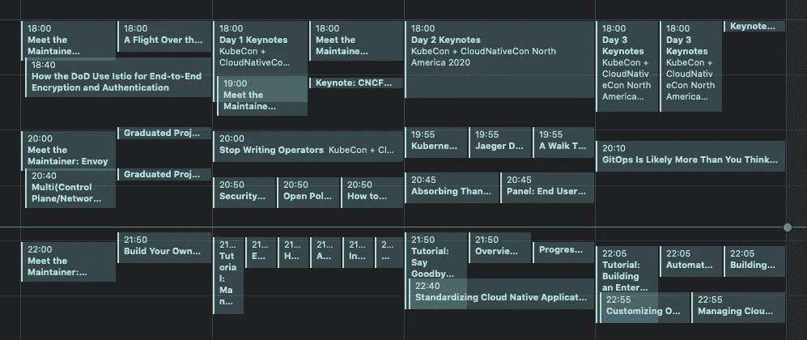

# 我对 2020 年 KubeCon & ServiceMeshCon 会议(CNCF)上的 Kubernetes 和 GitOps 的笔记

> 原文：<https://itnext.io/my-notes-on-kubernetes-and-gitops-from-kubecon-servicemeshcon-sessions-2020-cncf-c06893643bb5?source=collection_archive---------2----------------------->

我真的很高兴我已经预订了 3 天(英国时间意味着下午 4-5 点开始)的云原生 KubeCon。

我有几年的工作经验与 Kubernetes，我是 CKA 和 CKAD 认证。在深入研究了真正的原生 GitOps CI/CD，以及最近的服务网格之后，我认为我已经为此做好了准备。

> 我相信，以我的经验，我现在已经相当熟悉这些技术、供应商和开源社区。哦，我错了。
> 
> 这就是 2020 年的 Q1。

看着 [(CNCF)的云原生景观](https://landscape.cncf.io/)，这并不令人惊讶——它是巨大的，而且还在增长。

幸运的是，在我的专业领域——微服务基础设施编排(通常在 GCP，通过播客和博客阅读来跟上这个领域的快速发展确实有所帮助，但我主要强调的是需要留出**天**来浏览和消化 CNCF KubeCon & ServiceMeshCon 内容。没有干扰。

我在这里。几天后，仍然在处理认知超载，花时间处理和组织现在感兴趣的领域和以后感兴趣的领域。通过这样做，我希望这能为一篇有据可查的博文铺平道路，你以后也可以继续跟进。这里是我的活动持续时间的日历视图，让你对强度有个概念。完全正确，你最好记笔记。你将错过会议，并会发挥赶上所有其他的业余时间，你可能会或可能不会。如果那是你的工作，那你就去做。

它没有包含所有可用的会话，并且我很可能跳过了一些我不感兴趣的会话。或许过一两个假期后，可以再去看看。

我对这次 CNCF 2020 会议的兴趣是了解关于 **ServiceMesh** 和首次展示的新发展和最佳实践。[我最近在我的博客中谈到了这个话题——如果你也在考虑“得到一些”服务网格，这是值得一读的。](/going-down-the-service-mesh-rabbit-hole-why-do-you-think-you-need-it-and-architecture-8eb440ea5fea)

否则，在经历了[云原生 CI/CD gitop 的全部**禅意**——我也在今年早些时候写过](https://medium.com/contino-engineering/building-cloud-native-gitops-on-google-cloud-platform-21e022904e94)——我渴望了解企业采用这种实践的情况。此外，还寻求对功能集的其他开发和更新。例如，
*即* `*flux*` *v2 现在支持多存储库。
妙极了。我现在可以回家了。我真的很喜欢这个。*

首先要做的事。我写这篇文章的时候是 2020 年 11 月 21 日，CNCF 云计算大会已经结束。到 2020 年 12 月，大多数演讲和视频会议最终都会出现在 YouTube 上。

以下是我感兴趣的部分，以及一些有用的`about`片段，供快速参考。

## **我感兴趣的会话列表**

这些会议真的很好，我建议在 2020 年 12 月发布时在 YouTube 上查看它们。这既包括分组讨论，也包括来自 ServiceMeshCon 的一些讨论。

*   **标准化**跨不同云的云原生应用交付
    使用 Flagger by Weaveworks 的渐进式交付技术( [GitHub repo](https://github.com/weaveworks/flagger) )
*   吸收灭霸无限能量用于多簇遥测。
    https://thanos.io/**发现了**T22 工具包！😍
    **灭霸**重复数据消除普罗米修斯(基于拉动的)指标
    gRPC 调用 Frederic Branczyk 的

*   **面板**:最终用户面板:**企业中的 GITOPS 真实世界体验**——确实非常有趣。❗️
*   **耶格**深潜( [CNCF 九月视频](https://www.youtube.com/watch?v=BWtNelj_XUc))
*   漫步库伯内特斯 UI 景观
*   跨不同云实现云原生应用交付标准化
*   赫尔姆:过去、现在、未来
*   自动缩放简介(同时查看 Karpertner 的 AWS alpha 版本)
*   开放策略代理介绍
*   停止编写运算符
*   如何通过一起使用阿尔戈项目来倍增它们的力量
*   GitOps 可能比你想象的要多——Cornelia Davis，weave works——由概念创始人对 GitOps 进行了大量报道。模式和最佳实践的奇妙覆盖。很棒的谈话。
*   多(控制平面/网络/网格):实用的多集群部署
*   [服务网格规范及其在您的部署中的重要性— Lee Calcote & Kush Trivedi，Layer5](https://kccncna20.sched.com/#)
*   **教程**:在 Kubernetes 上构建企业基础设施控制平面
*   **自动**让仪表盘加载速度快 100 倍。—快速监测风。(监察队欢欣鼓舞！)

## **云原生安全的状态**

**帕洛阿尔托**(Prisma Cloud——twist lock)

*   [云原生安全状态](https://www.paloaltonetworks.com/state-of-cloud-native-security)
*   [Git 库漏洞管理](https://blog.paloaltonetworks.com/prisma-cloud/git-repo-vuln-management/)
*   [云交付的托管安全(博客文章)](https://blog.paloaltonetworks.com/2020/06/cloud-delivered-managed-security/)

**Stackrox** (Kubernetes 安全平台)

*   [Kubernetes 配置指南—白皮书](https://security.stackrox.com/rs/219-UEH-533/images/Guide%20to%20Kubernetes%20Configuration%20Whitepaper.pdf)
*   [Kubernetes 原生安全性:为何如此重要——白皮书](https://security.stackrox.com/rs/219-UEH-533/images/Kubernetes-native-security-whitepaper-what-it-is-why-it-matters.pdf)
*   [2020 年秋季集装箱和 Kubernetes 安全状况报告](https://security.stackrox.com/rs/219-UEH-533/images/State-of-container-and-Kubernetes-security-report-fall-2020.pdf)
*   [Kubernetes 攻击矩阵和缓解—白皮书](https://security.stackrox.com/rs/219-UEH-533/images/StackRox-Whitepaper-Kubernetes_Attack_Matrix_and_Mitigation.pdf)
*   [7 个 Kubernetes 安全最佳实践(Youtube)](https://www.youtube.com/watch?v=HRU0aCkhgwg&feature=youtu.be&ab_channel=StackRox)

**SysDig** (安全&监控)

*   [使用 Sysdig 的 Kubernetes 的零信任网络安全](https://www.youtube.com/watch?v=lgIB4EItah4&feature=emb_logo&ab_channel=Sysdig) (Youtube)
*   [Kubernetes 本地网络安全的 Sysdig 特性](https://sysdig.com/products/secure/runtime-security/)

**Aqua** (一个在 Kubernetes 和其他云平台上的**安全**解决方案)

*   IDE 镜头扩展由 Aqua 其阿尔法镜头右舷集成。https://github.com/aquasecurity/starboard-lens-extension 使用 treat❗️ [镜头扩展查看**右舷**当前*运行容器上的安全信息。更多*](https://github.com/aquasecurity/starboard-lens-extension)*[https://github.com/aquasecurity/starboard](https://github.com/aquasecurity/starboard)*

## **发布助手**

**石帕**

*   [Shipa 工具说明](https://www.youtube.com/watch?v=DTZqKYNJaTo&ab_channel=ShipaCorp)
*   [从咖啡到容器——从整体到微服务(稍后再谈。Youtube)](https://www.youtube.com/watch?v=0EAR7NoJxMk&ab_channel=ShipaCorp)
*   [Kubernetes 上的应用安全状况和扫描](https://www.youtube.com/watch?v=t4b3WYcYh3M&ab_channel=ShipaCorp)
*   [在 EKS 上使用 Shipa 跨多个集群部署应用](https://www.youtube.com/watch?v=G7h2tV5pfGA&feature=youtu.be&t=9&ab_channel=ShipaCorp)

**gitOps 上的会话非常有用**

CI/CD gitop 作为传统管道的替代方案，带来了许多积极的氛围和噪音。

> 我将使用 argocd，因为我们的团队不熟悉 k8s、git 和 gitops，UI 将有助于入职

**DIY GitOps app 发布推广的思路和建议**

*   Kustomize +头盔预渲染模板更新图像标签等每个环境
*   jsonnet(数据模板语言)来更新容器图像标签

一些 KubeCon 用户提到的来自社区
工具集的关于 GitOps 和 Kubernetes 的其他工具建议

*   [卡皮坦](https://kapitan.dev/)。开发—[Kubernetes 的通用模板化配置管理](https://kapitan.dev/)
*   [tanka . dev](http://tanka.dev)—[Kubernetes 的灵活、可重用和简洁的配置](https://tanka.dev/)

## 我特别感兴趣的发现

*   **网状网
    服务网状网性能比较**，网状网做 SMI。当前支持的多个服务网格的比较
    **演讲** : [服务网格规范及其在您的部署中的重要性— Lee Calcote & Kush Trivedi，Layer5](https://kccncna20.sched.com/#)
*   [**OSM**](https://openservicemesh.io/) **—精彩演讲和演示** [开放服务网格](https://landscape.cncf.io/selected=open-service-mesh)
*   [**交叉平面**](https://crossplane.io/) —从您的 Kubernetes 集群中调配云平台/代表资源。类似于 terraform 运算符。这是一个增强 Kubernetes 集群的附加组件，使您能够从`kubectl`供应和管理基础设施、服务和应用
*   **港** —使命是成为 Kubernetes、docker 容器[注册表缓存](https://goharbor.io/docs/2.1.0/install-config/#deploy-harbor-on-kubernetes)文档的可信云原生存储库。
*   **微软**演示——在讨论中分享——关于**GitOps**工作流和流程集成。过程中围绕 GitHub 架构有趣的建模。[太好了，上一届 Kubecon 展示了一个项目(来自 MSFT)](https://www.youtube.com/watch?v=JfQvAtsZP7Y&feature=youtu.be) ，该项目将交付控制器部件可视化。
*   **Spektate 工具** [调试应用回顾](https://kubernetes.io/docs/tasks/debug-application-cluster/debug-application-introspection/)
*   **基岩** CLI —基岩基于[基岩](http://aka.ms/bedrock)模式和原则，帮助您自动化、管理和观察 Kubernetes 部署操作。 [GitHub 知识库此处](https://github.com/microsoft/bedrock-cli)。
*   **Checkov** — terraform 单元测试—一个[静态代码分析工具](https://bridgecrew.io/blog/kubernetes-static-code-analysis-with-checkov/?utm_medium=sponsoredevents&utm_source=kubecon-cloudnativecon&utm_campaign=na2020)。
    现在 [Checkov 也运行头盔配置错误检查](https://bridgecrew.io/blog/scan-helm-charts-for-kubernetes-misconfigurations-with-checkov/?utm_medium=sponsoredevents&utm_source=kubecon-cloudnativecon&utm_campaign=na2020)——博客在此。

## 那里。你成功了

哦，是的，如果你还在这里，还有一个关于云原生采用的[**CNCF 2020 年调查**——非常值得一读](https://jaroslav-pantsjoha.medium.com/the-key-takeaways-of-cloud-native-compute-foundation-survey-of-2020-40fdc77acdcd)。

好的，我想这个可以了。
在 [LinkedIn](https://www.linkedin.com/in/johas/) 上连接，或者在 [Kubernetes Slack](https://slack.k8s.io/) 上找到我，继续这个对话。

既然你无所不知，分享爱吧。希望你觉得有用，喜欢，与你的同事一起分享。

Regs，JP

这是 CNCF 生态系统图。那就是你(或我)试图向某个从事应用程序设计或其他工作的可怜家伙解释它是如何很好地结合在一起的，以及它的用例……祝你好运。一定会发生的。