# 我自己的开发/测试云环境使用 Oracle Always Free 实例

> 原文：<https://itnext.io/my-own-dev-test-cloud-environment-using-oracle-always-free-instances-598695cc3a10?source=collection_archive---------0----------------------->

正如我在上一篇文章[中详述的，Oracle 总是在 HA 配置中释放云实例](/oracle-always-free-cloud-instances-in-ha-configuration-e1d3dd59d3b1)是部署云开发/测试环境的绝佳资源。


假设您已经有了一个双节点集群，并且在副本模式下运行[***GlusterFS***](https://www.gluster.org/)


配置图

让我们尝试部署:

*   [NGINX](https://www.nginx.com/) HTTP 前端支持多个域
*   [便携式集装箱。IO](https://www.portainer.io/) Docker Swarm UI 管理控制台
*   一个私有的 [Docker 注册表](https://docs.docker.com/registry/recipes/nginx/)来推送你自己的 Docker 图片
*   一个注册表用户界面来浏览你的私人图像
*   接收外部 HTTP/HTTPS 流量的负载平衡器

让我们通过安装一个 GlusterFS docker 卷驱动程序来开始这个部署，它将简化 docker 堆栈部署，在 [GitHub](https://github.com/trajano/docker-volume-plugins) 上有一个用于 ***GlusterFS*** 的卷驱动程序的项目，有一个使用最新的 Oracle Linux 7 精简映像和正确的 ***GlusterFS*** 版本合并的 [PR](https://github.com/trajano/docker-volume-plugins/pull/23) ，只是在 ***node1*** 中作为根运行:

```
# docker plugin install --alias ***glusterfs*** ***trajano/glusterfs-volume-plugin:v2.0.3*** --grant-all-permissions --disable
# docker plugin set ***glusterfs*** SERVERS=***localhost,remote***
# docker plugin enable ***glusterfs***
```

在 ***节点 2*** 实例上重复上述步骤，可以使用以下命令检查 ***GlusterFS*** 卷插件:

```
# docker plugin ls
ID           NAME              DESCRIPTION                 ENABLED
b728c6465a61 glusterfs:latest  GlusterFS plugin for Docker ***true***
```

或者如果你已经创建了一个 ***GlusterFS*** 卷名为 ***myvolume，*** 检查它们使用:

```
# docker volume create --driver ***glusterfs*** ***myvolume***
# # docker run -it --rm -v ***myvolume***:/mnt oraclelinux:7-slim bash
bash-4.2# ls -l /mnt
total 1048592
drwxr-xr-x. 5 root root       4096 Oct 23 11:25 configs
drwxr-xr-x. 2 root root       4096 Oct 27 22:02 html
drwxr-xr-x. 5 root root       4096 Oct 25 00:18 portainer
drwxr-xr-x. 3 root root       4096 Oct 26 17:17 registry
-rw-r--r--. 1 root root 1073741824 Oct 26 19:34 test1.img
```

好了，现在我们有了一个 ***GlusterFS*** 复制存储，可以在 Docker Swarm 下使用，让我们先部署一个 Docker 私有注册表/UI 和 [Portainer。IO](https://www.portainer.io) ，为两种服务创建一个共享存储，以便在 docker 重启和跨节点迁移时持久保存和存活:

```
# mkdir -p /gluster-storage/registry /gluster-storage/portainer /gluster-storage/html
# docker network create -d overlay lb_network
```

带有 UI 堆栈的私有注册表:

docker-compose-registry.yml

一个搬运工。IO 堆栈:

docker-compose-portainer.yml

最后，NGINX 堆栈作为上述服务的前端:

docker-compose-nginx.yml

以上堆栈中的配置文件引用可以使用以下方式创建:

```
# curl -s [https://gist.githubusercontent.com/marcelo-ochoa/30123f50c30a15bed5c6f2ef326db475/raw/7fc34bb98d8a06397aff6f17797806a32046e994/nginx.conf](https://gist.githubusercontent.com/marcelo-ochoa/30123f50c30a15bed5c6f2ef326db475/raw/7fc34bb98d8a06397aff6f17797806a32046e994/nginx.conf) | docker config create ***nginx.conf*** -
# curl -s [https://gist.githubusercontent.com/marcelo-ochoa/bfd014f4e9ff59315a1928233da57fe0/raw/902d7ceb57ac9d0b2c837fa8bec2e5a0acf9d0f7/portainer.conf](https://gist.githubusercontent.com/marcelo-ochoa/bfd014f4e9ff59315a1928233da57fe0/raw/902d7ceb57ac9d0b2c837fa8bec2e5a0acf9d0f7/portainer.conf) | docker config create ***portainer.conf*** -
# curl -s [https://gist.githubusercontent.com/marcelo-ochoa/189573847373d59dd82eef230a0b8899/raw/6894c59d09c3c31fb5a092e23c0af1eb34526942/registry.conf](https://gist.githubusercontent.com/marcelo-ochoa/189573847373d59dd82eef230a0b8899/raw/6894c59d09c3c31fb5a092e23c0af1eb34526942/registry.conf) | docker config create ***registry.conf*** -
# curl -s [https://gist.githubusercontent.com/marcelo-ochoa/55b07f94a7a459f64edd19f1004319b9/raw/0b4855691ab3dc948c7aaee8ed81789ee85fb940/registry-ui.conf](https://gist.githubusercontent.com/marcelo-ochoa/55b07f94a7a459f64edd19f1004319b9/raw/0b4855691ab3dc948c7aaee8ed81789ee85fb940/registry-ui.conf) | docker config create ***registry-ui.conf*** -
```

请注意，上述配置文件引用了我的上游服务器，因为 10.0.1.20 和 10.0.1.22 更改了分配给 Oracle Cloud 上的 node1 和 node2 实例的私有 IP，registry-ui.conf 也引用了公共负载平衡器 IP，用下面获得的值替换 1.1.1.1。最后，只需部署以上堆栈，并使用以下命令重新配置 Linux 防火墙:

```
# firewall-cmd --permanent --zone=public --add-port=80/tcp
# firewall-cmd --permanent --zone=public --add-port=443/tcp
# firewall-cmd --permanent --zone=public --add-port=5000/tcp
# firewall-cmd --permanent --zone=public --add-port=8000/tcp
# firewall-cmd --permanent --zone=public --add-port=9000/tcp
# firewall-cmd --permanent --zone=public --add-port=9001/tcp
# firewall-cmd --reload
# docker stack deploy -c docker-compose-nginx.yml nginx
# docker stack deploy -c docker-compose-portainer.yml portainer
# docker stack deploy -c docker-compose-registry.yml registry
```

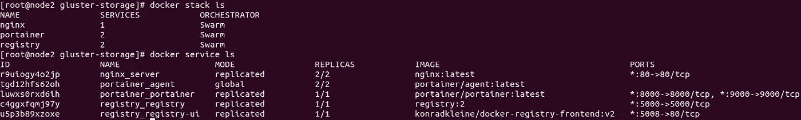

部署的堆栈和服务

现在，最后一步是配置 Oracle Cloud Free Load Balancer，将传入的 HTTP/HTTPS 流量重定向到我们的 NGINX 前端，下面是一系列步骤截图:

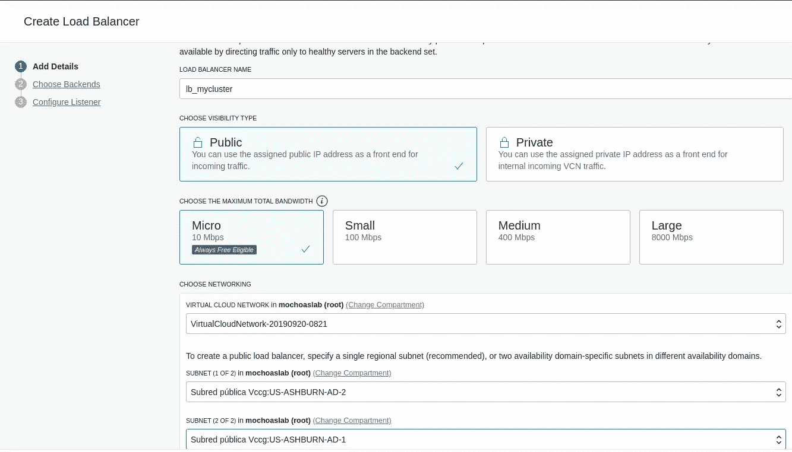

负载平衡器定义步骤 1

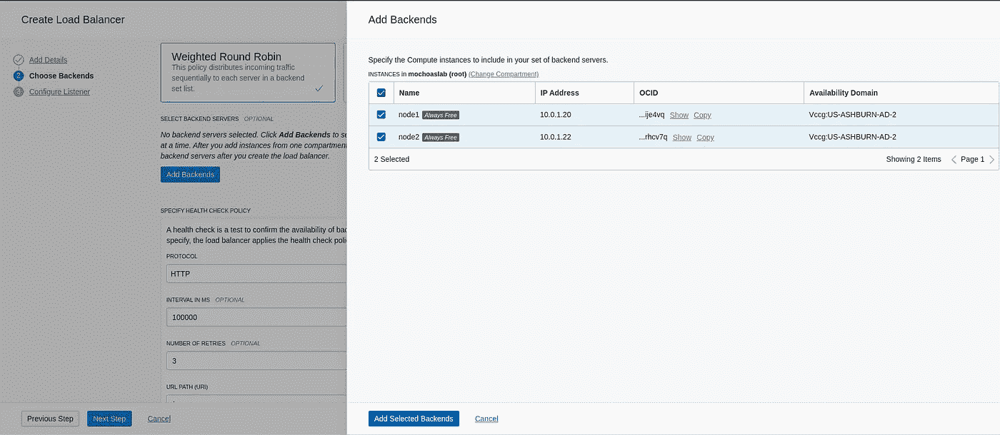

添加后端

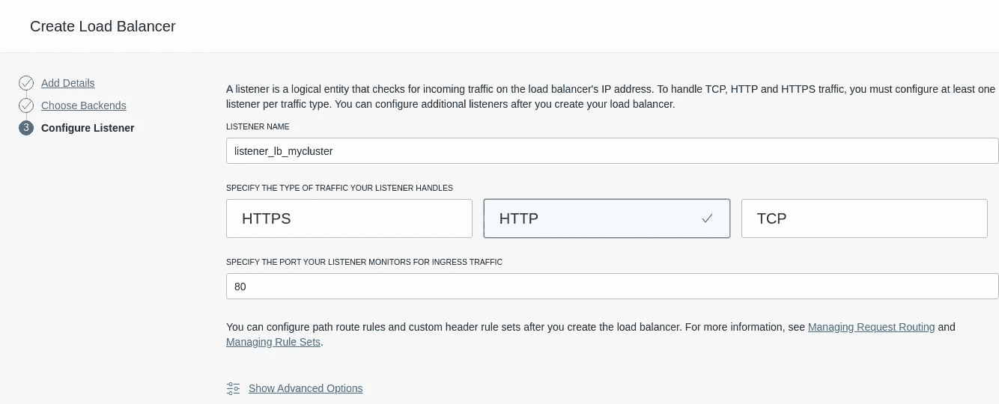

HTTP 侦听器定义

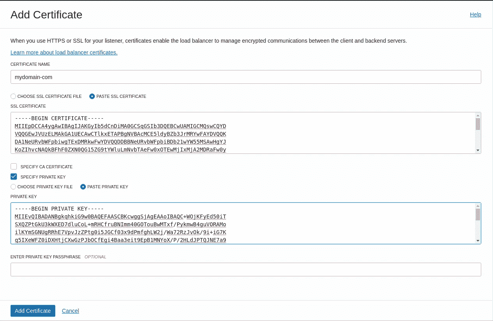

自签名 SSL 证书，见下文

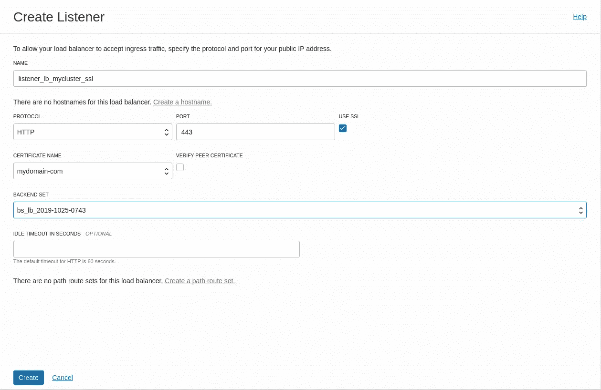

HTTPS 监听器定义

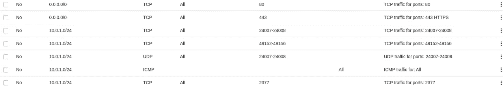

从任何地方查看端口 80/443 的进入规则(0.0.0.0/0)

注意:使用 OpenSSL 生成的自签名证书，这里是使用 [mydomain-com.conf](https://gist.githubusercontent.com/marcelo-ochoa/8bb37c916a72ef744203371af2f604e3/raw/2fd0b23f5fd2ba80917ae52b748c306c4376a229/mydomain-com.conf) 创建的步骤:

```
# openssl req -config [mydomain-com.conf](https://gist.githubusercontent.com/marcelo-ochoa/8bb37c916a72ef744203371af2f604e3/raw/2fd0b23f5fd2ba80917ae52b748c306c4376a229/mydomain-com.conf) -new -x509 -sha256 -newkey rsa:2048 -nodes -keyout ***mydomain-com.key.pem*** -days 365 -out ***mydomain-com.cert.pem***
```

启动并运行负载平衡器后，从“网络”->“公共 IP”菜单获取分配给你的公共 IP，下面是一个屏幕截图:

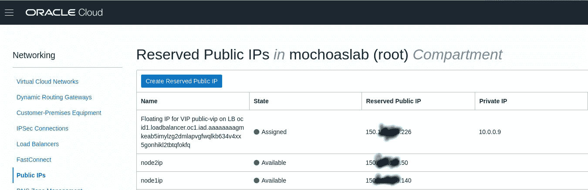

负载平衡器公共 IP

根据以上信息，您可以编辑/etc/hosts 文件，下面是一个示例:

```
$ more /etc/hosts
127.0.0.1 localhost
127.0.1.1 my-notebook# The following lines are desirable for IPv6 capable hosts
::1     ip6-localhost ip6-loopback
fe00::0 ip6-localnet
ff00::0 ip6-mcastprefix
ff02::1 ip6-allnodes
ff02::2 ip6-allrouters150.nnn.mmm.226 [www.mydomain.com](http://www.mydomain.com)
150.nnn.mmm.226 registry.mydomain.com
150.nnn.mmm.226 registry-ui.mydomain.com
150.nnn.mmm.226 portainer.mydomain.com
```

检查**和*搬运车就这样。IO*** 、 ***NGINX*** 或 ***Registry-UI*** 访问使用您的浏览器和 URL http[s]://[www | Registry-UI | portainer]. my domain . com

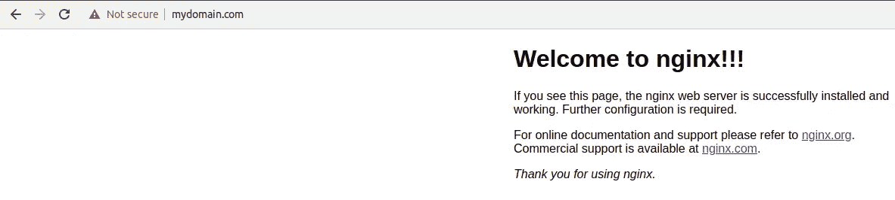

NGINX 工作

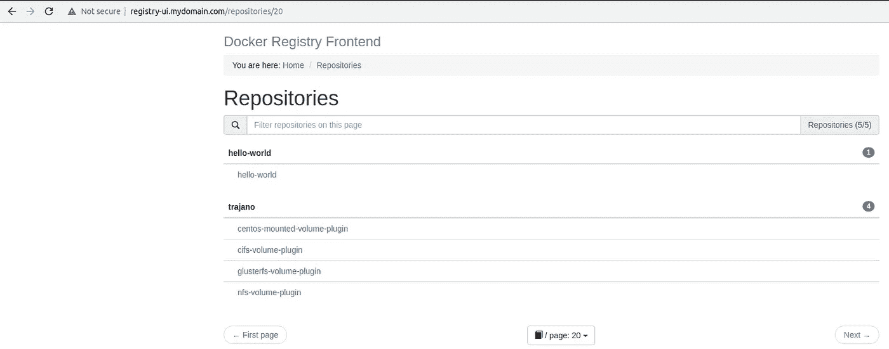

注册表-用户界面

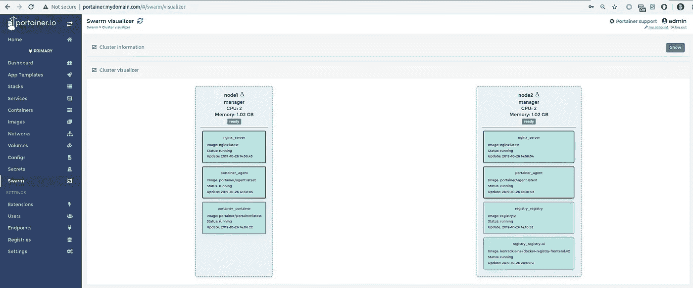

Portainer。超正析象管(Image Orthicon)

如果要将 docker 映像从本地计算机上传到 Oracle 云托管环境，需要将自签名证书复制到证书的本地 Docker 目录中，例如:

```
$ ls -l ***/etc/docker/certs.d/registry.mydomain.com/ca.crt*** 
-rw-r--r-- 1 root root 1671 oct 24 08:43 /etc/docker/certs.d/registry.mydomain.com/ca.crt
$ ***docker pull hello-world:latest***
latest: Pulling from library/hello-world
1b930d010525: Pull complete 
Digest: sha256:c3b4ada4687bbaa170745b3e4dd8ac3f194ca95b2d0518b417fb47e5879d9b5f
Status: Downloaded newer image for hello-world:latest
docker.io/library/hello-world:latest
$ ***docker tag hello-world:latest registry.mydomain.com/hello-world:latest***
$ ***docker push registry.mydomain.com/hello-world:latest***
The push refers to repository [registry.mydomain.com/hello-world]
af0b15c8625b: Layer already exists 
latest: digest: sha256:92c7f9c92844bbbb5d0a101b22f7c2a7949e40f8ea90c8b3bc396879d95e899a size: 524
```

***ca.crt*** 是用 ***OpenSSL*** 生成的***my domain-com . cert . PEM***文件的副本。

下一个帖子将会是一些更真实的东西，比如使用 Oracle DB 的 ***Node.js*** App，Apex 的 REST 端点或 [OpenHab](https://www.openhab.org/) automation hub，保持同步。