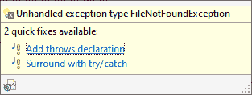

# 我个人的(java)异常权威指南

> 原文：<https://itnext.io/my-personal-definitive-guide-to-java-exceptions-d2e4131393c7?source=collection_archive---------3----------------------->

前提:

*   我主要是比较 C 和 Java 这两种主要的语言有无例外。你可以交换你最喜欢的两种语言，我个人并不是在挑 C 语言或什么的。
*   本文中的 c 或 Java 代码片段不一定能正确编译，可以认为它更像是伪代码。
*   我知道异常早于 Java。我只是说我最精通的语言。
*   请原谅我的英语错误，这不是我的母语。
*   这里的一切都是我的看法，当我说“事情应该是这样的”是“我认为事情应该是这样的”的捷径。

异常是 Java 中最难理解的概念之一。即使是有经验的专业人士也很难使用它们，而且很少有人正确使用它们，主要是因为有大量关于如何“正确”使用它们的错误信息，这使得它们的使用方式没有预期的那么有效。我感觉很多程序员对异常的憎恨源于他们使用 Java 的第一天。在最初的日子里，我们都被“未检查的异常”编译器错误所重创，你不可能写出最简单的方法而不被它所阻碍。随着时间的推移，你学会了如何应对，但对例外的不愉快感觉依然存在。这是一件坏事，因为异常真的很好。

我要说的是，你可以通过观察 java 程序员如何使用异常来判断他们有多优秀。

**为什么会出现异常**

在 Java 或 C++出现之前，C. C 不提供任何类型的错误处理支持，你只能使用基于常规编码工具的定制解决方案来处理你的错误，比如，大多数情况下，函数返回值(或者有时指针参数等)。事情看起来是这样的:

没有标准的 tho:

*   有些库会在成功时返回 0，在失败时返回一些错误代码
*   其他人会在失败时返回 0，在成功时返回非 0
*   其他函数需要将错误状态与实际的业务返回值混合，因此函数可能会在失败时返回 NULL，在成功时返回有效的指针。

总之，这是一个烂摊子，一个典型的视频游戏设置功能，例如，看起来像这样:

这显示了您必须处理非常现实的错误处理机制组合。还要注意，除了将返回值完全分配给错误处理(因此基本上完全放弃了正确的函数)之外，您没有简单的方法来描述您的错误，除了它发生了。因此，像全局“errcode”变量这样更丑陋的解决方案被用来传递更多的信息。

所以基本上，在 C 中，**对于每个函数或 API 调用，你需要手动检查错误，并以适当的方式处理或恢复它**。你真的没有其他选择。因为，一般来说，代码主要是调用函数和 api(除了一些赋值和算法？)，这意味着您有两个选择:要么到处用错误处理样板文件来破坏您的代码，要么不正确地处理错误。在最坏的情况下，任何一屏 C 代码都可能有 70%的错误处理和 30%的实际代码(这些数字显然是我刚刚编造的)。

此外，在某些情况下，返回值不提供“空闲位置”来分配给错误处理(比如返回一个 nil 指针)，因为有效返回值的范围覆盖了返回类型的整个域。举个简单的例子:

没有办法向调用者报告错误，例如整数溢出，除了增加第三个参数或全局变量之外。

不要忘记加入资源管理，也就是:你分配的在返回之前需要释放的资源。如果你分配了一个工作缓冲区(比如操作字符串)，你最好记住不要只在函数结束时释放它，而是在需要时在每次错误检查时释放它:

正如您所看到的，随着您获得的每个资源，错误处理块变得越来越大，越来越复杂。显然，代码可以重构一点，但你能清理的也就这么多了，因为资源必须以相反的顺序正确地释放，而且只能释放那些实际获得的资源。

C 语言的另一个问题是，仅仅通过查看签名(有时甚至通过快速查看源代码)是不可能知道一个函数是如何报告错误的，所以你必须回头检查文档。签名上没有告诉你如何管理错误的合同。Java 实际上试图将错误声明添加到方法签名中，这有它自己的问题(参见后面的检查异常)。

你的 C 程序在业务代码和错误处理代码之间不断跳跃。由于错误处理是您必须经常做的手动任务，所以很容易时不时地忘记，尤其是对新手来说，这会导致代码中潜伏着定时炸弹。你要关注的是业务逻辑，而不是错误处理。顺便说一下，这与自动内存管理和垃圾收集器的推理是一样的(“您希望专注于业务逻辑，而不是内存管理”)。

我个人认为这是使用 C 的最大障碍之一(除了可能缺乏模块化和命名空间)，否则它肯定仍然有它的用法和*存在的理由*。

所以这是发明例外的第一个也是唯一的原因:

1.  **让程序员不必为每个函数调用编写样板错误处理代码。**

就是这样。请记住这一点。

这样做，它们提供了一些附加值，比如统一和形式化错误处理机制，以及将错误处理代码归入它自己的独立块。

**它们是如何工作的**

好吧，每种有异常的语言都有自己的风格，但是一些通用的东西是所有语言共有的，主要是:一种发出错误信号(超出函数签名的范围)的方法，该方法中断当前流程，并将其转移到错误处理例程，以及关于错误的一些信息。现在，如果只是调用一个处理函数，也可以用 C 来完成，问题是:处理函数完成后去哪里。您不能像常规中断处理程序一样恢复执行。因此，设计人员设计了一种方法，通过让您定义一个“catch”块来指定这一点，该块将成为在其 try 块中发生的任何错误的跳转目标(即使是在嵌套调用中)。Catch 块不像代码的其余部分那样是“线性的”,而是调用堆栈被“展开”到最近的“catch”块。它遍历调用堆栈，这是让你写一个单一的，捕捉所有具有适当语义的处理程序。

但是让我们看看上面的例子。在 java 中，可能是这样的:

我想没有人会不同意这是一个巨大的进步。错误处理不会妨碍业务，错误处理被很好地归入他自己的(小)块中，可读性显著提高。

但是，异常真正闪光的地方是当你有嵌套调用时，例如:方法 A 调用方法 B，方法 B 调用方法 c。

如果你用 C 编程，异常处理与函数调用是相反的:主函数必须处理它，A 函数必须处理它，B 和 C 函数也一样。每个人都有自己的假设和/或早期回报以及通常的样板文件。

在 Java 中，你可以考虑整个调用链，并决定哪一点是放置 catch 块的最佳点(典型地，无论你正在编程的逻辑“主要”是什么，稍后会有更多介绍)，就这样。子函数 A、B 和 C 不需要以任何方式处理错误。你可能会对此感到惊讶，因为毕竟你的代码充满了“捕捉”和错误处理。这是关于异常的第一个、最大的和最重要的“错误信息”:

**你经常被鼓励写 CATCH BLOCKS，这是错误的。**

这有两个原因:第一个主要是人的原因:如果你不放置 catch 块，感觉你没有正确处理错误。他们“逃跑”了！如果你写了一个服务函数，比如“downloadFile”，或者“produceReport”，而它不包含 catches，你的老板会看着它说“嘿，你忘了处理异常，这是一个新手的错误”。编译器本身也鼓励这种文化，这带来了第二个原因:编译器实际上很难正确处理异常，因为有一种东西叫做检查异常。

假设您必须编写一个接受 url 的函数“downloadDocument”。这是你的老板给你实现的一个接口。它的签名可能是:

```
byte[] downloadDocument(String url) throws CompanySpecificException
```

它实际上会抛出一个公司代码通常在内部使用的检查异常。

很好，你开始实施它:

问题是，它不能编译，因为“下载”实际上会抛出一个 IOException。您面临着所有其他 java 程序员都曾面临的困境:如何处理未处理的异常。这是大多数开发者的误区。他们通常添加一个 catch 语句，以某种方式“管理”异常。但这是错误的，因为 90%的时候，那不是放接球的正确位置。

面对未处理的异常时，正确的做法是传播它，而不是捕捉它。

现在，这是非常重要的，正确的做法是在抛出声明列表中添加 IOException。这是第二个错误信息:触及抛出条款就像是一个超级禁忌，只有你工作场所的专家才被允许考虑。这是错误的，因为所有的异常都是由方法内部的代码抛出的，应该在 throw 子句中报告，让它们“冒泡”到调用者，这就是异常的意义所在(参见第 1 点)。如果你添加定制代码来处理一个异常(当你不需要处理它的时候),你就违背了它们的用法。您正在添加样板代码，而这些代码正是异常想要让您摆脱的。

但是回到我们的例子:你是一个优秀的程序员，你继续将异常添加到 throws 子句中，修改接口并冒着激怒你的老板的风险:

```
byte[] downloadDocument(String url) throws CompanySpecificException, IOException
```

但是现在您有了另一个问题:使用您的“downloadDocument”的调用站点现在无法编译，因为它在另一个只抛出 CompanySpecificException 的方法(prepareReport())内部。您想把事情做好，所以您变得更加大胆，您更改了 prepareReport()，将 IOException 添加到它声明的异常中。但是 wops，原来 prepareReport()也被公司软件的一个完全不同的分支使用，由不同的团队管理。现在怎么办？

你现在看到照片了吗？许多人会告诉你检查异常是不好的，但是很少有人会给你正确的理由。

**受控异常糟糕的真正原因是它们干扰了异常的自然冒泡。**

因此，面对两个不同开发团队的愤怒，即使对最勇敢的程序员来说也是太多了，你很快恢复你的更改并做下一件最好的事情:

您捕获异常并抛出一个您允许抛出的不同的异常(在本例中是 CompanySpecificException，但在没有 throws 声明的方法的最坏情况下，它将是 RuntimeException)。如果你是一个优秀的程序员，你可以把原来的包在新的包里(把它们链接起来)，这样堆栈跟踪就会揭示真正的错误位置。如果你没有，就这样做:

```
throw new CompanySpecificException(“Error downloading document”);
```

那么堆栈跟踪将在那里结束，让您对错误的真正来源一无所知。这是一个非常常见的错误。我经常看到我的同事做这个。因为整个事情很容易出错。如果他们真的很可怕或者真的是新手，他们甚至可能在异常世界犯下最严重的暴行:默默地吃掉异常:

```
catch(Exception e)
{
  // nothing or perhaps e.printStacktrace();
}
```

我肯定你见过这个。这是最糟糕的事情，因为错误被默默地忽略了，其他的事情会在稍后中断，报告一个异常和一个与错误的真正原因无关的堆栈跟踪。你好调试！

注意，你必须做的这个容易出错的“捕捉游戏”是完全没有任何附加价值的，你必须这么做是因为有缺陷的检查异常系统。这纯粹是样板文件，直接违背了异常存在的首要原因(参见上面的第 1 点)。

即使是 ide 也经常出错。例如，在 Eclipse 中，当您遇到未处理的异常时，它会为您提供以下两种选择:



注意，正确地说，将它添加到 throws 声明中是第一选择，但是如果您决定将它括起来，您会得到这样的结果:

对于一个心烦意乱的程序员，或者一个赶时间的人来说，这现在可以编译了，所以它是“正确的”。除了不是，例外都被吃了！是的，你有待办事项提醒，但我的工作场所代码库中有上千个，我可以告诉你，它们在以后吸引开发人员的注意力方面并不太有效。更明智的违约应该是:

至少现在，如果程序员只是盲目地使用它，它会正确地处理异常并链接它，以便它报告正确的来源。

因此，这里的主要外卖课程如下:

在 JAVA 中处理异常的正确方法应该是什么都不做，让它们冒泡到正确的捕捉位置。

真的，我们有一个很棒的系统，以最好的方式解决了一个丑陋的问题:什么都不做。我们浪费了它。

同样，这也受到检查异常系统的阻碍。它的问题是限制性太强。我仍然需要“throws”声明，但是它应该作为一个“契约”来使用，以记录函数可以抛出哪些类型的错误，这样调用者就可以区分它们，并以不同的方式处理它们，但是不应该限制要抛出的其他异常，也不应该要求调用者显式地声明它们。例如，这样一种方法:

```
public void socketConnect(…) throws HostNotFoundException, TimeoutException, NoNetworkException
```

对开发人员是有帮助的:如果需要的话，他们可以正确区分行为，但是传播异常仍然是主要的事情。

理论上，整个服务库应该是可写的，没有一个“catch”块(或者很少几个),因为 catch 块属于调用者，属于某个服务的最终用户。

你可以说:嘿，但是如果我像 FancyExcel 一样使用我喜欢的库，我希望它的方法抛出 FancyExcelException，对吗？嗯，有一段时间是这样的(看看 Jasper JRException 就是一个例子)，但是现在人们开始想到要么抛出 RuntimeException，要么根据需要简单地声明机构异常(IOException 等)，没有包装。例如，Gson 有自己的 JsonParseException，但它扩展了 RuntimeException。它在 Throws 子句中声明了它！你现在能做的最好的是:[https://www . javadoc . io/doc/com . Google . code . gson/gson/latest/com . Google . gson/com/Google/gson/JSON parser . html](https://www.javadoc.io/doc/com.google.code.gson/gson/latest/com.google.gson/com/google/gson/JsonParser.html))

如果你考虑一下，包装一个异常只是抛出一个带有你定制的公司/库名的异常，实际上用途有限，相反，它使得栈跟踪更难读取。如果一个库从不做自己的“捕捉”,那么在它内部生成的 stacktrace 将会是清晰的、线性的和直截了当的，就像它们被设计的那样。链接异常还会污染最终的错误消息。你见过类似“Java . lang . runtime exception:fancy . library . fancylibrary exception:Java . io . io exception:Java . foo . bar . file not found exception:找不到文件”的东西吗？我做到了。

实际上，捕捉并再抛出在某些情况下可能是有用的，特别是在长过程中，一个“没有发现数据异常”可能来自许多不同的系统。类似于“检索客户端详细信息时出错:未找到数据”这样的内容对于初次评估肯定更有帮助。堆栈跟踪仍然是这两种情况下的主要证据。

异常让你可以通过什么都不做来正确地处理错误，所以你可以随意抛出它们，但是只在你绝对需要的时候捕获它们。

**一个 JAVA 程序应该有足够多的抛出，但极少有捕捉。**

我甚至可以说，java 程序的质量可以通过它所拥有的“catch”的数量来衡量(至少，其中一个度量可以是它)。

**那么，哪些地方是“捕捉”es 的好地方呢？**

捕捉应该发生在一个逻辑“单元”的最顶层，如果不捕捉就会将异常传播给最终用户或者退出整个批处理程序。如果你理解例外，在哪里放渔获应该是非常自然的，无论如何一些好的地方应该是:

*   就在返回用户发起的动作之前:如果用户按下“打印报告”按钮，该按钮(希望是异步的)调用 printReport()，那么 print report()是放置 catch 的好地方。
*   在循环处理项目列表时，当一个有问题的项目不应该阻塞整个过程时。例如，如果您正在解析一个包含股票信息行的文件，您可能希望跳过给出错误的行，并在处理所有其他行时报告它们。然后在循环中使用 catch 并处理错误。
*   在事件系统中，主事件循环肯定会有一个 catch 来捕获单个事件的错误，而不会终止自身。
*   servlet 需要一个 catch 来捕获页面生成(或任何启动的“动作”)的问题，以便向用户显示正确的错误消息。

向最终用户展示什么？

当然，一个重要的问题是当异常发生时向用户显示什么。嗯，你有很多选择，这也取决于你在编程什么，你的典型用户是谁。但是有一点应该明确:异常是程序员的工具，而不是错误报告工具。显示未处理的异常消息或堆栈跟踪很少是正确的做法。这一次，他们暴露了系统的内部架构:他们可以告诉黑客你在使用哪种语言，哪个库，框架等等。安全漏洞也是如此。不要这样:

向用户显示的最安全的东西是一般的消息，并将实际的错误和堆栈跟踪转移到日志记录系统。另一种选择是使用 RuntimeException 的自定义子类，并添加额外的字段(是的，您可以这样做),如错误代码或用户消息。

**关于资源管理的一句话**

如前所述，资源管理与异常管理密切相关。释放资源是你无论如何都要做的事情，它会干扰异常传播。出于这个原因，通常异常都带有一个“finally”语句，允许您执行代码(这反过来会引发异常，但这是另一个棘手的问题)。我通常做的是，因为我不怎么使用“catch ”,所以我使用 try finally 变体，就像这样:

它有一个不幸的“特性”, try 作用域中声明的变量在 finally 中不可用，这迫使您将声明上移，这更像是样板文件。半新的“try-with-resources”构造已经提供了一些帮助，但是它需要来自实际资源的明确支持(它必须实现 Autoclosable)。我在其他语言中看到的，也是我非常喜欢的，是将获取和释放委托给实际的资源类，并传递一个 lambda 表达式/闭包和代码来执行资源。在 java 中可能是这样的:

“with()”方法将打开文件，调用闭包并在最后关闭文件。好的一面是，通过将管理委托给资源，它从客户端转移到了服务端，所以即使是分心的程序员也是安全的，并且不会忘记清理。希望我们也能在 java 中看到这种模式，现在它有了 lambdas。

**其他方法**

一些语言正在尝试其他方法，可能最显著的是使用代数数据类型。例如，使用 ADT，您可以有一个不固定的返回类型，但可以是列表中的几个类型之一。一个例子可能是:

```
Error|String readFileContent(File file)
```

这样，您的方法可以返回字符串或错误。根据返回类型，您可以发出出错或一切正常的信号，并且您拥有可用于实际内容的完整字符串域。现在，依我看，这比 C 语言稍微好一点:它允许您添加一个关于如何报告错误的契约(从签名中可以立即看出)，并为您提供一个完整的错误对象，包括消息等。有些语言让你用“Error|？”来连锁调用返回值，遇到错误时自动停止并返回(注意？。语法):

这将在调用链的末尾返回字符串，或者返回由中间调用返回的任何错误。

这种方法肯定有一些优点，我要明确地说，我对此没有太多的经验，但让我吃惊的是，尽管有所有的语法糖和编译器支持，使用这种方法，您又回到了在每个调用级别上处理错误，就像 C 一样。在对一个方法的每一次调用中，您都需要显式地处理可能的错误，无论多么简洁。

总之，我鼓励你把例外想成是你通常扔出去很少接住的东西，而不是相反。有疑问的时候，让打电话的人去处理。这不是“别人会那样做”的心态，而是例外是如何起作用的。拥抱 RuntimeExceptions，直到它们清理了被检查的异常系统(就像大多数其他 JVM 语言已经做的那样)。

想想你正在开发的程序，试着找出其中哪些是好的“捕捉”网站，并与你实际拥有的“捕捉”进行比较。

感谢阅读！