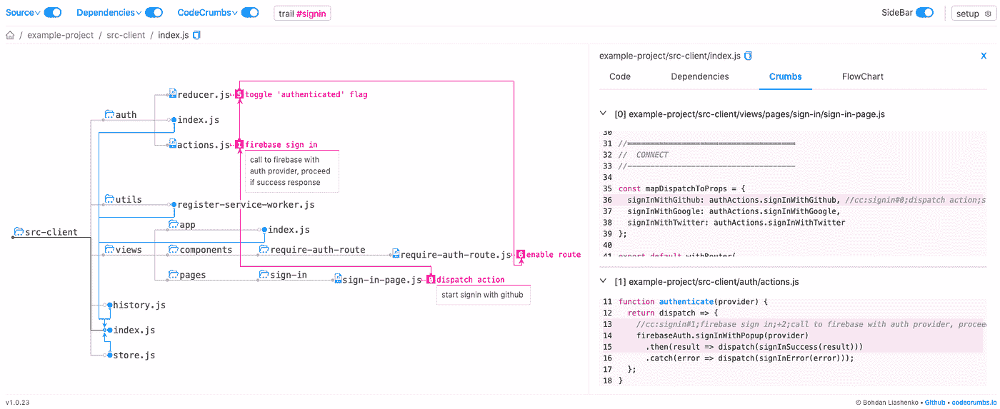
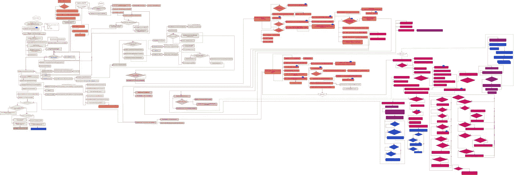
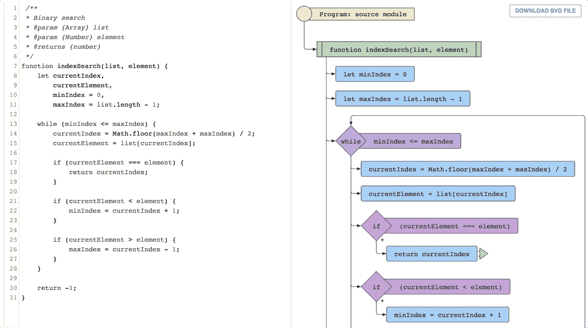
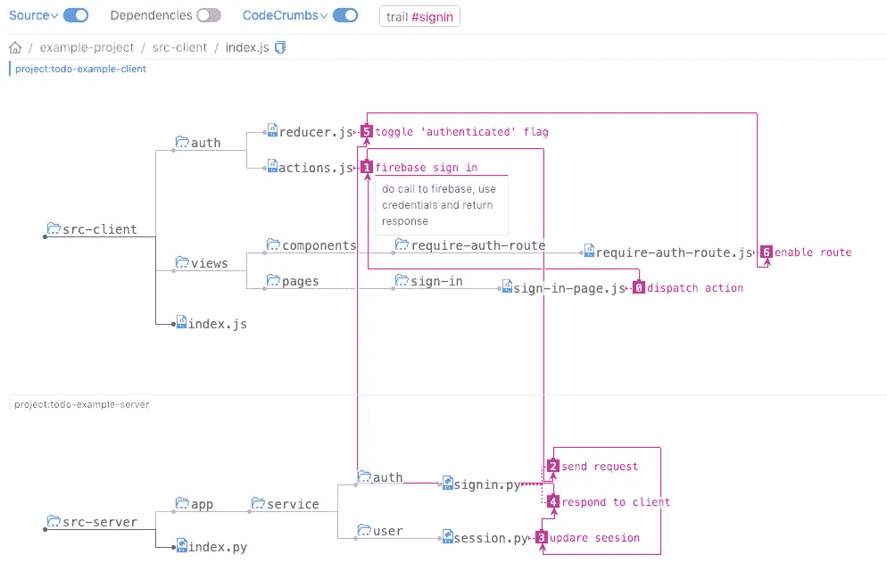
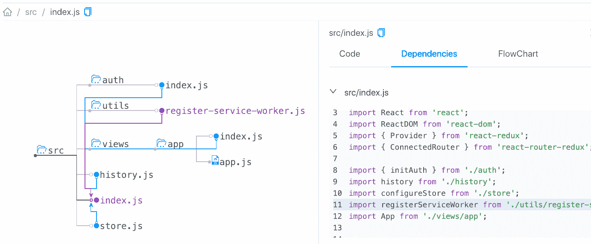
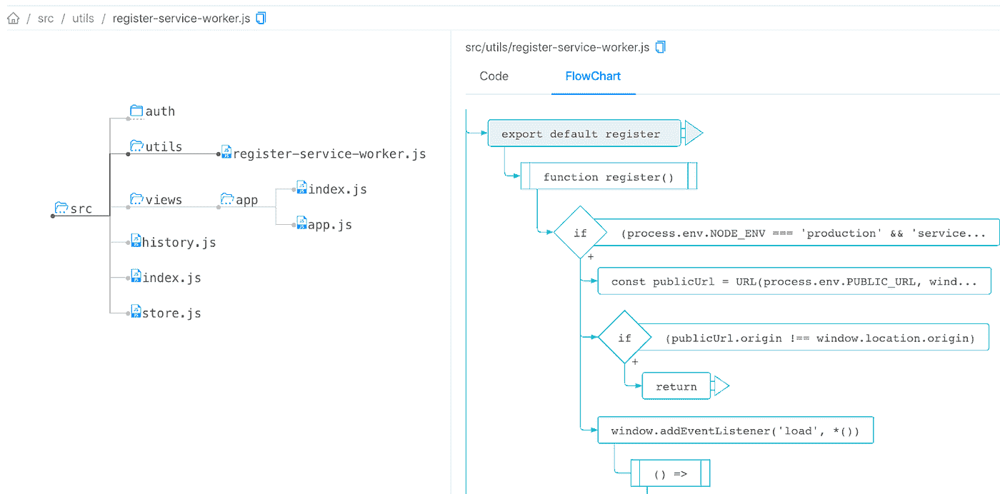
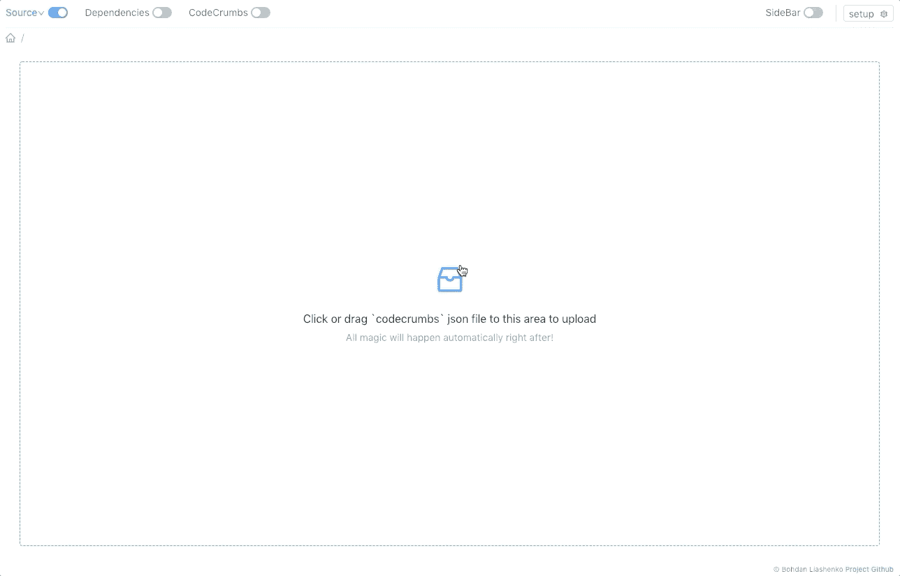

# 我学习源代码和构建开源工具的故事

> 原文：<https://itnext.io/my-story-of-learning-source-code-and-building-open-source-tools-e9583e020893?source=collection_archive---------2----------------------->

大家好，我叫 [Bohdan](https://twitter.com/bliashenko) ，我是一名 JavaScript 开发人员。我已经学习源代码(JavaScript 和其他)将近 10 年了。在这篇文章中，我想告诉你我开发工具来处理代码的故事，并展示我最新的 Github 项目 [codecrumbs](https://github.com/Bogdan-Lyashenko/codecrumbs) 。

# 项目理念

这一切始于整整两年前，当时我决定钻研 React 源代码。显然，这不是一个简单的任务，我花了近 3 个月的时间试图理解它，并在我的脑海中建立一些所有事情如何一起工作的画面。结果[引擎盖下反应](https://github.com/Bogdan-Lyashenko/Under-the-hood-ReactJS)项目诞生了。

它从社区得到了积极的反馈，所以你可以认为它是“成功的”,但是在我完成它之后，我意识到我学习代码库的方式是超级低效的。以用流程图描述逻辑为例:我花了大量的时间来创建方案。每次我从代码中获得新的发现，都会立即影响整个计划，迫使我移动和排列“碎片”。只是重复的手工劳动。超级烦人，我需要以某种方式自动化。所以我创建了[js-code-to-SVG-flow trade](https://github.com/Bogdan-Lyashenko/js-code-to-svg-flowchart)。将任何 JavaScript 代码转换成 SVG 流程图的库。

分析我自己研究大型项目源代码的经验，我得出结论:**对我来说，理解一段特定功能的代码并不困难，因为很难看到“大画面”**，强加抽象并剔除不重要的细节。每次我发现自己只是在文件之间毫无意义地跳跃，经常多次打开同一个文件，意识到“哦，我已经看到这个了，这不是那个地方”或“我刚才看到的正确的地方在哪里。”

因此，我需要某种工具来标记代码中的重要位置，理想情况下，如果它可以构建一些关于所有东西如何一起工作的“视觉画面”。这就是 [codecrumbs](https://github.com/Bogdan-Lyashenko/codecrumbs) 项目(源自“代码”和“面包屑”)出现的方式——一个允许你在代码中留下“面包屑”并从中构建可视化方案的工具。

# 履行

该项目是使用套接字通信的客户机-服务器体系结构的经典例子(一切都是用 JavaScript 实现的)。服务器分析项目代码，寻找包含“代码碎屑”的注释，收集它们并发送给客户端。客户将它们添加到项目结构中，并绘制一个 SVG 图像。有对“实时更新”的支持，所以使用过程可能如下:在一台显示器上——你的代码编辑器，在另一台显示器上——带有“codecrumbs”客户端的浏览器标签。写一条评论——该方案是动态重建的。

# 特征

面包屑痕迹——一系列代码碎屑可以用来描述一些数据流(例如，用户登录，或表单提交等)。).申请单代码库或多代码库集成——研究子模块之间的联系。

依赖关系树—为入口点生成依赖关系树。您可以选择连接并查看“导入了什么”和“它的实现”

流程图—构建所选文件代码的 SVG 流程图([js2 流程图](https://github.com/Bogdan-Lyashenko/js-code-to-svg-flowchart)在幕后使用)

分享代码碎屑状态——你可以轻松地与他人分享你的发现。只需下载 codecrumbs store 的 json 文件，发送给朋友，他/她稍后可以上传到 codecrumbs 来查看相同的图片(即使本地没有项目)。

多语言支持—当前版本支持下一代编程语言:

*   Java Script 语言
*   以打字打的文件
*   计算机编程语言
*   服务器端编程语言（Professional Hypertext Preprocessor 的缩写）
*   Java 语言(一种计算机语言，尤用于创建网站)
*   C++和其他使用//作为注释的语言:)

# 未来计划

这个工具(codecrumbs)允许我们更快地学习、记录和解释代码库。此外，通过下载和上传功能，收集和分享您的“调查结果”变得非常容易。

最终目标是在[网站 https://codecrumbs.io](https://codecrumbs.io/) 上提供许多案例研究。项目库“用 codecrumbs 解释”，这是一个用真实世界的例子进行协作学习的地方。

更多功能即将推出，敬请关注。**请放个“星星”和朋友们分享**，感激不尽:)Github-repo 这里[https://github.com/Bogdan-Lyashenko/codecrumbs](https://github.com/Bogdan-Lyashenko/codecrumbs)。谢谢！

如果你喜欢这篇文章，并想了解我下一篇文章的更新，请在 twitter 上关注我。