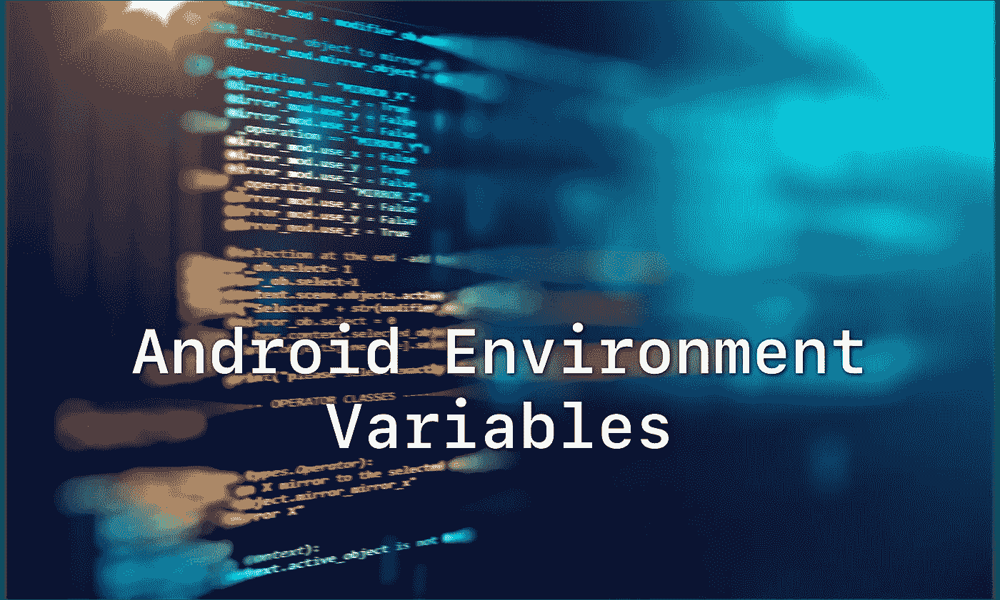

# 我对 Android 项目中环境变量的看法

> 原文：<https://itnext.io/my-take-on-environment-variables-in-android-project-d77e0e466f43?source=collection_archive---------2----------------------->

今天我想告诉你一个管理 env 变量的有趣方法(那些你通常放在`build.gradle`中的东西)。

> *免责声明:*我并不是在假装这是最正确的做法(甚至根本就是正确的)，但它解决了我在项目中面临的问题。

# 环境和变量

首先我们来定义一个**环境变量**在 Android app 中是什么意思。通常它是一个`String`或`boolean`标志，根据你运行应用的环境而变化。假设您的 API 有两个不同的服务器:

*   *开发服务器，*主要开发和测试发生的地方
*   *生产服务器，*您的应用上线的地方

Android 中那些服务器的 URL 常用的放置方式是什么？对，是`BuildConfig`

像这样设置好你的`build.gradle`并同步项目后，你可以用`BuildConfig.BASE_URL`在你的代码中访问它。这里是你的环境变量。根据你使用的建筑类型，它会有所不同。

# 构建脚本与代码

这是一个非常好的方法，适用于大多数项目。但是不久前，我的领导给了我一个有趣的任务:“我们应该能够通过点击一个按钮从开发切换到生产，然后再切换回来”。
事实证明，我无法用`BuildConfig`方法轻松地做到这一点:`BuildConfig`类是在编译时生成的，所有变量的设置取决于所选的构建类型，并且不能更改。

也就是说，我决定将所有的环境变量从`build.gradle`转移到实际代码中。首先，让我们描述一下我们的环境变量(在本文中尽量简短):

之后，我们需要为我们的应用程序定义所有的环境

作为最后一步，我们将编写一个`EnvironmentManager`类，它将允许我们获取任何 env 变量，也可以轻松地切换环境。
*(注意下面代码片段中的注释，它们解释了所发生的事情👍)*

我们需要做的最后一件事是将我们的`buildTypes`连接到代码中描述的环境，以便在代码中没有选择任何内容的情况下，为每个构建类型使用正确的变量。为此，我们定义了一个 buildConfig 属性:`DEFAULT_ENV`
，因此，对于全新安装，您的应用程序将使用在`DEFAULT_ENV`中设置的环境

仅此而已！现在你可以像这样使用`EnvironmentManager`:

如果你喜欢这个帖子，请给一些掌声👏
在 twitter 上关注我

[https://twitter.com/timofeipl](https://twitter.com/timofeipl)