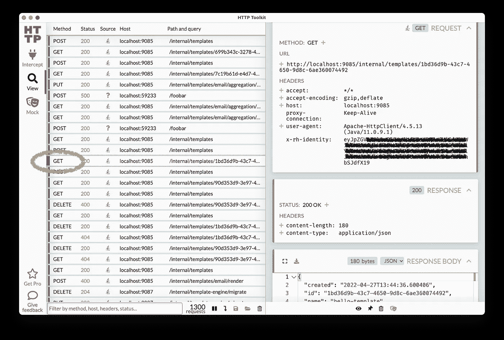
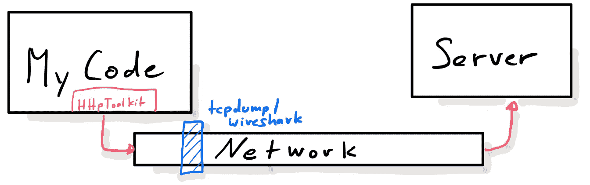
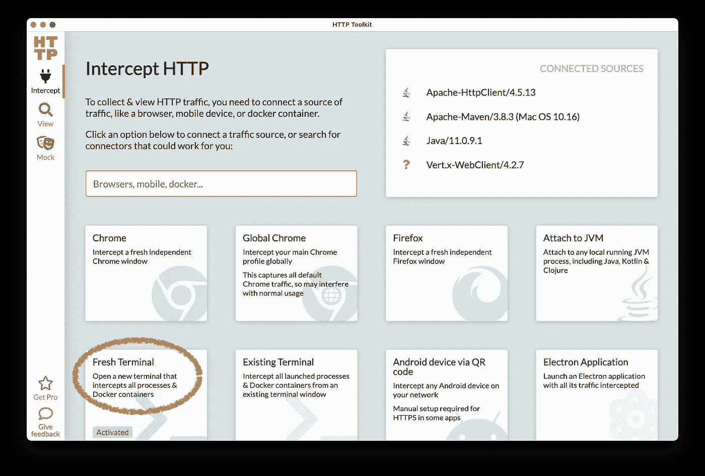
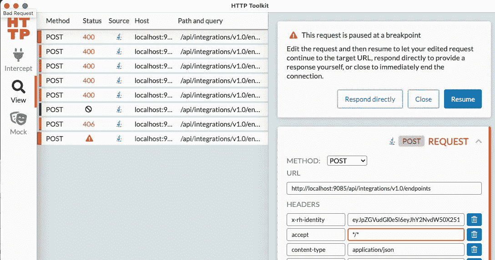

# 我的工具箱:HttpToolkit

> 原文：<https://itnext.io/my-toolbox-httptoolkit-c86239b130b?source=collection_archive---------5----------------------->

*【这是即将推出的工具箱系列的第一篇文章，展示了我在开发工作中使用的一些工具】*

我经常需要找出 HTTP 请求的细节，以对一些 API 进行逆向工程，或者理解错误响应，其中我所使用的 Java 库只抛出一些异常，但除此之外并没有告诉我更多。不久前我发现了 [HttpToolkit](https://httptoolkit.tech) ，从那以后我几乎每天都在使用它(在开发的时候)。

带有一些拦截流量的 HttpToolkit 视图

我在这里使用的工具之一是 tcpdump 和后来的 Wireshark，但这经常不起作用，因为流量在到达网络层时已经被加密。HttpToolkit 使用一种不同的方法，接入用户代码并像代理服务器一样运行，如下图所示。

设置，显示 HttpToolkit 和 tcpdump/Wireshark 的运行位置

上面 HttpToolkit 的截图在左边显示了我用“mvn install”运行的一些集成测试的流量。对于这项工作，设置非常简单:在截取页面上，我只需通过点击下一个截图中显示的相应磁贴来启动一个新的终端，一个新的终端弹出来，我在其中启动“mvn install”。对我来说，当我想调整我的 [mockserver](https://mock-server.com) 规则时，这非常方便。

也可以附加到正在运行的 JVM 上。单击相应的图标，然后从正在运行的 JVM 列表中选择流程。

回到第一个屏幕截图，您可以在右侧看到对左侧所选条目的请求和响应。

有一点需要注意的是，1.7 版本(撰写本文时的最新版本)不会自动拦截进入我的 Quarkus 进程的请求。但是为了这个目的，我仍然可以启动 Wireshark。

回到 HttpToolkit:另一个不错的选择是实际停止并动态重写流量。只需在模拟部分添加一个新规则(不要忘记按 save，否则它不会被激活):

当请求被拦截时，详细信息屏幕变为可编辑状态，您可以修改请求的标题字段，如标记的 accept-header。您可能需要更快，因为一些代码设置了一些低超时。

到目前为止我只展示了一个 UI app，所以你可能会问为什么 Http *Toolkit* ？当你查看他们的 GitHub 库时，你可以看到一堆应用程序，它们也可以在没有 GUI 的情况下单独使用。我还没有使用所有提供的功能，专业版提供了更多。对我来说绝对是一个超级有用的工具，值得一试。

安装很简单，只需进入 [https://httptoolkit.tech](https://httptoolkit.tech) 并下载安装程序。