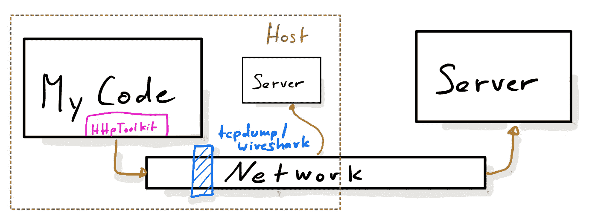
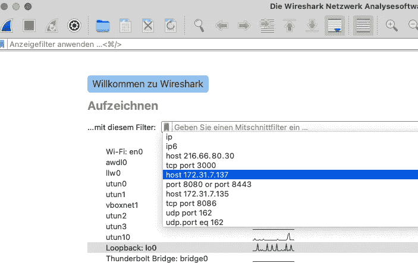
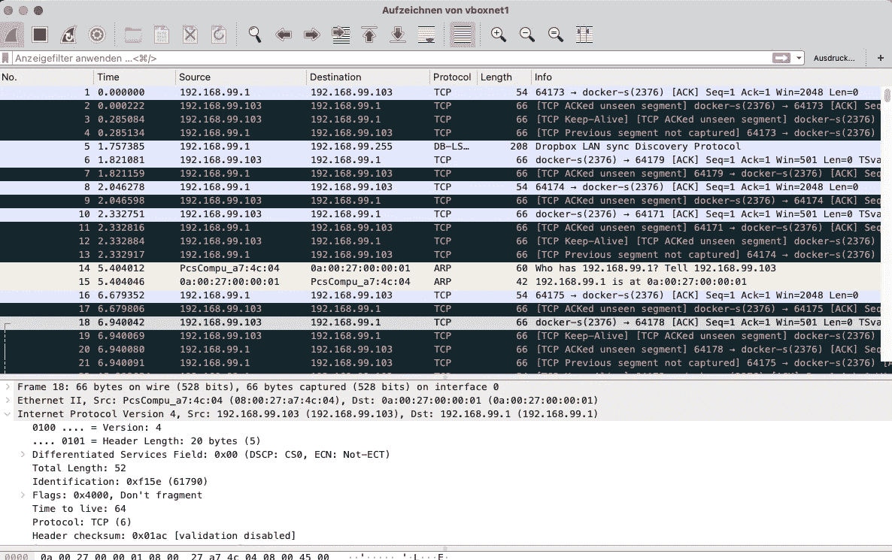
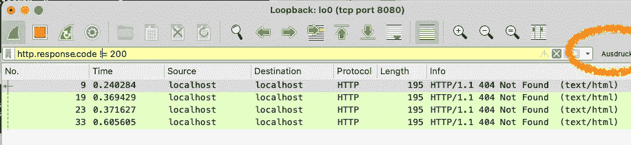
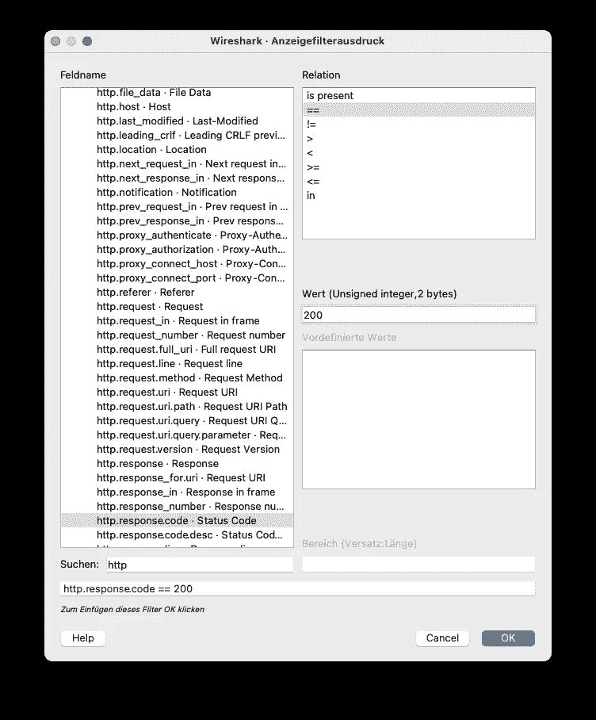

# 我的工具箱:Wireshark

> 原文：<https://itnext.io/my-toolbox-wireshark-c4293f216c43?source=collection_archive---------1----------------------->

在我之前的工具箱文章中，我谈到了 HttpToolkit，以及看到 http 请求是多么的棒。还有一个更老的工具，大概是网络调试工具的瑞士军刀(没错，我已经老到对它的前身 tcpdump 有贡献了)，Wireshark。

Wireshark 直接在运行它的机器的网络层上运行，这一方面意味着您可以“看到”所有正在进行的流量。这也意味着您看不到 https 连接内部的内容。在这里，HttpToolkit 是正确的选择。

启动 Wireshark 后(由于其功能强大，通常需要以特权用户身份完成)，会显示检测到的网络接口列表，并且可以在选定的接口上输入流量过滤器。从上面的截图可以看出，过滤表达式可以相当精细；更多见下文。接口列表还显示了一些关于他们获得的流量的迷你图，这可能是一个很好的提示，看看选择哪一个。本地主机的那个(比如做 curl[http://localhost:8085/](http://localhost:8085/)使用本地主机)标有 *Loopback* ，俗称 *lo0* 。

录制开始后，顶部会出现一个列表视图，每行显示一个数据包，其中包含源和目的地、使用的 IP 协议以及数据包的一些解码信息。当你点击一行时，更多的细节会显示在下面的文本视图中。

您可能已经看到了数据包 18–21 左边的小括号:这些数据包一起属于一个 TCP 连接，该连接在线路上被分成多个 IP 数据包。

上面的观点可能相当无趣，而且过于冗长。图标下方的文本字段允许应用显示过滤器:

过滤得到非 200 响应的 http 请求

可能的过滤器项目列表很大。Wireshark 有一个向导可以交互式地构建这样的过滤器。不幸的是，它有点隐藏——在之前的截图中，我已经用橙色圆圈标记了要调用它的位置。

筛选表达式向导

最好的方法可能是启动 Wireshark 并亲自试用。在 macOS 上，很容易通过*brew install-cask wireshark 从自制软件安装。*您可能还需要安装一个额外的包来更改 *bpf* 的访问权限，bpf 是提供过滤的(伪)设备:*brew install—cask wireshark-chmodbpf*

## TL；博士；医生

Wireshark 是一个超级强大的工具，可以进行各种调试并了解计算机网络层上发生的事情。它的界面可能有点神秘，但值得一试。Wireshark 帮助了我很多次，我无法大声称赞它的价值。