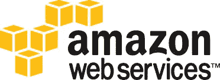
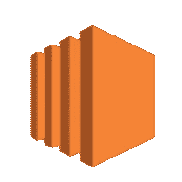
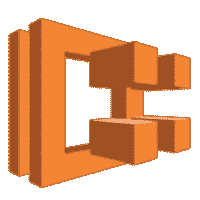
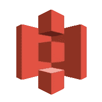
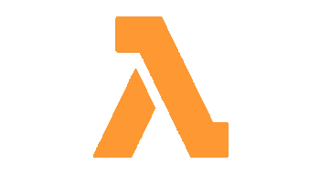

# 我的 10 大 AWS 服务

> 原文：<https://itnext.io/my-top-10-aws-services-e6ebda3e891?source=collection_archive---------5----------------------->

我认为所有 AWS 开发者都应该知道的关于 AWS 服务的 10 大指南。

AWS 很庞大。凭借其众多的服务和持续的更新，AWS 是开发人员的乐园，但其庞大的规模可能会让新手不知所措。

这就是为什么我整理了一份关于我的**十大 AWS 服务**的指南，我认为所有 AWS 开发者都应该知道；不管你是在从事大数据、机器学习、网络应用、物联网还是网络工作，因为你可能需要在某个时候与它们互动。

排名不分先后，以下是我的前 10 名:

# EC2

**什么事？**

云中的可扩展服务器。

**为什么重要？**

好吧，我们先把大的做完。

AWS EC2 是 AWS 的主干。这是 2006 年推出的首批服务之一，采用了传统的数据中心概念，但只需点击一个按钮，你就可以在没有任何承诺的情况下启动和关闭服务器。你可以把 EC2 想象成一块空白的画布，你可以在上面安装、配置和运行任何你想要的东西，甚至是 minecraft 服务器。此外，如果您不想自己安装某些东西，可以从市场上启动预配置的快照，称为 AMI。

最重要的是，EC2 在许多 AWS 认证考试中占很大一部分，所以学习 EC2 吧。

# 精英公司

**是什么？**

可伸缩的无服务器容器编排。

**为什么重要？**

除了 EC2，ECS 是在 AWS 中运行定制应用程序的另一种主要方式。

这是一个受管理的(并且可以是完全无服务器的)容器编排服务。这意味着不用担心你的应用程序运行的底层硬件；你只需要确保你的应用可以在 docker 容器中运行。

对于开发者来说，这意味着他们的应用可以很容易地移植到不同的云提供商。从安全角度来看，这意味着无需修补主机操作系统；从经济角度来看，这意味着您只需支付所需的计算费用，而不是像 EC2 那样支付整个服务器的费用。

对于应用程序开发人员来说，了解 ECS 是必须的——就个人而言，这是我定制应用程序的必经之路。

# 无线电数据系统

**什么事？**

托管关系数据库

**为什么重要？**

不管你喜欢 SQL 还是 NoSQL，事实是 SQL 数据库本身就是一个巨大的产业。许多复杂的应用程序需要某种关系数据库，而 RDS 是实现这一点的最佳方式。

RDS 消除了自己管理关系数据库的痛苦(以及运行服务器来托管它的开销成本),并支持许多数据库引擎，包括 Oracle、MSSQL、MariaDB、MySQL，当然还有唯一真正的选择 PostgreSQL。RDS 已经存在很长时间了，它是 AWS 认证中出现的另一项服务，所以请确保您花一些时间了解诸如读取副本和从快照备份之类的主题。

# DynamoDB

**什么事？**

托管键值和文档数据库

**为什么重要？**

我们已经以 RDS 的形式讨论了 SQL，现在让我们来谈谈 NoSQL。DynamoDB 是一个托管的无服务器键值存储，这意味着您不用再担心任何底层基础设施、扩展或维护。

DynamoDB 的独特之处在于，您不必为数据库的调配大小付费，而是为所需的吞吐量(每秒所需的读/写次数——可以手动或按需扩展)和使用的存储付费。

DynamoDB 是无模式的、快速的、有弹性的，非常适合任何需要扁平数据库层次结构的用例——它是 AWS 的默认 NoSQL 存储。与其他一些技术一样，它已经存在了很长时间，并经常出现在许多 AWS 认证中，但由于复杂性降低，其程度不如 RDS。

# S3

**什么事？**

简单的可扩展弹性对象存储

**为什么重要？**

S3 是 AWS 最简单的服务之一。

它是简单的对象存储，你可以像存储传统文件系统一样存储文件。S3 的重要之处在于，尽管它很简单，但却非常灵活，被许多其他 AWS 服务用作中间存储。建立一个数据湖？使用 S3 进行数据存储。我想使用 AWS code pipeline——它使用 S3 来存储构建工件。想在 AWS Athena 上查询数据—它使用 S3 来存储查询结果。

最重要的是，S3 还有一个分层定价结构，您只需为您使用的存储付费，但这一成本取决于您访问数据的速度和频率。

有了这些，S3 在所有 AWS 认证中频繁出现也就不足为奇了…学习 S3，因为你肯定会用到它。

# VPC

**什么事？**

AWS 资源的隔离虚拟网络

**为什么重要？**

VPC 允许您提供 AWS 云的逻辑隔离部分，您可以在其中启动 AWS 资源。

想做 EC2，你需要一台 VPC。想要运行 ECS 群集—您将需要一个 VPC。托管一个 web 应用程序——你需要一个 VPC。VPC 是许多 AWS 资源的基本要求，包括从子网和网络网关到路由表和 NACL 的一切。

由于其复杂性，它构成了许多 AWS 认证的一大部分，对于任何希望部署到 AWS 的人来说，它都是必须知道的。

# 希腊字母的第 11 个

**什么事？**

无需服务器即可运行代码

**为什么重要？**

虽然 EC2 和 ECS 非常适合运行连续的流程或应用程序，但是当您只想按计划运行一个小脚本或响应一个事件时，该怎么办呢？

这就是 Lambda 发挥作用的地方。

Lambda 提供了一个无服务器的平台来编排和运行小脚本，只要它们在 15 分钟内完成，而不必运行一个超大的服务器和编排工具。需要运行脚本来响应上传到 S3 的数据吗？使用 Lambda。需要一个脚本在每隔一天的上午 10 点运行吗？使用 Lambda。

Lambda 是事件驱动处理和脚本执行的首选。

# KMS

**什么事？**

安全的数据加密和密钥管理

**为什么重要？**

安全性很重要，在云上更是如此，不正确的设置会将您的资源暴露给外界。KMS 在云端保护数据和机密。

存储 S3 的数据？使用 KMS 密钥对其加密。在机密管理器中存储机密密钥—您需要使用 KMS 来完成此操作。

使用 KMS 对于构建安全的 AWS 本地解决方案至关重要。

# 云观察

**什么事？**

资源的日志、监控和洞察

**为什么重要？**

一旦我们让资源和应用程序在云中运行，我们需要能够观察它们并访问它们的日志。如果出了什么事，我们需要知道到底发生了什么。

这就是 CloudWatch 发挥作用的地方。

使用 CloudWatch，我们可以从托管服务和我们自己在 ECS 和 EC2 上运行的应用程序中收集日志。我们还可以使用 CloudWatch 进行事件处理，并安排 lambda 事件。

因此，无论您是将服务部署到 AWS 还是调度事件驱动架构，CloudWatch 都至关重要。

# AWS IAM

**什么事？**

用户和权限管理

**为什么重要？**

在您开始向 AWS 部署服务之前，您需要考虑 IAM。IAM 是我们为用户和角色分配权限的方式。

因此，如果您正在设计一个需要访问私有 s3 存储桶的服务，您将需要使用 IAM 来为您的服务正在使用的角色分配 S3 读访问权限。学习 IAM 权限对于应用程序开发人员和安全工程师来说都是无价的。

IAM 也是 AWS 认证中经常出现的另一项服务，因此有必要熟悉一下最常见的服务。

# 你怎么想呢?

感谢您花时间阅读本指南——我希望它能有所帮助！如前所述，这些是我个人的观点，这些申请没有任何特定的排名顺序。

如果有一个你所信赖的 AWS 应用程序，它没有出现在这十大列表中，或者你对这些应用程序有任何问题，我希望收到你的来信。

如需更多博客和技术见解，请在 Twitter 上关注我@ [joellutman](https://twitter.com/joellutman) 获取更多关于 AWS、云计算、无服务器和软件开发的信息