# 我的虚拟疫苗接种计划

> 原文：<https://itnext.io/my-virtual-vaccination-program-5ee0ca1a34de?source=collection_archive---------4----------------------->

三个月前，我创造了一个没有僵尸的国家机器，它允许你创造关心的公民，并帮助他们在疫情社会中生存。(这是一个多么荒谬的句子。0-O .)

我在一篇名为“[状态机中没有僵尸”](/no-zombies-in-state-machines-b24511a2270e)的文章中分享了该应用程序的链接，令人惊讶的是，大量的人开始创建和关心虚拟的关心公民。不知道为什么。有人要求一个模拟我们现在生活的地狱场景的应用程序吗？

但这就是生活，现在我有一大群关心我的公民要照顾。我也非常担心那些忧心忡忡的公民。所以，我认为是时候开始给我的公民接种疫苗了。

(无关说明:到今天为止，没有人决定杀死一个关心的公民，尽管每个人都能够这样做。相信人类，人们！)

我们今天的任务是:

1.  邀请人们接种疫苗
2.  使公民能够获得或拒绝他们的疫苗(使用子案例)
3.  通过仪表板跟踪我们的民众健康状况(我们达到群体免疫了吗？)

让我的人接种疫苗吧！

# 第一节:草案

我就如何称呼疫苗的邀请过程进行了很多内部讨论。原则上，我希望被邀请参加疫苗接种，尽管我知道其他人会有所保留。所以我想要一个术语来反映这一点。例如，受到诚挚的邀请。但是另一方面…这不是你一个人做的事情。这是你对社会福利的贡献，这种责任感也应该得到体现。

因此，最后我决定，决定谁接种疫苗的机制被称为“草案”，但每个公民都会收到“邀请”。很明显，他们可以拒绝。

在这一节中，我们将构建草稿的机制。在现实生活中，决定谁先接种疫苗是复杂的，取决于许多变量。在我的世界里，事情没那么复杂。

我将在草案中使用我的公民的三个属性:

*   伊萨 live
*   易受伤害
*   IsDrafted

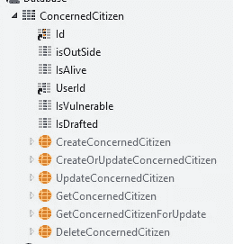

显然只有活着的人才有资格接种疫苗。我们只会起草那些还没有起草的。而那些易受攻击的(IsVulnerable=True)优先。征兵的时候给人留两种疫苗，和现实世界的国家做的多少不一样，但这是我个人的偏好。

我们每周都会接种疫苗，实际上数量是随机的，在 2 到 8 之间。当我们这样做的时候，我们将根据这个数字+库存，拟定我们可以给予 2 种疫苗的公民数量。所以，如果我们有 6 种疫苗，那就是 3 个公民。如果我们有 3 个疫苗，一个公民将被选中，一个疫苗将被储存。

来实施吧！

我设置了一个计时器来确保我们每周都能接种疫苗:

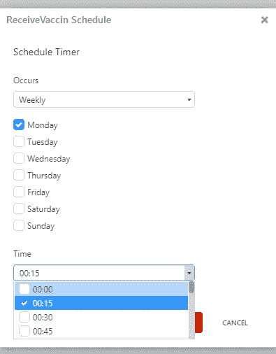

在相关的动作中，我调用了 Draft 过程，给它一个随机数作为输入，使用 Forge 的[随机数生成器](https://www.outsystems.com/forge/component-overview/677/randomizer-number-generator)来创建这个输入。

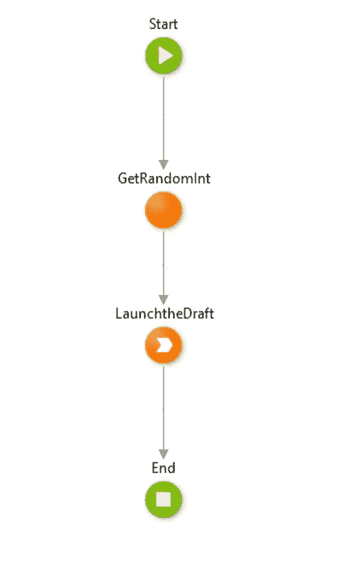

让疫苗送达

起草过程很容易理解。我首先计算我可以招募多少人，然后我从数据库中获取公民的数量，并为他们创建疫苗子案例。这里有一些图片来说明。

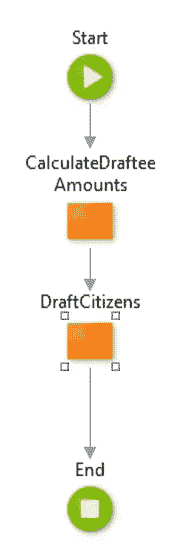

起草过程

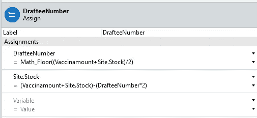

计算征兵人数和库存量

我有点担心我的数学在这里不完全正确，所以我很快使用 BDD 框架构建了一个数据驱动的单元测试来检查。我的算法在 15 个不同的例子中得出了正确的结果，所以我相信它:-)想自己测试一下吗？在这里运行我的测试集。
(注意:有一个测试会失败，因为我错误地输入了我的测试数据。-\_(-_-)_/-)

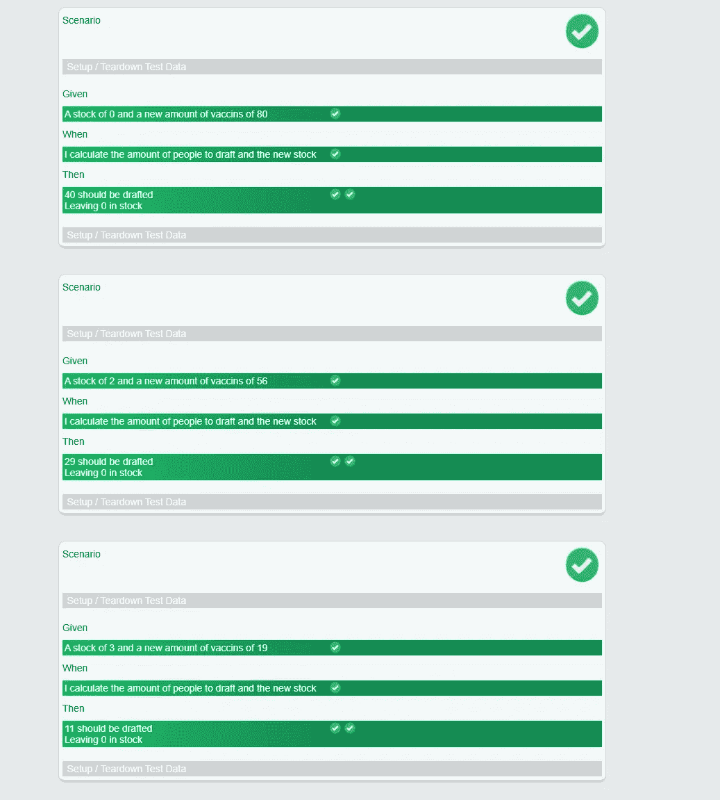

我的自动化测试集，使用 BDD 框架。

在确定了疫苗的数量后，我正在选择适当数量的公民，并邀请他们接种疫苗。

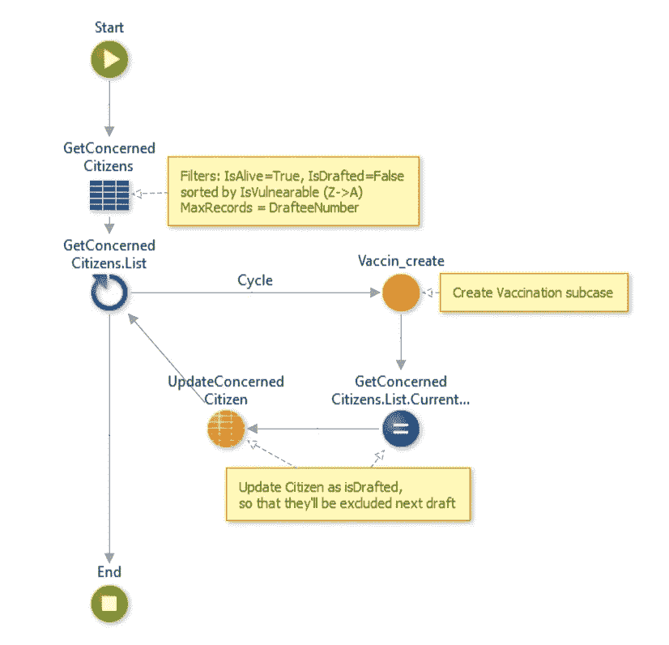

实际的起草逻辑

这样我的召唤逻辑就完成了。我的疫苗接种计划已经启动并运行！
不幸的是，现在人们可能会被邀请接种疫苗，但却无法真正接种疫苗。我们还没有这种情况。Vaccin_create 目前是一个空操作。因此，让我们开始构建我们的疫苗接种子案例吧！

# 第二部分:虚拟疫苗

那么你如何给一个虚拟的人接种疫苗，这个虚拟的人只是作为一个案例存在于一个国家机器中？当然是通过一个子案例！

一个子案例将允许我拥有一个单独的数据集和它自己的状态。这将有助于我们组织疫苗，而不会扰乱我们公民的日常生活。与此同时，子病例与市民联系在一起，因此我们永远不会忘记我们在给谁接种疫苗。

通常，设置子案例与设置案例非常相似。也就是说:我们创建一个业务实体，案例定义，一组状态，因为这个子案例是一个状态机，列出状态转换。

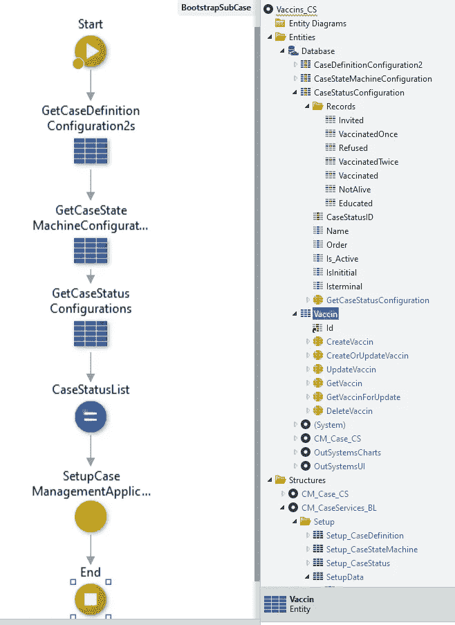

子案例与案例的不同之处仅仅在于初始化。要为一个案例在业务实体中创建记录，您需要在 create_BusinessEntity 记录操作周围有一个 crud-wrapper。毕竟，实体有 CaseIdentifier 作为标识符，所以您需要在创建记录之前初始化案例。这就是神奇的子案例发生的地方:您使用父案例作为父 id 来初始化案例。

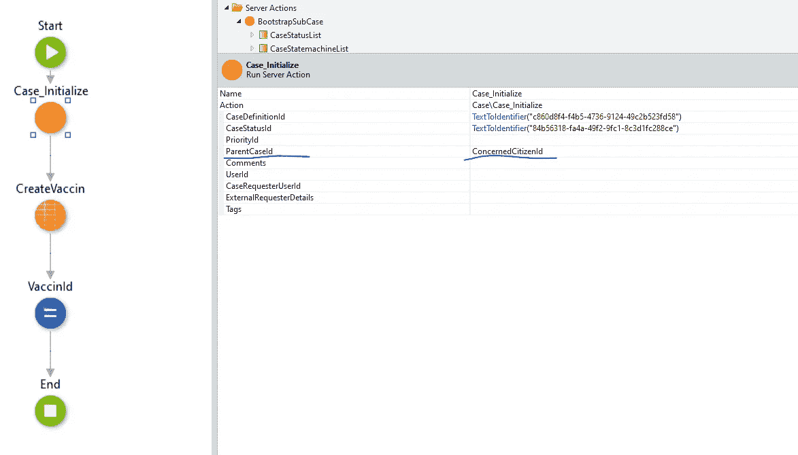

这就是将子案例链接到其父案例所需做的全部工作。一旦你做到了这一点，你就可以很容易地从任何你已经有了主机箱的地方访问你的子机箱。从理论上讲，我可以根据自己的需要制造尽可能多的子箱，比如，当有人外出时，可以开始制造一个戴面具的子箱。这可以很容易地相邻存在。

但是现在，让我们把注意力集中在疫苗上。(作为一个真正的世界领袖，我会说:-D)

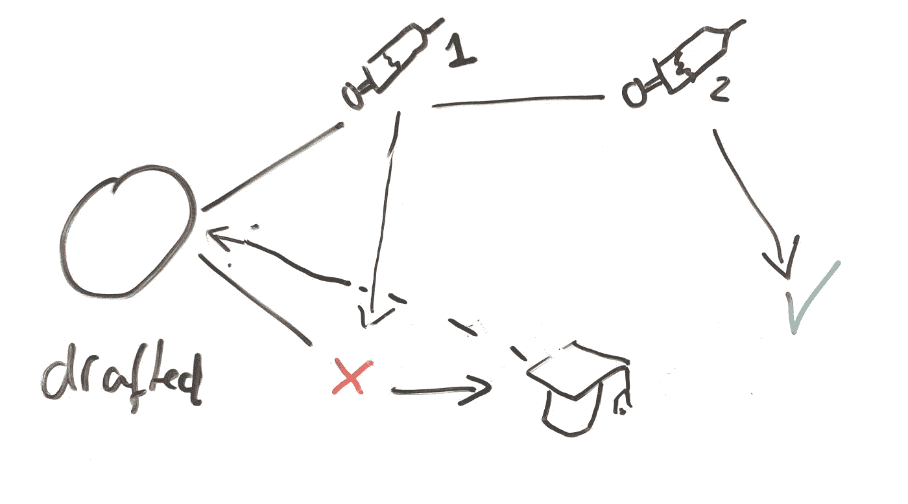

我的疫苗接种状态机(未图示:非存活状态。它确实使模式变得混乱)

所以我的疫苗接种状态机本质上很容易理解。当一个人被招募时，他们会被邀请接种疫苗 1，他们可以接受也可以拒绝。如果他们接受，他们将接种疫苗，然后被邀请接种疫苗 2。他们再次有机会接受或拒绝。接受第二种疫苗后，他们将幸福地生活在对 Covid19 免疫的环境中。

如果他们拒绝接种疫苗，他们就会进入另一个轨道:我们会认为他们拒绝接种疫苗是因为他们对此有所顾虑，并会继续对他们进行疫苗教育，希望消除他们的顾虑。之后，他们被邀请再次参与疫苗接种过程。我们为他们保留的疫苗一直保留着。正如你所看到的，在拒绝路径上有一个特定的圆周运动。在这个模型中，我没有人不接种疫苗的终点。

或者实际上，在我在《死亡》中模拟的代码中有……但是我没有把它画出来，因为它真的让我的画很混乱。令人沮丧。我认为这个僵尸项目可能是世界上第一个 [momento mori](https://en.wikipedia.org/wiki/Memento_mori) 国家机器。

剩下的实现工作并不多，因为我使用了 Case Management 框架中已经可用的许多功能。我在屏幕上添加了疫苗块:

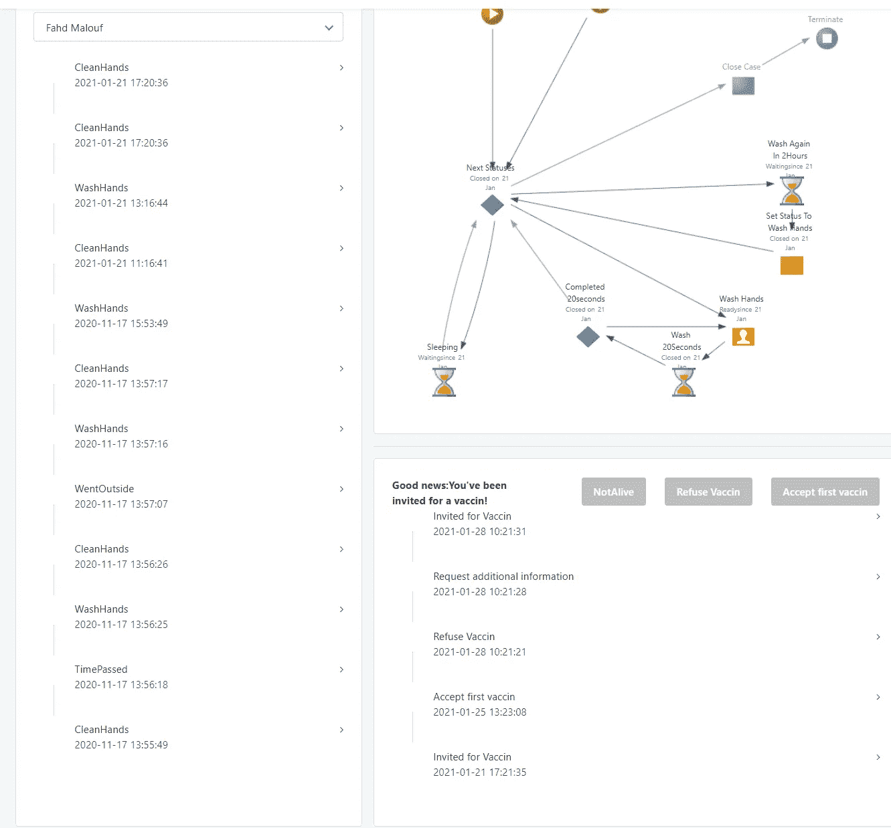

我们的新公民筛查具有疫苗接种能力

我添加了一些自动状态转换:

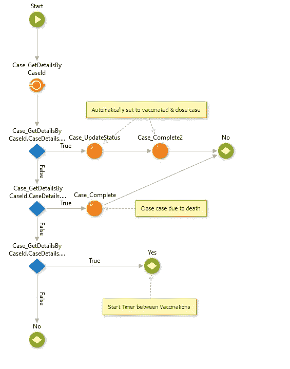

自动化状态转换

我设置了一个定时器，在两次接种之间等待三周。

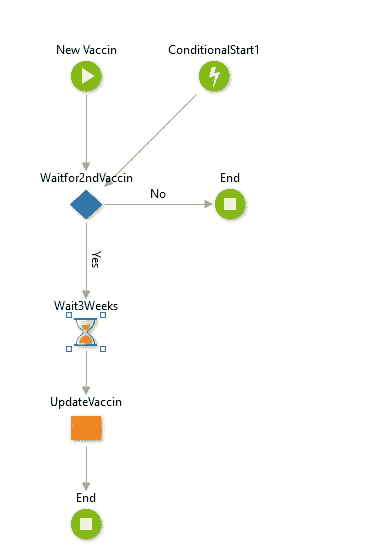

在接种疫苗之间设置计时器

我甚至构建了一些逻辑来在参与者死亡的情况下停止疫苗接种(根据父代的变化更新子案例):

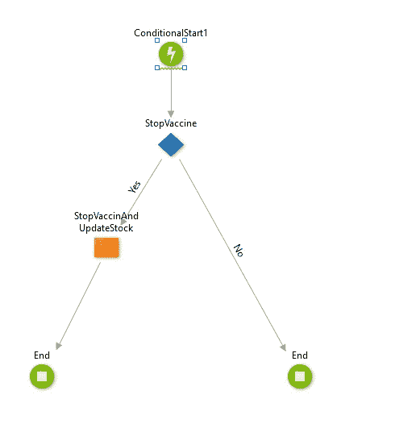

有了它，我的疫苗接种项目开始运行了！现在，要是我知道我的疫苗接种计划有多成功就好了…

# 第 3 部分:仪表板

为了检查我的人口接种情况，我创造了这个[小仪表板](https://sezen-debruijn.outsystemscloud.com/NoZombies/VaccinDashboard?_ts=637474354124438498)。它显示了人口计划的一些元数据。

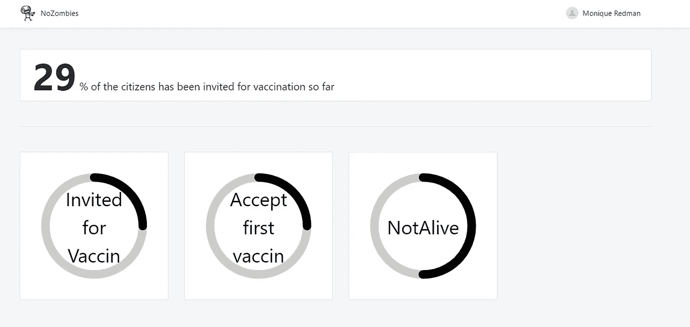

你也可以看到我不得不杀死一些公民来检查我的非活体机制是否在父母和孩子之间同步。我想，没有牺牲就没有进步！

(请注意，我是开玩笑的！没有牺牲的进步不仅是可能的，而且是每天都能实现的。相信人类，人们！只是不在我身上。)

# **第四部分:最终想法**

所以我们有它。我对我们生活的疯狂时代的见证。首先，我创造了一个试图避免被感染/感染他人，同时避免成为僵尸的平民群体。现在我加入了一个更积极的社会发展，加入了疫苗，因为我们正慢慢走向来世。

我没有天真到认为这条路会很容易。不会有最后的障碍，或突然戏剧性的发展让我们陷入困境。但我仍然非常乐观。2020 年 3 月，荷兰首相指出我们正处于日冕危机的哪个阶段，他说:“我们已经走过了起点，但还没有到达起点的终点。”

作为我自己的虚拟社区的总理，现在让我在 2021 年 1 月说:“我们已经走过了开端的终点，现在正处于终点的起点。”。