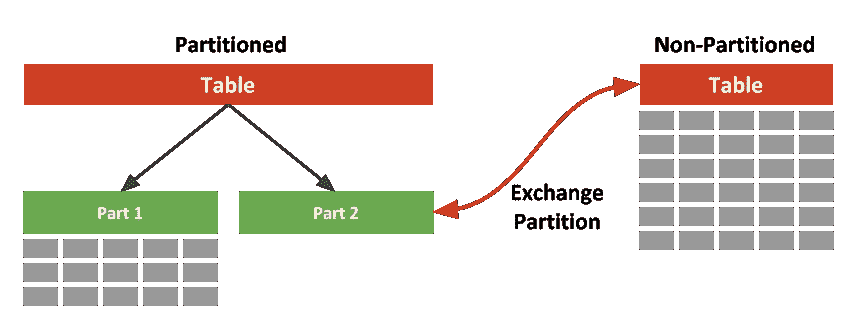
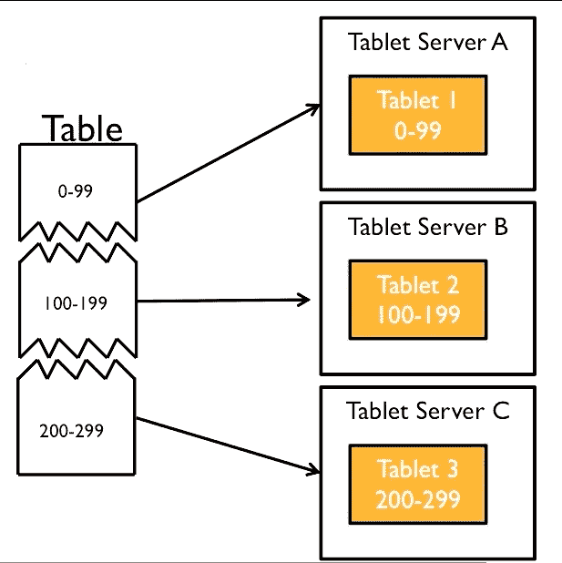
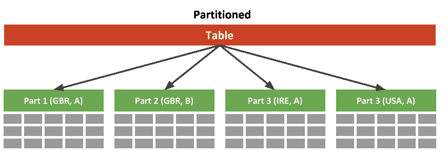
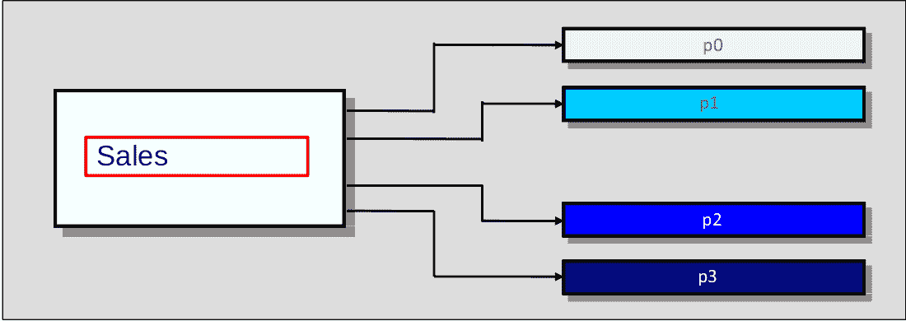
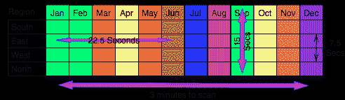
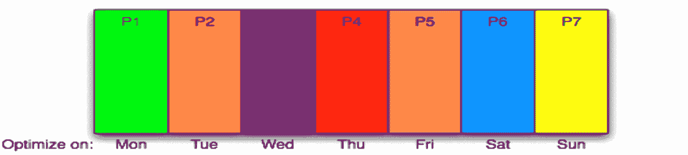

# SQL 缓存和表分区(后续)

> 原文：<https://itnext.io/mysql-caching-and-table-partitioning-c65d7010216e?source=collection_archive---------1----------------------->


继我的上一篇文章[优化 SQL 查询的技术](https://medium.com/itnext/techniques-for-optimising-sql-queries-c362dbe626b4)之后，我将再讨论两个主题来提高查询和数据库的性能。

*   [缓存 SQL 查询结果集 ](#80a5)
*   [**表分区**](#00df) **——**[**什么是分区**](#c5ba) **——**[**分区的类型有哪些**](#fe4f) **——**[**为什么分区**](#d04c) **——**[**分区和索引**](#dd78)

# **缓存 SQL 查询结果集**

**我们在 SQL 数据库中有两级缓存。默认情况下启用一级缓存，而必须配置二级缓存。你可以在这篇由 [Darshan Dalwadi](https://medium.com/u/c3c2a62da97b?source=post_page-----c65d7010216e--------------------------------) 撰写的[文章](https://medium.com/swlh/what-is-hibernate-caching-introduction-of-level-1-level-2-cache-8ea7339a5052)中阅读更多关于一级和二级缓存的内容。**

**由于默认情况下一级缓存是启用的，所以我们唯一能做的就是根据我们用来连接和处理数据库的技术或 ORM，将缓存驱动程序改为使用数组、文件或任何其他类型。**

**另一方面，二级缓存是禁用的，因此我们必须启用它，并根据我们的需求进行配置。这可以通过 [MemCached](https://medium.com/@mena.meseha/memcached-synchronizes-with-mysql-data-42a5d09c8b11) 进行配置，MemCached 由[米娜·阿尤布](https://medium.com/u/a7eb0e304f8a?source=post_page-----c65d7010216e--------------------------------)、 [Redis](https://dltlabs.medium.com/the-art-of-caching-with-redis-eaaa89ae74be) 提供快速介绍，由 [DLT 实验室](https://medium.com/u/aca22eb440b9?source=post_page-----c65d7010216e--------------------------------)、Riak 或任何其他服务提供，我们可以将它们用作与 SQL 兼容的缓存。**

**在来自 [Sudheer Sandu](https://medium.com/u/8493c3c4b789?source=post_page-----c65d7010216e--------------------------------) 的这篇[文章](https://medium.com/@sudheer.sandu/distributed-caching-the-only-guide-youll-ever-need-fe152357f912)中，您会发现对缓存的详细解释，包括数据库缓存。**

# **表分区**

****

## **什么是分区？**

**分区将一个表分成更小的逻辑部分，称为“分区”。看起来还是像张桌子。分区是用 CREATE 或 ALTER 语句定义的。**

```
CREATE TABLE Sales ( saleDate date, … ) 
  PARTITION BY KEY(saleDate) PARTITIONS 16;

ALTER TABLE Sales 
  ADD PARTITION (date = '2016-05-14');
```

**SQL engine 知道如何将表分成更小的部分，并使用这些信息来加速查询。在许多小零件上的操作通常比在一个大桌子上更快。**

## **分区的类型有哪些？**

**总共有 5 种分区类型，其中两种类型在现有分区中还可以有其他分区。所有这些分区类型都在下面进行了解释。**

*   ****范围分区**根据给定范围内的列值将行分配给分区。**

```
CREATE TABLE Table (
  id INT NOT NULL,
  firstname VARCHAR(25) NOT NULL,
  joined DATE NOT NULL
)
PARTITION BY RANGE( id) (
  PARTITION p0 VALUES LESS THAN (100),
  PARTITION p1 VALUES LESS THAN (200),
  PARTITION p2 VALUES LESS THAN (300)
);
```

****

**范围划分**

*   ****列表分区**类似于按范围分区，除了分区是根据与一组离散值之一匹配的列来选择的。**

```
CREATE TABLE Table (val INT)
PARTITION BY LIST(val)(
  PARTITION myFirstPart VALUES IN (1,3,5),
  PARTITION MyPart VALUES IN (2,4,6),
  .........
);
```

****

**列表分区**

*   ****散列分区**是指根据用户定义的表达式返回的值选择一个分区，该表达式对要插入到表中的行中的列值进行操作。该函数可以由 SQL 中产生非负整数值的任何有效表达式组成。这种类型的扩展，线性散列，也是可用的。**

```
CREATE TABLE Sales (
  id INT NOT NULL,
  store_name VARCHAR(30),
  store_id INT
)
PARTITION BY HASH(store_id) PARTITIONS 4;
```

****

**哈希分区**

*   ****键分区类似于哈希分区，只是只提供了一个或多个要评估的列，并且 SQL server 提供了自己的哈希函数。这些列可以包含除整数值之外的其他值，因为 SQL 提供的散列函数保证了整数结果，而不管列数据类型如何。这种类型的扩展，线性键，也是可用的。****

```
CREATE TABLE Sales ( order_date date, ... )
  PARTITION BY KEY(order_date) PARTITIONS 4;
```

*   ****列分区**是范围和列表分区的变体。列分区允许在分区键中使用多个列。所有这些列都被考虑在内，以便将行放置在分区中，并确定在分区修剪中要检查哪些分区的匹配行。**

```
CREATE TABLE rcx (
  a INT,
  b INT,
  c CHAR(3),
  d INT
)
PARTITION BY RANGE COLUMNS(a,d,c) (
  PARTITION p0 VALUES LESS THAN (5,10,'ggg'),
  PARTITION p1 VALUES LESS THAN (10,20,'mmm'),
  PARTITION p2 VALUES LESS THAN (15,30,'sss'),
  PARTITION p3 VALUES LESS THAN (MAXVALUE,MAXVALUE,MAXVALUE)
);
```

*   ****子分区，**范围和列表分区可以用键和散列子分区。在下图中，它显示了按月份细分的区域范围。我们看到了如何查询表以获得更快结果的不同组合。如果我们查询整个表，扫描并返回一个结果需要 3 分钟，但是如果我们只查询所有地区的 9 月份，我们在 15 秒内得到一个结果。**

****

**按月份和地区细分**

## ****为什么要分区？****

**通过对表进行分区，除了获取数据之外，我们还可以只删除特定分区上的数据。唯一的缺点是它只适用于范围和列表分区。**

**对于非索引列，我们可以更快地获得结果。这是因为 SQL 优化器知道分区表达式，并且当分区表达式中使用的列在查询 where 条件中时，可以在扫描表时消除分区。**

**我们可以减少甚至消除索引(分区定义仍然需要索引)！**

**添加索引可以更快，因为它们只添加在表的一部分上，并且所有的优化都可以按分区进行。**

**如果数据只被添加到一个分区，那么你可以只优化那个分区，而不是在整个表上运行优化。**

## ****分区和索引****

**我们必须了解表分区中使用的索引类型。**

*   ****唯一索引** 我们需要唯一索引分区，并且在表的分区表达式中使用的每一列都必须是该表上每个唯一键的一部分。
    这并不意味着您必须只有唯一的键，如果您这样做了，那么它们中的每一个都必须包括分区表达式中使用的所有值！**
*   ****非唯一索引** 分区表中也可以有非唯一索引。分区引擎将在每个分区上执行单独的非并行索引查找！如果分区数量很少(4 个),性能可能还可以，但是如果分区数量很大，性能就会变得很差。如果您必须拥有非唯一索引，请保持较低的分区数量(< 16)。太多的分区，超过 124，开始真正减慢非唯一索引查找**

**设计良好的分区表很少甚至没有索引！它应该总是少于非分区表，因为它需要重新设计索引！**

## **分区维护**

**表分区不是做一次就忘了的事情。它需要日复一日的维护。**

**如果需要，我们需要相应地修正索引。**

**定期在分区上运行优化和分析流程，例如每晚为每个分区运行 5-10 分钟的作业。**

****

**优化分区**

```
CREATE TABLE Sale (
  saleID INT AUTO_INCREMENT PRIMARY KEY, 
  salesDate TIMESTAMP, 
  storeID smallint, 
  amount decimal(10,2)
);
Alter table Sale Partition by hash(saleID) partitions 7;
Alter table sale optimize partition P1;
```

**插入、更新和删除将照常进行，默认情况下将针对最后一个分区**

**出于上述原因，尽量将分区数量控制在 16 个或更少，最好是 8 个或更少。**

**希望你觉得这些信息有用，并随时让我知道你的想法。**

**如果你想和我联系，你可以关注或联系我的任何社交网站，或者通过我的[个人网站](https://abame.github.io/)上的联系方式。**