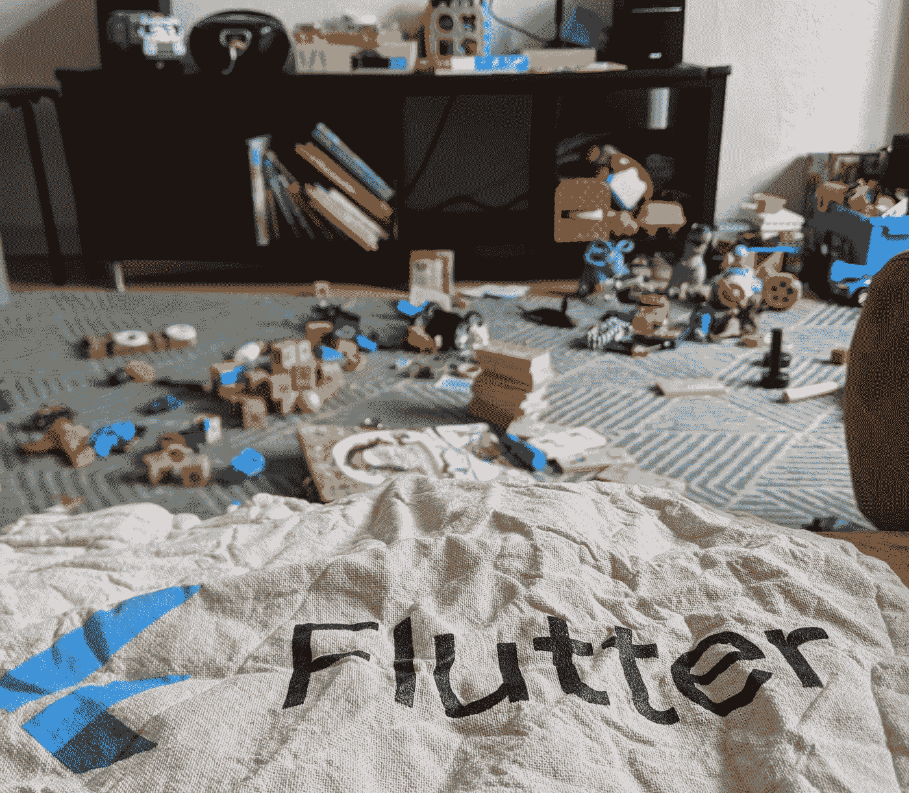
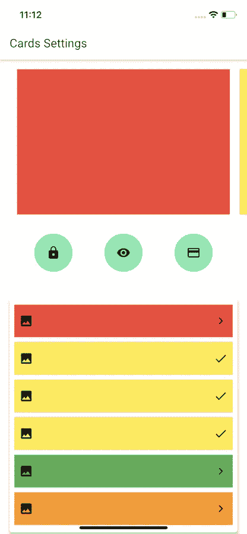
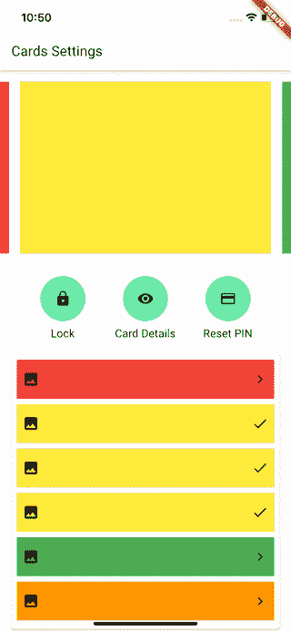
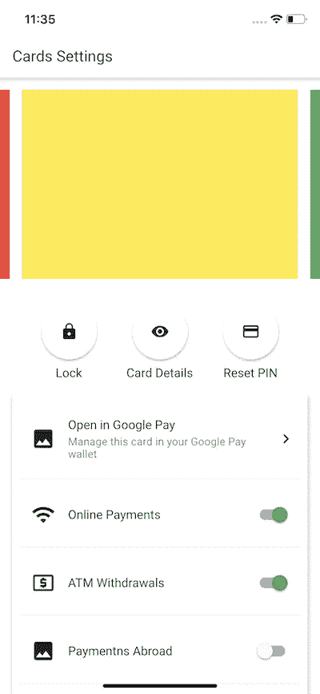
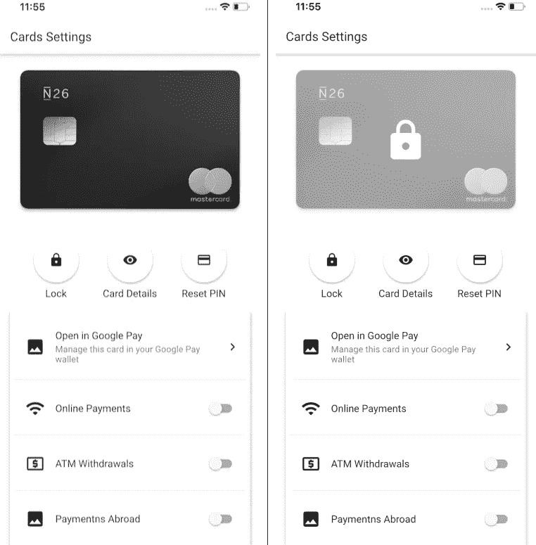
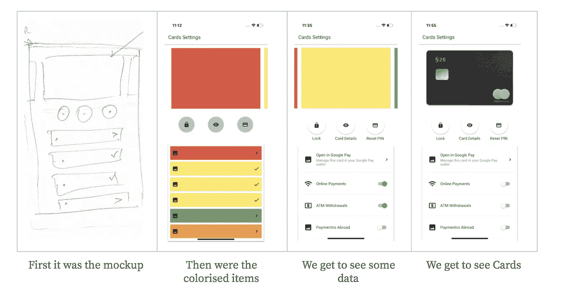

# N26 卡在颤动，第二部分

> 原文：<https://itnext.io/n26-cards-in-flutter-part-two-89765954e3ed?source=collection_archive---------10----------------------->

*在 Flutter 中实现 N26 卡的一个小系列*

1.  第一部分:[简介](https://link.medium.com/KGYQADmxv7)
2.  *声明 UI*
3.  第 3 部分:卡组(即将推出)

# 声明用户界面

让我们从那些彩色的块开始，实现成功状态的 UI，这样我们就建立了我们想要去的方向。我们对成功状态的理解是:

*   *卡片列表*
*   *该列表下的循环操作*(锁定/解锁、卡详情、重置 PIN、激活订单)
*   *横向动作*(添加到 Google 支付/钱包管理、每日限额、订购新卡)
*   *开关*(网上支付、ATM 取款、境外支付)

只有当这些视图显示并且它们的值在卡片列表中的交互或刷卡时发生变化时，视图才处于成功状态。

首先，我们的关键抽象将由显示不同颜色的外观相似的卡对象以及显示不同颜色的动作的列表组成。如果是圆形操作，则为圆形绿色按钮；如果是入口点操作，则为带箭头>的水平按钮；如果是偏好设置操作，则为复选符号。大概是这样的:

*在 iOS 模拟器中运行的实际颤振应用程序显示了我们想要看到的结果*

## 我们如何做到这一点？

让我们首先定义主应用程序作为起点。

在我们的情况下，这很简单。它定义了应用程序的标题(*卡片设置*)、主题数据(颜色和样式的基本材料设置)和回家路线(我们将导航到的第一页)。

# 风格

我们的主应用程序的`themeData`只定义了几个参数，这些参数将帮助我们完成项目。从第一部分的截图来看，我们的卡片屏幕看起来是黑白的，开关和分页指示器用了一些蓝绿色。在本文中，我们将像这样任意定义样式:

*   `**primaryColor**`:白色
*   `**primaryColorDark**`:黑色
*   `**accentColor**`:灰色
*   `**headline6**`(用于标题的主标题):字体系列:Roboto，大小 20.0，重量:w500)
*   `**subtitle1**`(主要用于列表项和较小标题的文本):字体系列:Roboto，大小 16.0，重量:w400)
*   `**subtitle2**`(进一步强调):font-family: Roboto，尺寸 14.0，重量:w200)

要访问主应用程序这一部分中设置的全局样式，可以在代码的任何地方使用静态调用`Theme.of(context)`，例如:

`Theme.of(context).textTheme.headline6`

更多来自素材库的规格和字体样式[见此处](https://api.flutter.dev/flutter/material/TextTheme-class.html)或颤振的通用[样式指南](https://flutter.dev/docs/cookbook/design/themes)。

为了处理字体，我们将使用官方的谷歌字体库。

# 项目结构

当我们实现 Bloc 时，我们必须为每个特性创建几个样板类。首先是 4。我们的特性所在的主*页面*，可以从视图传递的一组*事件*，一个定义视图所有状态的 *state* 类，以及特性的实际 bloc 类。在处理 Bloc 时，你至少需要这 4 个类来处理你的所有特性。也就是说，对于卡片，我们有:

*   `**CardsPage**` -一个有状态的小部件，为卡片保存支架和事件状态生成器。
*   `**CardsEvent**` -描述所有可以从 Cards 视图向事件处理程序发出的事件的抽象。
*   `**CardsState**` -卡片视图代表的州的描述。
*   `**CardsBloc**` -一个针对视图所有事件的 Cards Bloc 实现。

让我们先做一个非常基本的 UI 设置，然后我们可以详细讨论这些类中的每一个。

# 小部件集

在 Flutter 中有有状态和无状态的小部件。

无状态小部件是只由它们的构造函数定义的小部件。用于创建这些小部件的输入参数是这些小部件将呈现或依赖的最终数据。因为这些小部件是不可变的，所以改变这些小部件的数据意味着创建它们的新对象。这就是为什么在一个无状态小部件中定义一个全局非 final 字段，会激活 Lint 告诉你有问题。

有状态小部件与无状态小部件相同。的确，有状态窗口小部件是无状态窗口小部件*，除了*有一个很大的不同:它们被赋予一个可变的[状态](https://api.flutter.dev/flutter/widgets/State-class.html)，这个状态超越了构建过程。因此，对该状态所做的更改可以触发仅受该状态数据影响的零件的重新创建。例如，如果您有一个复选框，并且希望向用户显示复选框小部件的变化。复选框的值是 state。将状态设置为真或假定义了 Switch 类的值参数。因此，如果您将此布尔值的状态设置为 true，则不会重新创建有状态的小部件，但是在状态的构建函数中绘制的开关小部件会重新创建，但会使用不同的值。

我们要构建的第一个小部件是`CardsPage`。它的主要构建函数如下所示:

所以我们定义了页面的框架，作为这个框架的一部分，AppBar 和主体。身体是脚手架的内容块。在这个例子中，内容是一个带有两个列表的`Column`,`CardsList`和`CardActionsList`。

`CardsList`小部件看起来怎么样:

在这一点上，我们给它一个 260 的绝对高度，这在实时应用中是不应该的(你想让它相对于屏幕大小和密度)。`PageView`将显示一些来自`cardsList()`的基本窗口小部件，它将视口的比例设置为 90%,因为我们想查看一下上一个和下一个项目。我们通过将`viewPortFraction`属性设置为 0.9 来实现。`cardsList()`实际上会给我们一个`CardItemWidget` 对象列表，这个小部件现在看起来像这样:

*只显示颜色的基本卡片项目小工具*

这将只使用指定的`color`创建`Container`作为背景，这样我们可以在页面中看到一些东西。我们像这样创建它的对象:

*不一定是表达式体。*

因此，将所有这些放在一起并运行将会产生以下结果:

这是一个非常丰富多彩的卡片屏幕。让我们让它有意义。

动作的每个彩色项目都由`CardAction`抽象，定义如下:

那么为什么不是抽象类呢？因为它本来就是一个界面，只是它本来就在我脑子里。🤷🏼‍♂️

在 Dart 中有一个东西叫做*隐式接口。*这意味着，每个类都可以被实现，这样它的字段就可以被覆盖(注意也有抽象类)。这样我们就可以轻松做到:

`class RoundCardAction implements CardAction {...}`

我们将为`RoundCardActionWidget`和`HorizontalCardActionWidget`使用这个接口类。

先从观察第一个开始，`RoundCardActionWidget`:

正如你所看到的，对于圆形的动作，我使用了一个可以根据需要定义和成形的`[RawMaterialButton](https://api.flutter.dev/flutter/material/RawMaterialButton-class.html)`。`[FloatingActionButton](https://api.flutter.dev/flutter/material/FloatingActionButton-class.html)`也可以用没有任何问题，我就是喜欢避免歧义。我正在确定它的大小，并将形状设置为`CircleBorder`。

水平动作(带箭头)是`HorizontalCardActionWidgets`，也是无状态的小部件，因为它们只对它们采取点击动作:

我们可以很容易地使用 [ListTile](https://api.flutter.dev/flutter/material/ListTile-class.html) ，它是可定制的，足以满足大多数需求，但我想展示我们自己创建一个定制的小部件。

这组动作中只有一个有状态的小部件，它的状态包含切换的值(真/假)。这个小部件看起来和水平动作一样，除了有一个`Switch`代替了`trailingIcon`:

因此，现在我们可以轻松地填写我们想要的数据，以便相应地显示这些操作，例如:

当我们现在运行代码时，我们得到这样的视图:

好多了。这个屏幕剩下的唯一内容是卡片列表。

让我们更改`CardItemWidget`以便它实际上正确地表示卡片项目。首先，我们将再添加两个字段:

*   字符串`cardImageUrl` —卡片的图像，以及
*   布尔型`isLocked` —如果卡片被锁定，是否显示锁定的卡片覆盖图:

这个小部件也是无状态的，因为它只表示没有状态的静态数据。它是这样建造的:

注意这里的`FadeInImage`,这是一个非常有用的小部件，它将显示一个占位符(来自资产),直到来自 URL 的图像被加载。然后它会缓存并重用它👌。

此外，我们在这个实现中使用了 Stack 小部件，因为我们希望在卡片图像上显示锁定卡片的覆盖图。因此有两个视图，一个在另一个的上面，上面那个视图的可见性由`isLocked`字段决定。如果我们用正确的参数创建了`CardItemWidget`,我们会看到以下内容:

第一个是解锁时的视图，第二个是锁定时的视图。

太好了，我们走了很长的路来到这里！🦕这一观点是如何演变的:

现在，我们已经准备好显示数据和取决于该数据的不同状态的 UI。

在下一篇文章中，我们将看到如何将视图实体映射为数据载体，并利用 Bloc 抽象来创建状态。

这里是[库](http://github.com/abalalovski/n26-cards-flutter)，它将在本系列结束时保存完整的代码。

*感谢迄今为止的阅读。*

> 💙欢迎在评论中或推特上联系我们！