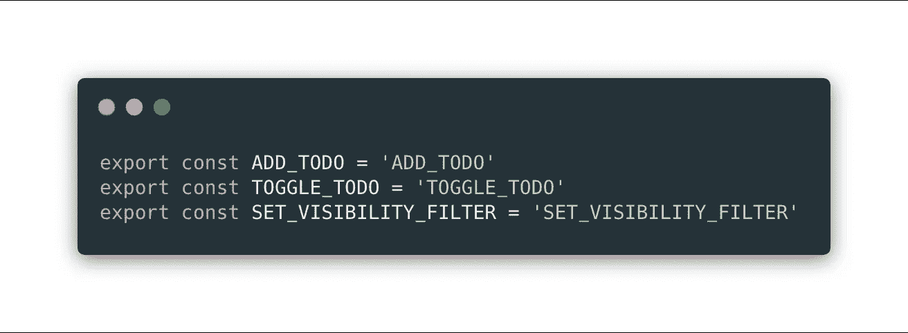
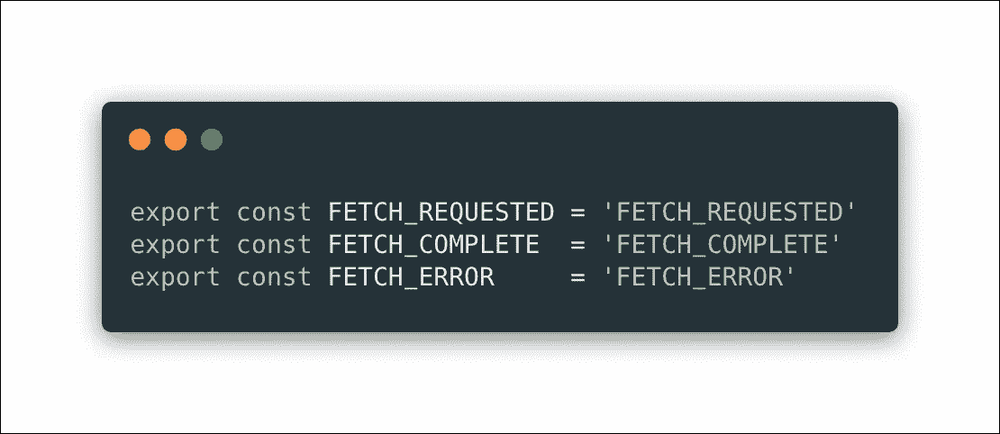
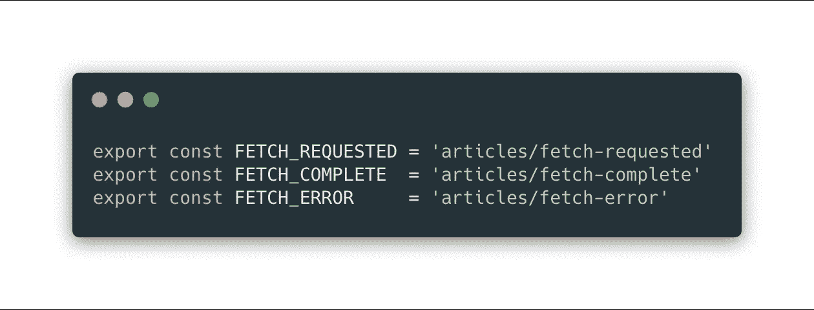
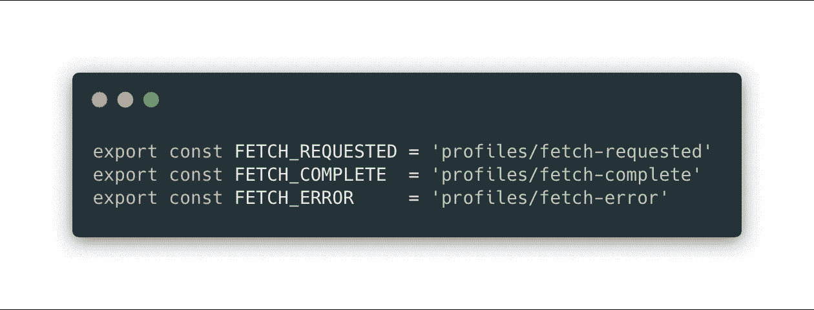
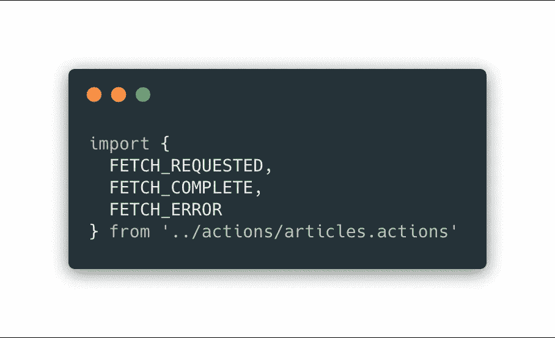
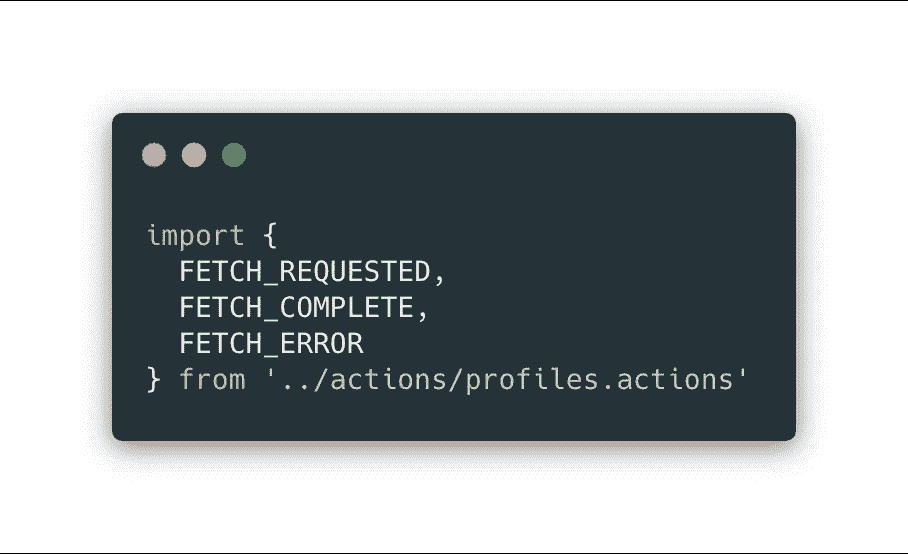

# Namespacing Redux 操作类型常量值

> 原文：<https://itnext.io/namespacing-redux-action-type-constant-values-90b932eea43f?source=collection_archive---------4----------------------->

编写清晰的动作类型常量，但不要过于冗长。

大多数人都同意为 Redux 动作类型定义常量是个好主意。如果您使用字符串文字，很容易拼错一个，并想知道为什么您的缩减器没有响应。如果使用常量，IDE 可以立即指出错误。

# 声明操作类型常量

## 标准方式

这里有一个来自 [Redux 文档](https://redux.js.org/basics/actions#source-code)的例子:

因为它在文档中，这就是你看到的大多数项目是如何实现它们的。所以，你在问，有没有理由用不同的方式去做？是的，有。

在任何重要的应用程序中，您可能会在几个不同的文件中定义动作类型常量和使用它们的动作创建者，这些文件由功能区域分隔。不同的团队成员可能一直在添加，所以一个文件中的动作类型常量与另一个文件中的冲突总是有可能的。

例如，考虑这两个文件中定义的常量:

**articles.actions.js**

**简介.行动. js**

如果您的动作类型是在单独的文件中定义的，那么响应它们的 reducers 也可能是这样。当您组合您的 reducers 时，您实际上创建了一个大的 switch 语句，如果您有两个具有相同常数值的动作类型，最终将为其中一个触发错误的 case 块。

## 冗长的方式

答案是让常量名和值更长吗？​

有可能，但它过于冗长且没有必要。

## 命名空间值方式

请记住，常量名称和值不必相同。这里有一个很好的方法来命名您的常量值，同时在它们的使用上下文中保持名称简单明了。

**articles.actions.js**

**profiles.actions.js**

# 进口

在 articles reducer 中，我们知道我们在处理文章，所以所有的常量都不需要把文章作为名字的一部分。异径管也是如此。

**articles.reducer.js**

**profiles.reducer.js**

# 结论

就是这样。带有命名空间值的简单常量名称将使您更加清晰并减少冗长，同时确保正确的大小写在您的 reducer 中触发。