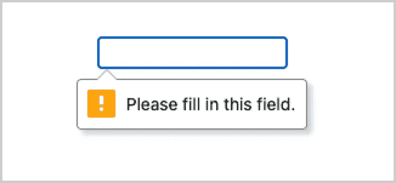
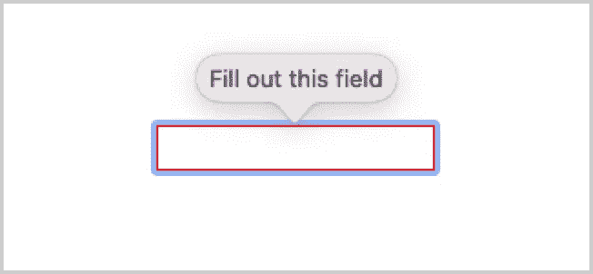
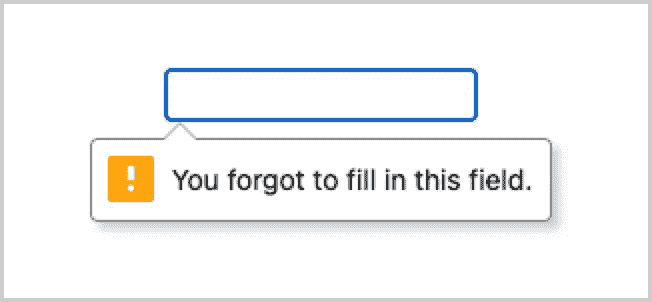
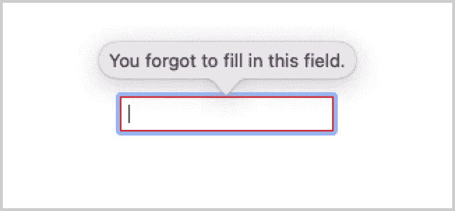

# Web 组件的本机形式验证

> 原文：<https://itnext.io/native-form-validation-of-web-components-a599e85176c7?source=collection_archive---------2----------------------->

简单、自然的表单验证指南


照片由[通讯社跟随](https://unsplash.com/@olloweb?utm_source=medium&utm_medium=referral)于 [Unsplash](https://unsplash.com?utm_source=medium&utm_medium=referral)

在我的上一篇文章“Web 组件现在可以成为本地表单元素”中，我解释了如何使用`ElementInternals`对象让 Web 组件像其他本地表单元素一样参与表单。

在这篇文章中，我将解释如何使用本机平台轻松验证这些自定义表单控件

# 原生形式验证

在 web 上使用表单的一个关键部分是验证:检查用户提供的输入是否是我们期望的，如果不是，则向用户显示反馈。

因此，当您提供自定义表单控件时，它应该像任何本机表单控件一样参与此表单验证。

虽然有很多库可以实现这一点，但是 native platform 已经提供了验证表单所需的所有工具。

# 限制

要验证一个表单，首先需要定义一个表单控件是有效还是无效。换句话说，你需要为控件设置约束*。*

例如，您可以定义一个字段是否是必需的，或者它的数据是否应该是某种类型或者有一个最大长度。

若要设置这些约束，可以在表单控件上设置下列验证属性:

- `required`:指定字段是否必须填写
- `minlength`和`maxlength`:指定字段文本的最小和最大长度
- `min`和`max`:指定字段的最小和最大数值
- `type`:指定字段的数据是否需要特定类型(数字、文本、URL、电子邮件等)。)
- `pattern`:指定字段数据必须遵循的模式的正则表达式

以下示例显示了一个必需的输入，该输入采用文本类型的数据，长度应在 5 到 20 个字符之间，并且仅由字母组成:

```
<input 
  type=”text”
  required
  minlength=”5"
  maxlength=”20"
  pattern=”[a-zA-Z]+”>
```

要确定一个字段是否满足其所有的验证约束，您可以检查其返回一个`ValidityState`对象的`validity`属性。

这个`ValidityState`对象有一个`valid`属性，指示该字段是否满足其所有验证约束(`true`或`false`)。

其他属性也是布尔值，指示字段不能用值“真”验证的原因:

- `valueMissing` : `true`当字段有`required`属性但没有值
- `typeMismatch` : `true`当数据的语法不正确时， 例如当`type`为`email`但值不是有效的电子邮件地址
- `tooShort` : `true`当字段具有`minlength`属性且数据长度小于该属性的值
- `tooLong` : `true`当字段具有`maxlength`属性且数据长度大于该属性的值
- `rangeUnderflow` : `true`当字段具有`min`属性且 当字段具有`max`属性时，该字段的数值小于该属性
- `rangeOverflow` : `true`的值；当字段具有`pattern`属性时，该字段的数值大于该属性
- `patternMismatch` : `true`的值，但当使用`setCustomValidity`设置自定义错误信息时，该字段的数据不遵循此模式
- `customError` : `true`

当字段无效时，它将抛出一个`invalid`事件，并被 CSS `:invalid`伪类选中。

例如，您可以用它给字段添加红色边框和红色文本:

```
input:invalid {
  border:1px solid red;
  color: red;
}
```

# 验证错误消息

有了一些约束，现在当提交表单时，表单输入将被验证，浏览器将显示一个默认的错误消息。

例如，当具有“必填”属性的字段没有值并且表单被提交时，在 Chrome 和 Safari 中显示以下消息:



Chrome 中的本机验证错误消息



Safari 中的本机验证错误信息

错误消息的文本和样式在不同的浏览器中是不一致的，但是幸运的是，您可以同时更改这两者。

要更改错误消息的文本，您可以使用字段的`setCustomValidity()`方法，该方法将错误消息作为唯一的参数:

```
const form = document.querySelector(‘form’);
const field = form.elements[0];field.setCustomValidity(‘You forgot to fill in this field.’);
```

现在，错误消息将显示您指定的文本:



Chrome 中的自定义验证错误消息



Safari 中的自定验证错误信息

# `invalid"`事件

要显示您的自定义错误消息，您可以挂钩到`invalid`事件，该事件在表单提交时为每个无效的表单元素触发。

请注意，如果您不需要自定义错误信息，并且对浏览器提供的默认错误信息感到满意，则不需要设置此事件处理程序。

提交表单时，将自动验证定义了约束的表单域，并为任何无效的表单域显示默认的错误消息。

让我们从编写该事件的处理程序开始:

```
const invalidHandler = (e) => {
  const field = e.target;
  const validState = field.validity; if(!validState.valid) {
   field.setCustomValidity(‘This field is not valid.’);
 }
};
```

当然，消息“此字段无效”有点太普通，没有告诉用户*为什么*字段无效，但是我们可以改变它。

回想一下，如果定义了适当的约束，字段的`ValidityState`对象包含字段无效的原因。

您可以使用它来确定字段无效的原因，并显示正确的错误消息:

```
const invalidHandler = (e) => {
  const field = e.target;
  const validState = field.validity; // all possible error messages
  const errorMessages = {
    valueMissing: ‘This field is required’,
    tooShort: ‘This value is too short’,
    tooLong: ‘This value is too long’, …
  }; if(!validState.valid) {
    // loop through the error reasons
    for(let state in validState) {
      // find the first error reason with value “true”
      if(validState[state]) {
        // select the correct message for the error
        const errorMessage = errorMessages[state];
        field.setCustomValidity(errorMessage);
      }
    }
  }
};
```

在上面的例子中，可能的错误信息存储在`errorMessages`对象中。

然后，我们遍历存储在`validState`变量中的字段的`validity`属性中的错误原因。

当用值`true`找到原因时，选择并显示错误信息。

虽然这样做是可行的，但它将验证逻辑与现在硬编码到其中的错误消息紧密耦合在一起。

更好的解决方案是将可能的错误信息存储在属性中。这样，可以在表单控件本身上指定消息，并且验证逻辑仍然是通用的。

例如，您可以将错误消息存储在`data`属性中。

`required`字段的*缺少*值的错误消息可以存储在`data-valueMissing`属性中，因此可以像前面的例子一样选择正确的消息:

```
<input
  type=”text”
  required
  data-valuemissing=”This field is required”>
```

然后选择正确的错误消息，如下所示:

```
const invalidHandler = (e) => {
  const field = e.target;
  const validState = field.validity; if(!validState.valid) {
    // loop through the error reasons
    for(let state in validState) {
      // get the attribute name of the message for this error reason
      const attr = `data-${state.toString()}`; // if this error reason has the value “true”
      if(validState[state]) { 
        // get the error message from the attribute is it's present,
        // otherwise get the native error message
        const errorMessage = field.hasAttribute(attr) ?
          field.getAttribute(attr) : field.validationMessage;
        field.setCustomValidity(errorMessage); break;
      }
    }
  }
};
```

同样，您可以为其他表单控件指定不同的错误信息:

```
<input 
  type=”number” 
  name=”age” 
  min=”18" 
  max=”40" 
  required
  data-valuemissing=”Please fill in your age”
  data-rangeunderflow=”You must be at least 18 years old”
  data-rangeoverflow=”The maximum allowed age is 40"
>
```

请注意，该行:

```
const attr = `data-${state.toString()}` 
```

构造类似于`data-valueMissing`(骆驼大小写)的属性名，而属性本身是`data-valuemissing`(小写)。

因为属性不区分大小写，所以两者都可以。

现在唯一剩下的事情就是为每个无效的表单字段调用`invalidHandler`函数。

您可以通过获取表单的`elements`属性中的所有表单字段并循环遍历它们以在每个字段上设置一个`invalid`事件处理程序来实现这一点。

如果您首先将`elements`转换成一个数组，那么您可以用`forEach`遍历它:

```
const form = document.querySelector(‘form’);// convert to an array
const fields = […form.elements];fields.forEach(field => 
  field.addEventListener(‘invalid’, invalidHandler));
```

现在将为每个无效的表单域调用事件处理程序，显示相应的错误消息。

# 验证 Web 组件

为了与您的定制元素一起工作，您需要将`ElementInternals`对象附加到它，并添加以下方法:

```
constructor() {
  super();
  this.#internals = this.attachInternals();
}// add the following methods to make your Custom Element participate // in form validation
get validity() {
  return this.internals.validity;
}get validationMessage() {
  return this.internals.validationMessage;
}get willValidate() {
  return this.internals.willValidate;
}checkValidity() {
  return this.internals.checkValidity();
}reportValidity() {
  return this.internals.reportValidity();
}
```

需要这些方法来确保您的自定义元素可以参与表单验证。

但是，这不会导致您的自定义元素被报告为无效。

您将需要使用`ElementInternals`对象的`setValidity`方法来明确指出您的元素是有效还是无效。

让我们假设我们有一个带有以下阴影 DOM 的自定义元素:

```
<style>
  :host {
    display: inline-block;
  } input {
    padding: 5px;
  }
</style><input type=”text”>
```

因为您的定制元素内部有一个`<input>`元素，所以您的元素的有效性来自内部`<input>`的有效性。

这意味着您需要在两种情况下将您的自定义元素的有效性设置为内部`<input>`的有效性:

-当您的自定义元素第一次添加到页面
时-每当内部`<input>`的值改变时

当您的元素在`connectedCallback`生命周期方法中添加到页面时，以及当`<input>`的值在`change`事件处理程序中发生变化时，您可以设置有效性。

您可以为此编写一个`validateInput()`方法，它与我们之前编写的`invalidHandler`非常相似:

```
validateInput() {
  // get the validity of the internal <input> that is stored in the 
  // property `#inputNode`
  const validState = this.#inputNode.validity;

  this.invalid = !this.pristine && !validState.valid;

  // if the input is invalid, show the correct error
  if(!validState.valid) {
    // loop through the error reasons
    for(let state in validState) {

      // get the name of the data attribute that holds the 
      // error message
      const attr = `data-${state.toString()}`;

      // if there is an error
      if(validState[state]) {
        this.validationError = state.toString();

        // get either the custom of native error message
        const errorMessage = this.hasAttribute(attr) ? this.getAttribute(attr) : this.#inputNode.validationMessage;

        // set the validity error reason and the corresponding 
        // message
        this.#internals.setValidity({[this.validationError]: true}, errorMessage);
      }
    }
  }
  else {
    this.#internals.setValidity({});
  }
}
```

我们检查内部`<input>`的有效性，如果无效，我们检查在`data`属性中是否定义了相应的错误消息。

如果发现错误，将使用正确的错误原因和相应的错误消息来设置自定义元素的有效性。

现在，只有在内部`<input>`上设置了任何约束条件(`required`、`min`、`max`等)时，内部`<input>`的有效性才会被设置。)

因为这些约束是在定制元素本身上设置的，所以它们也需要在`<input>`上设置。

您可以通过从您的定制元素中获取每个属性并将它们设置为内部`<input>`的属性来实现这一点。

让我们用我们需要的属性名创建一个数组，并对它们进行循环。

由于内部的`<input>`也需要自定义元素中的`value`、`type`和`placeholder`，我们也将添加它们:

```
[
  ‘type’,
  ‘value’,
  ‘placeholder’,
  'autocomplete',
  ‘required’,
  ‘min’,
  ‘max’,
  ‘minlength’,
  ‘maxlength’,
  ‘pattern’
].forEach((attr) => {
    // ‘required’ is a boolean attribute without a value so we use 
    // ‘hasAttribute’
    const attrValue = attr === ‘required’ ? 
      this.hasAttribute(attr) : this.getAttribute(attr); if(attrValue !== null) {
      this.input[attr] = attrValue;
    }
  });
```

现在唯一剩下的事情就是在`connectedCallback`内部调用`this.validateInput()`以及在内部`<input>`的`change`事件处理程序内部调用。

让我们把这些放在一起:

```
class FormInput extends HTMLElement {
  static formAssociated = true; constructor() {
    super();
    this.internals = this.attachInternals(); const shadowRoot = this.attachShadow({mode: ‘open’}); shadowRoot.innerHTML = `
      <style>
        :host {
          display: inline-block;
        } input {
          display: block;
          padding: 5px;
        }
      </style> <input type=”text”>
    `;
    } connectedCallback() {
    this.input = this.shadowRoot.querySelector(‘input’);// set the required properties (constraints) on the internal 
    // <input>
    [
      'type’,
      ‘value’,
      ‘placeholder’,
      ‘required’,
      ‘min’,
      ‘max’,
      ‘minLength’, // <-- camelCase!
      ‘maxLength’, // <-- camelCase!
      ‘pattern’
    ].forEach((attr) => {
        const attrValue = attr === ‘required’ ?          
          this.hasAttribute(attr) : this.getAttribute(attr); this.input[attr] = attrValue;
       }); this.input.addEventListener(‘change’, (e) => {
       // we also want to dispatch a `change` event from 
       // our custom element
       const clone = new e.constructor(e.type, e);
       this.dispatchEvent(clone); // set the element’s validity whenever the value of the 
       // <input> changes
       this.validateInput();
    }); this.addEventListener(‘focus’, () => this.input.focus()); if (!this.hasAttribute(‘tabindex’)) {
      this.setAttribute(‘tabindex’, ‘0’);
    } // set the initial validity of the component
    this.validateInput();
  } get value() {
    return this.input.value;
  } set value(value) {
    this.input.value = value;
    this.internals.setFormValue(value);
  } get form() {
    return this.internals.form;
  }

  get name() {
    return this.getAttribute(‘name’);
  }

  get type() {
    return this.localName;
  } get validity() {
    return this.internals.validity;
  } get validationMessage() {
    return this.internals.validationMessage;
  } get willValidate() {
    return this.internals.willValidate;
  } checkValidity() {
    return this.internals.checkValidity();
  } reportValidity() {
    return this.internals.reportValidity();
  } validateInput() {
    // get the validity of the internal <input>
    const validState = this.input.validity; // if the input is invalid, show the correct error
    if(!validState.valid) {
      // loop through the error reasons
      for(let state in validState) { // get the name of the data attribute that holds the 
        //error message
        const attr = `data-${state.toString()}`; // if there is an error and corresponding attribute holding 
        // the message
        if(validState[state]) {
          this.validationError = state.toString();

          // get the correct error message
          const errorMessage = this.hasAttribute(attr) ? 
            this.getAttribute(attr) : this.input.validationMessage; // set the validity error reason and the corresponding 
          // message
          this.internals.setValidity(
            {[this.validationError]: true},    
            errorMessage
          );
        }
      }
   }
   else {
     this.internals.setValidity({});
   }
 }
}
```

# 自定义错误信息的样式

正如您之前看到的，每个浏览器的本机错误消息的样式是不同的，不幸的是，没有办法使用 CSS 来样式化这些错误消息。

但是，您可以使用相同的本机验证逻辑以自定义样式显示错误信息。

这意味着不会显示本机错误消息，但相同的错误文本将显示为您选择的 HTML 元素。

为了防止显示本地错误消息，您需要调用由您的定制元素抛出的`invalid`事件的`preventDefault()`方法。

您可以通过简单地在自己的定制元素中设置一个`invalid`事件处理程序来做到这一点:

```
this.addEventListener('invalid', (e) => {
  this.invalid = true;

  // when a custom error needs to be displayed, prevent the native 
  // error from showing
  if(this.customErrorDisplay) {
    e.preventDefault();
  }
});
```

您还需要能够设置是否想要显示自定义错误。您可以通过设置一个属性来做到这一点，例如`custom-error-display`，并读取该属性以确定属性`this.customErrorDisplay`的值，该属性在前面的示例中使用:

```
get customErrorDisplay() {
  return this.hasAttribute('custom-error-display');
}
```

现在，本地错误消息将不会显示，但是字段的有效性仍然被设置，错误消息本身将出现在字段的`validationMessage`属性中。

然后，您可以使用该属性的值(错误消息)，将它放入一个 HTML 元素中，如`<div>`或`<span>`，并在您想要的任何地方显示它。

然后，您可以将任何 CSS 应用到您想要的这个元素，并且您有一个完全可样式化的错误消息。

在下面的例子中，创建了一个带有`class`“错误消息”的`<div>`，并在其`textContent`属性上设置了`field.validationMessage`。

这个`<div>`将被附加到字段的`parentNode`上。

这假设每个表单字段都被包装在另一个`<div>`中，所以字段和错误消息将在同一个`<div>`中。

然后，您可以随意放置错误消息。

当出现错误时，生成的 HTML 将如下所示:

```
<div class=”container”>
  <input type=”text” required>
  <div class=”error-message”>This field is required</div>
</div>
```

如果当字段有效时，错误只是被隐藏，则不需要在每次表单无效时追加错误消息。

该代码可以检查错误消息是否存在，如果不存在，它将被追加。

如果是，则`<div>`的`textContent`将被设置为错误信息并显示出来。

默认情况下，错误消息会有`display: none`所以它是隐藏的，当一个字段是`invalid`时，你可以添加一个属性`invalid`到它，并添加 CSS 使错误消息只有在字段有这个属性时才可见:

```
.error-message {
  display: none;
}input[invalid] ~ .error-message {
  display: block;
}
```

这里使用通用兄弟组合符`~`来选择`.error-message`，它是`input`的兄弟，但仅当它具有`invalid`属性时。

通过为`invalid`创建一个负责此事的设置器，只需设置`this.invalid`即可设置或删除该属性:

```
set invalid(isInvalid) {
  isInvalid && this.customErrorDisplay ? 
    this.setAttribute('invalid', '') : 
    this.removeAttribute('invalid');
}
```

获取错误消息是消费代码的责任。这段代码可以挂钩到`invalid`事件，从组件`validationMessage`属性中获取错误消息:

```
<label>
  Input <form-input
    required
    data-valuemissing="This field is required!">
  </form-input> <div class="error-message"></div>
</label>const input = document.querySelector('form-input');
const errorMessage = document.querySelector('.error-message');

input.addEventListener('invalid', (e) => {
  errorMessage.textContent = input.validationMessage;
})
```

# 何时验证？

最后一个要解决的问题是在`constructor`中调用`validateInput()`来立即设置组件的有效性。

这也可以将`invalid`属性设置为`true`，从而设置`invalid`属性。

如果您表示想要显示自定义错误消息(通过`custom-error-display`属性),这将导致自定义错误消息在用户与输入交互之前显示。

显然这不是你想要的。

您可以向组件添加一个`pristine`属性来防止这种情况。该属性最初被设置为`true`，只有当`input`无效且`this.pristine`为假时(例如，用户与组件交互)，才使用该属性将`this.invalid`设置为`true`。

*何时* `pristine`将被设置为`false`取决于*何时*您想要验证输入并在适用时显示错误。

如果您想在组件的值改变时验证组件，那么应该在`change`事件处理程序中将`pristine`设置为`false`。

如果您只想在表单提交后显示一个错误，那么应该在`invalid`事件处理程序中将`pristine`设置为`false`，因为只有在表单提交时才会触发。

在第二种情况下，当表单提交后组件的值发生变化时，组件也将被验证。

这很好，因为每当显示错误消息时，您不希望它只是在表单再次提交后才消失，而是在组件不再无效时立即消失。

为了表明每当组件的值改变时都要验证组件，可以引入一个类似于`validate-on-change`的属性，例如:

```
<form-input
  validate-on-change
  ...
  >
</form-input>
```

下面是完整的工作示例:

# 结论

与表单关联自定义元素使开发人员能够构建所有类型的自定义表单控件，这些控件可以像本机表单元素一样工作，并可以使用本机表单验证来验证。

对`ElementInternals`的支持尚未登陆 Safari，但已经被[合并到 Webkit](https://t.co/3xKqqkrqqG) 中。

在 Twitter 上关注我，在那里我写了现代网络能做什么，PWAs，和网络组件。