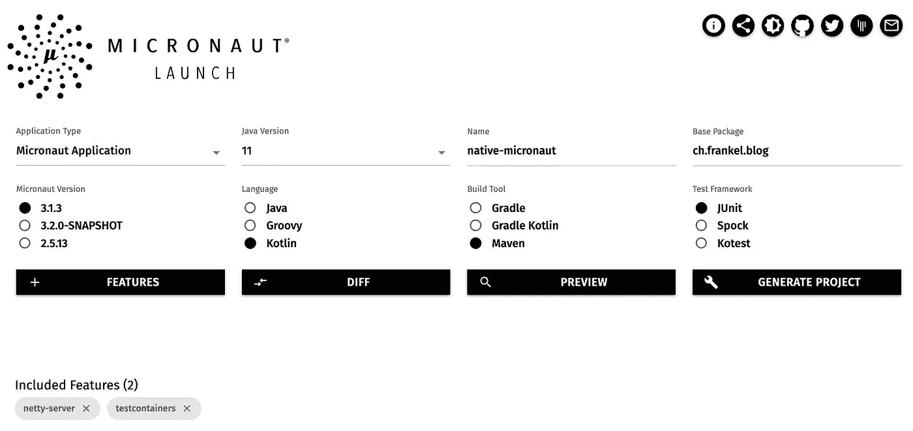
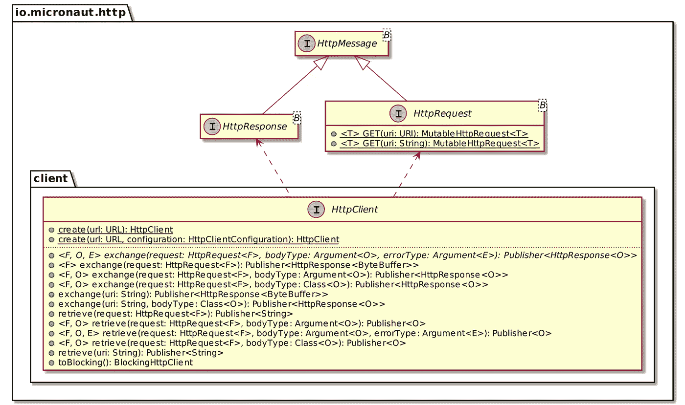
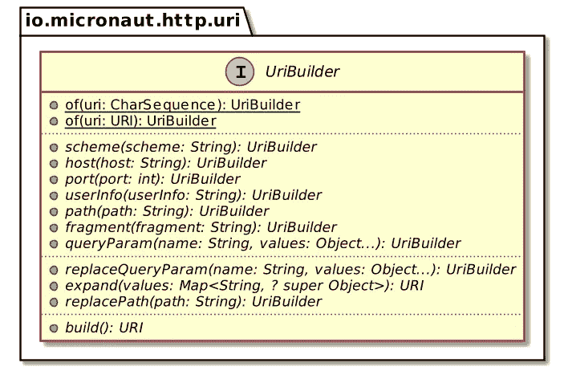
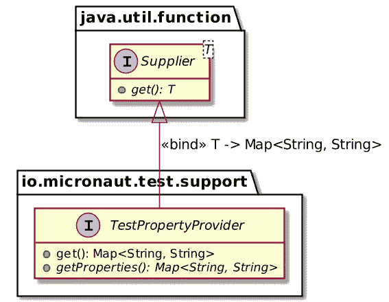
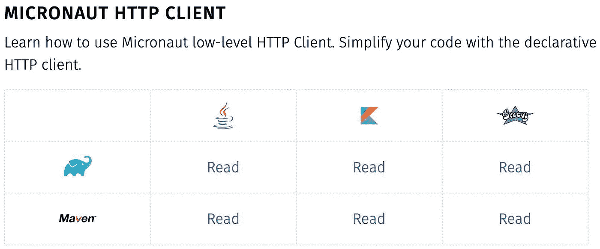

# 带有 Micronaut 的原生图像

> 原文：<https://itnext.io/native-image-micronaut-58800097cb4f?source=collection_archive---------7----------------------->


上周，我写了一个使用 Spring Boot 查询漫威 API [的本地 web 应用。本周，我想用 Micronaut 框架做同样的事情。](https://blog.franke.ch/native/spring-boot/)

# 创建新项目

Micronaut 提供了两个选项来创建新项目:

1.  一个[网络用户界面](https://micronaut.io/launch):



至于 Spring Initializr，它提供了几个特性:

*   在下载之前预览项目
*   共享配置
*   一个 API

我喜欢你能检查增加的特性对 POM 的影响。

2.一个[命令行界面](https://docs.micronaut.io/1.3.3/guide/index.html#buildCLI):

与 webapp 并行，您可以在不同的系统上安装 CLI。然后你可以使用`mn`命令来创建新的项目。

在这两个选项中，您可以配置以下参数:

*   使用 Kotlin DSL 的构建工具 Maven、Gradle 或 Gradle
*   语言，Java、Kotlin 或 Groovy
*   Micronaut 的版本
*   一些元数据
*   属国

应用程序的代码在 [GitHub](https://github.com/micronaut-projects/micronaut-starter) 上。你可以克隆和改编它，但据我所知，它在设计时并没有考虑扩展(还没有？).

# Bean 配置

Micronaut 的 bean 配置依赖于 [JSR 330](http://javax-inject.github.io/javax-inject/) 。JSR 在`jakarta.inject`包中定义了几个注解*，例如*、`@Singleton`和`@Inject`。开发人员使用它们，服务提供商实现规范。

`@Singleton`和它的兄弟`@ApplicationScoped`应该用在我们的代码上。我们的示例应用程序需要创建一个`java.security.MessageDigest`的实例，它不能被注释。为了解决这个问题，JSR 330 提供了`@Factory`注释:

```
@Factory                                                  // 1
class BeanFactory {

  @Singleton                                              // 2
  fun messageDigest() = MessageDigest.getInstance("MD5")  // 3
}
```

1.  生成 Bean 的类
2.  常规范围注释
3.  生成消息摘要单例

Micronaut 还提供了自动发现机制。可惜在科特林行不通。您需要指向 Micronaut 应该明确扫描的包:

```
fun main(args: Array<String>) {
    Micronaut.build().args(*args)
             .packages("ch.frankel.blog")
             .start()
}
```

# 控制器配置

Micronaut 从 Spring 复制了`@Controller`注释。你可以用同样的方法使用它。同样，用相关的 HTTP 方法注释来注释函数。

```
@Controller
class MarvelController() {

    @Get
    fun characters() = HttpResponse.accepted<Unit>()
}
```

# 非阻塞 HTTP 客户端

Micronaut 提供了两个 HTTP 客户端:一个声明式客户端和一个低级客户端。两个都是不堵的。

声明式客户端用于简单的用例，而低级客户端用于更复杂的用例。传递参数属于复杂的范畴，所以我选择了底层的。以下是它的 API 示例:



用法很简单:

```
val request = HttpRequest.GET<Unit>("https://gateway.marvel.com:443/v1/public/characters")
client.retrieve(request, String::class.java)
```

请记住，我们应该从对应用程序的请求中获取参数，并将它们传播到我们对漫威 API 的请求中。Micronaut 可以使用第一部分的`@QueryValue`注释自动将这样的查询参数绑定到方法参数。

```
@Get
fun characters(
    @QueryValue limit: String?,
    @QueryValue offset: String?,
    @QueryValue orderBy: String?
)
```

不可能使用 Kotlin 的字符串插值，因为这些参数是可选的。幸运的是，Micronaut 提供了一个`UriBuilder`抽象，它遵循构建器模式原则。



我们可以这样使用它:

```
val uri = UriBuilder
            .of("${properties.serverUrl}/v1/public/characters")
            .queryParamsWith(
                mapOf(
                    "limit" to limit,
                    "offset" to offset,
                    "orderBy" to orderBy
                )
            ).build()

fun UriBuilder.queryParamsWith(params: Map<String, String?>) = apply {
    params.entries
        .filter { it.value != null }
        .forEach { queryParam(it.key, it.value) }
}
```

# 参数化

像 Spring 一样，Micronaut 可以将应用程序属性绑定到 Kotlin 数据类。在 Micronaut 中，该文件被命名为`application.yml`。文件已经存在并且包含`micronaut.application.name`键。我们只需要添加额外的数据。我选择将它放在同一个父键下，但是没有这样的约束。

```
micronaut:
  application:
    name: nativeMicronaut
    marvel:
      serverUrl: https://gateway.marvel.com:443
```

为了绑定，我们需要两个注释的帮助:

```
@ConfigurationProperties("micronaut.application.marvel")   //1
data class MarvelProperties
                       @ConfigurationInject constructor(   //2
    val serverUrl: String,
    val apiKey: String,
    val privateKey: String
)
```

1.  将属性类绑定到属性文件前缀
2.  允许使用数据类。需要在构造函数上设置`@ConfigurationInject`:这表明团队可以在 Micronaut 中改进 Kotlin 的集成。

# 测试

Micronaut 测试基于`@MicronautTest`注释。

```
@MicronautTest
class MicronautNativeApplicationTest
```

我们将上述数据类的属性定义为不可空的字符串。因此，我们需要在测试开始时传递这个值。为此，Micronaut 提供了`TestPropertyProvider`接口:



我们可以利用它来传递属性值:

```
@MicronautTest
class MicronautNativeApplicationTest : TestPropertyProvider {

    override fun getProperties() = mapOf(
        "micronaut.application.marvel.apiKey" to "dummy",
        "micronaut.application.marvel.privateKey" to "dummy",
        "micronaut.application.marvel.serverUrl" to "defined-later"
    )
}
```

下一步是设置 Testcontainers。为流行的容器提供了现成的集成，*，例如*、Postgres，但是没有提供与模拟服务器的集成。我们必须编写代码来处理它。

```
@MicronautTest
@Testcontainers
@TestInstance(TestInstance.Lifecycle.PER_CLASS)             // 1
class MicronautNativeApplicationTest {

    companion object {

        @Container
        val mockServer = MockServerContainer(
            DockerImageName.parse("mockserver/mockserver")
        ).apply { start() }                                 // 2
    }
}
```

1.  默认情况下，为每个测试方法创建一个服务器。我们希望每个测试班都有一个。
2.  不要忘记显式启动它！

此时，我们可以注入客户端和嵌入式服务器:

```
@MicronautTest
@Testcontainers
@TestInstance(TestInstance.Lifecycle.PER_CLASS)
class MicronautNativeApplicationTest : TestPropertyProvider {

    @Inject
    private lateinit var client: HttpClient                     // 1

    @Inject
    private lateinit var server: EmbeddedServer                 // 2

    companion object {

        @Container
        val mockServer = MockServerContainer(
            DockerImageName.parse("mockserver/mockserver")
        ).apply { start() }
    }

    override fun getProperties() = mapOf(
        "micronaut.application.marvel.apiKey" to "dummy",
        "micronaut.application.marvel.privateKey" to "dummy",
        "micronaut.application.marvel.serverUrl" to
            "http://${mockServer.containerIpAddress}:${mockServer.serverPort}" // 3
    )

    @Test
    fun `should deserialize JSON payload from server and serialize it back again`() {
        val mockServerClient = MockServerClient(
            mockServer.containerIpAddress,                      // 3
            mockServer.serverPort                               // 3
        )
        val sample = this::class.java.classLoader.getResource("sample.json")
                                                 ?.readText()  // 4

        mockServerClient.`when`(
            HttpRequest.request()
                .withMethod("GET")
                .withPath("/v1/public/characters")
        ).respond(
            HttpResponse()
                .withStatusCode(200)
                .withHeader("Content-Type", "application/json")
                .withBody(sample)
        )

        // With `retrieve` get the body and assert on it
        val body = client.toBlocking().retrieve(                // 5
            server.url.toExternalForm(),
            Model::class.java                                   // 6
        )
        assertEquals(1, body.data.count)
        assertEquals("Anita Blake", body.data.results.first().name)
    }
}
```

1.  注入*反应式*客户端
2.  注入嵌入式服务器，*，即*，应用程序
3.  从模拟服务器检索 IP 和端口
4.  使用 Kotlin 读取样本文件——没有像 Spring 中那样提供抽象
5.  我们需要阻止，因为客户是被动的
6.  没有 JSON 断言 API。最简单的方法是在一个`Model`类中反序列化，然后断言对象的状态。

# Docker 和 GraalVM 集成

和 Spring 一样，Micronaut 提供了两种创建原生映像的方法:

1.  在本地机器上。
    它需要本地 GraalVM 安装**和** `native-image`。
    `mvn package -Dpackaging=native-image`
2.  在码头。它需要本地 Docker 安装。
    `mvn package -Dpackaging=docker-native` 注意，如果您不使用 GraalVM JDK，您需要激活 GraalVM 概要文件。
    

使用第二种方法，结果如下:

```
REPOSITORY        TAG       IMAGE ID         CREATED          SIZE
native-micronaut  latest    898f73fb44b0     33 seconds ago   85.3MB
```

这些层如下:

```
┃ ● Layers ┣━━━━━━━━━━━━━━━━━━━━━━━━━━━━━━━━━━━━━━━━━━━━━━━━━━━━━━━━━━━━━━━━━━━━━━━
Cmp   Size  Command
    5.6 MB  FROM e6b8cc5e282829d                                  #1
     12 MB  RUN /bin/sh -c ALPINE_GLIBC_BASE_URL="https://github. #2
    3.5 MB  |1 EXTRA_CMD=apk update && apk add libstdc++ /bin/sh  #3
     64 MB  #(nop) COPY file:106f24caede12d6d28c6c90d9a3ae33f7848  #4
```

1.  父图像
2.  阿尔卑斯山 glibc
3.  附加包
4.  我们的本地二进制

# 其他评论

我对 Spring Boot 很熟悉，对麦克诺特就更不熟悉了。
下面是几个杂七杂八的评论。

*   Maven 包装器:
    当创建一个新的 Maven 项目时，Micronaut 还会配置 [Maven 包装器](https://github.com/takari/maven-wrapper)。
*   文档矩阵:
    Micronaut 指南各提供一个配置矩阵。您选择了语言和构建工具，您将会以完全想要的方式阅读指南。



我希望更多的多语言多平台框架文档能够提供这样的特性。

*   可配置的打包:
    Micronaut 将 Maven 的 POM `packaging`参数化，这样您就可以覆盖它，就像上面的原生映像生成一样。真是*非常*聪明！这是我第一次碰到这种方法。当我创建这个项目时，我感到非常惊讶，所以(一开始)我删除了它。留着吧。
*   代码生成:
    最后但同样重要的是，Micronaut 在运行时绕过了传统的反射。为此，它会在编译时生成额外的代码。代价是较慢的构建时间和较快的运行时间。对于 Kotlin，我发现了另一个问题。Micronaut 使用`kapt`生成附加代码。不幸的是，`kapt`已经被推至[维护模式](https://kotlinlang.org/docs/kapt.html)。事实上，如果你使用的 JDK 版本高于 8，你会在编译时看到警告。
    与 IntelliJ 的`kapt`集成很差。虽然所有指南都提到如何配置它，*，即*，启用注释处理，但它对我不起作用。我不得不使用命令行重新构建应用程序，以便能够查看更改。这使得开发生命周期变得更加缓慢。该团队正在努力争取 KSP 的支持，但这是一项长期的工作。

# 结论

Micronaut 取得了与 Spring Boot 相同的结果。Docker 图像的大小缩小了约 20%。它也更简单，层次更少，并且基于 Linux Alpine。

Kotlin 与 Micronaut 合作，但感觉并不“自然”。如果你看重科特林的整体效益，你最好选择 Spring Boot。否则，保持 Micronaut，但支持 Java，以避免挫折。

非常感谢 Ivan Lopez 对这篇文章的评论。

这篇文章的完整源代码可以在 [GitHub](https://github.com/ajavageek/micronaut-native) 上以 Maven 格式找到。

**更进一步:**

*   [微机器人发射](https://micronaut.io/launch)
*   [定义 bean](https://docs.micronaut.io/3.1.3/guide/#beans)
*   [Micronaut HTTP 客户端](https://guides.micronaut.io/latest/micronaut-http-client-maven-kotlin.html)
*   [创建您的第一个微型应用程序](https://guides.micronaut.io/latest/micronaut-creating-first-graal-app-maven-kotlin.html)

*原载于* [*一个 Java 极客*](https://blog.frankel.ch/native/micronaut/)*2021 年 11 月 21 日*