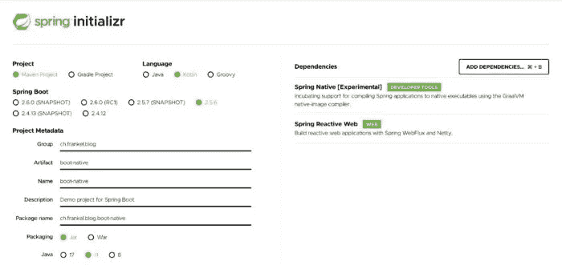
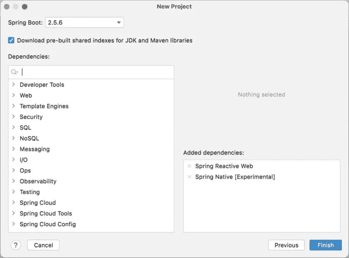

# Spring Boot 本土形象

> 原文：<https://itnext.io/native-image-spring-boot-2862371d3149?source=collection_archive---------4----------------------->


云实现了许多以前不可能实现的新用途。其中包括无服务器:

> *无服务器计算是一种云计算执行模式，其中云提供商按需分配机器资源，代表客户管理服务器。无服务器计算不在易失性存储器中保存资源；计算是在短时间内完成的，结果保存在存储器中。当应用程序不在使用中时，没有计算资源分配给该应用程序。*
> 
> *——*[*维基*](https://en.wikipedia.org/wiki/Serverless_computing)

同样，为了管理锁定单个云供应商的风险，人们可以避开他们的特定服务，选择 Kubernetes。

在这两种情况下，尤其是在前一种情况下，运输舱/容器的寿命很短。因此，启动时间对整个系统的性能有很大的影响。很明显，这是一个 JVM 没有表现出来的领域。

为了解决这个问题，Oracle 提供了 GraalVM，它包含一个字节码到二进制的 AOT 编译器。我一直在关注 GraalVM 在几个版本上的改进，独立的和与 Spring Boot 集成的。

Spring 框架是在十多年前设计的，当时还没有这个问题。另一方面，几年前出现了拥抱云和 AOT 的 Spring 竞争者:
Micronaut 和 Quarkus。

在这个由三部分组成的系列中，我想依次看看它们，剖析几个主题:

*   创建新项目
*   Bean 配置
*   控制器配置
*   非阻塞 HTTP 客户端
*   参数化
*   测试
*   Docker 集成
*   生成 GraalVM 映像
*   等等。

为此，我将创建一个基于 Kotlin 的应用程序，它可以使用非阻塞代码查询漫威 API。

这篇文章致力于解释应用程序和 Spring Boot。

# 漫威空气污染指数

漫威提供了一个 REST API 来查询他们的数据。它需要生成一个 API 密钥**和一个私有密钥**。

要进行身份验证，需要传递以下内容作为查询参数:

1.  现有的 API 密钥
2.  时间戳
3.  时间戳、私钥和 API 密钥串联的 MD5 哈希

```
curl http://gateway.marvel.com/v1/public/comics?ts=1&apikey=1234&hash=ffd275c5130566a2916217b101f26150
```

更多详细信息，请参考[文档](https://developer.marvel.com/documentation/authorization)。

# 创建新项目

Spring 团队是第一个提供 Web UI 来配置项目的团队，Spring Initializr 。



使用它，您可以配置以下参数:

*   构建工具，Maven 或 Gradle
*   语言，Java、Kotlin 或 Groovy
*   Spring Boot 的版本
*   一些元数据
*   属国

此外，该应用程序还提供了一个 REST API 来使用 CLI 和自动化重复性任务。IntelliJ IDEA 集成了 REST API，因此您可以在不离开 IDE 的情况下创建一个新项目。



最后，当它被托管时，底层代码是在 Apache v2 许可下在 GitHub 上可用的[，因此您可以克隆和配置它。它的设计考虑到了可扩展性，允许升级。](https://github.com/spring-io/initializr)

# Bean 配置

我已经写了一篇关于在 Spring 中创建 beans 的不同方法的文章。

尽管 Spring 为 beans 提供了专用的 DSL，但我们将使用“传统的”方式——注释。

我们需要一个 MD5 消息摘要来认证。使用 Bean DSL，我们可以这样配置:

```
@Configuration
class MarvelConfig {

    @Bean
    fun md5(): MessageDigest = MessageDigest.getInstance("MD5")
}
```

由于有了`@SpringBootApplication`注释，Spring 将在启动时自动发现这个类，并实例化 beans:

```
@SpringBootApplication
class BootNativeApplication
```

# 控制器配置

Spring 率先在 Servlet API 之上引入了基于注释的控制器配置。从那以后，有一些反对注释的声音。出于这个原因，Spring 引入了声明性路由。Kotlin 让 DSL 路由变得更加令人愉快:

```
fun routes() = router {
    GET("/") { request ->
        ServerResponse.ok().build()
    }
}
```

我们还需要将路由器注册为 bean:

```
@Configuration
class MarvelConfig {

    @Bean
    fun routes() = router {
    GET("/") { request ->
        ServerResponse.ok().build()
    }

    // Other beans
}
```

# 非阻塞 HTTP 客户端

很久以来，Spring 已经以作为 Web MVC 一部分的`RestTemplate`的形式提供了一个*阻塞* HTTP 客户端。在第 5 版中，Spring 引入了 WebFlux，它是 Web MVC 的反应式对应物。WebFlux 建立在 Project Reactor 之上，而 Project Reactor 本身建立在反应流之上。您可能熟悉 Project Reactor 的基础原语:

*   `Mono`:最多发射一个项目
*   `Flux`:发射 0..n 个项目

有了 WebFlux，Spring 弃用了`RestTemplate`，取而代之的是提供的无功`WebClient`。以下是如何在现有路线内拨打电话:

```
fun routes() = router {
    GET("/") { _ ->
        val client = WebClient.create();
        val mono = client
            .get()
            .uri("https://gateway.marvel.com:443/v1/public/characters")
            .retrieve()
            .bodyToMono<String>()
        ServerResponse.ok().body(mono)
    }
}
```

我们还想获得一些参数，并进一步传播它们。在漫威 API 提供的所有工具中，我选择暴露三个:`limit`、`offset`和`orderBy`。

`GET`函数接受一个`(ServerRequest) -> ServerResponse`作为其第二个参数。`ServerRequest`提供了`queryParam(String)`来检查查询参数的存在。它返回一个 Java `Optional`。另一方面，`UriBuilder`允许通过`queryParam(String, String)`功能设置查询参数。

我们可以在两者之间创建一个扩展桥:

```
fun UriBuilder.queryParamsWith(request: ServerRequest) = apply {
    arrayOf("limit", "offset", "orderBy").forEach { param ->     <1>
        request.queryParam(param).ifPresent {                    <2>
            queryParam(param, it)                                <3>
        }
    }
}
```

1.  对于每个参数
2.  如果请求中有
3.  在 URI 构建器上设置其名称和值

现在，我们可以相应地称之为:

```
fun routes(client: WebClient, props: MarvelProperties, digest: MessageDigest) = router {
    GET("/") { request ->
        val mono = client
            .get()
            .uri {
                it.path("/characters")
                  .queryParamsWith(request)
                  .build()
            }.retrieve()
            .bodyToMono<String>()
        ServerResponse.ok().body(mono)
    }
}
```

# 参数化

下一步是参数化应用程序:漫威 API 要求我们进行身份验证，我们不想硬编码我们的凭证。此外，出于测试目的，我们希望快速更改我们发送请求的服务器的 URL。

参数化包括两个部分:如何将参数传递给应用程序，以及如何在应用程序中使用这些参数。

对于传递参数，Spring Boot 提供了许多不同的方法。参数可以在配置文件中分组，并作为一个整体激活。在本例中，我选择在应用程序内部的 YAML 文件中设置服务器 URL，因为这是默认设置，并通过命令行传递秘密。

```
app:
  marvel:
    server-url: https://gateway.marvel.com:443
```

要在应用程序中使用参数，我们还有几种选择。一种是用`@Value`注释字段，让 Spring 在运行时注入值。或者，我们可以将它们分组到一个专用的类(或几个类)中，让 Spring 再次进行绑定。我相信，除非你只有一个单一的价值，财产类是一个很好的选择。

```
@ConfigurationProperties("app.marvel")      <1>
@ConstructorBinding                        <2>
data class MarvelProperties(
    val serverUrl: String,                 <3>
    val apiKey: String,
    val privateKey: String
)
```

1.  管理要读取的前缀
2.  与 Kotlin 数据类集成
3.  Spring 比较宽容，允许几种情况:烤肉串、蛇或者骆驼

# 测试

代码库的大小不适合大量的测试，尤其是单元测试。但是，我们可以添加一个集成测试，确保来自 API 的响应被解组到一个类中，并再次从应用程序中封送回来。在测试中，我们希望避免依赖第三方基础设施:测试不应该因为我们无法控制的依赖而失败。

对于集成测试，我们可以在类上使用`@SpringBootTest`注释:

```
@SpringBootTest(
    webEnvironment = WebEnvironment.RANDOM_PORT,      <1>
    properties = [
        "app.marvel.api-key=dummy",                   <2>
        "app.marvel.private-key=dummy"                <3>
    ]
)
class BootNativeApplicationTests
```

1.  在随机端口上启动应用程序，以避免由于端口冲突而导致失败
2.  `MarvelProperties`需要该参数，但未用于测试。只要参数存在，我们就传递任何东西。

TestContainer 是一个 Java 库，允许启动/停止 Docker 容器。要使用它，我们只需要用相关的注释对类进行注释。我们还需要配置我们想要使用的容器:

```
@Testcontainers                                             <1>
class BootNativeApplicationTests {

    companion object {                                      <2>

        @Container                                          <3>
        val mockServer = MockServerContainer(
            DockerImageName.parse("mockserver/mockserver")  <4>
        )
}
```

1.  与测试容器集成
2.  在 Java 中，我们需要有一个`static`成员。
    在 Kotlin 中，它被翻译成伴随对象的属性
3.  配置测试容器
4.  使用引用的容器图像

[MockServer](https://www.testcontainers.org/modules/mockserver) 是一个容器，可以被存根化以返回依赖于输入的有效载荷。

现在真正有趣的部分来了:

*   为了开始测试，我们需要 IP 和 port 作为参数来初始化`MavelProperties`
*   要获得 IP 和端口，我们需要启动容器，容器的生命周期与测试绑定在一起，*即*，我们需要首先启动测试

我们可以在[动态属性源](https://www.baeldung.com/spring-dynamicpropertysource)的帮助下解决这个鸡和蛋的问题。

```
companion object {

    @JvmStatic                                                   <1>
    @DynamicPropertySource                                       <2>
    fun registerServerUrl(registry: DynamicPropertyRegistry) {   <3>
        registry.add("app.marvel.server-url") {                  <4>
            "http://${mockServer.containerIpAddress}:${mockServer.serverPort}"    <5>
        }
    }
}
```

1.  Java 兼容性所必需的
2.  神奇！
3.  Spring Test 在运行时注入它
4.  添加此属性…
5.  …这个值取自`mockServer`财产

现在，让我们来看看测试方法:

```
@Test
fun `should deserialize JSON payload from server and serialize it back again`() {                                                  <1>
    val mockServerClient = MockServerClient(
        mockServer.containerIpAddress,
        mockServer.serverPort
    )                                                            <2>
    val sample = ClassPathResource("/sample.json").file.readText()<3>
    mockServerClient.`when`(                                     <4>
        HttpRequest.request()
            .withMethod("GET")
            .withPath("/v1/public/characters")
    ).respond(                                                   <5>
        HttpResponse()
            .withStatusCode(200)
            .withHeader("Content-Type", "application/json")
            .withBody(sample)
    )
    // Test code
}
```

1.  Kotlin 允许测试方法名称有描述性文本
2.  创建存根
3.  引用类路径资源的 Spring 抽象。`sample.json`是测试样本。
4.  *当*部分存根
5.  *然后是*部分

让我们继续测试本身。Spring Test 提供了`WebTestClient`，一个非阻塞的测试客户端。它允许参数化 HTTP 请求，发送它们并在响应上执行几个流畅的断言。

```
class BootNativeApplicationTests {

    @Autowired
    private lateinit var webTestClient: WebTestClient            <1>

    @Test
    fun `should deserialize JSON payload from server and serialize it back again`() {
        // Stubbing code
        webTestClient.get()
            .uri("/")
            .exchange()
            .expectStatus().isOk
            .expectBody()
            .jsonPath("\$.data.count").isEqualTo(1)              <2>
            .jsonPath("\$.data.results").isArray                 <2>
            .jsonPath("\$.data.results[0].name")
                .isEqualTo("Anita Blake")                        <2>
    }
}
```

1.  春试为你注入`WebTestClient`
2.  响应上的断言

但是，此时测试无法执行。我们使用 Beans DSL 配置了应用程序；我们必须在应用程序启动时显式调用`beans`。我们还需要明确地配置测试。

```
class TestConfigInitializer : ApplicationContextInitializer<GenericApplicationContext> {
    override fun initialize(context: GenericApplicationContext) {
        beans.initialize(context)
    }
}

@SpringBootTest(
    properties = [
        "context.initializer.classes=ch.frankel.blog.TestConfigInitializer" <1>
    ]
)
class BootNativeApplicationTests
```

1.  引用初始化类

# Docker 和 GraalVM 集成

注意:本节假设您已经熟悉 GraalVM native。

Spring Boot 提供了两种创建本地二进制文件的方法:

1.  依赖于系统的二进制文件:这种方法需要安装带有`native-image`扩展名的本地 GraalVM。它将创建一个非跨平台的系统相关的二进制文件。
    对此，Spring Boot 有专门的简介:
    `./mvnw -Pnative package`
2.  Docker 映像:这种方法构建了应用程序的容器化版本。它需要一个本地映像构建，*，例如*，Docker。在内部，它利用了 [CNCF 构建包](https://buildpacks.io/)(但不需要`pack`)。
    Spring Boot 为此提供了一个专家目标:

*   `./mvnw spring-boot:native-image`

Spring Boot 负责 GraalVM 代码的本地配置和大多数依赖关系。如果需要进一步配置，可以使用标准配置文件*，如*、`/META-INF/native-image///reflect-config.json`。

作为替代，Spring 提供了基于注释的配置。让我们开始吧:

```
@SpringBootApplication
@NativeHint(options = ["--enable-https"])                        <1>
@TypeHint(
    types = [
        Model::class, Data::class, Result::class, Thumbnail::class,
        Collection::class, Resource::class, Url::class, URI::class
    ],
    access = AccessBits.FULL_REFLECTION                          <2>
)
class BootNativeApplication
```

1.  保留 TLS 相关代码
2.  保持分类并允许在运行时反射

使用第二种方法，结果如下:

```
REPOSITORY      TAG       IMAGE ID         CREATED         SIZE
native-boot     1.0       c9284b7f99a6     41 years ago    104MB
```

如果我们深入到图像中，我们可以看到以下图层:

```
┃ ● Layers ┣━━━━━━━━━━━━━━━━━━━━━━━━━━━━
Cmp   Size  Command
     17 MB  FROM c09932ee5c22aa1                <1>
     268 B                                      <2>
    3.4 MB                                      <3>
     81 MB                                      <4>
    2.5 MB                                      <5>
     12 kB
       0 B                                      <6>
```

1.  父图像
2.  系统权限
3.  Paketo buildpacks CA 证书
4.  我们的本地二进制
5.  云原生启动器可执行文件
6.  启动器别名

生成的图像接受参数，就像您在命令行上运行 Java 应用程序一样。

```
docker run -it -p8080:8080 native-boot:1.0 --app.marvel.apiKey=xyz --app.marvel.privateKey=abc --logging.level.root=DEBUG
```

我们现在可以发送请求来使用该应用程序:

```
curl localhost:8080
curl 'localhost:8080?limit=1'
curl 'localhost:8080?limit=1&offset=50'
```

# 结论

Spring 在处理样板代码和让开发人员专注于业务代码方面有着悠久的历史。在后来的几年里，它成功地集成了 Kotlin 语言，提供了一种奇妙的开发体验。

然而，随着云变得更加广泛，Spring 生态系统被迫应对 GraalVM 原生。虽然它仍有改进的空间，但它完成了任务。

在接下来的文章中，我将使用所谓的云原生框架 Quarkus 和 Micronaut 来描述同一个应用程序。

感谢 [Sébastien Deleuze](https://twitter.com/sdeleuze) 对这篇文章的帮助。

这篇文章的完整源代码可以在 [Github](https://github.com/ajavageek/springboot-native) 上以 Maven 格式找到。

**更进一步:**

*   [弹簧初始化](https://start.spring.io/)
*   [动态房产来源](https://www.baeldung.com/spring-dynamicpropertysource)
*   [春天原生文档](https://docs.spring.io/spring-native/docs/current/reference/htmlsingle/)
*   [原生提示](https://docs.spring.io/spring-native/docs/current/reference/htmlsingle/#native-hints)

*原载于* [*一个 Java 怪胎*](https://blog.frankel.ch/native/spring-boot/)*2021 年 11 月 14 日*