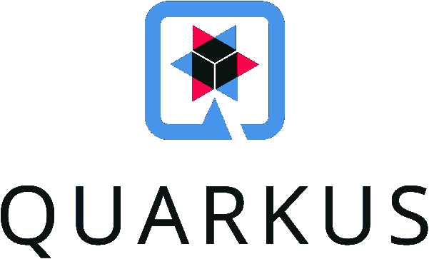
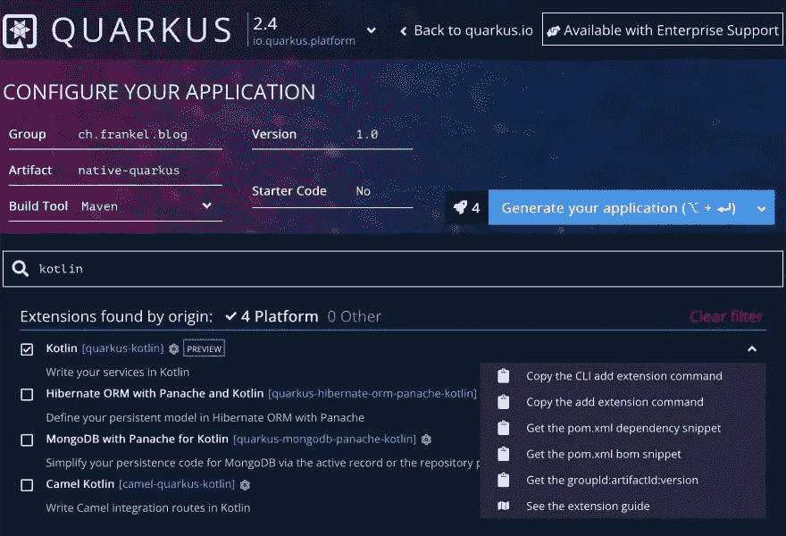
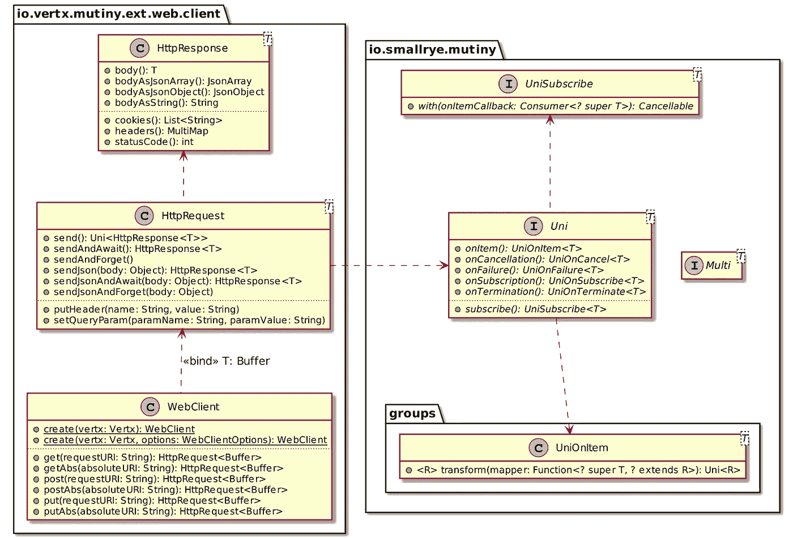
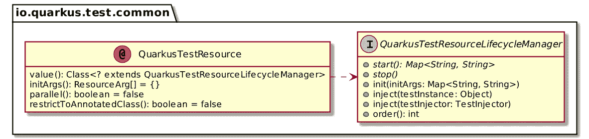

# 带夸库的原生图像

> 原文：<https://itnext.io/native-image-with-quarkus-aa3cbee997f8?source=collection_archive---------6----------------------->



到目前为止，我们已经了解了 [Spring Boot](https://blog.frankel.ch/native/spring-boot/) 和 [Micronaut](https://blog.frankel.ch/native/micronaut/) 集成 GraalVM 本地映像扩展的情况。在这篇文章中，我将重点关注[夸库](https://quarkus.io/):

> *为 OpenJDK HotSpot 和 GraalVM 量身定制的 Kubernetes 原生 Java 堆栈，采用了同类最佳的 Java 库和标准。*

# 创建新项目

正如 Spring Boot 和 Micronaut 一样，Quarkus 提供了创建新项目的选项:

1.  专用的`quarkus` [CLI](https://quarkus.io/guides/cli-tooling)
2.  一个[网络用户界面](https://code.quarkus.io/)



Quarkus 相对于其竞争对手有明显的改进。每个依赖项都有一个详细的上下文菜单，允许:

*   通过`quarkus`复制添加依赖关系的命令
*   通过 Maven 复制添加依赖项的命令
*   复制 Maven POM 依赖项片段
*   复制 Maven BOM 依赖关系片段
*   复制 Maven BOM 依赖关系片段
*   打开相关依赖项的指南

请注意，如果您选择 Gradle 作为构建工具，菜单会显示与 Gradle 相关的命令。

3.一个 Maven 插件:我喜欢除了自己选择的构建工具之外，不需要任何外部依赖。

# Bean 配置

夸库斯依靠 [JSR 330](http://javax-inject.github.io/javax-inject/) 。然而，它偏离了规范:它列出了[限制](https://quarkus.io/guides/cdi-reference#limitations)和[非标准特征](https://quarkus.io/guides/cdi-reference#nonstandard_features)。

例如，使用 Quarkus，如果生产者方法已经用范围注释之一*进行了注释，例如*、`@Singleton`，那么您可以跳过生产者方法上的`@Produces`注释。下面是创建消息摘要的代码:

```
class MarvelFactory { @Singleton
    fun digest(): MessageDigest = MessageDigest.getInstance("MD5")
}
```

# 控制器配置

很多夸库依赖于雅加达 EE 规范。因此，创建控制器最直接的途径就是 JAX-RS。我们可以用下面的代码创建一个“控制器”:

```
@Path("/")
class MarvelController { @GET
    fun characters() = Response.accepted()
}
```

因为 Quarkus 的开发者也在 [Vert.x](https://vertx.io/) 上工作，所以前者也提供了集成后者的插件。Vert.x 是全*反应式*并提供*路线*的概念。使用 Quarkus，您可以注释方法，将它们标记为路径。可以将上述代码迁移到 routes:

```
@Singleton
class MarvelController { @Routes
     fun characters() = Response.accepted()
}
```

可替换地，人们可以更喜欢编程路由注册:

```
@Singleton
class MarvelRoutes { fun get(@Observes router: Router) {       // 1
        router.get("/").handler {
            it.response()
                .setStatusCode(200)
                .send()                       // 2
        }
    }
}
```

1.  观察`Router`“事件”:启动时触发一次。
2.  发送空响应；返回一个`Future<Void>`

请注意，在这种特殊情况下，编程方式需要与注释方式一样多的注释。但是，前者需要两个注释，而后者需要每个路线一个加一个。

# 非阻塞 HTTP 客户端

Micronaut 通过插件集成了许多 HTTP 客户端风格。在这个项目中，我选择了使用[兵变](https://smallrye.io/smallrye-mutiny/)。

> *还有其他的反应式编程库。在 Java 世界里，我们可以提到 Project Reactor 和 Rx Java。*
> 
> *那么，《兵变》和这两个知名的库有什么不同呢？API！*
> 
> 如上所述，对于大多数开发人员来说，异步是很难掌握的，这是有充分理由的。因此，API 不能要求高深的知识或增加认知负荷。它应该可以帮助你设计你的逻辑，并且在 6 个月内仍然可以理解。
> 
> *—*[*https://small rye . io/small rye-mutate/pages/philosophy # what-makes-mutate-different*](https://smallrye.io/smallrye-mutiny/pages/philosophy#what-makes-mutiny-different)

以下是兵变 API 的一个子集:



起初，我不喜欢叛变。我的意思是，我们已经有足够多的反应式客户:Project Reactor、RxJava2 等。

然后，我意识到了它的做法的独特性。反应式编程是相当棘手的，因为所有可用的选项。但哗变是围绕一个流畅的 API 设计的，它利用类型系统在编译时缩小兼容选项的范围。它温和地帮助你写出你想要的结果，即使只是简单的 API 知识。

我现在被说服给它一个机会。
让我们用哗变来提出一个请求:

```
val client = WebClient.create(vertx)                      // 1
client.getAbs("https://gateway.marvel.com:443/v1/public/characters")  // 2
      .send()                                             // 3
      .onItem()                                           // 4
      .transform { it.bodyAsString() }                    // 5
      .await()                                            // 6
      .indefinitely()                                      // 7
```

1.  通过包装一个`Vertx`实例来创建客户端。夸库斯提供了一个，可以给你注射
2.  创建一个`GET` HTTP 请求的新实例
3.  异步发送请求*。目前还没有发生任何事情。*
4.  *当它收到响应时…*
5.  *…把它的身体变成一个`String`*
6.  *等等…*
7.  *…永远，直到它得到响应。*

*利用路由上下文，从到来的请求中获取参数并转发它们是很简单的:*

```
*router.get("/").handler { rc ->
    client.getAbs("https://gateway.marvel.com:443/v1/public/characters")
        .queryParamsWith(rc.request())
        .send()
        .onItem()
        .transform { it.bodyAsString()) }
        .await()
        .indefinitely()fun HttpRequest<Buffer>.queryParamsWith(req: HttpServerRequest) =
    apply {
        arrayOf("limit", "offset", "orderBy").forEach { param ->
            req.getParam(param)?.let {
                addQueryParam(param, it)
            }
        }
    }*
```

# *参数化*

*像 Spring Boot 和 Micronaut 一样，Quarkus 允许以多种方式参数化应用程序:*

*   *系统属性*
*   *环境变量*
*   *`.env`文件在当前工作目录下*
*   *`$PWD/config/application.properties`中的配置文件*
*   *类路径中的配置文件`application.properties`*
*   *类路径中的配置文件`META-INF/microprofile-config.properties`*

*注意，不可能使用命令行参数进行参数化。*

*与它的兄弟不同，web 客户端要求您将 URL 分成三个部分，主机、端口和是否使用 SSL。*

```
*app.marvel.server.ssl=true
app.marvel.server.host=gateway.marvel.com
app.marvel.server.port=443*
```

*因此，我们需要在配置类方面有点创意:*

```
*@Singleton                                            // 1
data class ServerProperties(
    @ConfigProperty(name = "app.marvel.server.ssl")
    val ssl: Boolean,                                 // 2
    @ConfigProperty(name = "app.marvel.server.host")
    val host: String,                                 // 2
    @ConfigProperty(name = "app.marvel.server.port")
    val port: Int                                     // 2
)@Singleton                                            // 1
data class MarvelProperties(
    val server: ServerProperties,                     // 3
    @ConfigProperty(name = "app.marvel.apiKey")
    val apiKey: String,                               // 2
    @ConfigProperty(name = "app.marvel.privateKey")
    val privateKey: String                            // 2
)*
```

1.  *配置类是常规的 CDI beans。*
2.  *Quarkus 使用微配置文件配置规范。`@ConfigProperty`设置要读取的属性键。在所有键上重复相同的前缀是不方便的。因此，Microprofile 提供了`@ConfigProperties`来设置类的前缀。然而，这样一个类需要一个零参数的构造函数，这对 Kotlin 的数据类不起作用。*
3.  *注入另一个配置类，并从嵌套结构中获益*

# *测试*

*像它的兄弟一样，Quarkus 为测试提供了专用的注释，`@QuarkusTest`。它还提供了`@NativeImageTest`，允许在本地映像环境中运行测试。想法是在用前者注释的类中定义 JVM 测试，并创建用后者注释的子类。这样，测试将在 JVM 上下文和本机上下文中运行。请注意，我不确定它在我的设置中是否有效。*

*但是依我看，Quarkus 在测试环境中的附加价值在于它如何定义一个可重用的资源抽象。*

**

*只有一个接口和一个注释，就可以定义一个资源，*，例如*，一个模拟服务器，在测试之前启动它，在测试之后停止它。让我们这样做:*

```
*class MockServerResource : QuarkusTestResourceLifecycleManager { private val mockServer = MockServerContainer(
        DockerImageName.parse("mockserver/mockserver")
    ) override fun start(): Map<String, String> {
        mockServer.start()
        val mockServerClient = MockServerClient(
            mockServer.containerIpAddress,
            mockServer.serverPort
        )
        val sample =
            this::class.java.classLoader.getResource("sample.json")
                                       ?.readText()
        mockServerClient.`when`(
            HttpRequest.request()
                .withMethod("GET")
                .withPath("/v1/public/characters")
        ).respond(
            HttpResponse()
                .withStatusCode(200)
                .withHeader("Content-Type", "application/json")
                .withBody(sample)
        )
        return mapOf(
            "app.marvel.server.ssl" to "false",
            "app.marvel.server.host" to
                mockServer.containerIpAddress,
            "app.marvel.server.port" to
                mockServer.serverPort.toString()
        )
    } override fun stop() = mockServer.stop()
}*
```

*现在，我们可以在测试中使用这个服务器:*

```
*@QuarkusTest
@QuarkusTestResource(MockServerResource::class)
class QuarkusApplicationTest { @Test
    fun `should deserialize JSON payload from server and serialize it back again`() {
        val model = given()                                 // 1
            .`when`()
            .get("/")
            .then()
            .statusCode(200)
            .contentType(ContentType.JSON)
            .and()
            .extract()
            .`as`(Model::class.java)
        assertNotNull(model)
        assertNotNull(model.data)
        assertEquals(1, model.data.count)
        assertEquals("Anita Blake", model.data.results.first().name)
    }
}*
```

1.  *Quarkus 集成了 RestAssured API。它使用了 Kotlin 的一些关键字，所以我们需要用反勾号对它们进行转义。*

*我喜欢它将测试从依赖中分离出来的方式。*

# *Docker 和 GraalVM 集成*

*当一个人搭建一个新项目时，Quarkus 会创建不同的现成可用的`Dockerfile`:*

*   *一个古老的罐子*
*   *分层 JAR 方法:首先将依赖项添加到映像中，这样如果其中任何一个发生变化，构建就可以重用它们的层*
*   *本土形象*
*   *具有*发行版*父级的本机映像*

*好的一面是，用户可以根据自己的需要配置这些模板中的任何一个。缺点是它需要本地 Docker 安装。此外，模板只是模板，您可以完全更改它们。*

*如果你不喜欢这种方法，Quarkus 提供了一个带有[悬臂](https://github.com/GoogleContainerTools/jib)的[集成点](https://quarkus.io/guides/container-image#jib)。在本节的其余部分，我们将继续使用 Docker 文件。*

*要创建 GraalVM 本地二进制文件，可以使用以下命令:*

```
*./mvnw package -Pnative -Dquarkus.native.container-build=true*
```

*您可以在`target`文件夹中找到生成的本机可执行文件。*

*要将其包装在 Docker 容器中，请使用:*

```
*docker build -f src/main/docker/Dockerfile.native -t native-quarkus .*
```

*注意，如果在非 Linux 平台上运行第一个命令，Docker 容器将无法启动。要解决这个问题，需要添加一个选项:*

```
*./mvnw package -Pnative -Dquarkus.native.container-build=true \
                         -Dquarkus.container-image.build=true*
```

> *`*quarkus.container-image.build=true*` *指示 Quarkus 使用最终的应用程序工件(在本例中是本机可执行文件)创建一个容器映像。**
> 
> **—*[*https://quar kus . io/guides/building-native-image # using-the-container-image-extensions*](https://quarkus.io/guides/building-native-image#using-the-container-image-extensions)*

*对于较小的图像，我们可以使用 distroless 分布。*

*结果如下:*

```
*REPOSITORY                TAG     IMAGE ID     CREATED        SIZE
native-quarkus-distroless latest  7a13aef3bcd2 2 hours ago    67.9MB
native-quarkus            latest  6aba7346d987 2 hours ago    148MB*
```

*让我们潜水吧:*

```
*┃ ● Layers ┣━━━━━━━━━━━━━━━━━━━━━━━━━━━━━━━━━━━━━━━━━━━━━━━━━━━━━━━━━━━━━
Cmp   Size  Command
    2.4 MB  FROM 58f4b2390f4a511                                 #1
     18 MB  bazel build ...                                      #2
    2.3 MB  bazel build ...                                      #2
    113 kB  #(nop) COPY file:b8552793e0627404932d516d478842f7f9   #3
     45 MB  COPY target/*-runner /application # buildkit         #4*
```

1.  *父发行版映像*
2.  *添加系统库，显然是通过 Bazel 构建系统*
3.  *又一个系统库*
4.  *我们的本地可执行文件*

*我们现在可以运行容器了:*

```
*docker run -it -p8080:8080 native-quarkus-distroless*
```

*以下 URL 按预期工作:*

```
*curl localhost:8080
curl 'localhost:8080?limit=1'
curl 'localhost:8080?limit=1&offset=50'*
```

# *结论*

*夸库斯带来了激动人心的表演。与 Micronaut 不同，它不会在每次编译时生成额外的*字节码*。只有在通过 Maven 命令生成本机映像时，才会生成额外的代码。此外，如果您碰巧有一个 Docker 守护进程，那么依靠 Dockerfiles 可以让您随心所欲地配置它们。*

*但是，缺少 Kotlin 集成。您必须降级您的模型表示以允许 Quarkus 水合您的数据类，从`val`移动到`var`并设置默认值。此外，需要在每个字段上设置 Jackson 注释。最后，配置属性不能很好地处理数据类。*

*和 Micronaut 一样，如果 Kotlin 是你的必备，那么你最好选择 Spring Boot 而不是夸库斯。否则，给夸库斯一个机会。*

*感谢塞巴斯蒂安·布兰克和克莱门特·埃斯科菲耶的评论。*

*这篇文章的完整源代码可以在 GitHub 上找到[。](https://github.com/ajavageek/quarkus-native)*

# ***更进一步:***

*   *[Quarkus 应用程序配置器](https://code.quarkus.io/)*
*   *[Quarkus 命令行界面](https://quarkus.io/guides/cli-tooling)*
*   *[用 Maven 构建应用](https://quarkus.io/guides/maven-tooling)*
*   *[使用 Kotlin](https://quarkus.io/guides/kotlin)*
*   *[反应兵变入门](https://quarkus.io/guides/getting-started-reactive#mutiny)*
*   *[容器图像](https://quarkus.io/guides/container-image)*

**最初发表于* [*一个 Java 极客*](https://blog.frankel.ch/native/quarkus/)*2021 年 12 月 11 日**