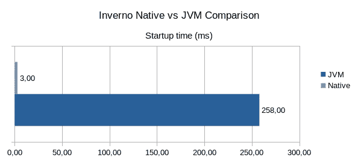
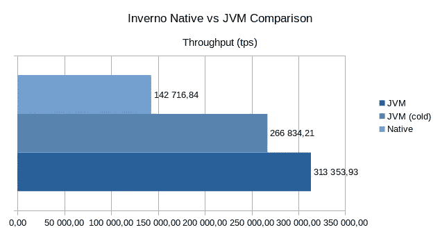
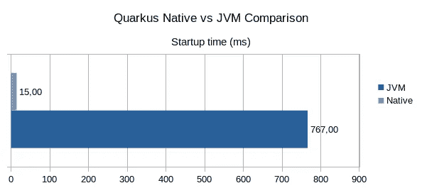
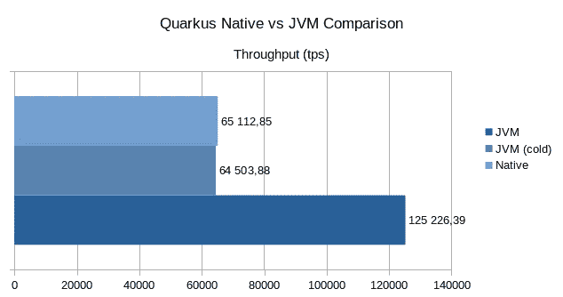
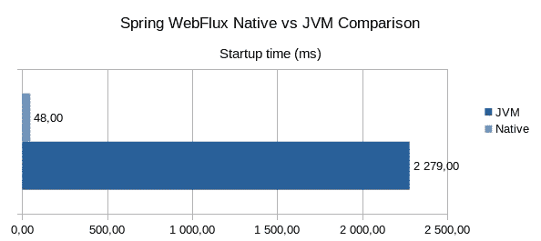
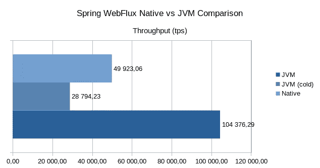
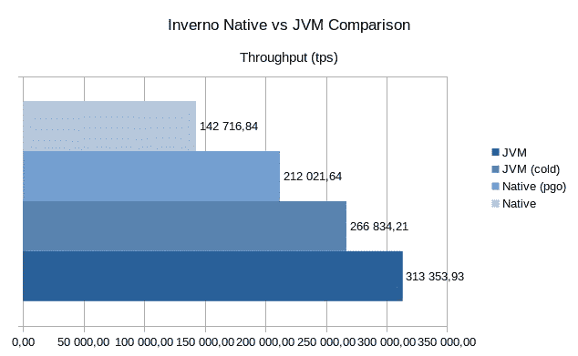

# 带有 GraalVM 的本机 Inverno

> 原文：<https://itnext.io/native-inverno-with-graalvm-f64bd1533aab?source=collection_archive---------5----------------------->

除非你住在山洞里，否则你不可能错过围绕 GraalVM 的所有宣传，以及生成通常在 JVM 上运行的 Java 程序的优化本机映像的能力。 [Inverno Framework](https://inverno.io) 旨在减少应用运行时开销，从而加快应用启动并改善资源消耗。通过依赖编译器而不是运行时库来组装应用程序组件，以及通过将反射的使用减少到几乎为零，这已经成为可能。理论上，所有这些都将极大地促进使用 GraalVM 生成原生映像，所以我决定看看它在实践中是如何进行的。

本土因弗诺

但是首先，什么是本机映像以及它是如何工作的。当 JVM 启动一个 Java 程序时，它加载可从程序入口点访问的类:main 方法，它解释字节码，并使用 JIT 编译器将其翻译成本机代码。这就是为什么 Java 经常被批评为慢的原因，这是真的也是假的，因为 Java 程序只是启动慢，但是过一段时间后，一旦所有代码都被 JIT 编译器翻译了，性能就可以和本机代码相比了。当构建本机映像时，我们试图在构建时而不是运行时提前完成 JIT 编译器的工作。由此产生的本机映像应该启动得更快，使用的内存更少，因为程序精确地集成了运行时所需的内容。可以想象，这并不是没有限制的，但是我稍后会谈到这些。

所以让我们试一试吧！

本机映像生成需要 [GraalVM](https://www.graalvm.org/downloads/) 和[本机映像命令](https://www.graalvm.org/reference-manual/native-image/)。

我考虑了一个简单的 [HTTP 应用程序](https://github.com/inverno-io/inverno-examples/tree/native-tests/inverno-example-http)，我对它进行了一点改造以进行一些测试(移除了 TLS、HTTP 压缩和 epoll)。我还使用了 [GraalVM 本地构建工具](https://graalvm.github.io/native-build-tools/0.9.5/index.html)来将本地映像构建过程集成到项目构建中。

我必须做的第一件事是提供[构建配置](https://www.graalvm.org/reference-manual/native-image/BuildConfiguration/)来告诉 GraalVM 本机映像构建器应该在构建时或运行时加载哪些类，哪些类通过反射加载，哪些资源应该集成到结果映像中……许多框架试图自动化这一步骤，主要是通过嵌入一些常见配置，但也有一些特别的静态代码分析。例如，Spring 非常依赖反射，它提供了在构建时提取对象图形并生成合适配置的工具。

要学习的第一个经验是，实际上不需要提供任何特定的配置来正确支持 Inverno 的模块，因为 Inverno 不依赖反射来组装应用程序。然而，对于 Log4j2、Netty 或 Jackson 等第三方库来说，事情要复杂一些，不过我会在后面解释这些限制。使用 [GraalVM 跟踪代理](https://www.graalvm.org/reference-manual/native-image/Agent/)并查看类初始化报告，我最终创建了一个工作配置。我基本上选择在构建时初始化 Log4j2，在运行时初始化 Netty。这可能不会产生最佳的图像，但至少它的工作没有太多的麻烦。

下图比较了本机映像和 JVM 上运行的应用程序的启动时间和吞吐量，也就是负载下的性能。这些数据是通过保留 5 次运行的最佳结果获得的，但冷 JVM 吞吐量除外，这是第一次在*冷* JVM 上运行的结果。使用具有 256 个连接的 [wrk](https://github.com/wg/wrk) 获得吞吐量，在 15 秒内使用 8 个线程。

这些结果基本上显示了两件有趣的事情。首先，本机映像将启动时间提高了 98.84%，这是一个巨大的提高，尤其是考虑到它最初只有 258 毫秒*和*。第二点更令人不安，本机映像的性能下降了 54.45%。*冷的* JVM 数字正好证实了运行在 JVM 上的 Java 应用程序必须预热才能发挥其全部潜力。

由于原生映像目前不支持 epoll 等原生传输，这种性能下降会带来更多问题，在支持 epoll 的平台上，性能会再下降 15%。除此之外，应用程序运行良好，我们还可以注意到，本机映像没有预热时间，吞吐量从一开始就是恒定的。

在这一点上，我想知道其他的应用程序框架，如 [Spring](https://spring.io/) 或 [Quarkus](https://quarkus.io/) ，它们积极地支持原生映像生成，是否存在同样的性能问题。为了测试这些，我创建了一个简单的 [RESTEasy JAX-RS Quarkus](https://code.quarkus.io) 应用程序，并使用了 Spring native[web flux Netty](https://github.com/spring-projects-experimental/spring-native/tree/main/samples/webflux-netty)示例应用程序。下图显示了 Spring 和 Quarkus 的结果。

正如您所看到的，我们使用 Quakus 或 Spring Webflux 观察到了相同的模式:与 JVM 相比，Quakus 的性能下降了 48 %, Spring 的性能下降了 52%,而启动时间却大大减少了。

那么为什么我们会有这样的差异呢？为了获得可能的最佳性能，JVM 不仅仅将字节码翻译成本地代码，它还在运行时根据负载模式对其进行优化。这基本上意味着 JIT 编译器的输出可能会因运行的不同而不同。另一方面，当在构建时生成本机映像时，不可能预测会导致整体性能降低的负载模式。GraalVM Enterprise Edition 提供了[配置文件引导优化](https://www.graalvm.org/reference-manual/native-image/PGO/)，基本上允许生成一个可在运行时收集代码执行频率配置文件的插装本机映像，该配置文件稍后可用于生成一个专门优化的本机映像。

下图将配置文件引导的优化本机映像的吞吐量与之前的结果进行了比较。

我们清楚地看到 PGO 映像做得更好，但是它仍然落后 JVM 32%。

关于原生映像的限制，我已经提到了一个事实，即目前 Netty 的原生传输(epoll，kqueue…)不被支持，这导致了支持它的平台上的一些性能损失。Java 模块系统也不被支持，这是非常不幸的，但目前这并不是一个问题。我最大的问题实际上与构建本机映像时必须明确指定的资源有关。在运行时，解析类路径或模块路径上的资源的方式非常不同，这引起了一些关注:因为没有模块，所以不能按模块解析资源，因为没有类路径，所以不能列出资源或区分具有相同路径的资源，必须知道资源的确切路径，否则会在映像中发生冲突。例如，Inverno Web 模块受到影响，因为 OpenAPI 和 WebJars 功能依赖于以前的技术来发现和公开静态资源。

无论是使用反射、类路径/模块资源还是类初始化树，尤其是组件之间的依赖关系，构建本机映像的能力都会对应用程序的代码和架构产生一些影响。创建本机映像所需的封闭世界可能很困难，尤其是如果应用程序使用许多不提供或不能提供本机配置的第三方库。单个静态最终场可以对如何构建图像产生重大影响。

关于内存消耗的最后一点:我没有提到它，因为对于我测试过的任何框架，在高负载下，我没有看到本机映像和 JVM 之间的显著差异。然而，这在很大程度上取决于映像是如何构建的，所以对我来说，这是不确定的，尽管这显然是原生映像的承诺之一。

# 减去

随着云和容器技术的发展，JVM 提供的可移植性已经变得不那么吸引人了，甚至因为不必要的长启动时间和预热阶段而被视为一个问题。本机映像部分解决了这个问题，并提供了极快的启动速度。

另一方面，如果我考虑到复杂性、对代码的影响以及使用 JVM 全部功能的限制，我不确定为常规的长时间运行的微服务应用程序生成本机映像是否是可取的。考虑到本机映像与 JVM 相比表现不佳，这一点更是如此，即使使用配置文件引导的优化也不容易设置，并且只附带了非免费的 GraalVM Enterprise Edition。

那么 Java 原生是 Java 的未来吗？是的，最有可能的是，这是行业的发展方向，但警告目前太大了，我现在能看到的唯一应用是无服务器/FaaS 应用，对这些应用来说，极快的启动是必须的。但是对于任何其他用例，我认为重要的是将启动时间减少到最小，最有效地利用资源，让 JVM 做剩下的事情，这正是 [Inverno Framework](https://inverno.io) 正在做的。