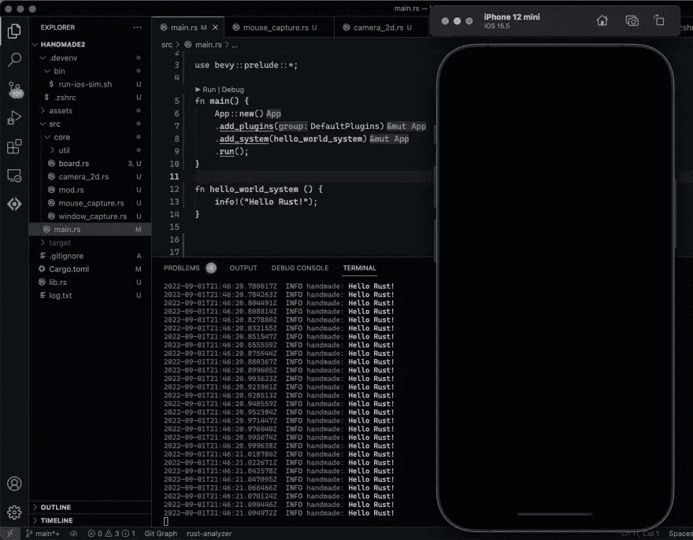

# 带 Rust 的原生 iOS 游戏开发

> 原文：<https://itnext.io/native-ios-game-development-w-rust-a1134887c35f?source=collection_archive---------0----------------------->

我用纯 Rust 探索跨平台游戏开发的记录之旅。

> 说真的。100%生锈或破裂！

下一篇: [**原生 iOS 触摸事件 w/ Rust**](https://medium.com/@wadecodez/rust-native-ios-touch-events-8b01418e0f3b)


# 为什么我选择了铁锈

当谈到性能和模块化设计时，Rust 是一个热门话题，但在撰写本文时，Rust 社区中只有 iOS 开发的微弱消息。所以我选择 Rust 是因为我想要一个跨平台的系统编程语言。

> **后知之明:我喜欢 Rust 的地方**
> 
> 在深入研究 Rust 几个星期后，我发现一些最可怕的特性令人惊讶地令人愉快。虽然有一个学习曲线，但事后看来，我真的很欣赏 Rust 的以下特性。
> 
> 没有 OOP
> 
> 模块化代码
> 
> 文档生态系统
> 
> 构建系统
> 
> 包装管理

# 我探索铁锈的目标

我的目标是找到一种语言，它允许我编写跨平台的代码，而不需要经历一系列困难。作为一名业余爱好者，我没有以前那么多时间去学习新语言或钻研框架。

最终我想在 App Store 上发布一个成品，但是现在我的目标是编译一些东西。如果 Rust 允许我去掉大部分(如果不是全部的话)Swift 和 Objective-C 编程，我会很高兴。

# 0.项目环境设置

进入这个项目，我知道我会频繁地修改环境变量和构建脚本。所以在开始使用 Rust 之前，我增强了我的`.bashrc`,这使得我可以很容易地对我的开发环境进行大的修改。

下面的脚本允许我从我的`~/code`文件夹中的任何项目目录扩展我的`.bashrc`，向上遍历直到找到一个名为`.devenv`的文件夹。从那里我可以获得每个项目的 bash 脚本。

```
# get the first match from `find` while traversing upwards
function find_above {
    old_pwd="$PWD"
    while [[ "$PWD" == $HOME/code/* ]] ; do
        new_pwd=`find "$PWD"/ -maxdepth 1 "$@"`

        if [[ "$new_pwd" ]]; then
            break
        fi

        cd ..
    done

    echo "$new_pwd"
    cd "$old_pwd"
    old_pwd=""
    new_pwd=""
}
```

这是我使用该方法寻找本地`.bashrc`的部分。每次切换项目时，我都必须重新开发我的环境，但这不是问题。

```
# see code above

ENVDIR=$(find_above -type d -name ".devenv")
if [[ "$ENVDIR" ]]; then
    source "$ENVDIR/.bashrc"
fi
```

# 创建别名

现在我的机器可以处理每个项目的 bash 环境，我设置了几个命令来快速跳过我的代码。

```
# ~/code/tictactoe/.devenv/.bashrc
echo "detected local env: $PWD"

# src directory
export SRCDIR=$(find_above -name "src")

# root directory
export ROOTDIR=$(dirname $SRCDIR)

# build directory
export BUILDDIR="$ROOTDIR/target"
mkdir -p "$BUILDDIR"

# lib directory
export LIBDIR="$ROOTDIR/src"
mkdir -p "$LIBDIR"

# bin directory
export BINDIR="$ROOTDIR/.devenv/bin"
mkdir -p "$BINDIR"
export PATH="$BINDIR:$PATH"

export RUST_LOG="warn,handmade=debug"
export RUST_BACKTRACE=1

# aliases
alias c="cargo build"
alias clean="clean"
alias s="source $HOME/.zshrc"
alias root="cd $ROOTDIR"
alias r="cargo run"
alias t="cargo test"
alias i="run-ios-sim.sh"
alias cr="c && r"
```

# 1.Hello World Rust/Bevy

几周前，我想从尽可能低的水平开始。我想写自己的图形渲染器和游戏引擎。然而，大约 3 天零进展后，我放弃了那个梦想，寻找一个 Rust 游戏引擎。*大概是先试跑再学走的经典场景。*

# 安装 Bevy

所以很自然地，我下载了我能找到的第一个游戏引擎。这是一个非常好的框架。Bevy 是一个游戏引擎，它是围绕高度模块化的应用程序而设计的。我已经用了几个星期的图书馆了，非常棒！

```
cargo add bevy
```

# 使用 Bevy 范式编写代码

这是在 Mac OS 上使用 Bevy 的 Hello world:

```
use bevy::prelude::*;

fn main() {
    App::new()
        .add_system(hello_world_system)
        .run();
}

fn hello_world_system() {
    println!("Hello Rust");
}
```

注意我没有直接调用`println`。这是因为 Bevy 提供了一个非常类似于`ExpressJS`中路由系统的框架。在更大的项目中，你可以在模块/插件中提取功能，每个插件都可以访问上下文来注册更多的系统。

# 运行 Bevy Hello World

```
cargo run
```

# GUI 在哪里？

Bevy 将其所有组件隔离成插件，所以如果你想放弃整个“游戏引擎”的东西，你可以这样做！你也可以在无头模式下运行 Bevy！尽管为了这个实验，我启用了默认插件。

```
use bevy::prelude::*;

fn main() {
    App::new()
        .add_plugins(DefaultPlugins)
        // ...
        .run();
}

// ...
```

# 2.为 iOS 构建(跨平台前期)

我想立即尝试为 iOS 编译`hello world`。这节省了我大量的前期时间，因为如果我不能让 iOS 与 Rust 一起工作，那么这个项目就是失败的。此外，没有什么比编写一个项目，然后在事后试图将其移植到另一个系统更困难的了。

> **后见之明:警告导致发现**
> 
> 我花了很长时间才成功编译。最初，我认为我需要使用 `*extern "C"*` *创建一个头桥，但事实并非如此。一切都用纯 Rust 代码工作！*

# 集束

有一个用于 cargo 的构建工具，让我可以毫不费力地为 iOS 编译和打包。首先安装构建工具:

```
cargo install cargo-bundle
```

## 添加编译目标

然后你可以列出 Rust 支持的所有可能的构建目标。因为我的目标是 iOS，所以我运行了以下命令:

```
rustup target list | grep ios
```

如果您缺少作为目标的 iOS，您可以基于您的机器的架构添加一个新的目标。

```
# for production
rustup target add aarch64-apple-ios

# for development
rustup target add aarch64-apple-ios-sim
```

# iOS 模拟器的打包

一旦您的系统**上有了可用的编译目标，并且您在 Mac** 上，您可以使用下面的脚本或者复制并粘贴以下命令来将您的应用程序注入模拟器。大多数命令都是 XCode 附带的。

该脚本使用 [dasel](https://github.com/TomWright/dasel) 从项目`Cargo.toml`文件中查询名称和包标识符。

```
brew install dasel
```

使用 XCode 提供的一系列命令，我可以在不启动 GUI 的情况下使用 iPhone 模拟器。关于这个脚本中的命令如何工作的更多信息可以使用这个[备忘单](https://nshipster.com/simctl/)找到。

```
#/usr/bin/env bash

APP_NAME="$(cat Cargo.toml | dasel -r toml '.package.name')"
BUNDLE_ID="$(cat Cargo.toml | dasel -r toml '.package.metadata.bundle.identifier')"

cargo bundle --target aarch64-apple-ios-sim
xcrun simctl boot "iPhone 12 mini"  
open /Applications/Xcode.app/Contents/Developer/Applications/Simulator.app 
xcrun simctl install booted "target/aarch64-apple-ios-sim/debug/bundle/ios/$APP_NAME.app"
xcrun simctl launch --console booted "$BUNDLE_ID"
```

# 3.项目成功！

如果一切正常，我应该会有一个 iOS 应用程序向我的终端发送“Hello Rust ”,并满足以下标准:

*   完全用铁锈写的
*   没有桥接代码
*   没有 XCode
*   标准设计
*   灵活的开发环境



# 待续

如果您想将项目的其余部分作为一个系列来记录或共享源代码，请关注、鼓掌并发表评论！它帮助我保持动力

下篇: [**原生 iOS 触摸事件 w/ Rust**](https://medium.com/@wadecodez/rust-native-ios-touch-events-8b01418e0f3b)

# 结论

完全用 Rust 写一个游戏，编译到 iOS 是有可能的。

[](https://devmap.org/membership) [## 通过我的推荐链接加入 Medium-Wade Zimmerman

### 阅读 Wade Zimmerman(以及 Medium 上成千上万的其他作家)的每一个故事。您的会员费直接支持…

devmap.org](https://devmap.org/membership)