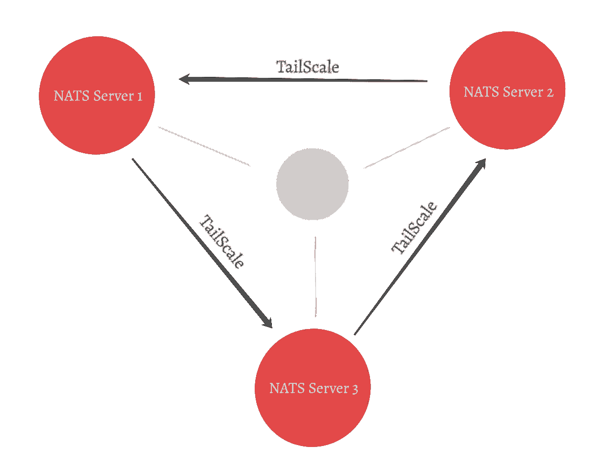
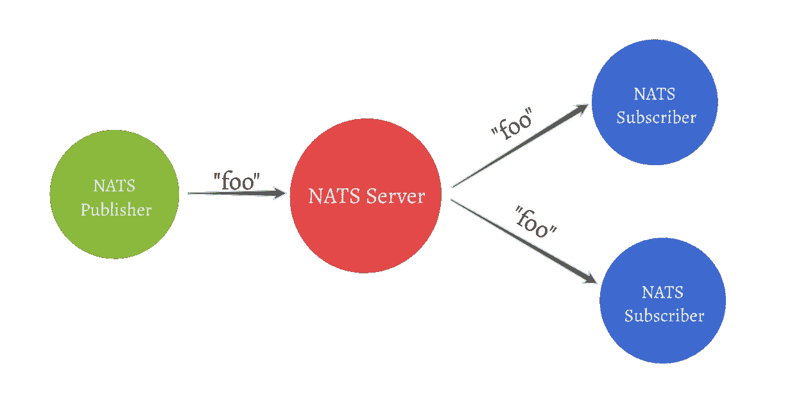
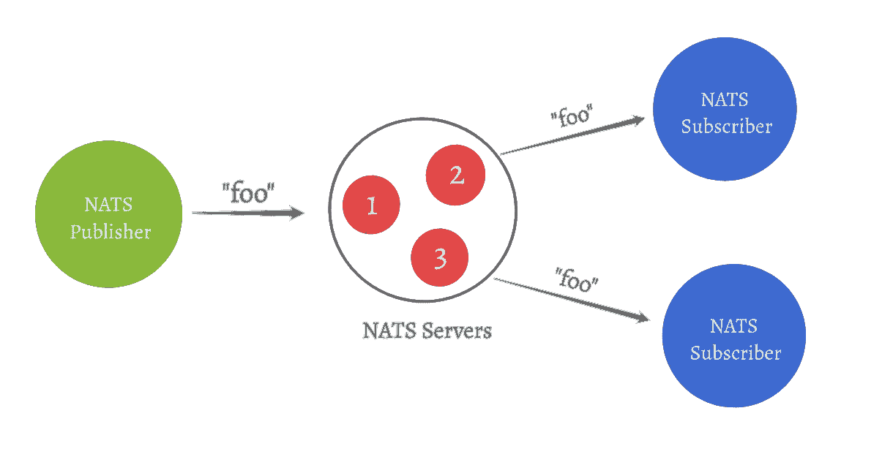
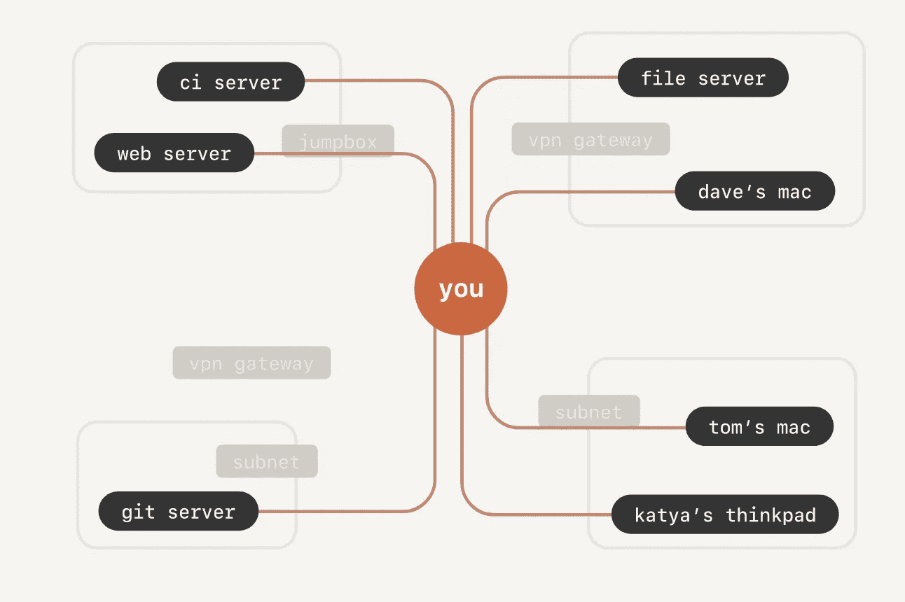
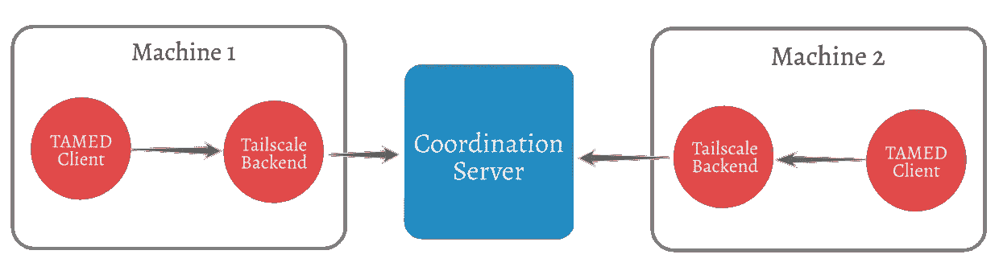

# NAT scaled:TailScale 网络上的分布式服务

> 原文：<https://itnext.io/natscaled-distributed-services-on-tailscale-network-d9947b291e57?source=collection_archive---------2----------------------->

玩具应用程序在一个大规模网络中运行多个 NATS 服务器

## 最终产品

这个**玩具**应用的目的是实验 Tailscale(更多关于 tailscale 的内容见下文)。当我们运行应用程序(实际上是一个二进制文件)时，它将:

1.  要求用户通过 Gmail/Microsoft/Tailscale 登录
2.  登录后，将启动服务器
3.  在具有相同登录帐户的多个系统(位于任何地方)中重复步骤 1 和 2 将导致所有这些服务器彼此安全地通信，即这些服务器将形成一个集群。

概略地说，在三台机器上运行后，它看起来像这样:

图 1:三台 NAT 服务器(机器)使用 Tailscale 相互连接(点对点)。[ *箭头是双向的，但为了美观，画的是单向的]*

**科技栈:** [Go](https://golang.org/) ， [TailScale](https://tailscale.com/) ， [NATS](https://docs.nats.io/)

现在让我们试着一层一层地剥开它

## 海军运输航空处(Naval Air Transport Service)

想象一下这样一种情况，作为开发人员，您的任务是创建一个发布事件(用户事件)的服务，这些事件由多个服务(分析、通知)消费。如果你打算使用 NATS 套餐，这是你要经历的

1.  在计算机中启动 NATS 服务器
2.  创建使用 NATS 发布者客户端向主题发布消息的服务
3.  使用 NATS 订阅服务器创建订阅服务，以订阅已发布的主题

图 2:一个 NATS 发布者客户端在主题“foo”下发布，2 个 NATS 订阅者客户端正在收听“foo”下的事件

在生产环境中，为了避免单点故障和许多其他原因，我们需要 2 台以上的服务器。NATS 服务器支持将多台机器组合成集群，允许服务器相互通信(图 3)。

图 3:与图 2 相同，但是多个 NATS 服务器形成一个集群

为了让 NATS 服务器组成一个集群，它们需要知道现有集群中至少一个 其他服务器的 [*的 IP 地址，也就是说，每次我们(重新)启动一个服务器时，我们都需要用集群中任何其他正在运行的服务器的 IP 信息来播种它。这个识别其他服务的过程通常被称为服务发现。*](https://docs.nats.io/nats-server/nats_admin/upgrading_cluster#seed-servers)

如果每次都给服务器分配动态 IP 地址，任务会变得更加麻烦。有各种各样的解决方案可以解决这个问题，但是我们将使用 Tailscale 进行实验(非常非常规！).

## 尾秤

[Tailscale](https://tailscale.com/) 在设备(或机器)之间创建一个**专用网络，**

1.  你可以在你的笔记本电脑，手机，云服务器，树莓派，大脑的小脑里安装 Tailscale 应用程序[这里不严肃！]等…
2.  使用谷歌/微软/Tailscale 登录
3.  所有这些设备都将通过专用网络连接。

图 4:借用自 [tailscale](https://tailscale.com/) 的图片，展示了如何在没有 VPN 网关或跳线盒的情况下直接连接到多台机器

*对其工作感兴趣的人，请阅读* [*这篇*](https://tailscale.com/blog/how-tailscale-works/) *牛逼的帖子。*

除了提供安全的点对点专用网络，tailscale 还确保为每台设备分配一个唯一的 Tailscale IP 地址，该地址对于登录帐户保持不变。

现在我们已经看到了零件，让我们开始组装玩具吧

## 驯养

当我们在机器上运行 tailscale 应用程序时，Tailscale 守护进程开始与协调服务器通信。[Tamed](https://github.com/nnanto/tamed)(Tailscale As Membership Discovery)是一个 **tailscale 客户端库**，它监听来自 Tailscale 守护进程的事件，并维护对等体的成员信息。

图 5:驯服客户在尾秤堆栈中的位置描述。机器之间的通信仍然以对等的方式进行

被驯服的客户端公开了 AllPeers() 函数，我们可以用它来获取对等体的 Tailscale IP 地址。此外，当前的实现也运行 Tailscale 守护进程(即，你不需要安装 Tailscale 应用程序),因为 ping 请求更新在 Mac 上仍然不可用，但听说它正在路上

> 声明:驯服是我个人的实现，它甚至没有接近生产就绪。请将其用于概念验证或用作[参考](https://github.com/nnanto/tamed/blob/main/example/client/client.go)。

## NATScaled

既然我们可以获得所有对等体的 IP 地址(在运行时当前连接到 tailscale ),我们可以通过提及集群中其他服务器的可能路由来启动 NATS 服务器。NATS 将负责新服务器的启用和停用。希望图 1 现在更有意义。

NATScaled 是运行在 tailscale 网络上的 NATS 服务器的一个示例实现。它首先启动提供对等体列表的被驯服的客户端，然后启动 NATS 服务器并通知服务器我们的 tailscale 网络中所有可能的对等体。

## 到处跑

多亏了 GoLang 和它的交叉编译，我们可以用一个命令为其他平台生成二进制文件。*(所以还不需要码头工人)*

图 6:在美国各地运行 NATScaled

由于 [NATScaled](https://github.com/nnanto/natscaled) 二进制包含 tailscale 和 NATS 服务器，我只需运行` ***sudo。/NAT scaled-TSD****`*in

1.  我的个人笔记本电脑(加州)
2.  Azure 虚拟机(美国中部)
3.  我朋友的笔记本电脑(纽约)

让 NATServer 在我们的三台机器上安全地运行和通信。

*运行 NATScaled 启动 tailscale 守护进程，驯服客户端，通知 NATS 服务器的对等点，并启动 NATS 服务器*

## 等等……你意识到了吗？

1.  我没有撞到防火墙或 NAT 穿越或开放端口。
2.  我不必跨机器处理 TLS 证书。
3.  人们甚至可以在 Android/iOS 上运行它(尽管 TAMED 现在还不能工作)
4.  我只需要从那台机器上登录到 Google/Microsoft/Tailscale 就可以连接这些机器了。
5.  NATS 服务器只是为了展示，您可以通过使用 Tailscale 作为引擎盖下的成员发现来实现自己的系统。

简单来说，Tailscale 就是牛逼！这只是一个玩具应用程序，但我希望看到有趣的应用程序将建立在 Tailscale。

*P.S:我最初试图通过在所有设备上运行 git server 并同步存储库(目录)来创建一个共享目录。对于玩具应用程序来说，这似乎是太多的工作了，但是你可以考虑一下！*