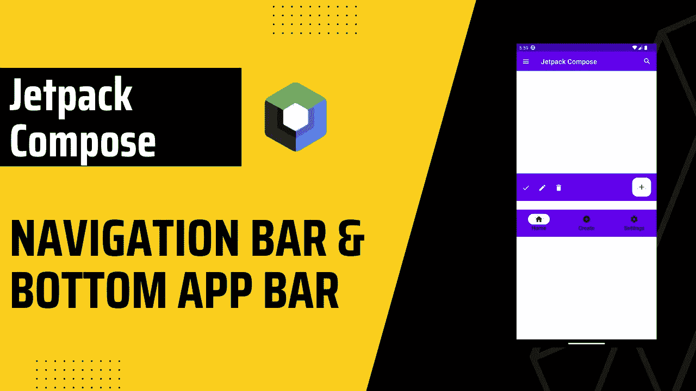
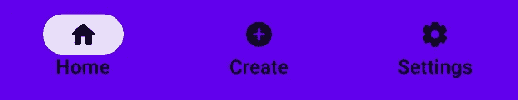
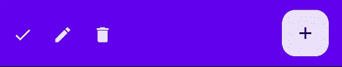
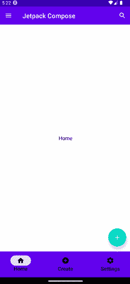

# Jetpack 中的导航栏和底部应用程序栏由材料 3 组成

> 原文：<https://itnext.io/navigation-bar-bottom-app-bar-in-jetpack-compose-with-material-3-c57ae317bd00?source=collection_archive---------0----------------------->



> 导航栏，提供了一种持久而便捷的方式在应用程序的主要目的地之间切换。`[NavigationBar](https://developer.android.com/reference/kotlin/androidx/compose/material3/package-summary#NavigationBar(androidx.compose.ui.Modifier,androidx.compose.ui.graphics.Color,androidx.compose.ui.graphics.Color,androidx.compose.ui.unit.Dp,androidx.compose.foundation.layout.WindowInsets,kotlin.Function1))`应该包含三到五个`[NavigationBarItem](https://developer.android.com/reference/kotlin/androidx/compose/material3/package-summary#(androidx.compose.foundation.layout.RowScope).NavigationBarItem(kotlin.Boolean,kotlin.Function0,kotlin.Function0,androidx.compose.ui.Modifier,kotlin.Boolean,kotlin.Function0,kotlin.Boolean,androidx.compose.material3.NavigationBarItemColors,androidx.compose.foundation.interaction.MutableInteractionSource))`，每个代表一个目的地。
> 
> 底部应用程序栏，在手机屏幕底部显示导航和按键操作。该组件提供对多达四个图标按钮以及一个浮动操作按钮(FAB)的访问。

# 目录

*   [区别和用法](#6fa0)
*   [开始获取信息](#9241)
*   [导航栏](#d653)
*   [底部应用栏](#774c)
*   [从子代动作点击](#40e8)

在我们开始之前，让我们了解一下`Navigation Bar`和`Bottom App Bar`的用法和区别，因为它们不可互换，并且它们需要不同的用例。

# 差异和用法

`Bottom App Bar`应该用于有 2 到 5 个动作的屏幕。它不是`Navigation Bar`，不应该像 T5 一样使用。`FloatingActionButton`是可选的，在需要的时候使用它，不要把它放在`Bottom App Bar`的外面。`Bottom App Bar`不建议在大屏幕上使用。

`Navigation Bar`提供对目的地的访问，而`Bottom App Bar`可以包含目的地和动作。`Navigation Bar`提供 3 至 5 个目的地。它应该仅用于顶级目的地。如果您需要 5 个以上的目的地，您可以使用`Tabs`或`Navigation Drawer`，如果您需要 3 个以下的目的地，您应该使用`Tabs`。

你可以看看我的导航抽屉和标签博客，

[](/app-bar-and-navigation-drawer-in-jetpack-compose-dc799417e459) [## Jetpack Compose 中的应用程序栏和导航抽屉

### Jetpack Compose 中的应用程序栏和导航抽屉。我们还将介绍如何在 Jetpack Compose 中实现搜索应用程序栏。

itnext.io](/app-bar-and-navigation-drawer-in-jetpack-compose-dc799417e459) [](https://burakdev.medium.com/tabs-tablayout-in-jetpack-compose-cd1f84d3a381) [## Jetpack 撰写中的选项卡(TabLayout)

### 选项卡对于在不同的和相关的信息组视图之间切换很有用。选项卡跨…组织内容

burakdev.medium.com](https://burakdev.medium.com/tabs-tablayout-in-jetpack-compose-cd1f84d3a381) 

# 入门指南

首先，让我们添加材料 3 依赖。您可以在[合成材料 3 发布页面](https://developer.android.com/jetpack/androidx/releases/compose-material3)上看到最新的 M3 版本。

```
def material3_version = "1.0.1"
implementation "androidx.compose.material3:material3:$material3_version"
```

可选地，如果你已经在使用材料 2，你可以跟随[这篇博客](https://material.io/blog/migrating-material-3)迁移到材料 3。

最后，我们将在 Jetpack Compose 中使用导航，如果你不知道它是如何工作的，我建议你先看看这个博客。

[](https://burakdev.medium.com/navigation-with-arguments-in-jetpack-compose-bb98999aa49f) [## 在 Jetpack 撰写中使用参数导航

### 在 Jetpack Compose 中使用参数导航非常简单。您可以轻松地在可组合视图之间导航。

burakdev.medium.com](https://burakdev.medium.com/navigation-with-arguments-in-jetpack-compose-bb98999aa49f) 

# 导航栏

让我们从为`[NavigationBarItem](https://medium.com/r?url=https%3A%2F%2Fdeveloper.android.com%2Freference%2Fkotlin%2Fandroidx%2Fcompose%2Fmaterial3%2Fpackage-summary%23%28androidx.compose.foundation.layout.RowScope%29.NavigationBarItem%28kotlin.Boolean%2Ckotlin.Function0%2Ckotlin.Function0%2Candroidx.compose.ui.Modifier%2Ckotlin.Boolean%2Ckotlin.Function0%2Ckotlin.Boolean%2Candroidx.compose.material3.NavigationBarItemColors%2Candroidx.compose.foundation.interaction.MutableInteractionSource%29)`创建模型类开始，

```
data class BottomNavItem(
    val name: String,
    val route: String,
    val icon: ImageVector,
)
```

你可以根据你的需要改变这个类，我们会保持简单。我们将使用`route`进行导航，使用`name` & `icon`进行`NavigationBarItem`。

现在，我们可以创建我们的`BottomNavItem`列表。

```
val bottomNavItems = listOf(
      BottomNavItem(
          name = "Home",
          route = "home",
          icon = Icons.Rounded.Home,
      ),
      BottomNavItem(
          name = "Create",
          route = "add",
          icon = Icons.Rounded.AddCircle,
      ),
      BottomNavItem(
          name = "Settings",
          route = "settings",
          icon = Icons.Rounded.Settings,
      ),
  )
```

就是这样。我们准备实施`Navigation Bar`。

在这个例子中，我们使用了 routes 来检查`selected`，我们也可以使用带有索引的替代方法，

在这两种情况下，我们的最终结果是一样的。在第一个例子中，我们检查当前的`route`，如果它与`item.route`相同，我们将其标记为选中。另一方面，替代方法只是使用索引。

就是这样！



导航栏

# 底部应用程序栏

> `actions`，BottomAppBar 的图标内容。这里的默认布局是一个`Row`，所以里面的内容将被水平放置。
> 
> `floatingActionButton`，BottomAppBar 末端可选浮动动作按钮。

*注意:我已经离开了* `*androidx.compose.material3.*` *所以你不会混淆，因为材料 2 库也有相同的组件。*



底部应用程序栏

# 从子代单击操作

额外注意，如果你想从子屏幕设置`onClick`方法，例如，你在`MainActivity.kt`中设置`Bottom App Bar`，并且你想从不同的可组合屏幕访问它。您应该使用视图模型，

```
class SharedViewModel: ViewModel() {
    var actionIconOnClick = mutableStateOf({})
}
```

并且，从您想要使用的子节点设置`actionIconOnClick`，

```
LaunchedEffect(key1 = Unit) {
    sharedViewModel.actionIconOnClick.value = {
        //Your code here  
    }
}
```

最后从`Bottom App Bar`调用`actionIconOnClick`。

```
sharedViewModel.actionIconOnClick.value.invoke()
```



导航栏 GIF

## 最后的话，

*由于本文的目的是只显示底部应用程序栏的导航栏&，我们忽略了* [*设计架构*](https://developer.android.com/topic/architecture)*[*状态吊装*](https://developer.android.com/jetpack/compose/state#state-hoisting)[*构建架构*](https://developer.android.com/jetpack/compose/architecture) *等。一边实施。我建议您在开发应用程序之前研究并了解它们。**

## *来源:*

*   *[导航栏—材料设计 3](https://m3.material.io/components/navigation-bar)*
*   *[Android x . compose . material 3 | Android 开发者](https://developer.android.com/reference/kotlin/androidx/compose/material3/package-summary#navigationbar)*
*   *[底部应用栏—材料设计 3](https://m3.material.io/components/bottom-app-bar/guidelines)*
*   *[androidx.compose.material3 |安卓开发者](https://developer.android.com/reference/kotlin/androidx/compose/material3/package-summary#BottomAppBar(androidx.compose.ui.Modifier,androidx.compose.ui.graphics.Color,androidx.compose.ui.graphics.Color,androidx.compose.ui.unit.Dp,androidx.compose.foundation.layout.PaddingValues,androidx.compose.foundation.layout.WindowInsets,kotlin.Function1))*