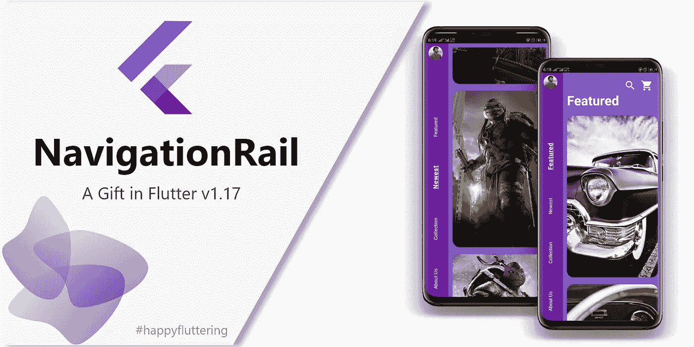
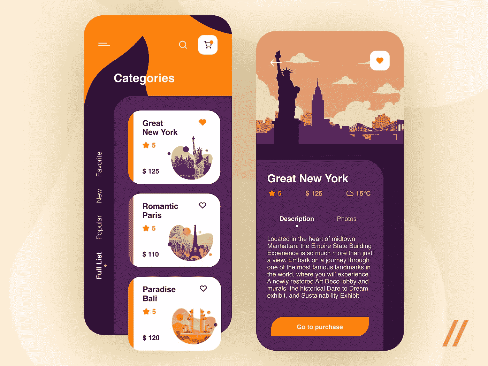
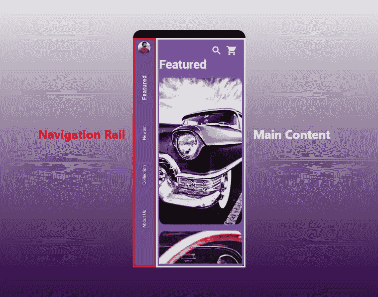
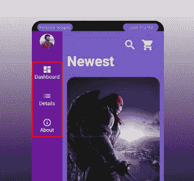
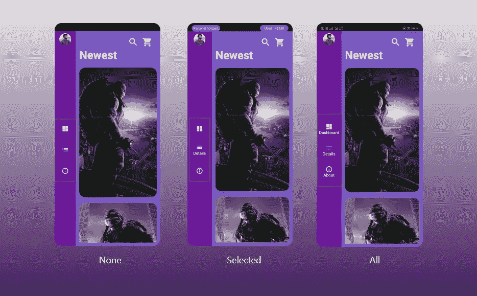
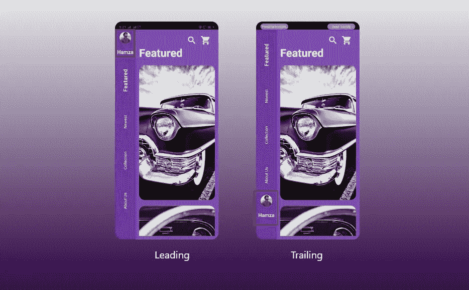
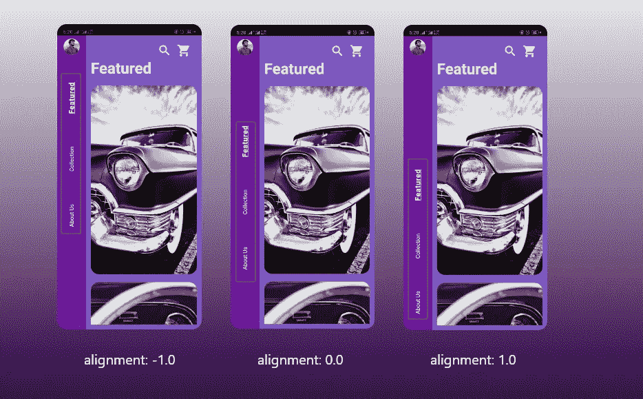
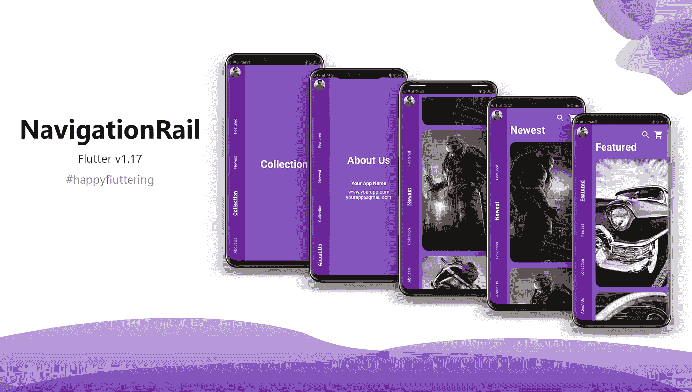

# 导航条小工具— Flutter 1.17 礼物

> 原文：<https://itnext.io/navigation-rail-widget-flutter-1-17-229f7c5d3215?source=collection_archive---------4----------------------->

作为一名开发人员，尤其是如果你是一名移动应用程序开发人员，保持最新的 UI 设计是非常重要的。更吸引人、更漂亮、更易于互动的设计。我本人是移动应用程序开发的新手，尝试为我的应用程序使用新的 UI 设计。我已经和 flutter 一起工作了将近 7-8 个月，到目前为止，我的经历非常愉快。

我总是倾向于使用新的部件、动画和设计来让我的应用程序更漂亮。感谢 Flutter 团队，他们不断推出新的功能和部件来帮助我们。

在 Flutter 的最新更新版本 1.17 以及其他特性之后，Flutter Widgets 家族又增加了一名新成员

> **导航条小工具**



# NavigationRail 部件

嗯， **NavigationRail** 和 **BottomNavigationBar 的工作方式差不多。**在 flutter 的官方[文档](https://api.flutter.dev/flutter/material/NavigationRail-class.html)中，声明它是一个材质小工具，可以放在屏幕的左侧或右侧，你可以在各种屏幕或片段之间导航，无论你想怎么称呼它们。

> 但是，这并不意味着你不能同时使用 BottomNavigationBar。是的，你可以使用这两者来创建无缝有趣的用户界面设计。

下面是我最喜欢的关于*导航条*的运球设计。



[purr web](https://medium.com/u/438dc83766ff?source=post_page-----229f7c5d3215--------------------------------)设计。

> 还有更多，但这一个给了我很大的打击😜

# 屏幕布局

颤振团队*导航轨*的完整示例可以在[这里](https://api.flutter.dev/flutter/material/NavigationRail-class.html)找到。**导航条**的位置或地点对于**顶栏**或**底导航条**不是预先定义的。考虑来自 Flutter 文档的例子，它通常被放在一个*行*小部件的开始或最后，然后主要内容被**垂直分隔符**分隔。主要内容被包裹在*展开的*小部件中，以填满屏幕上的剩余空间。



布局导航轨道

# 深入了解房地产

因此，我们已经看到了布局或设计看起来如何，这是令人敬畏的，让我们看看有哪些属性，以及如何使用它们来创建一些美丽的东西。

与***BottomNavigationBarItems***类似，它持有一个***navigationraildesight***类的属性。

## **导航铁路目的地**

它只是在 **NavigationRail** 中创建可点击的导航，并保存数据以表示该导航或目的地屏幕/视图。



导航轨道目的地

因为，它不是一个小部件，而是一个类，而且它还有 3 个属性。

*   ***图标* :** 一般情况下，图标 widget 放在这里，但是可以带任何 Widget。必须为非空，并且是目标的实际图标
*   **假设您将 ***info_outline*** 作为图标，将 ***info*** 作为 *selectedIcon* 。所以，这种填充图标可以放在这里。**
*   ***标签* :** 必须非空。通常是一个文本小部件，作为特定目的地的标题，位于图标下方。

> 通过使用 **NavigationRail** 中的 **labelType** 属性，可以隐藏或显示所有目的地的标签

**导航铁路目的地**对象的示例，

```
NavigationRailDestination( icon: Icon(Icons.info_outline),
      selectedIcon: Icon(Icons.info),
      label: Text('About'),),
```

# 其他属性

让我们看看 *NavigationRail* 还有什么其他属性

*   ***目的地*** :该属性取*navigationraildesigne*的列表，必须至少包含 2 项。类似于 *BottomNavigationBar* 对于*项* 属性。
*   ***selectedIndex***:与 *BottomNavigationBar* 中的功能完全相同。将定义当前选择的*导航铁路目的地*的索引。
*   ***on destinationselected***:这是一个函数，在选择新的目的地时调用。 ***setState*** '用于使用新选择的索引重建导航轨道，这意味着您必须使用有状态小部件来创建 *NavigationRail*
*   ***labelType*** :通过*navigationrailbelabel type*值给你 3 个选项，

```
NavigationRailLabelType.selectedNavigationRailLabelType.allNavigationRailLabelType.none
```



标签文本选项

它们是不言自明的。**选中的**将在目的地被选中时显示标签，**所有的**将一直显示标签，无论是否被选中，**无**将隐藏所有的标签

*   ***selectedicoontheme&unselect edicoontheme:***其他小工具中常见的属性。您可以简单地定义放在*目的地*属性中的*导航轨道目的地*对象中图标的**颜色**、**不透明度**和**大小**
*   ***selectedLabelTextStyle&unselectedlabeltextstyle:***Standard stuff，您可以使用这些属性来更改*navigationraildestinaion*下面的标签文本的外观和样式，它们采用 *TextStyle* 对象，就像我们通常在 Flutter 中使用它们来样式化文本小部件一样。
*   ***前导&拖尾*** :对！你猜对了。这些属性的工作方式与*列表框*或*应用栏*完全相同。很明显，一个小部件可以放在这里，这样你就可以通过*列*或*列表视图*使用多个小部件。

> 我不知道为什么这里有人会使用 ListView*😅*



领先和落后

还有一点，trailing property 并没有将小部件放在导轨的底部，但是它实际上跟踪了**NavigationRailDestinations**。老实说，我不知道为什么！😜

*   ***group alignment***:用于设置轨道项目的垂直位置。该值必须介于-1.0 和 1.0 之间。默认情况下，它被设置为-1.0，这将把所有轨道的目的地放在**顶部**。0.0 将它们放置在**中心**处，1.0 将它们放置在**底部**处。



群组对齐选项

*   ***minWidth*** :嗯，名字不言自明。它定义了*导航轨*的宽度。默认情况下，其值为 72，但您也可以更改该值来创建紧凑轨道。

# 完整示例

我不是专业的 flutter 开发者，所以这是我用 **NavigationRail** 设计的。代码可以在[这里](https://github.com/m-hamzashakeel/NavigationRail_widget)找到。



完整的示例屏幕

# 注意:创建垂直文本

我使用了一个小部件 **RotatedBox** 来垂直对齐我的文本小部件。

```
NavigationRailDestination( icon: SizedBox.shrink(),
       label: Padding(
       padding: EdgeInsets.symmetric(vertical: 20),
       child: RotatedBox(
                 quarterTurns: -1,
                 child: Text("Hello Flutter"),
             ),
      ))
```

最后，在这里我是一个新手，写一些我最喜欢的平台的更新和特性。我希望你喜欢它😃

这是所有的乡亲。希望对你们有些人有帮助。给一个👏如果你认为这是值得的，请让我知道，自从我最近开始写作以来，我该如何改进。请和我分享你的设计，这对我这个初学者来说会有很大的帮助。

**推特/insta gram/Snapchat/Reddit:**m _ hamzashakeel

**脸书:**哈姆扎

> 谢谢你们所有人💙