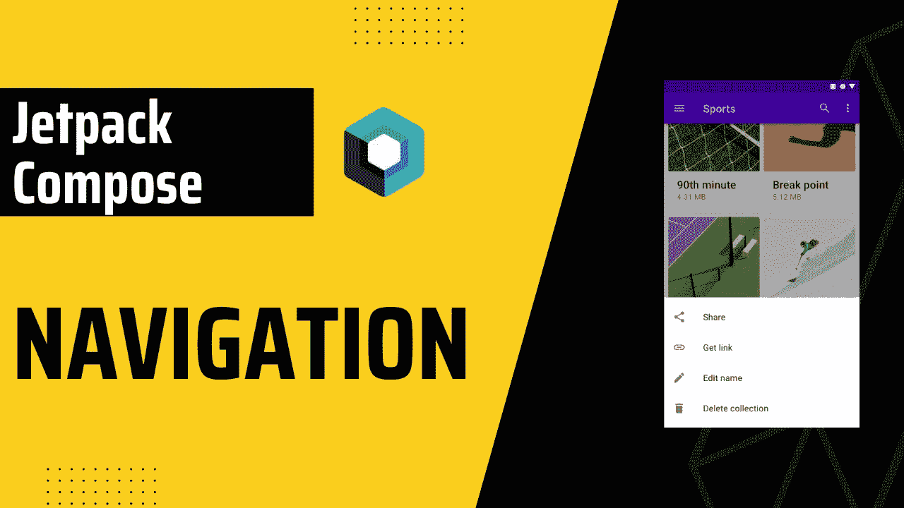

# 在 Jetpack 撰写中使用参数导航

> 原文：<https://itnext.io/navigation-with-arguments-in-jetpack-compose-bb98999aa49f?source=collection_archive---------1----------------------->



# 入门指南

```
dependencies {
    def nav_version = "2.5.3"

    implementation "androidx.navigation:navigation-compose:$nav_version"
}
```

# 履行

首先，让我们创建文件来处理我们的导航。

别担心，我们会在下一部分传递它。首先，我们创建`NavHost`。

> 每个`[NavController](https://developer.android.com/reference/androidx/navigation/NavController)`必须与一个单独的`[NavHost](https://developer.android.com/reference/androidx/navigation/NavHost)`组合相关联。`NavHost`将`NavController`与一个导航图链接起来，该导航图指定了您应该能够在其中导航的可组合目的地。

在创建了`NavHost`之后，我们正在传递我们的`navController`对象和`startDestination`值。在我们的`NavHost`内部，我们传递我们的可组合视图，例如`HomeScreen`，就这样。

在我们的例子中，我们使用可选参数。如果你不希望参数是可选的，你可以把`route`改成，`add/{value}`就足够了。在`arguments`中，我们设置了`type`和`defaultValue`。之后，我们简单地用`backStackEntry.arguments?.getString(“value”)`获取参数，并将其传递给我们的可组合视图。

现在，让我们实现我们的 UI 并使用我们的`NavigationComposable`类。

> 您应该在您的可组合层次结构中所有需要引用它的可组合对象都可以访问它的地方创建`NavController`。这遵循了[状态提升](https://developer.android.com/jetpack/compose/state#state-hoisting)的原理。

在我们的`MainActivity`中，我们创建主机`navController`并将其传递给`MainScreen`，就这样。`NavigationComposable`将处理导航更改。

## 航行

[参考](https://developer.android.com/jetpack/compose/navigation#nav-to-composable)谷歌文档

如您所见，在 Jetpack Compose 中导航非常简单。最后，让我们看看如何使用参数导航。

最后，我希望它是有用的。👋👋

你可以联系我，

*   [LinkedIn](https://www.linkedin.com/in/burak-fidan/)
*   [Github](https://github.com/MrNtlu)
*   [推特](https://twitter.com/BurakFNtlu)