# 需要一个容器图像注册表和舵图表存储库？去海港！

> 原文：<https://itnext.io/need-a-container-image-registry-and-helm-chart-repository-go-harbor-b0c0d4eafd3b?source=collection_archive---------0----------------------->

## CNCF 孵化项目概述

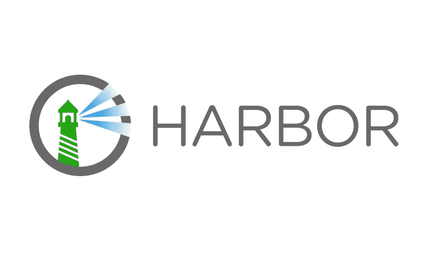

[港湾](https://goharbor.io)是 CNCF 的项目，目前处于孵化阶段。这是一个容器图像注册和掌舵图表存储库，非常注重安全性。看看这个令人印象深刻的功能列表:

*   安全和漏洞分析
*   内容登录和验证
*   多租户
*   跨多个实例的映像复制
*   RBAC
*   API 和 Web 用户界面

在这篇文章中，我们将看到如何用 TLS 来设置 Harbor，并展示它的一些特性。

# 先决条件

在任何云提供商上启动虚拟机(有很多选择，其中包括我最喜欢的:[数字海洋](https://digitalocean.com)、 [Civo](https://civo.com) 、 [Exoscale](https://www.exoscale.com/) 、…)。

安装 Docker，这可以通过以下命令快速完成:

```
$ curl https://get.docker.com | sh
```

使用以下命令安装 Docker Compose:

```
$ sudo curl -L "[https://github.com/docker/compose/releases/download/1.24.1/docker-compose-$(uname](https://github.com/docker/compose/releases/download/1.24.1/docker-compose-$(uname) -s)-$(uname -m)" -o /usr/local/bin/docker-compose$ sudo chmod +x /usr/local/bin/docker-compose
```

注意:Harbor 是一个与 Docker Compose 一起运行的微服务应用程序，它包括以下组件:

*   一种数据库系统
*   雷迪斯
*   克莱尔
*   比格
*   海图博物馆
*   码头工人/配送
*   码头工人/公证人
*   舵
*   斯瓦格-ui

为了保护注册表，我们需要创建一个 TLS 证书。在这篇文章的例子中，我们已经创建了一个证书，所以注册表可以在*https://registry . tech whale . io*上使用

注意:在这个[以前的帖子](/wildcard-lets-encrypt-certificate-2b6133a1acdf)中，我们展示了如何使用 DNS-01 挑战创建一个通配符证书

# 安装港口

首先，我们下载最新的版本(在撰写本文时是 1.9.3 ),并解压归档文件:

```
$ curl -L [https://github.com/goharbor/harbor/releases/download/v1.9.3/harbor-online-installer-v1.9.3.tgz](https://github.com/goharbor/harbor/releases/download/v1.9.3/harbor-online-installer-v1.9.3.tgz) -o harbor.tgz$ tar xvf harbor.tgz
```

接下来，我们需要通过 *harbor.yml* 文件来配置 Harbor。在本例中，我们仅更改:

*   主机名作为注册表可在 *registry.techwhale.io* 上访问
*   提供域证书和私有密钥的 https 配置(我们之前分别将这些文件复制到了 */etc/ssl/certs* 和 */etc/ssl/private* 文件夹中)

```
# The hostname to access admin UI and registry service.
hostname: registry.techwhale.io# http related config
http:
  port: 80# https related config
https:
  port: 443
  certificate: /etc/ssl/certs/registry-fullchain.pem
  private_key: /etc/ssl/private/registry-privkey.pem
```

一旦配置完成，我们就可以运行 *install.sh* shell 脚本来安装 Harbor 了。有几个选项可用:

*   -使用-公证人，公证人确保创建和验证与容器图像相关的数字签名
*   -用-clair， [Clair](https://github.com/quay/clair) 扫描二进制图像，检查它们是否包含现有的 [CVE](https://cve.mitre.org)
*   - with-chartmuseum， [ChartMuseum](https://github.com/helm/chartmuseum) 主持舵图

在本例中，我们将只安装带有 Clair scanner 和 ChartMuseum 的 Harbor。

```
$ sudo ./install.sh --with-clair --with-chartmuseum
```

然后，使用 Docker Compose，我们确保所有组件都在运行:

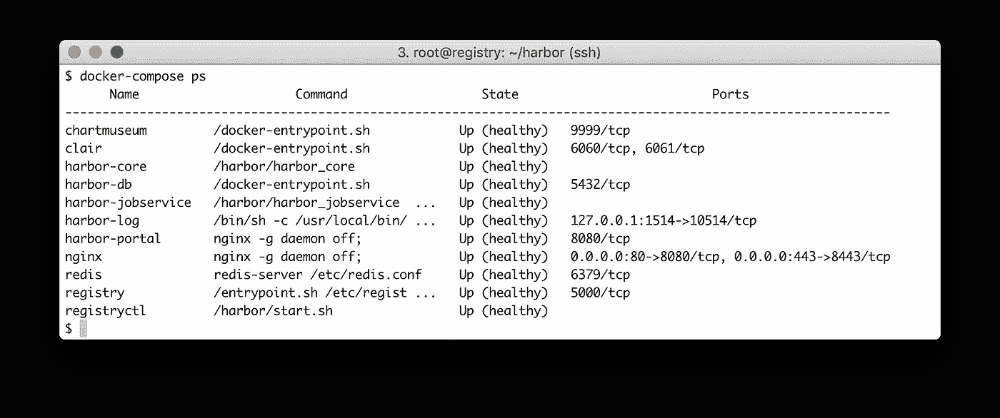

通过 Harbor 运行的组件

我们现在可以访问*https://registry . tech whale . io*上的界面

注意:默认凭证为*admin*/*harbor 12345*，请确保在首次登录时或在安装前更改 *harbor.yml* 配置文件中的密码

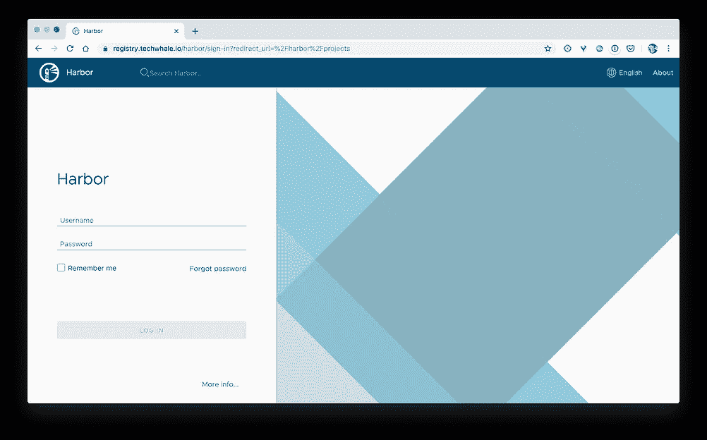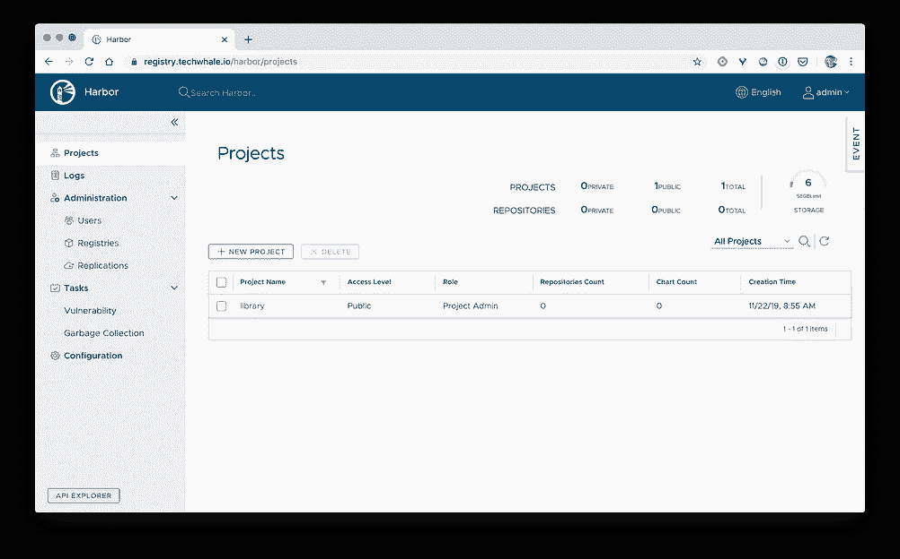

我们登陆*项目*页面，默认*库*项目已经在安装过程中创建。现在让我们创建一个新项目并展示如何使用它。

# 创建项目

首先，从项目菜单中，我们创建一个名为 *demo* 的新项目，让我们考虑这个项目用于托管微服务应用程序的组件。

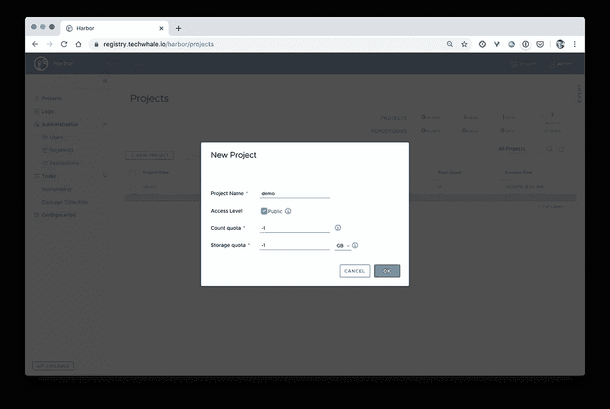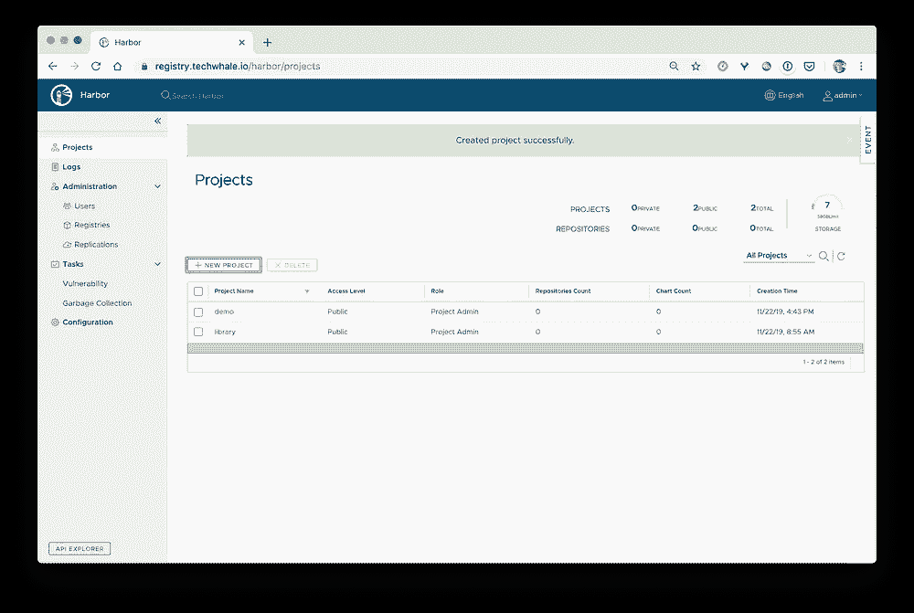

创建新项目

对于每个项目，一个*总结*菜单提供主要信息:

*   容器映像存储库的数量
*   托管的舵图表的数量
*   项目的成员(我们没有在默认的管理员之上创建额外的用户)

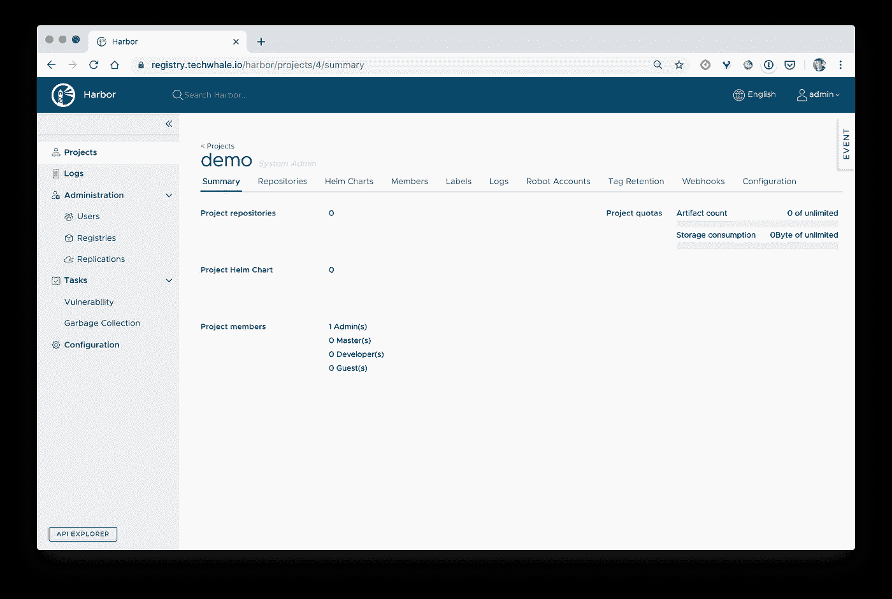

项目摘要视图

对于每个项目，水平导航菜单定义了不同的可用功能:

*   存储库:项目中托管的容器图像存储库
*   舵轮图:Kubernetes 在项目中托管的舵轮图
*   成员:属于项目及其相关角色的用户
*   标签:可以添加到容器图像中并用于过滤的字符串
*   日志:显示在存储库上执行的所有操作
*   机器人帐户:定义某种可以执行自动任务的系统用户(推/拉容器图像和舵图)
*   标签保留:定义移除图像标签的规则
*   Webhook:用于在项目中执行某个操作时通知外部 HTTP 端点(推/拉/删除图像、扫描成功/失败、上传/下载/删除舵图)。例如，使用 webhook，我们可以触发一个新图像的重新部署
*   配置:用于指定项目可见性(公共可用或限制给定的一组用户)和一些与 CVE 扫描相关的选项

## 项目配置

在项目的“配置”选项卡中，我们检查了以下选项:

*   *“推送时自动扫描图像”，*以便每次新图像被推送到注册表时，对照已知的 CVE 进行分析(CVE 内部数据库定期更新)
*   *“阻止易受攻击的映像运行”*，这样如果发现某些漏洞(本例中仅高漏洞)就无法拉取映像

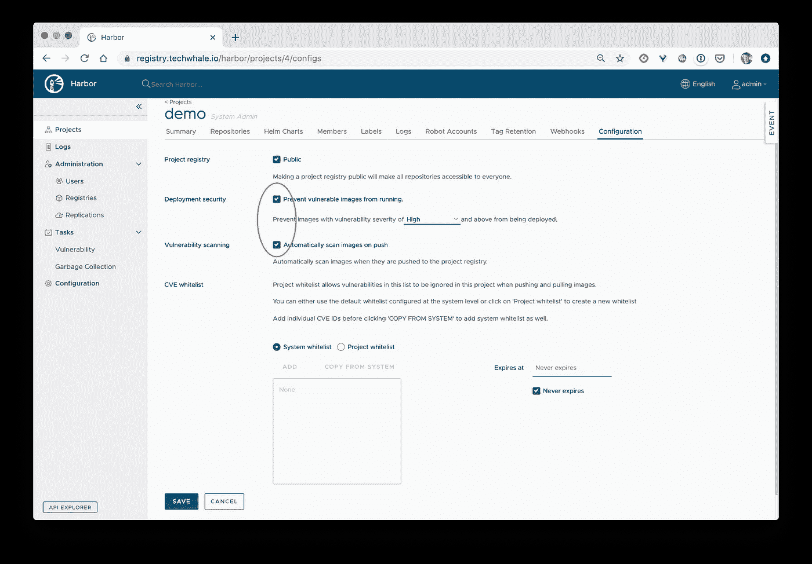

项目配置

## 容器图像注册表

我们现在将把一个容器映像推送到项目中。从*存储库*菜单中，我们选择*推送图像*下拉菜单，这表明在将图像推送到项目之前必须如何对其进行标记。

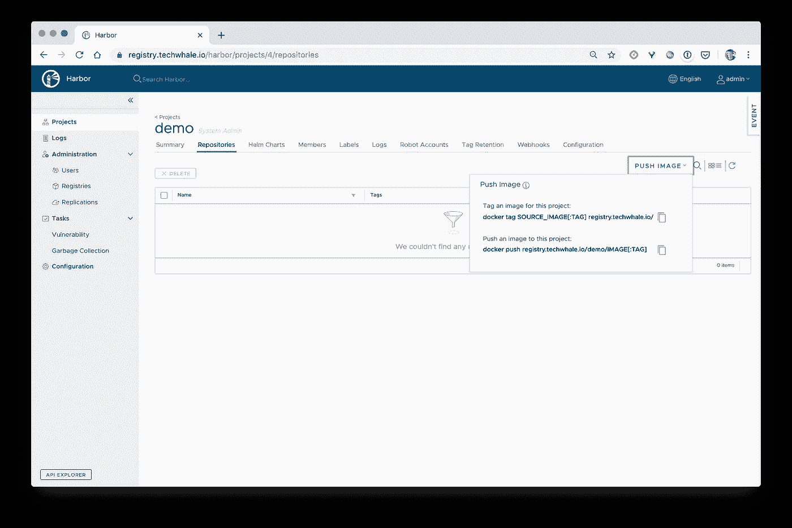

项目的存储库菜单

假设我们的*演示*项目用于托管一个微服务应用程序的所有组件，其中一个名为 *api* 的微服务已经打包在一个标记为 *api:0.1* 的本地映像中。

为了将此图像推送到项目中，我们首先需要对其进行标记，使其包含注册表的 URL:

```
$ docker image tag api:1.2 registry.techwhale.io/demo/api:0.1
```

注意:标记一个图像仅仅意味着给它一个额外的参考

接下来，我们需要登录以授权 Docker 守护进程与注册表进行通信:

```
$ docker login -u admin registry.techwhale.io
```

然后，我们可以将图像推送到项目中:

```
$ docker image push registry.techwhale.io/demo/api:0.1
```


然后我们可以在*演示/api* 存储库中看到新的图像

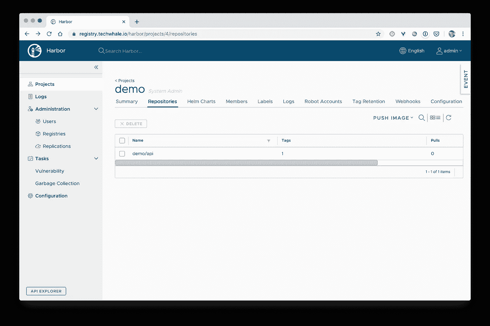

点击存储库，我们得到已经推送的标签列表。在与标签相关的信息中，*漏洞*列给出了图像推送后扫描运行的状态。正如我们在下面的截图中看到的，图像 *demo/api:1.0* 包含几个漏洞:

*   5 高
*   16 中等
*   10 低

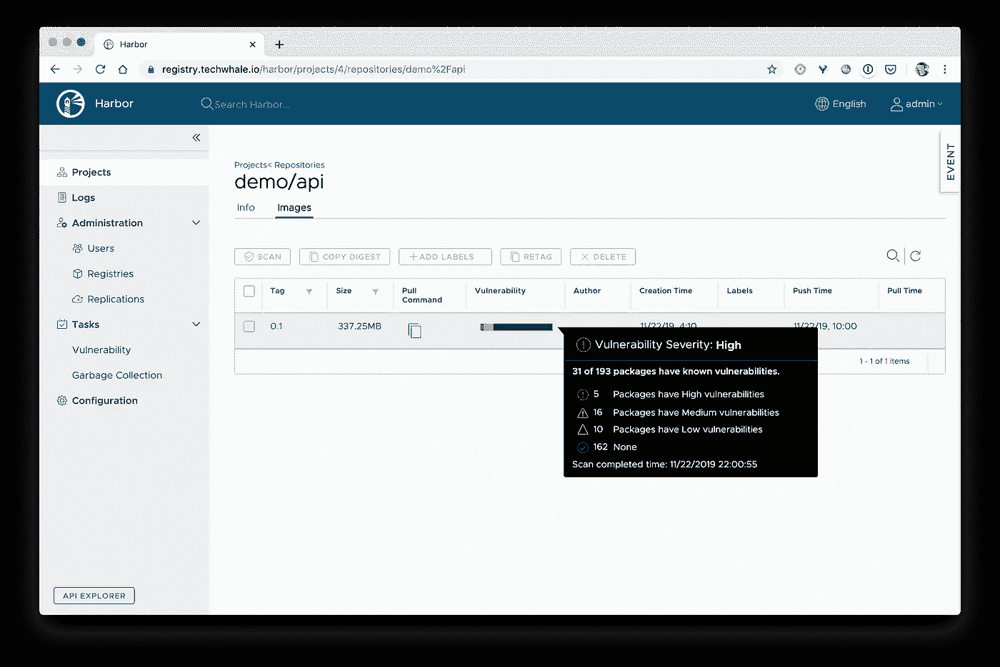

图像扫描的结果

知道一个图像是否包含一些漏洞非常重要，但也很难判断我们是否应该继续使用它。这取决于几个因素:它是对外部世界公开还是只在内部运行，该漏洞能否被利用，…

让我们从另一台机器上提取这个图像(首先需要登录):

```
**$ docker image pull registry.techwhale.io/demo/api:0.1**
Error response from daemon: unknown: The severity of vulnerability of the image: "high" is equal or higher than the threshold in project setting: "high".
```

正如我们所料，此图像不能被拉，因为它包含高漏洞。这来自于我们在项目配置中选择的选项。

## 舵图储存库

Harbor 也可以作为一个舵轮图表库，现在让我们看看如何推动一个图表。

首先，我们在本地安装 helm 客户端:(下面的例子使用 MacOS 版本)

```
$ curl -O https://get.helm.sh/helm-v3.0.0-darwin-amd64.tar.gz$ tar -zxvf helm-v3.0.0-darwin-amd64.tar.gz$ mv darwin-amd64/helm /usr/local/bin/
```

注意:[版本 3 刚刚发布](https://helm.sh/blog/helm-3-released/)，Helm 现在只是客户端，集群中不再有 Tiller 服务器

假设我们已经将我们的 *api* 打包到一个舵图中:

```
$ tree api
api
├── Chart.yaml
├── charts
├── templates
│ ├── NOTES.txt
│ ├── _helpers.tpl
│ ├── deployment.yaml
│ ├── service.yaml
│ └── tests
│ └── test-connection.yaml
└── values.yaml
3 directories, 9 files
```

接下来，我们可以用下面的命令将图表打包成一个*tar.gz*档案:

```
$ helm package ./api
Successfully packaged chart and saved it to: /Users/luc/api-0.1.0.tgz
```

然后，我们可以从*舵图表*选项卡上传图表

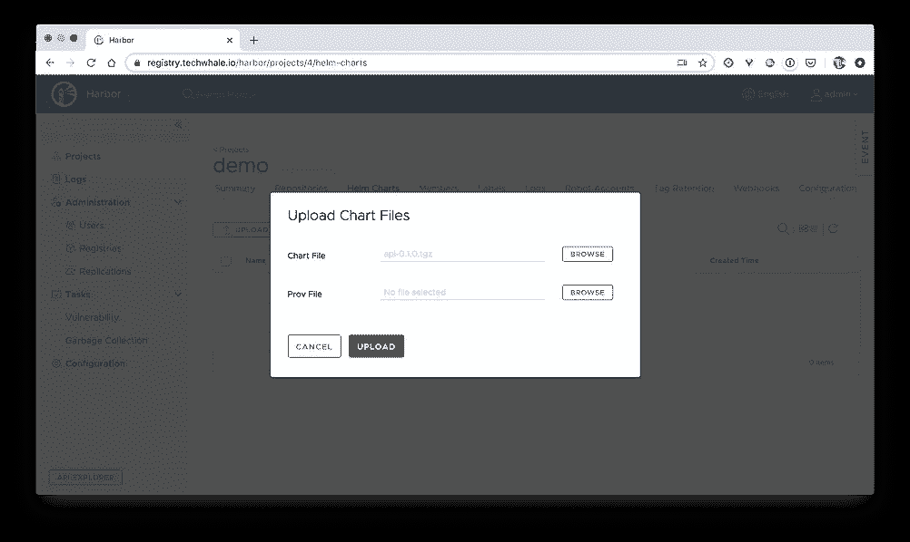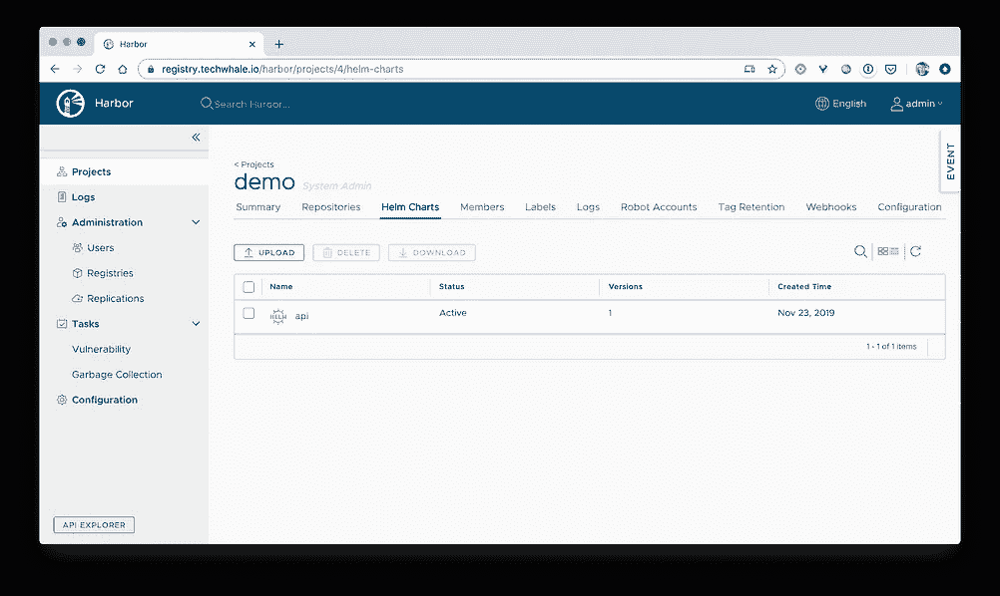

在项目中上传图表

一旦图表在我们的远程存储库中，让我们尝试从远程机器将它安装到 Kubernetes 集群上。

首先我们需要在那台机器上安装头盔([https://helm.sh/docs/intro/install/](https://helm.sh/docs/intro/install/))

接下来，我们需要将存储库添加到 Helm 客户端，可以从其中获得图表:

```
$  helm repo add \
   --username=admin \
   --password=XXX myrepo \
   https://registry.techwhale.io/chartrepo
```

然后，我们可以将图表部署到 helm 客户端可以访问的 Kubernetes 集群:

```
$ helm install api api
NAME: api
LAST DEPLOYED: Sat Nov 23 16:37:42 2019
NAMESPACE: default
STATUS: deployed
REVISION: 1
NOTES:
1\. Get the application URL by running these commands:
  export POD_NAME=$(kubectl get pods --namespace default -l "app.kubernetes.io/name=api,app.kubernetes.io/instance=api" -o jsonpath="{.items[0].metadata.name}")
  echo "Visit [http://127.0.0.1:8080](http://127.0.0.1:8080) to use your application"
  kubectl --namespace default port-forward $POD_NAME 8080:80
```

# 清除

注册表是一个 Docker 编写应用程序。它可以用通常的命令删除:

```
$ docker-compose down -v
```

默认情况下，所有数据都存储在 */data/database* 和 */data/registry* 文件夹中(这可以在 *harbor.yml* 文件中配置)。

```
$ rm -r /data/database
$ rm -r /data/registry
```

# 摘要

在这篇文章中，我们解释了如何安装 Harbor，并看到这是一个使用默认选项的非常简单的过程。我们给出了容器图像注册和舵图表存储库的例子，但只是触及了表面，因为有许多可用的功能和配置选项:图像签名和 RBAC 是我们可以在下一篇文章中说明的一些。