# 仙境中的新:一个调整你的外部系统架构和其他东西的工具集

> 原文：<https://itnext.io/neo-in-wonderland-a-toolset-to-tune-your-outsystems-architecture-and-others-stuff-9449b085735d?source=collection_archive---------3----------------------->

你好，我的朋友们。我带回来一篇《从黄昏到黎明》系列的新文章。如果你错过了它们，请看[从黄昏到黎明(I):out systems 的 Web Forge 组件的金色蜂鸣器](https://medium.com/@fabiofantato/from-dusk-till-dawn-1-fb62935e01e4)并在那里留下你的评论。

这一次，我将与您分享一个由组件、方法和模式组成的工具集，我总是在所有项目从分析到交付外部系统项目的所有开发步骤中使用这些工具集。

我在这里的重点将放在架构和维护方面。因此，我将介绍:

*   *如何在开始编码之前设计好架构；*
*   *如何打磨和验证你的架构；*
*   *你的 app 和数据模型的大图；*
*   *数据库维护工具；*
*   *监控每个开发者的应用和贡献；*

# 假设

注意，我不会讨论项目的第一步，比如获取需求和定义执行计划和目标。我想你已经这样做了。

但是万一你需要一些帮助，我向你推荐保罗·卡罗里的《精益开端》这本书。他分享了他是如何通过撰写产品愿景、捕捉人物角色、理解用户旅程和开发高级功能来完成项目的初始阶段的。

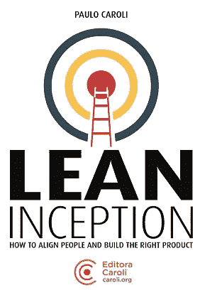

架构设计就在这个开始之后。当你已经知道你需要做什么(或者你应该知道)并且你需要设计你的软件并且提出一个好的和可扩展的架构来做这件事的时候，我将继续向前并且离开你。对于所有的 It 专业人员来说，经过深思熟虑的架构可能是项目成功或失败的关键，这已经不是什么秘密了。我将为您提供一些在 OutSystems 生态系统中实现最佳架构的技巧。

# 如何在开始编码之前设计一个好的架构

市场上有很多框架、想法或模式来支持我们创建一个好的架构，选择一个是一项艰难而又费力的工作。好消息是 OutSystems 已经为我们做了这项工作。他们创造了一个工具来简化建筑的设计。事实上，OutSystems 为我们提供了一个叫做 **4 层画布或 4LC 的框架。**

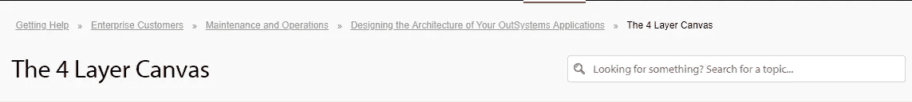

[https://success . out systems . com/Support/Enterprise _ Customers/Maintenance _ and _ Operations/Designing _ The _ architecture _ of _ your _ out systems _ applications/01 _ The _ 4 _ Layer _ Canvas](https://success.outsystems.com/Support/Enterprise_Customers/Maintenance_and_Operations/Designing_the_architecture_of_your_OutSystems_applications/01_The_4_Layer_Canvas)

使用这个框架，您可以促进可重用服务的正确抽象，包括微服务方法和功能模块的正确隔离。这允许我们在基础设施中开发和维护应用程序时，拥有真正的重用能力，而不是所谓的承诺重用能力。

4LC 提出的方法类似于 P.D.C.A 循环(计划-执行-检查-行动或计划-执行-检查-调整)，但这里适用于一个实时和连续的过程，以揭示、组织和组装目标应用程序的概念和模块。

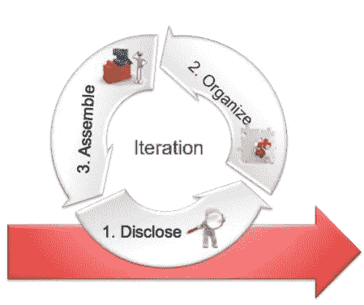

4LC 将为您提供更好的架构设计，促进业务用户和开发人员之间的共识，并使架构的验证变得容易。主要建议是使用上面图片中的三个阶段进行交互，并将它们分为四个大层。

4LC 是提高架构质量的强大工具，在软件的整个生命周期中保持设计的活力和更新是一个很好的实践。

要了解详细信息，您可以分别参加以下网络和移动课程:

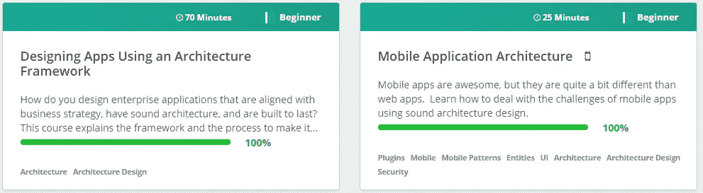

[https://www . out systems . com/learn/courses/67/designing-apps-using-an-architecture-framework/](https://www.outsystems.com/learn/courses/67/designing-apps-using-an-architecture-framework/)和[https://www . out systems . com/learn/courses/72/mobile-application-architecture/](https://www.outsystems.com/learn/courses/72/mobile-application-architecture/)

还有一个有用的 forge 组件可以帮助你在开始项目之前设计你的架构。

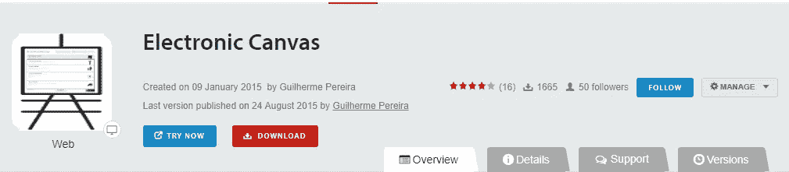

[https://www . out systems . com/forge/component/706/electronic-canvas/](https://www.outsystems.com/forge/component/706/electronic-canvas/)

使用**电子画布**你甚至可以在开始编写应用程序之前设计自己的架构。在您的外部系统环境中安装它，并开始使用它。使用此工具可以将您的图导出为图像，从而将它们包含到您的项目文档中。

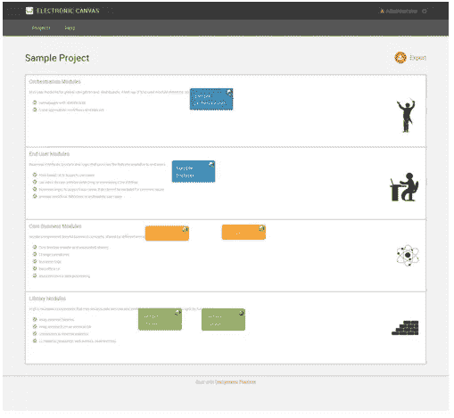

# 如何完善和验证您的架构

完美。现在我可以开始写代码了，我再也不会回来检查我的架构了，对吗？不对。在最初的设计之后，您需要不断地更新架构。但是如果没有一个大的项目开销，你怎么能做到这一点。这是一个价值百万美元的问题，但我还是有好消息。OutSystems 有一个工具可以帮助你完成这项任务。

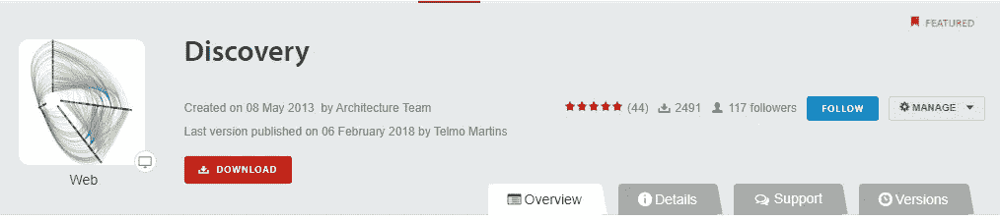

【https://www.outsystems.com/forge/component/409/discovery/? Unfollow=False

Discovery 是一个特色组件，也就是说，它是一个有价值的组件，不一定是由外部系统开发的，他们相信大多数用户都会从中受益，无论是通过直接使用还是通过检查其内容。

它允许您从整个环境中创建快照，并根据 4LC 框架提出的规则分析您的模块和应用程序。

通过使用 Discovery，您有了一个很好的工具来分析您的架构，并检查您的应用程序是否使用了 4LC 框架提出的最佳实践，或者它们是否违反了这些最佳实践。

您可以看到您的环境的全貌，并获得一些 KPI，包括关于循环依赖关系、*的信息，例如，模块 A 使用模块 B，模块 B 也使用模块 A* 。

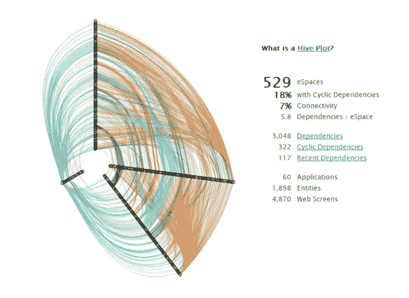

您环境中可用的所有模块和应用程序都将显示在这里，您可以设置它们所属的正确层。Discovery 不是一个神奇的工具，所以您需要在第一次使用时手动执行此操作。

映射模块后，discovery 会向您提供有关消费者和生产者正在使用哪些元素(操作、屏幕、块和操作)的信息，以及您是否违反了层依赖关系。例如，不允许库模块依赖于最终用户模块。

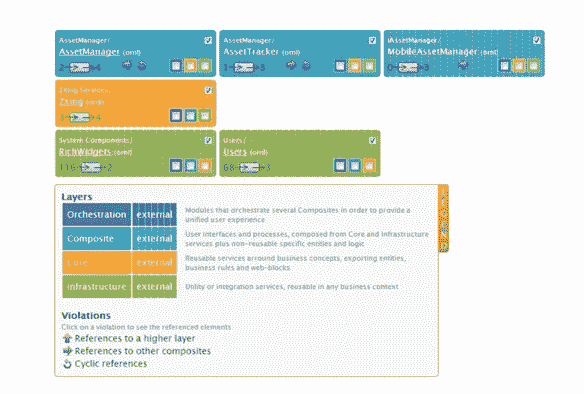

Discovery 可以显示关于模块及其关系的不同信息视图

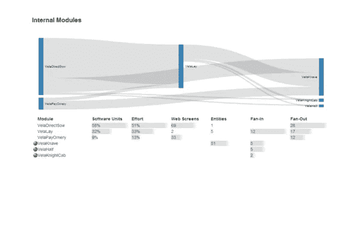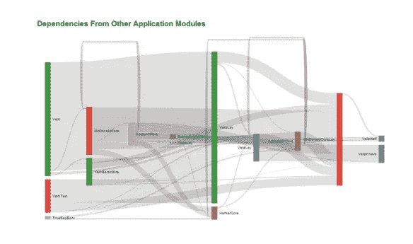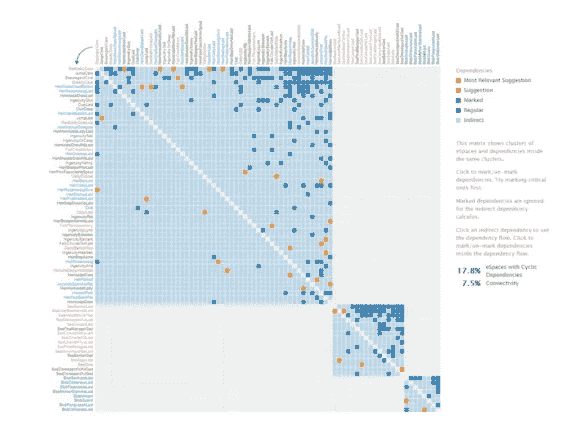

要了解更多关于如何在您的环境中使用 Discovery 的信息，我建议您观看 OutSystems Learn 部分提供的验证和重构应用程序课程。这将是保持您的架构最新状态的一个很好的起点。

[https://www . out systems . com/learn/courses/69/validating-and-refactoring-applications/](https://www.outsystems.com/learn/courses/69/validating-and-refactoring-applications/)

# 您的应用和数据模型的总体情况

既然您的应用程序已经运行良好，那么您可能需要一个大的图片来包含在项目文档中，或者甚至与您的团队共享。您可以使用 Clean Architecture 工具来帮助您完成这项任务。

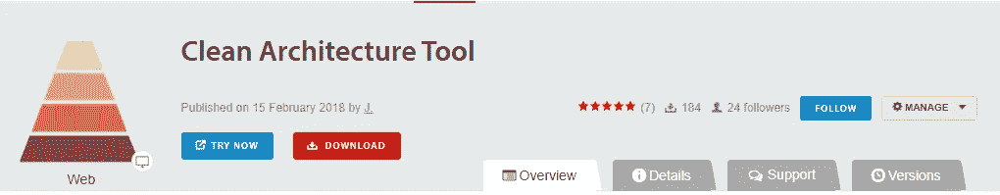

[https://www . out systems . com/forge/component/1548/clean-architecture-tool/](https://www.outsystems.com/forge/component/1548/clean-architecture-tool/)

该组件允许您创建一组应用程序，设置一个排除列表，并在一个清晰的可视图表中查看您的组。Clean Architecture 有两个视图:一个是应用程序和模块，在这里你可以设置是否要按层分组，是否显示扩展，以及定义一些其他的显示规则。

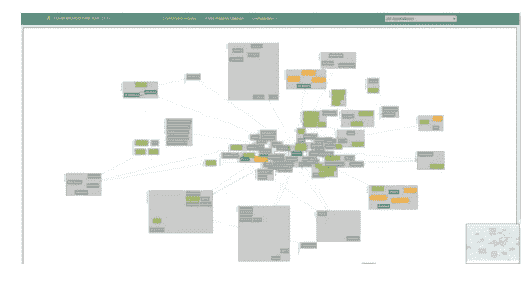

另一个视图是显示您的实体关系图。但是这是一个简单的图，不包括实体的属性。

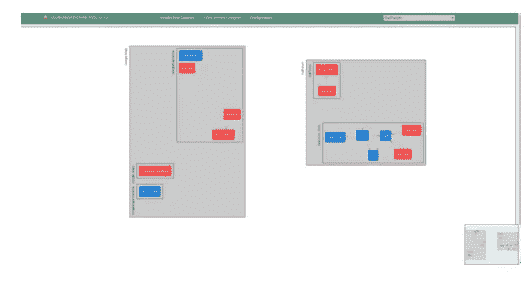

# *数据库维护*

在这一节中，我将向您展示 3 个有用的组件，当我需要维护我的应用程序数据库时，我总是会用到它们。

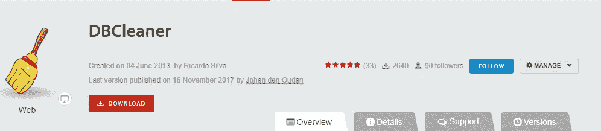

【https://www.outsystems.com/forge/component/423/dbcleaner/ 

在开发过程中，我们知道我们的数据模型将会发生很大的变化，以反映我们的实际需求。这有一个副作用，会在数据库中留下一些无法使用 Service Studio 或服务中心清理的垃圾。

DBCleaner 是一个 forge 组件，虽然这个工具不被支持，但是它使用本地可用的 DBCleanerApi。

DBCleaner 允许您物理删除不再使用的旧实体和属性。也可以删除旧版本的模块、BPT 进程历史日志和电子邮件日志。

当我知道我的应用程序是稳定的，不再频繁变化时，我总是运行 DBCleaner。

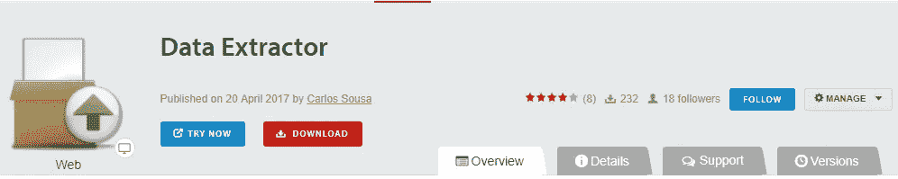

[https://www . out systems . com/forge/component/1093/data-extractor/](https://www.outsystems.com/forge/component/1093/data-extractor/)

有时，当您使用不同的环境 *(DEV、QA、Prod)* 时，需要在模块和应用程序之间复制数据，或者将它们导出，以便在外部系统中使用相同的数据测试其他环境。

数据提取器组件允许您提取脚本以在外部数据库中重新创建您的实体和/或以 *CSV 格式*导出您的数据，以便在您拥有的其他应用程序中使用引导程序导入。

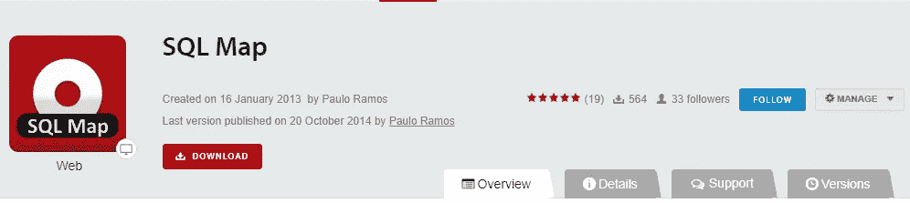

[https://www.outsystems.com/forge/component/369/sql-map/](https://www.outsystems.com/forge/component/369/sql-map/)

当您使用外部系统时，例如 BI 和/或 ETL 工具，您需要映射您的查询，以了解查询中每个表的物理数据库名称。当您在高级查询中使用表名时，OutSystems 会提取所有表名。例如，实体用户是物理表 OSSYS_USER。

SQL Map 可以帮助您完成这项任务。您可以下载并安装在您的环境中，它会将您的查询转换为物理名称，反之亦然。

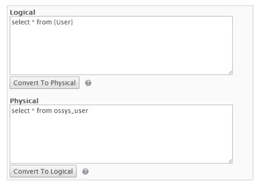

# *监控每个开发者的申请和贡献*

最后，我的架构设计得很好，我的数据库干净安全，我的开发人员正在做他们的工作(或者他们正在做吗？).

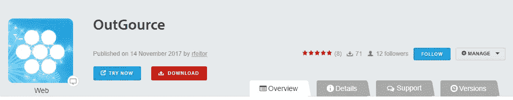

https://www.outsystems.com/forge/component/1384/outgource/

我个人反对严格控制我的开发人员的任务或工作效率，但是这个组件的巨大价值在于它很好的比较视图，在这里我们可以看到谁是在我的环境中贡献最大的开发人员，以及他们正在开发哪些应用程序。

这个组件帮助你将无聊的审计他们的贡献转化为游戏体验，在你的董事会上，你只有那些真正值得在那里的人。

在我看来，这和日常的 scrum 会议是一个概念。当人们分享他们的贡献时，他们会被激励着不要看起来比别人差。

Outgource 还为您提供了一些可视化的信息，关于哪些模块接收了更多的贡献，以及它们是如何相互连接的。

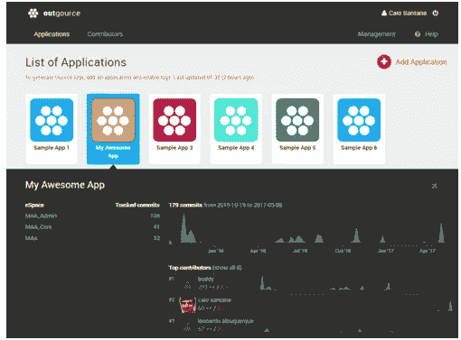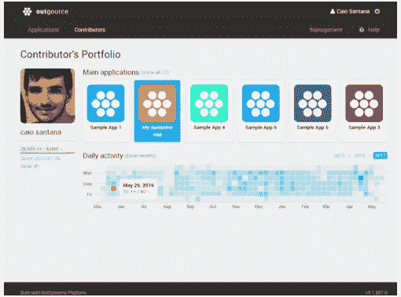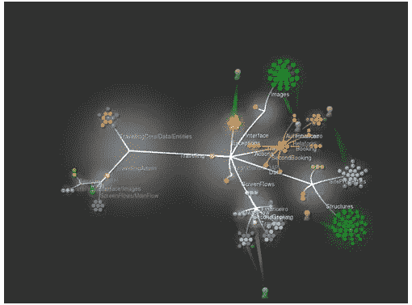

# 是全部吗？

事实上，这仅仅是个开始。保持您的架构定义良好、干净和健壮是一项艰巨而持久的工作。总有需要改进、修正或重构的地方。但是你需要记住，这是你应该花在项目上的最重要的时间之一。

我没有深入讨论这些主题，以免冗长乏味。我在这里的想法是给你一个洞察力和一个起点，帮助你成功地执行项目和编写应用程序。

*“从黄昏到黎明系列”的下一篇文章将关注移动组件。回头见。*

第一版:改正英语的用法，拼写错误，改写一些不好的和混乱的结构。感谢基利安·赫克斯

*感谢阅读。我希望你喜欢它。请让我知道你的想法。留下你的评论。给下一篇文章主题的建议。我想听听你的意见。如果你喜欢，请关注我的频道，分享吧。可以通过*[*LinkedIn*](https://linkedin.com/in/fantato/)*或者* [*OutSystems 简介*](https://www.outsystems.com/profile/40762/) *联系我。*

[***精益生产——您可以依靠的系统外专业知识！***](http://doitlean.com/)