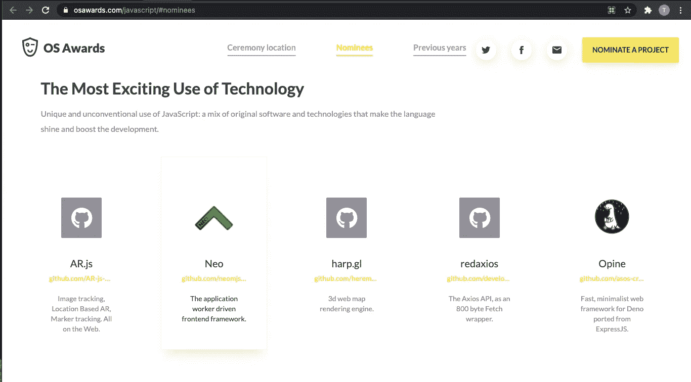
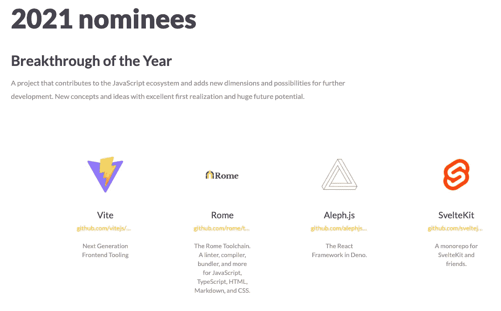
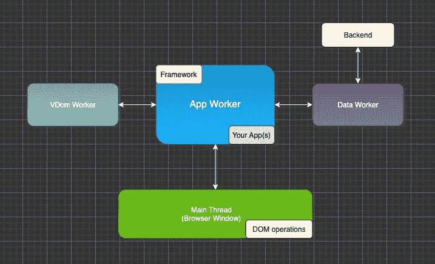
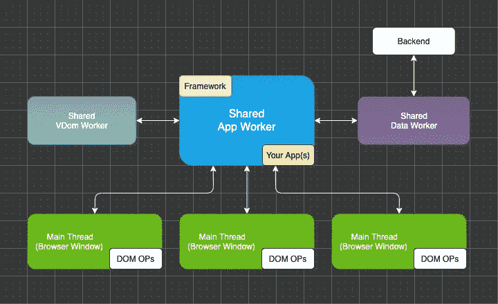

# neo.mjs 获得“最令人兴奋的技术应用”提名

> 原文：<https://itnext.io/neo-mjs-nominated-for-the-most-exciting-use-of-technology-cd5983debc7b?source=collection_archive---------1----------------------->

JavaScript 开源奖励计划 2021 内幕。

“这是你最后的机会。在这之后，就没有回头路了。你吃了蓝色药丸——故事结束，你在床上醒来，相信你想相信的一切。你吃红色药丸——你呆在仙境，我让你看看兔子洞有多深。”墨菲斯(黑客帝国)

# 内容

1.  关于操作系统奖励计划
2.  neo.mjs 是什么？
3.  neo.mjs 的商业模式是什么？
4.  最大的挑战是什么？
5.  最后的想法

# 1.关于操作系统奖励计划

Javascript 开源奖励计划突出了近年来最有影响力的开源项目。

今年的获胜者将于 6 月 9 日至 11 日在 [JS Nation conference](https://live.jsnation.com/) 上宣布，这是云领域最大的 Javascript 会议，有超过 25，000 名开发者参加。

该奖项计划分为 5 个类别，共有 23 名候选人。

我很荣幸 [neo.mjs](https://github.com/neomjs/neo) 和其他 4 名候选人一起入选“最令人兴奋的技术应用”类别。德国的项目在国际上受到重视是极其罕见的。

你可以在这里找到提名页面:

 [## JavaScript 开源奖- GitNation

### 我们庆祝社区的成功，并强调近年来最有影响力的开源项目。下一个仪式…

osawards.com](https://osawards.com/javascript/#nominees) 

请深入了解其他项目！

专业的操作系统项目应该得到更多的关注和重视。

# 2.neo.mjs 是什么？

neo.mjs 是一个 MIT 授权的 JavaScript 前端框架，以一个作为主角的应用工作者为中心。

有两种不同的设置可供选择。

单页应用程序(spa)

多窗口应用程序

**项目信息:**

1.  开发模式可以直接在您的浏览器中运行，同时只要最新的 ECMAScript 特性在所有主流浏览器中可用，就可以使用它们。不需要任何构建或编译可以在开发过程中节省大量时间，并带来完美的调试体验。
2.  模块化:基于 JS 模块的干净一致的架构。
3.  可伸缩性:您可以根据需要延迟加载 JS 和 CSS。在生产环境中，跨应用程序分割块以及增量 CSS 更新都是可用的，甚至跨不同的浏览器窗口。
4.  可扩展性:超过 200 个类可以原样使用或扩展。ES 类通过定制配置系统得到了增强
5.  命令行界面(CLI)已经就绪。您可以使用`npx neo-app`创建新的应用程序外壳。
6.  框架核心暴露(`core.Base`)。不是所有东西都需要扩展组件。
7.  轻松的状态管理，甚至跨不同的浏览器窗口
8.  尽可能多地重用 JS 实例
9.  一个强大的基于 JSON 的虚拟 dom 引擎，运行在它自己的 worker 中。
10.  性能:JS 引擎测试显示每秒高达 33，000 次增量更新。真正的极限仍然未知。

您可以在以下位置找到存储库:

 [## 近地天体

### neo.mjs 使您能够使用一个以上的 CPU 创建可扩展的高性能应用程序。不需要照顾一个…

github.com](https://github.com/neomjs/neo) 

# 3.neo.mjs 的商业模式是什么？

保持整个代码库开源(免费使用)，包括所有的例子和演示应用程序，是该项目的主要目标。

[neo.mjs](https://github.com/neomjs/neo) 正在使用业务即服务(BaaS)模式来帮助有需要的客户。这是一种保险政策，以确保客户项目尽可能顺利地运行。

1.  提供培训以加快开发速度并熟悉最佳实践。
2.  支持:客户在遇到基于框架的错误时可以获得帮助，或者提高特性请求的优先级→对路线图产生影响。
3.  专业服务:客户可以在他们的应用程序开发过程中获得帮助。如果客户希望开发 PoC 应用程序，他们也可以联系我们，以了解这对他们的用例有多大好处。

我的目标是创造就业机会。

# 4.最大的挑战是什么？

从技术角度来看，这个项目做得很好，并且每天都在变得更好。

从零开始建立一个社区肯定是具有挑战性的。

这个项目需要更多的捐助者。如果你有兴趣，加入 [neo.mjs Slack 频道](https://join.slack.com/t/neomjs/shared_invite/zt-6c50ueeu-3E1~M4T9xkNnb~M_prEEOA)非常感谢。很明显，我会为客户项目以及 neo 团队中潜在的未来工作推荐最佳和最积极的贡献者。

现在我还没有想出如何赚钱的 neo.mjs，这是一个短期的问题。它阻止我投入尽可能多的时间去做我想做的事情。

我的下一步是结束“微前端”主题，然后写更多初学者友好的文章。像这样的主题

1.  “如何创建自己的组件？”
2.  "如何使用像 MVVM 这样的组件树和架构模式创建应用程序？"

# 5.最后的想法

正如文章开头提到的，对于项目提名，我感到非常高兴和荣幸。希望这将对行业的进一步参与产生积极的影响。

我很乐意在 [neo.mjs](https://github.com/neomjs/neo) 之上添加更多的价值。该项目极具颠覆性，可能过于超前，但演示应用的性能不言自明。

该项目如何继续依赖于您的支持！

迷你路线图:

1.  添加更多的企业级组件(缓冲网格，包括编辑器、整理日历、滑块、颜色选择器等)。
2.  添加更多移动范围的示例以及新组件。
3.  图表工作者:web 工作者不能访问 DOM，但是他们可以访问画布节点。我们可以利用这一点来创造一个工人的图像，图表或地图操作。
4.  neo.mjs 中间件:使用套接字连接保持 UI 和中间件数据存储同步。节点中也有工作人员，因此我们可以选择使用节点中的 vdom 引擎进行服务器端渲染。

非常感谢社区让这一切成为现实！

来自慕尼黑的问候，托拜厄斯